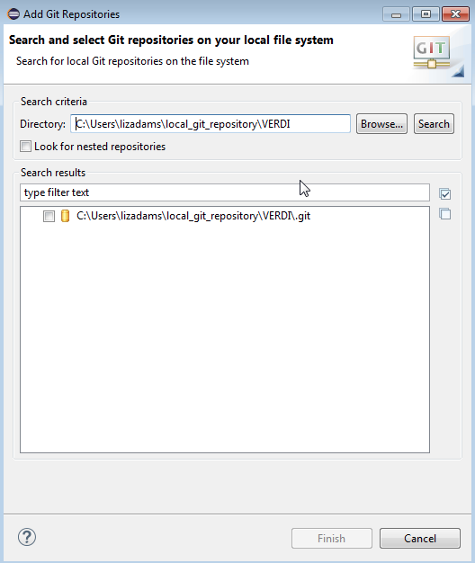
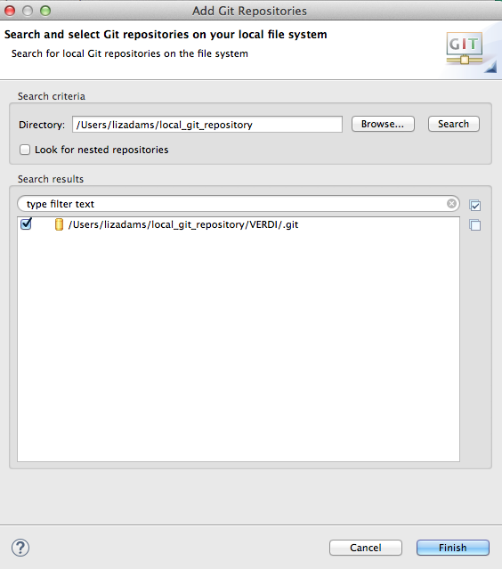
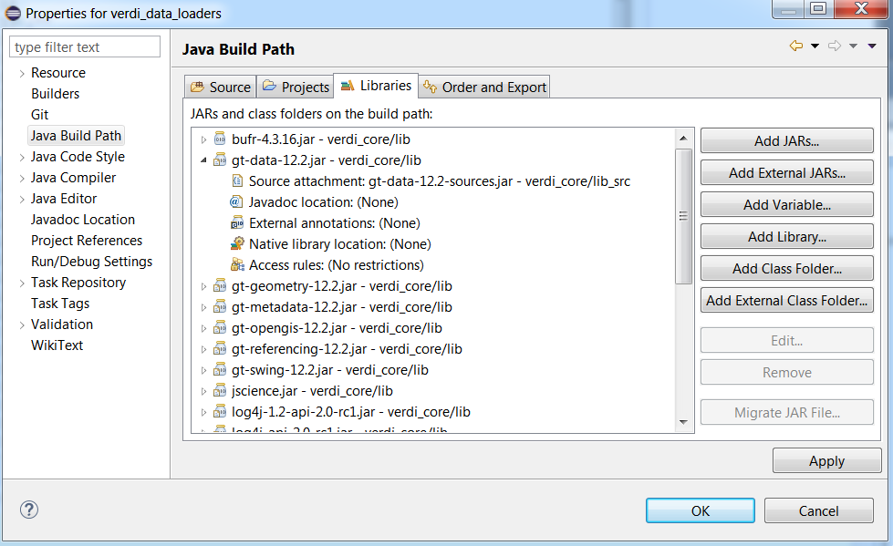

***Visualization Environment for Rich Data Interpretation (VERDI 1.6 alpha): Developer Instructions***

U.S. EPA Contract No. EP-W-09-023, “Operation of the Center for Community Air Quality Modeling and Analysis (CMAS)
Prepared for: Donna Schwede
U.S. EPA, ORD/NERL/AMD/APMB
E243-04
USEPA Mailroom
Research Triangle Park, NC 27711
Prepared by: Liz Adams and Jo Ellen Brandmeyer
Institute for the Environment
The University of North Carolina at Chapel Hill
100 Europa Drive, Suite 490
CB 1105
Chapel Hill, NC 27599-1105
Date: June 15, 2016

<span id="_Toc80776013" class="anchor"></span>**Contents**

* [1. Introduction ](#introduction)
* [2. Install Developer Environment ](#install-developer-environment)
  * [2.1 Install Java Development Kit
](#install-java-development-kit)
  * [2.2 Download and Install Eclipse](#download-and-install-eclipse)
* [3. Using git from the command line 5](#using-git-from-the-command-line)
  * [3.1 VERDI GitHub Repository](#Figure3-1)
  * [3.2 Install git](#install-git)
  * [3.3 Set-up git](#set-up-git)
  * [3.4 Clone the master branch of VERDI to a local repository](#clone-the-master-branch-of-verdi-to-a-local-repository)
  * [3.5 Examine existing branches](#examine-existing-branches)
  * [3.6 Checkout Branch](#checkout-branch)
  * [3.7 Make changes, check status, stage change, commit change to the local repository, and push changes to GitHub](#make-changes-check-status-stage-change-commit-change-to-the-local-repository-and-push-changes-to-github)
  * [3.8 Check log of commits](#check-log-of-commits)
  * [3.9 Create a new branch for new development on VERDI GitHub site](#create-a-new-branch-for-new-development-on-verdi-github-site)
  * [3.10 GitHub Released Versions ](#github-released-versions)
* [4. Git Desktop Client](#git-desktop-client)
* [5. Start Eclipse](#start-eclipse)
* [6. Import VERDI into Eclipse from your local git repository](#import-verdi-into-eclipse-from-your-local-git-repository)
  * [6.1 Select FileImport](#select-fileimport)
  * [6.2 Checkout Projects from Git](#checkout-projects-from-git)
  * [6.3 Import Projects from Git - Select Existing Local Repository](#import-projects-from-git---select-existing-local-repository)
  * [6.4 Specify Location of Repository Location](#specify-location-of-repository-location)
  * [6.5 Specify Location of your local Git Repository](#specify-location-of-your-local-git-repository)
  * [6.6 Select VERDI Local Git Repository](#select-verdi-local-git-repository)
  * [6.7 Source Code for Libraries](#source-code-for-libraries)
* [7. Configure Apache Ant to Use tools.jar from the JDK](#configure-apache-ant-to-use-tools.jar-from-the-jdk)
* [8. Set Eclipse Preferences](#set-eclipse-preferences)
  * [8.1 Workspace Preferences](#workspace-preferences)
  * [8.2 Verdi_core Properties](#verdi_core-properties)
    * [8.2.1 Java Build Path](#java-build-path)
    * [8.2.2 Java Compiler](#java-compiler)
* [9. Build the NetCDF-Java Library with Modifications for VERDI](#build-the-netcdf-java-library-with-modifications-for-verdi)
  * [9.1 Set up NetCDF-Java Library in Eclipse](#set-up-netcdf-java-library-in-eclipse)
* [10. Test VERDI Using Scripts within Eclipse](#test-verdi-using-scripts-within-eclipse)
  * [10.1 View Scripts within Eclipse](#view-scripts-within-eclipse)
* [11. Build the VERDI Distribution](#build-the-verdi-distribution)
  * [11.1 Prepare to Build VERDI Distribution](#prepare-to-build-verdi-distribution)
   * [11.1.1 Microsoft Windows](#microsoft-windows)
   * [11.1.2 Linux](#linux)
   * [11.1.3 Mac OS X](#mac-os-x)
   * [11.1.4 Build_dist xml](#build_dist-xml)
  * [11.2 Build Using Ant](#build-using-ant)
   * [11.2.1 Microsoft Windows Distribution](#microsoft-windows-distribution)
   * [11.2.2 Linux Distribution](#linux-distribution)
   * [11.2.3 Mac Distribution](#mac-distribution)
   * [11.2.4 Check Console for Error Messages](#check-console-for-error-messages)
   * [11.2.5 Add Java Compiler to Ant](#add-java-compiler-to-ant)
* [12. Logging Messages in VERDI](#logging-messages-in-verdi)
  * [12.1 Implementing Log4J2](#implementing-log4j2)
  * [12.2 Log files](#log-files)
* [13. List of Libraries and Source Code Files](#list-of-libraries-and-source-code-files)

**Figures**

* [Figure 2‑1. Java -version command on 64-bit Windows 7](#Figure2-1)
* [Figure 3‑1. GitHub site for VERDI](#Figure3-1)
* [Figure 3‑2. Create a New Branch in GitHub](#Figure3-2)
* [Figure 4‑1. Git Desktop Client](#Figure4-1)
* [Figure 4‑2. Git Desktop – Add Commit Message](#Figure4-2)
* [Figure 5‑1. Example startup screen for Eclipse](#Figure5-1)
* [Figure 5‑2. Select a VERDI workspace for Eclipse](#Figure5-2)
* [Figure 5‑3. Eclipse workbench](#Figure5-3)
* [Figure 5‑4. Click on Worbench Arrow to go to Eclipse workbench](#Figure5-4)
* [Figure 5‑5. Example Eclipse development environment for Java projects](#Figure5-5)
* [Figure 5‑6. Example Eclipse window in editing mode](#Figure5-6)
* [Figure 6‑1. File/Import in Eclipse](#Figure6-1)
* [Figure 6‑2. Import a project into Eclipse from Git](#Figure6-2)
* [Figure 6‑3. Checkout Projects from Git](#Figure6-3)
* [Figure 6‑4. Import Projects from Git](#Figure6-4)
* [Figure 6‑5. Search for Git repository on your local file system](#Figure6-5)
* [Figure 6‑6. Select Git repository on local file system](#Figure6-6)
* [Figure 6‑7. Select projects to check out from Git](#Figure6-7)
* [Figure 6‑8. VERDI projects imported to Eclipse workspace](#Figure6-8)
* [Figure 6‑9. Projects listed in the Package Explorer of the Eclipse workspace](#Figure6-9)
* [Figure 6‑10. Location of source code for open source libraries](#Figure6-10)
* [Figure 6‑11. Cross-reference of source code and class libraries within an Eclipse project](#Figure6-11)
* [Figure 7‑1. Eclipse preferences](#Figure7-1)
* [Figure 7‑2. Ant preferences within Eclipse](#Figure7-2)
* [Figure 7‑3. Add tools.jar to Ant classpath](#Figure7-3)
* [Figure 8‑1. Eclipse preferences](#Figure8-1)
* [Figure 8‑2. Project references for verdi_core](#Figure8-2)
* [Figure 8‑3. Dependent projects for verdi_core](#Figure8-3)
* [Figure 8‑4. Project-specific settings for the Java compiler](#Figure8-4)
* [Figure 10‑1. Run configurations](#Figure10-1)
* [Figure 10‑2. Sample configuration for a VERDI script](#Figure10-2)
* [Figure 10‑3. Tab to set environment variables for a run configuration](#Figure10-3)
* [Figure 10‑4. Specify VERDI_HOME environment variable](#Figure10-4)
* [Figure 11‑1. Review and edit a build.properties file](#Figure11-1)
* [Figure 11‑2. Window Show View Ant](#Figure11-2)
* [Figure 11‑3. Double-click on build.win.dist to build VERDI distribution with Ant](#Figure11-3)
* [Figure 11‑4. Console error message related to not finding Java compiler](#Figure11-4)
* [Figure 11‑5. Open Window Preferences](#Figure11-5)
* [Figure 11‑6. Expand Ant, select runtime, select global entries](#Figure11-6)
* [Figure 11‑7. Add tools.jar to Ant preferences](#Figure11-7)

Introduction
============

This manual contains instructions on how developers can set up, run, build, and obtain updates from the software repository for the Visualization Environment for Rich Data Interpretation (VERDI) software. Developers are encouraged to develop and contribute code for VERDI. Anyone who experiences a bug should check and, if appropriate, update the existing issues list on the VERDI github site: https://github.com/CEMPD/VERDI/issues. If the bug is new please submit a new issue report along with available test datasets and screenshots that demonstrate the problem. Requests for enhancements are always welcome.

Initial development of VERDI was done by the Argonne National Laboratory for the U.S. Environmental Protection Agency (EPA) and its user community. Argonne National Labora­tory's work was supported by the EPA through U.S. Department of Energy contract DE-AC02-06CH11357.  Further development has been performed by the University of North Carolina at Chapel Hill’s (UNC) Institute for the Environment under U.S. EPA Contract Nos. EP-W-05-045 and EP-W-09-023, by Lockheed Corporation under U.S. EPA contract No. 68-W-04-005, and by Argonne National Laboratory.  VERDI is licensed under the GNU Public License (GPL) version 3, and the source code is available through GitHub: <https://github.com/CEMPD/VERDI>.  VERDI is supported by the CMAS Center under U.S. EPA Contract No. EP-W-09-023. The CMAS Center is located within the Institute for the Environment at UNC.

VERDI 1.6.0 alpha is distributed for the following computing environments:

-   Windows 7, 64-bit

-   Windows 7, 32-bit

-   Linux, 64-bit

-   Linux, 32-bit

-   Mac, 64 bit

Install Developer Environment
=============================

To install VERDI 1.6.0 alpha on Windows 7, you no longer need administrator privileges. You should exit all programs before installing software. NOTE: VERDI 1.6.0 alpha was developed under Java 7 and has been minimally tested under Java 8.

The remainder of this chapter discusses how to install the Java Development Kit, the Eclipse Integrated Development Environment (IDE), and Subversion on your development system.

Install Java Development Kit
-----------------------------

Check to see if the Java Development Toolkit (JDK) and the Java Run-time Environment (JRE) 7 are already installed and properly configured on your computer. VERDI v1.6.0 alpha was developed using the JDK version 7u55. If your version of Java is at least that release of Java 7, you can skip to section 2.2.

1.  Under Windows 7, open a Command window to get to a Command prompt.

2.  Type the command “java –version” as shown below [Figure 2‑1](#Figure2‑1). If you see the proper response from that java command, then your java version is already installed and included in your PATH.

<a id=Figure2-1></a> Figure 2‑1. Java -version command on 64-bit Windows 7


1.  Make certain that your Java version is at least that shown above. If you have an earlier Java version (e.g., 1.6 or before) you need to download and install an update.

Download the JDK and the JRE for your operating system from the current repository for Java. Follow the installation instructions provided by the download site. http://www.oracle.com/technetwork/java/javase/downloads/index.html

1.  For Linux 64:

    1.  Download the gzipped tar file *&lt;version&gt;*-linux-x64.tar.gz file

    2.  Run the command tar –xzvf *<span id="jdk-8u91-oth-JPRXXXjdk-8u91-linux-x64.ta" class="anchor"></span>jdk-8u91-linux-x64.tar.gz to give it executable permissions

    3.  Run the alternatives program to tell the system about the existence of your new installation:

Alternatives –config java

(this will list how many versions are installed. If there is only one then install the JDK as number 2)
alternatives –install /usr/bin/java java /opt/jdk1.6.0_20/bin/java 2
Run the alternatives program again, to choose the new installation
alternatives –config java, select number 2

1.  Verify that your computer is finding the correct version of Java:
    $ java –version

2.  Repeat the above steps for javac:

Alternatives –install /usr/bin/javac javac /opt/jdk1.6.0_20/bin/javac 2

Alternatives –config java, select number 2

1.  For Windows 64 be certain to download the installer (.exe) version of the Java Development Kit.

    1.  Click on Start Button&gt; Control Panel&gt; System &gt; Advanced System Settings&gt; Environment Variables

    2.  In the System Variables Window highlight Path and click on the Edit button

    3.  If you already have a version of Java in your path, update it’s version, otherwise add it.

    4.  Edit the PATH environment variable to add the fully qualified path to your java executable (e.g., C:\Program Files\Java\jdk1.8.0_91\bin).

    5.  Note that the list is semicolon-delimited.

    6.  Follow the instructions at the beginning of this section and shown in [Figure 2‑1](#Figure2-1).

2.  For Windows 64 with Powershell: Use the following command to set the path, then exit Powershell and restart it for the path to be set.

    1.  setx PATH "$env:path;\the\directory\to\add" –m

    2.  You should see SUCCESS: Specified value was saved.

    3.  **Restart your session** and the variable will be available. setx can also be used to set arbitrary variables type setx /? at the prompt for documentation.

Download and Install Eclipse
----------------------------

1.  Use your Web browser to go to:
    <http://www.eclipse.org/downloads/packages/eclipse-ide-java-developers/mars2>
    If the URL has changed, go to <http://www.eclipse.org/> and navigate to IDE and Tools, Desktop IDEs, Java IDE.

2.  Look for Download Links compatible with your development system.

3.  Download and install the Eclipse IDE for Java Developers.

    1.  Windows: Select a mirror or click Direct link to file under Other Options to download Eclipse.

    2.  Select a convenient directory where you have permission to install software; that is, you do not have to install Eclipse under one of the “Program Files” directories or on the root file system on one of your drives.

    3.  Unzip the downloaded file into your chosen directory.

    4.  Linux/Mac: Install to local directory and extract using tar –xzvf

4.  If you are running Eclipse on Microsoft Windows, you can put the Eclipse icon where it will be convenient for you. Using the Windows Explorer, navigate to where you installed Eclipse. Go to the eclipse subdirectory and right-click on the eclipse.exe file. Windows displays a context menu associated with eclipse.exe. Select one or more of three main options.

    1.  Pin to Taskbar: Place the icon in the taskbar at the bottom of your main window. Once there, you can click and drag the icon along the taskbar to place the icon at a logical place for you.

    2.  Pin to Start Menu: Place the icon in the Start menu. The icon will be placed as the last item in your list of pinned items (i.e., just above the horizontal line that divides your pinned items from your frequently used items).

    3.  Place on Desktop: Hover over “Send to”, move your mouse into the menu that opens to the right and select “Desktop (create shortcut)”. You can then move your shortcut to a different location on your desktop or rename it.

Using git from the command line
===============================

VERDI GitHub Repository
-----------------------------------------------------------------------------------------------
VERDI is available through the GitHub repository under the CEMPD organization, see [Figure 3‑1](#Figure3-1).

<a id=Figure3-1></a>Figure 3‑1. GitHub site for VERDI


***If you do not have a GitHub account, register for it on the following website: <https://github.com/> and click on Sign Up to create a personal account.***

***To assist with development, please send an e-mail to <cmas@unc.edu> with your github ID and you will be added as an outside collaborator to the VERDI GitHub repository. https://github.com/CEMPD/VERDI***

Install git
-----------

1.  Install git by following the links for your operating system on http://gitimmersion.com

2.  Use the default settings selected by the Git installer

3.  On windows after running the installer you will see Git Bash on the Start Menu

Set-up git
----------

1.  Follow the instructions starting on step 3 (as you have already installed git for the command line) following this link <https://help.github.com/articles/set-up-git/>

2.  On Windows, Start from the Git Bash command window

3.  Set your user name and e-mail using git config

4.  Connect to the GitHub repository over HTTPS

5.  Skip create a repository, as VERDI is already available on GitHub

6.  mkdirSkip Fork a repository, instead follow the directions below to clone a branch of VERDI from GitHub

Clone the master branch of VERDI to a local repository
------------------------------------------------------

1.  To obtain a local cloned copy of VERDI use the following commands to download the source code from GitHub to the directory local_git_repository/VERDI

> &gt; mkdir local_git_repository
>
> &gt; cd local_git_repository
>
> &gt; git clone https://github.com/CEMPD/VERDI.git ./VERDI
>
> &gt; cd VERDI
>
> (note: if you get a message that you could not read from the remote repository please contact us and provide us with your GitHub ID).

Examine existing branches
-------------------------

1.  First go to the VERDI directory using:

> &gt; cd VERDI

1.  To see a list of the branches that are on the local repository use the command

> &gt; git branch

Output: * master

1.  To fetch a branch from the GitHub repository use the command:

> &gt; git fetch origin

1.  To see a list of all branches use the command:

> &gt; git branch -a

Output:

```csh
Shapefiles
master
* shapefile_mpas
remotes/origin/HEAD -&gt; origin/master
remotes/origin/Shapefiles
remotes/origin/gh-pages
remotes/origin/master
remotes/origin/shapefile_mpas
remotes/origin/verdi_1.6
remotes/origin/verdi_1.6_v1
remotes/origin/verdi_config_v1
remotes/origin/verdi_mpas
```

Checkout Branch
---------------

1.  To checkout a branch other than the master branch and switch to using that branch use the following command, for example to obtain and switch to using the Shapefiles branch:

> &gt; git checkout shapefile_mpas
>
> Output:
>
> Branch shapefile_mpas set up to track remote branch shapefile_mpas from origin.
>
> Switched to a new branch 'shapefile_mpas'

Make changes, check status, stage change, commit change to the local repository, and push changes to GitHub
-----------------------------------------------------------------------------------------------------------

1.  After you edit a file on the local repository git will keep track that changes have been made to the files.

2.  To see files that have been modified on your local repository use the command:

> &gt; git status
>
> output:
>
> modified: directory/filename

1.  To add the files to the index for staging before a commit use the command:

> &gt; git add directory/filename

1.  To commit the file to the local repository branch that you are using:

> &gt; git commit –m “commit message”

1.  To push the changes from the local repository branch to the remote GitHub branch

> &gt; git push

Check log of commits
--------------------

1.  One line history

    &gt; git log --pretty=format:'%h %ad | %s%d [%an]' --graph --date=short

Output:

```csh
* 0ca8b20 2016-04-19 | Temporarily disable Add Layer and Edit Layer buttons in Configure GIS Layers dialog (HEAD -&gt; Shapefiles, origin/Shapefiles) [Catherine Seppanen]
* 5bbd76b 2016-04-18 | Set world bounds on MapContent viewport before rendering [Catherine Seppanen]
* 1455e91 2016-04-18 | Specify no ellipsoid shift in assumed datum for datasets [Catherine Seppanen]
* 93145c5 2016-04-18 | Fix inconsistent datum and ellipsoid for world map shapefile [Catherine Seppanen]
* 2ebbdf3 2016-04-18 | Merge branch 'Shapefiles' of https://github.com/CEMPD/VERDI into Shapefiles [Catherine Seppanen]
|
| * 4107a02 2016-04-18 | removed 3 old *.sld files no longer being used. [Jo Ellen Brandmeyer]
* | 9a6b7bd 2016-04-18 | Ignore QGIS spatial index files (*.qix) in Git [Catherine Seppanen]
|/
* 6f37689 2016-04-18 | Merge branch 'Shapefiles' of https://github.com/CEMPD/VERDI.git into Shapefiles [Jo Ellen Brandmeyer]
|
| * 79a6222 2016-04-17 | Use current timestep and layer when building Area Information table [Catherine Seppanen]
| * e5ca158 2016-04-17 | Replace invalid characters in Area Information dockable identifier [Catherine Seppanen]
* | c058216 2016-04-18 | Changed US Counties coverage from tl_2015_us_county to cb_2014_us_county_500k (smaller file, highest resolution of the 3 sets of cartographic boundary shapefiles US counties from www.census.gov/geo/maps-data/data/cbf/cbf_counties.html [Jo Ellen Brandmeyer]
|/
* c9d9bac 2016-04-14 | When user enters a pattern for formatting values shown in the legend, changed code such that a "0" is appended only with the modifier ends with "E" and not "0". [Jo Ellen Brandmeyer]
* de70b4a 2016-04-13 | Merge branch 'Shapefiles' of https://github.com/CEMPD/VERDI.git into Shapefiles [Jo Ellen Brandmeyer]
```

Create a new branch for new development on VERDI GitHub site
------------------------------------------------------------

***If you plan to add a new feature or make changes to VERDI please create a new branch.***

***Note: VERDI new development is started by cloning a new branch, rather than forking the VERDI code. By cloning rather than forking, you avoid creating an independent repository.***

1.  Go to the GitHub website: <http://github.com/CEMPD/VERDI>

2.  Click on the Branch button.

3.  Type in the new name of your branch, for example: new_branch in the text box.

4.  Click on the Blue “Create branch: new_branch from ‘master’ (see [Figure 3‑2](Figure3-2)).

<a id=Figure3-2></a>Figure 3‑2. Create a New Branch in GitHub


GitHub Released Versions
------------------------

The GitHub site allows you to create a tagged Released Version of your code. GitHub allows you to indicate that it is a pre-release and whether it is production ready or not. Binary assets (such as compiled executables and documentation) can be added to a GitHub tag released version.  Once published, the release details and assets are available to anyone that can view the repository.

<https://github.com/blog/1547-release-your-software>

Git Desktop Client
==================

As an alternative to using git command line, the Git Desktop Client allows you to view changes that were made to files in eclipse and then to synchronize those changes to the remote server. In the middle of [Figure 4‑1](#Figure4-1) you see two tabs, one that is labeled “No Uncommitted Changes”, and the other that is labeled “History”. Download the Git Desktop client and follow the set-up instructions from the following website: <https://desktop.github.com/>

<a id=Figure4-1></a>Figure 4‑1. Git Desktop Client


If you make changes to a file in Eclipse and then view the VERDI project in the Git Desktop Client, then you see a list of the number of files that were changed with the filenames changed on the left side, and the changes in the file highlighted in green on the right side ([Figure 4‑2](#Figure4-2)). At the bottom of the left panel is a comment box for you to add a message about the commit and the “Commit to Shapefile Branch” button that you use to make the commit. After you commit the change, click on the Sync button in the upper right to synchronize the local shapefile branch with the remote GitHub Server.

<a id=Figure4-2></a>Figure 4‑2. Git Desktop – Add Commit Message


Start Eclipse
=============

**Using Windows:** Select the Eclipse icon on your taskbar, start menu, or desktop, or go to the directory where your installed Eclipse (e.g., C:\Program Files\eclipse directory and double-click on eclipse.exe.

**Using a Mac:** Go to the applications directory, to the Eclipse folder, and click on the Eclipse icon.

**Using a Linux machine:** Go to the directory where Eclipse was installed and run the eclipse executable.

[Figure 5‑1](#Figure5-1) shows the startup window for Eclipse. A progress bar is displayed at the bottom of the window to indicate how Eclipse is being configured. Eclipse requires more startup time as you add tools into the Eclipse environment.

<a id=Figure5-1></a>Figure 5‑1. Example startup screen for Eclipse


Next, select the workspace for Eclipse ([Figure 5‑2](#Figure5-2)). If you have not yet used VERDI on your computer, you can select the Browse button to select where you want to put the workspace directory. Eclipse will create the directory for you. Warning: The location of the workplace directory should be different than the location of the local git repository directory. In fact, it will look empty (even after you import the VERDI local git repository into Eclipse) but will contain a .metadata directory that contains a version.ini file. Eclipse’s startup screen is once again displayed while more tools are loaded.

<a id=Figure5-2></a>Figure 5‑2. Select a VERDI workspace for Eclipse


Depending on the version of Eclipse to enter the developer workspace, click on the link under the Welcome screen; titled “ Go to the workbench” ([Figure 5‑3](#Figure5-3)) or click on an arrow that is labeled Workbench ([Figure 5‑4](#Figure5-4)). The Eclipse workbench contains several windows that allow you to view source code, edit, and build within a single developer environment ([Figure 5‑5](#Figure5-4)).

<a id=Figure5-3></a>Figure 5‑3. Eclipse workbench


<a id=Figure5-4></a>Figure 5‑4. Click on Worbench Arrow to go to Eclipse workbench


<a id=Figure5-5></a>Figure 5‑5. Example Eclipse development environment for Java projects


The Eclipse IDE window as shown in [Figure 5‑6](#Figure5-6) has a title bar at the top showing the name of the file currently being edited, menus and icons below the title bar, the Package Explorer down the left-hand side, multiple tabbed panes in the central file editor with Java keyword highlighting, messages along the bottom, and the Ant build environment in the bottom right-hand corner. These and other windows may be added, closed, moved, and resized as-needed for the work being performed.

<a id=Figure5-6></a>Figure 5‑6. Example Eclipse window in editing mode


Import VERDI into Eclipse from your local git repository
========================================================

Select FileImport
-----------------

<a id=Figure5-7></a>Figure 5‑7. File/Import in Eclipse


To import the VERDI source code, use your mouse to select **FileImport** ([Figure 6‑1](#Figure6-1)). This will generate a pop-up window titled Import ([Figure 6‑2](#Figure6-2)).

<a id=Figure6-1></a>Figure 6‑1. Import a project into Eclipse from Git


Checkout Projects from Git
--------------------------

Click on the **Git** Folder to open it, and then select **Checkout Projects from Git** by clicking on it (see [Figure 6‑3](#Figure6-3)). Then click next.

<a id=Figure6-3></a>Figure 6‑3. Checkout Projects from Git


Import Projects from Git - Select Existing Local Repository
-----------------------------------------------------------

Click on the **Existing local repository** to open it, and then select **Next** (see [Figure 6‑4](#Figure6-4)). Then click next.

<a id=Figure6-4></a>Figure 6‑4. Import Projects from Git


Specify Location of Repository Location
---------------------------------------

Click on Add.. and type in the directory location of your local git Repository into the search field ([Figure 6‑5](#Figure6-5)), then click on the box next to the local git repository that was found and then click Finish.

<a id=Figure6-4></a>Figure 6‑5. Search for Git repository on your local file system




Specify Location of your local Git Repository
---------------------------------------------

Click on the box next to the local Git repository that was found and then click Finish ([Figure 6‑6](#Figure6-6)).

<a id=Figure6-6></a>Figure 6‑6. Select Git repository on local file system




Select VERDI Local Git Repository
---------------------------------

To load the software into eclipse click on VERDI and then click next and then select Import Existing Eclipse Projects. Click the Finish button ([Figure 6‑7](#Figure6-7)).

<a id=Figure6-7></a>Figure 6‑7. Select projects to check out from Git


Eclipse then checks out VERDI from the local repository. The workspace and the directory where the VERDI software is installed should not share the same location. [Figure 6‑8](#Figure6-8) shows that the code has been successfully imported into the workspace. A red X by one of the folders, on the other hand, indicates a problem. The six VERDI projects are shown in the workspace in [Figure 6‑9](#Figure6-9). Note that the Git branch name for each project is listed next to the project’s name.

<a id=Figure6-7></a>Figure 6‑7. VERDI projects imported to Eclipse workspace


<a id=Figure6-8></a>Figure 6‑8. Projects listed in the Package Explorer of the Eclipse workspace


Source Code for Libraries
-------------------------

Some of the libraries that VERDI uses are open source and have their source code readily available. The source code to many of these libraries are distributed with VERDI and are linked within the Eclipse project. Now if your debugging session needs to go into a library for which the source code is distributed, Eclipse should be able to display the source code for you.

All of this source code is included in the verdi_core/lib_src directory of your VERDI source code installation. As shown in [Figure 6‑10](#Figure6-10), the library source files are provided as jar or zip files.

<a id=Figure6-10></a>Figure 6‑10. Location of source code for open source libraries


Each library is cross-referenced within Eclipse from its executable jar file to its source file. To see the libraries used by one of the projects, verdi_data_loaders for example, right-click on verdi_data_loaders in the Eclipse Package Explorer. This brings up the Properties box. Select Java Build Path on the left-hand side and the four tabs then open – Source, Projects, Libraries, and Order and Export ([Figure 6‑11](#Figure6-11)).

<a id=Figure6-11></a>Figure 6‑11. Cross-reference of source code and class libraries within an Eclipse project




As shown in [Figure 6‑11](#Figure6-11), the library gt-data-12.2.jar within the directory verdi_core/lib is cross-referenced to the gt-data-12.2-sources.jar within verdi_core/lib_src. Note that both the class and source libraries are located in verdi_core directory structure, although the properties for the verdi_data_loaders project are shown. The libraries that are used for multiple Eclipse projects within VERDI are stored under verdi_core, which is the largest project. All library source code that is distributed with VERDI is located within verdi_core/lib_src.

Configure Apache Ant to Use tools.jar from the JDK
==================================================

Apache Ant is a software tool for automating the software build process. It is provided with Eclipse.

You need to edit the General Ant Preferences to add the tools.jar from the JDK. To do this, select Window&gt; Preferences as shown in [Figure 7‑1](#Figure7-1).

<a id=Figure7-1></a>Figure 7‑1. Eclipse preferences


Next, select Ant&gt; Runtime&gt; Global Entries as shown in [Figure 7‑2](#Figure7-2).

<a id=Figure7-2></a>Figure 7‑2. Ant preferences within Eclipse


Then select **Add External JARS** and navigate to the location where the JDK is installed on your computer. Next, browse to the lib, select *tools.jar* and click the Open button ([Figure 7‑3](Figure7-3)). Finally, press the Apply button followed by the OK button.

<a id=Figure7-3></a>Figure 7‑3. Add tools.jar to Ant classpath


Set Eclipse Preferences
=======================

This chapter provides recommended Eclipse settings for building VERDI.

Workspace Preferences
---------------------

Eclipse can be set up to build the projects automatically after a developer makes local changes to the Java source code. To automatically build after source code changes are made, enable this preference using the Eclipse menus ([Figure 8‑1](#Figure8-1)):

Window &gt; Preferences &gt; General &gt; Click on Workspace &gt;

NOTE: Any options that you set here are for all of the projects in this workspace.

<a id=Figure8-1></a>Figure 8‑1. Eclipse preferences


If you want Eclipse to automatically rebuild your projects as you change a file, check the Build Automatically checkbox ([Figure 8‑1](#Figure8-1)). Note that this option can slow down your development if you are making several changes because your projects will rebuild after each change.

There is also a setting to automatically recognize files that are added to the workspace. To automatically synchronize the workspace with the underlying file system, check the Refresh on Access option ([Figure 8‑1](#Figure8-1).

If your code is to be used on multiple platforms, go to “Text File Encoding” near the bottom of the window. Click the radio button to the left of “Other” and select “UTF-8”. Click the Apply button and then the OK button.

Verdi_core Properties
----------------------

In the Package Explorer view, right click on verdi_core and select Properties at the bottom of the pop-up menu. A pop-up window titled Properties will appear for verdi_core ([Figure 8‑2](#Figure8-2)).

<a id=Figure8-2></a>Figure 8‑2. Project references for verdi_core


### Java Build Path

Select Java Build Path. The right side of the window then shows four tabs, containing information on the **Source** folders, the required **Projects**, the **Libraries** (Java ARchives (JARS) and class folders on the build path), and the **Order and Export** (entries that are selected for export to dependent projects) ([Figure 8‑3](#Figure8-3)). <span id="_Toc353898019" class="anchor"><span id="_Toc353949788" class="anchor"><span id="_Toc353950157" class="anchor"></span></span></span>

<a id=Figure8-3></a>Figure 8‑3. Dependent projects for verdi_core


[Figure 8‑3](#Figure8-3) shows that the verdi_core project depends upon three other projects – verdi_bootstrap, verdi_saf_core_runtime, and verdi_saf_ui. Therefore, these projects must be built and available to the Java compiler when verdi_core is built. Also, note that the latter two projects are part of the Repast Simphony library. You should not need to change these dependencies.

### Java Compiler

From the verdi_core Properties window, select Java Compiler ([Figure 8‑4](#Figure8-4)). The panel on the right side shows the version of the JDK that is currently being used by VERDI. Note that the compliance settings are all set to Java 1.7. Also, the check mark at the top enables project-specific settings for the Java Compiler.

<a id=Figure8-4></a>Figure 8‑4. Project-specific settings for the Java compiler


The Classfile Generation section, which is beneath the compliance settings, has several options that are used by the debugger. If you plan on running VERDI in the Eclipse debugger, check these settings.

After verifying all of your settings, click the Apply button and then the OK button.

Build the NetCDF-Java Library with
Modifications for VERDI
==================================

You may skip this chapter unless you need to make changes to the NetCDF-Java library. Note that VERDI uses a modified version of the netcdfAll library.

Set up NetCDF-Java Library in Eclipse
-------------------------------------

Follow these steps to download version 4.5.5 of the NetCDF-Java Library from GitHub. Git and maven are required.

1.  Check if mvn is installed on your machine using

    1.  mvn –version

    2.  The output should be something close to: Apache Maven 3.2.3

2.  If mvn is not found, install Maven on your machine by following the Installation Instructions on the Maven Download site: <http://maven.apache.org/download.cgi>

3.  Determine if git is installed on your machine using

    1.  git –-version

    2.  The output should be something close to: git version 2.8.1

4.  If git is not found, install Git on your machine following instructions in Chapter 3.

5.  To obtain the thredds source code from the Unidata/thredds GitHub site: <https://github.com/Unidata/thredds>

    1.  Download the 4.5.5 version using the command:

        git clone -b target-4.5.5 git://github.com/Unidata/thredds.git

6.  Within Eclipse, select File&gt;Import&gt;Maven&gt;Existing Maven Projects

7.  Browse to the directory where git downloaded the 4.5.5 version. Use the top level thredds directory as the Root Directory to import.

8.  Eclipse will import and use maven to build the class files for thredds.

9.  There will be some errors in the opendap and ui projects.

    1.  Change package import statement on files that did not compile correctly from opendap.util.gui to opendap.tools.gui.

    2.  Under ucar.nc2.dods remove *#***import** *ucar.nc2.DODSNode*;

    3.  For CoordSysTable.java use **import** ucar.ma2.DataType to solve the issue of the unresolved DataType.

    4.  The following link has tips on solving these type of errors: <https://meteo.unican.es/trac/wiki/TutorialMaven>

10. There are three files that have been modified for VERDI: WRFConvention.java, M3IOConvention.java and Stereographic.java

11. The versions specific to VERDI are found under: verdi_data_loaders/src/ucar/nc2/dataset/conv/M3IOConvention.java

    verdi_data_loaders/src/ucar/nc2/dataset/conv/WRFConvention.java

    verdi_data_loaders/src/ucar/unidata/geoloc/projection/Stereographic.java

    These versions need to be copied from the above directories to replace these files under thredds:

    cp Stereographic.java thredds/cdm/src/main/java/ucar/unidata/geoloc/projection

    cp M3IOConvention.java thredds/cdm/src/main/java/ucar/nc2/dataset/conv/

    cp WRFConvention.java thredds/cdm/src/main/java/ucar/nc2/dataset/conv/

12. Refresh the cdm project. Note the WRFConvention.java uses the logger log4j, so you need to add the log4j to the build path.

13. After the files have been compiled in eclipse, do a mvn install from the command line (outside of eclipse) to build the jar file needed by VERDI.

14. This will create a netcdfAll-*.jar under thedds/ui/target

15. Copy the netcdfAll-*.jar to /verdi_core/lib/netcdfAll-4.5.5-SNAPSHOT.jar

16. Refresh the verdi_core project and rebuild VERDI.

Test VERDI Using Scripts within Eclipse
=======================================

Scripts are available for testing VERDI within Eclipse for several plot types.

View Scripts within Eclipse
---------------------------

From the Eclipse Main Menu, select either Run&gt;Run Configurations or Run&gt; Debug Configurations if you want to run the script within the debugger. Then, select Java Application to view the scripts ([Figure 10‑1](#Figure10-1)).

<a id=Figure10-1></a>Figure 10‑1. Run configurations


The script names include verdi_script, verdi_script_batch, verdi_script_camx, verdi_script_two_bars, and verdi_script_vertical_crosssection. Select verdi_script, and then click on the arguments tab to view the command-line arguments that are passed to VERDI in the script ([Figure 10‑2](#Figure10-2)). When you run the script, VERDI automatically loads the data and creates plots using the script commands specified in the arguments tab. Setting up and running scripts shorten the time required to debug plot issues because plots can be reproduced more quickly. (Note: The pathnames are specified relative to the distfiles/data directory in the arguments tab. This allows developers to run the test scripts on different platforms [Windows, Linux, or Mac] without having to edit the pathname to load the data correctly.)

<a id=Figure10-2></a>Figure 10‑2. Sample configuration for a VERDI script


Before you run the script, you need to add the VERDI_HOME environment variable to point to a location with the distribution files (the files that are available after you build VERDI within eclipse). Click on the **Environment** Tab shown in [Figure 10‑3](#Figure10-3).

<a id=Figure10-3></a>Figure 10‑3. Tab to set environment variables for a run configuration


Add the environment variable VERDI_HOME and have it point to your eclipse workspace VERDI (see [Figure 10‑4](#Figure10-4)). At this point you are able to debug VERDI within Eclipse using the verdi_script.launch file.

<a id=Figure10-4></a>Figure 10‑4. Specify VERDI_HOME environment variable


Build the VERDI Distribution
=============================

Prepare to Build VERDI Distribution
-----------------------------------

Once VERDI has been checked out of the repository, the folders will be displayed in the Project Explorer Window on the Workbench (see [Figure 6‑9](#Figure6-9)). The next step is to edit the appropriate build.properties file.

### Microsoft Windows

If you are building VERDI for the Windows platform, open and edit either the 32-bit build.properties.win32 or the 64-bit build.properties.win64 file that matches your JDK; double-click on the appropriate file to open it in the text editor ([Figure 11‑1](#Figure11-1)). Edit the build.properties file to specify the JDK used to compile VERDI and the directory where Eclipse will build the VERDI distribution. Save your new file both under its initial name and as the new build.properties file. An example JDK location is:

C:\Program Files\Java\jdk1.7.0_55

<a id=Figure11-1></a>Figure 11‑1. Review and edit a build.properties file


### Linux

If you are building VERDI for a Linux platform, open and edit either the 32-bit build.properties.linux32 or the 64-bit build.properties.linux64 file that matches your JDK. Edit the file to specify the JDK used to compile VERDI and the directory where Eclipse will build the VERDI distribution. Save your new file both under its initial name and as the new build.properties file. An example JDK location is:

/home/lizadams/jdk1.7.0_55

### Mac OS X

If you are building VERDI for a Mac, open and edit the build.properties.mac file. Specify the JDK used to compile VERDI and the directory where Eclipse will build the VERDI distribution. Save your new file both under its initial name and as the new build.properties file. An example JDK location is:

/System/Library/Java/JavaVirtualMachines/1.7.0.*jdk*/Contents/

### Build_dist xml

There are five build_dist xml files available for Ant building, each for a specific version of JDK: build_dist_win32.xml, build_dist_win64.xml, build_dist_linux32.xml, build_dist_linux64.xml, and build_dist_mac.xml. These XML files provide the instructions for how to build the respective Windows, Linux, and Mac OS X distributions of VERDI. After editing a file, save it both under its initial name and as the new build_dist.xml file.

The build_dist.xml file obtains the local directory settings from the build.properties file. Although the changes to specify these directories could be made in the in the build_dist xml file, the build.properties file has been created to clearly identify what settings are dependent on the local computer configurations. Also, this structure should reduce errors that might be incurred by a user editing the build_dist xml file. <span id="_Toc353949811" class="anchor"><span id="_Toc353950179" class="anchor"><span id="_Toc353949813" class="anchor"><span id="_Toc353950181" class="anchor"><span id="_Toc272501680" class="anchor"></span></span></span></span></span>

Build Using Ant
---------------

If you have not already set your workspace preferences, you need to set them prior to building VERDI using Ant (see Chapter 8.1).

### Microsoft Windows Distribution

The Windows distribution can be built using the scripts (build_dist_win32.xml or build_dist_win64.xml) within verdi_dist on a Windows 7 computer. Select the Eclipse menu options WindowShow ViewAnt to create a subwindow for Ant ([Figure 11‑2](#Figure11-2)). Drag the corresponding build_dist_{machineOS}.xml into the Ant window. Click on the small arrow next to **verdi** to open and display the contents.

1.  Double click on build-version to update the build version number

2.  Double click on compile-version to update the compile version number

3.  Double click on build.win.dist to build the VERDI distribution for a Windows machine ([Figure 11‑3](#Figure11-3)).

<a id=Figure11-2></a>Figure 11‑2. Window Show View Ant


<a id=Figure11-3></a>Figure 11‑3. Double-click on build.win.dist to build VERDI distribution with Ant


### Linux Distribution

The Linux distribution can be built by using Ant to run build.linux.dist on a Linux machine. The verdi_dist folder contains the build_dist_linx32.xml or build_dist_linx64.xml script. Select the Eclipse menu options WindowShow ViewAnt to create a subwindow for Ant ([Figure 11‑2](#Figure11-2)). Drag the corresponding build_dist xml into the Ant window. Click on the plus button next to verdi to open and display the contents.

1.  Double click on build-version to update the build version number

2.  Double click on compile-version to update the compile version number

3.  Double click on build.linux.dist to build the VERDI distribution for a Linux machine.

### Mac Distribution

The Mac distribution can be built by using Ant to run build.mac.dist on a Mac OS X machine. The verdi_dist folder contains the build_dist_mac.xml script. Select the Eclipse menu options WindowShow ViewAnt to create a subwindow for Ant ([Figure 11‑2](#Figure11-2)). Drag the corresponding build_dist xml into the Ant window. Click on the plus button next to verdi to open and display the contents.

1.  Double click on build-version to update the build version number

2.  Double click on compile-version to update the compile version number

3.  Double click on build.mac.dist to build the VERDI distribution for a Mac OS X machine.

### Check Console for Error Messages

Error messages will appear in the console window underneath the Ant window. If you obtain the error shown in [Figure 11‑4](#Figure11-4), add the Java compiler to your path on the Windows or Linux machine (please review Chapter 7 and Section 8.2.2 to resolve and fix the problem).

<a id=Figure11-4></a>Figure 11‑4. Console error message related to not finding Java compiler


### Add Java Compiler to Ant

(You will need this section of the manual only if you obtain the error shown in [Figure 11‑4](#Figure11-4). Console error message related to not finding Java compiler)

To allow the Ant compiler to find the Java compiler, you will also need to change the Ant Preferences to add tools.jar as an external jar as follows:

1.  In the Eclipse main menu, select WindowPreferences ([Figure 11‑5](#Figure11-5)).

2.  In the Preference Window, select AntRuntime ([Figure 11‑6](#Figure11-6)).

3.  Click on the Classpath tab, then select Global Entries.

4.  Click on Add External JARs.

5.  Locate the tools.jar under the lib folder on the JDK local installation directory, then click OK, and click OK again ([Figure 11‑7](#Figure11-7)).

<a id=Figure11-5></a>Figure 11‑5. Open Window Preferences


<a id=Figure11-6></a>Figure 11‑6. Expand Ant, select runtime, select global entries


<a id=Figure11-7></a>Figure 11‑7. Add tools.jar to Ant preferences


Logging Messages in VERDI
=========================

VERDI 1.6a uses the Apache Log4J version 2 (Log4J2) logging services. For complete information see <http://logging.apache.org/log4j/2.x/>. All of the messages produced by VERDI itself are now sent through the Log4J2. Some of the libraries used by VERDI also use Log4, allowing messages generated within these libraries to print in with the VERDI-generated messages in a single log file for debugging purposes.

Implementing Log4J2
-------------------

Log4J2 uses a hierarchical messaging system, allowing the user to specify the level of detail desired in the log file. The complete manual is on-line at <http://logging.apache.org/log4j/2.x/manual/index.html>. VERDI uses the XML version of configuration (<http://logging.apache.org/log4j/2.x/manual/configuration.html>). A configuration file log4j2.xml is included in VERDI’s directory bootstrap/lib. You can customize and enhance this configuration file to fit your needs.

Each Java class file needs to include 2 import statements:

**import** org.apache.logging.log4j.LogManager;

**import** org.apache.logging.log4j.Logger;

The class then has to include 1 statement at the top of the class definition. For the class named BatchTaskFactory the statement is:

**static** **final** Logger *Logger* = LogManager.*getLogger*(BatchTaskFactory.**class**.getName());

Then, instead of using System.out to send messages, use Logger. messages. For example, at the top of the member function showGISLayersDialog() we have a message to tell us where we are in the execution:

*Logger*.debug("in FastTilePlot.showGISLayersDialog()");

This tells Java to send the message in FastTilePlot.showGISLayersDialog() to the logger at the DEBUG level.

Another type of message prints the value of a variable. In this example we have just calculated the value of an integer variable and we want to see it in a DEBUG logger:

*Logger*.debug("statisticsSelection = " + statisticsSelection);

For permanent messages, use a higher message level. Typically messages that are always important, such as those caught in a catch block of a try/catch, are written as an ERROR. If VERDI is configured to print out ERROR, FATAL, or ALL messages, then the ERROR messages will be printed but the DEBUG messages will not.

The hierarchical levels in VERDI are:

TRACE, DEBUG, INFO, WARN, ERROR, FATAL, ALL, OFF

OFF messages are never printed, and the OFF level in the XML file will print no messages. An ALL message is printed for all levels except OFF, a FATAL message is printed for levels ALL and FATAL, etc.

The manual also provides information on implementing different logging levels in different parts of your program. That way, you can have more messages printed (e.g., DEBUG level) in the code on which you are currently focused.

Log files
---------

The log4j2.xml file distributed with VERDI appends logs into an existing log file. If you have messages printed at the ERROR level, this file will stay relatively small. However, if you use the TRACE, DEBUG, or INFO levels you will need to maintain the log file. Depending upon your needs, you can delete the file periodically, rename the file when you want to keep a set of messages, or use some file maintenance utility (e.g., tail) to reduce the size of the log file.

Also, the XML file included in the distribution is set up to write to the file named verdi.log in the verdi subdirectory of the user’s home directory. You can change the directory or the name of the file to suit your needs.

List of Libraries and Source Code Files
=======================================

| **Compiled Library**                             | **Source Code**                            |
|--------------------------------------------------|--------------------------------------------|
| anlBasic.jar                                     |                                            |
| ant-contrib-1.0b2-bin.zip                        |                                            |
| AppleJavaExtensions.jar                          |                                            |
| bufr-4.3.16.jar                                  | bufr-3.0-sources.jar                       |
| clibwrapper_jiio-1.1.jar                        |                                            |
| commons-codec-1.9.jar                            | commons-codec-1.9-sources.jar              |
| commons-collections-3.2.1.jar                    | commons-collections-3.2.1-sources.jar      |
| commons-httpclient-3.1.jar                       | commons-httpclient-3.1-sources.jar         |
| commons-io-2.4.jar                               | commons-io-2.4-sources.jar                 |
| commons-logging-1.1.3.jar                        | commons-logging-1.1.3-sources.jar          |
| dockingFramesCommon.jar                          |                                            |
| dockingFramesCore.jar                            |                                            |
| epsgraphics-1.2.jar                              | epsgraphics-1.2-sources.jar                |
| forms-1.0.5.jar                                  |                                            |
| gluegen-rt.jar                                   |                                            |
| gluegen-rt-natives-macosx-universal.jar          |                                            |
| grib-8.0.29.jar                                  | grib-8.0.29-sources.jar                    |
| GRIP.jar                                         |                                            |
| gt-api-12.2.jar                                  | gt-api-12.2-sources.jar                    |
| gt-brewer-12.2.jar                               | gt-brewer-12.2-sources.jar                 |
| gt-coverage-12.2.jar                             | gt-coverage-12.2-sources.jar               |
| gt-coverage-api-12.2.jar                         | gt-coverage-api-12.2-sources.jar           |
| gt-coveragetools-12.2.jar                        | gt-coveragetools-12.2-sources.jar          |
| gt-data-12.2.jar                                 | gt-data-12.2-sources.jar                   |
| gt-epsg-extension-12.2.jar                       | gt-epsg-extension-12.2-sources.jar         |
| gt-epsg-wkt-12.2.jar                             | gt-epsg-wkt-12.2-sources.jar               |
| gt-feature-aggregate-12.2.jar                    |                                            |
| gt-feature-pregeneralized-12.2.jar               | gt-feature-pregeneralized-12.2-sources.jar |
| gt-geometry-12.2.jar                             | gt-geometry-12.2-sources.jar               |
| gt-grid-12.2.jar                                 | gt-grid-12.2-sources.jar                   |
| gt-image-12.2.jar                                | gt-image-12.2-sources.jar                  |
| gt-jts-wrapper-12.2.jar                          | gt-jts-wrapper-12.2-sources.jar            |
| gt-main-12.2.jar                                 | gt-main-12.2-sources.jar                   |
| gt-metadata-12.2.jar                             | gt-metadata-12.2-sources.jar               |
| gt-opengis-12.2.jar                              | gt-opengis-12.2-sources.jar                |
| gt-referencing-12.2.jar                          | gt-referencing-12.2-sources.jar            |
| gt-render-12.2.jar                               | gt-render-12.2-sources.jar                 |
| gt-shapefile-12.2.jar                            | gt-shapefile-12.2-sources.jar              |
| gt-swing-12.2.jar                                | gt-swing-12.2-sources.jar                  |
| hamcrest-core-1.3.jar                            | hamcrest-core-1.3-sources.jar              |
| icu4j-50_1_1.jar                               | icu4j-50_1_1-src.jar                     |
| j3dcore-d3d.dll                                  |                                            |
| j3dcore-ogl.dll                                  |                                            |
| j3dcore-ogl-cg.dll                               |                                            |
| j3dcore.jar                                      |                                            |
| j3dutils.jar                                     |                                            |
| jai_codec-1.1.3.jar                             |                                            |
| jai_core-1.1.3.jar                              |                                            |
| jai_imageio-1.1.jar                             |                                            |
| jai_imageio_windows-i586.jar                   |                                            |
| jaramiko-151.jar                                 | jaramiko_java.zip                         |
| jarbundler-1.9.jar                               |                                            |
| javadbf-0.4.0.jar                                | javadbf-0.4.0-sources.jar                  |
| jcommon-1.0.23.jar                               | jcommon-1.0.23-sources.jar                 |
| jdom-2.0.5.jar                                   | jdom-2.0.5-sources.jar                     |
| jeo.jar                                          |                                            |
| jfreechart-1.0.19.jar                            | jfreechart-1.0.19-sources.jar              |
| jfreesvg-2.0.jar                                 |                                            |
| jh-2.0_0.2.jar                                  |                                            |
| jide-oss-3.5.14.jar                              | jide-oss-3.5.14-sources.jar                |
| jmf.jar                                          |                                            |
| jogl-all.jar                                     |                                            |
| jogl-all-natives-macosx-universal.jar            |                                            |
| jpf.jar                                          | jpf-1.5-sources.jar                        |
| jpf-boot.jar                                     | jpf-boot-1.5-sources.jar                   |
| jpf-tools.jar                                    |                                            |
| jscience.jar                                     | jscience-4.3.1-src.zip                     |
| jsr-275-1.0-beta-2.jar                           |                                            |
| jt-all-1.3.1.jar                                 |                                            |
| jts-1.13.jar                                     |                                            |
| l2fprod-common-all.jar                           |                                            |
| libj3dcore-ogl.so.linux                          |                                            |
| log4j-1.2-api-2.0-rc1.jar                        | log4j-1.2-api-2.0-rcl-sources.jar          |
| log4j-api-2.0-rc1.jar                            | log4j-api-2.0-rc1-sources.jar              |
| log4j-core-2.0-rc1.jar                           | log4j-core-2.0-rc1-sources.jar             |
| log4j-jcl-2.0-rc1.jar                            | log4j-jcl-2.0-rc1-sources.jar              |
| log4j-taglib-2.0-rc1.jar                         | log4j-taglib-2.0-rc1-sources.jar           |
| miglayout-core-5.1-20150404.220010-96.jar        |                                            |
| miglayout-swing-5.1-20150404.220019-96.jar       |                                            |
| milStd2525_png.jar                              |                                            |
| mlibwrapper_jai-1.1.3.jar                       |                                            |
| mlib_jai-1.1.2_01.jar                          |                                            |
| netcdfAll-4.5.5-SNAPSHOT.jar                     | thredds_4.5.5.zip                         |
| omcorba.jar                                      |                                            |
| omj3d.jar                                        |                                            |
| omsvg.jar                                        |                                            |
| org.apache.commons.lang_2.6.0.v201205030909.jar |                                            |
| org.eclipse.osgi-3.9.1.v20130814-1242.jar        |                                            |
| org.eclipse.uomo.core_0.7.0.20140420011.jar     |                                            |
| org.eclipse.uomo.ucum_0.7.0.20140420011.jar     |                                            |
| org.eclipse.uomo.ui_0.7.0.20140420011.jar       |                                            |
| org.eclipse.uomo.units_0.7.0.20140420011.jar    |                                            |
| org.eclipse.uomo.util_0.7.0.20140420011.jar     |                                            |
| org.eclipse.uomo.xml_0.7.0.20140420011.jar      |                                            |
| osx.jar                                          |                                            |
| piccolo.jar                                      |                                            |
| piccolo2d-core-3.0.jar                           | piccolo2d-core-3.0-sources.jar             |
| piccolo2d-extras-3.0.jar                         | piccolo2d-extras-3.0-sources.jar           |
| piccolo2d-swt-3.0.jar                            | piccolo2d-swt-3.0-sources.jar              |
| piccolox.jar                                     |                                            |
| prefsAll.jar                                     |                                            |
| reference.jar                                    |                                            |
| repast_simphony_gis_2_1_0.jar               |                                            |
| sgt_v30.jar                                     | sgt_src_v30.jar                          |
| swingx-all-1.6.5.jar                             | swingx-all-1.6.5-sources.jar               |
| TableLayout.jar                                  |                                            |
| unit-api-0.6.1.jar                               | unitsofmeasurement.zip                     |
| vecmath-1.3.2.jar                                |                                            |
| velocity-1.7.jar                                 | velocity-1.7.zip                           |
| visad.jar                                        | visad_src.jar                             |
| wizard-0.1.12.jar                                |                                            |
| xpp3_min-1.1.4c.jar                             | xpp3_min-1.1.4c-sources.jar               |
| xstream-1.4.7.jar                                | xtream-distribution-1.4.7-src.zip          |
