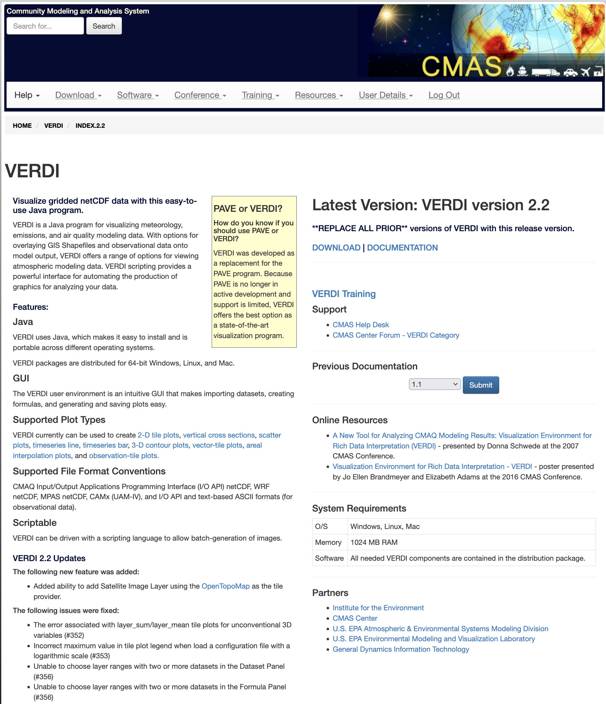
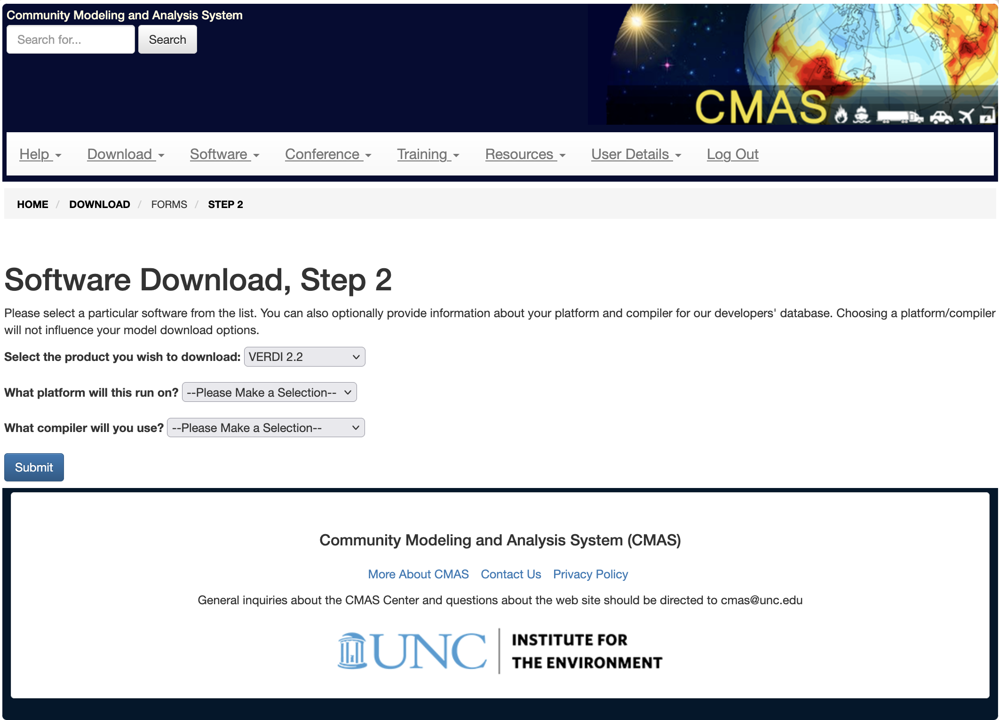
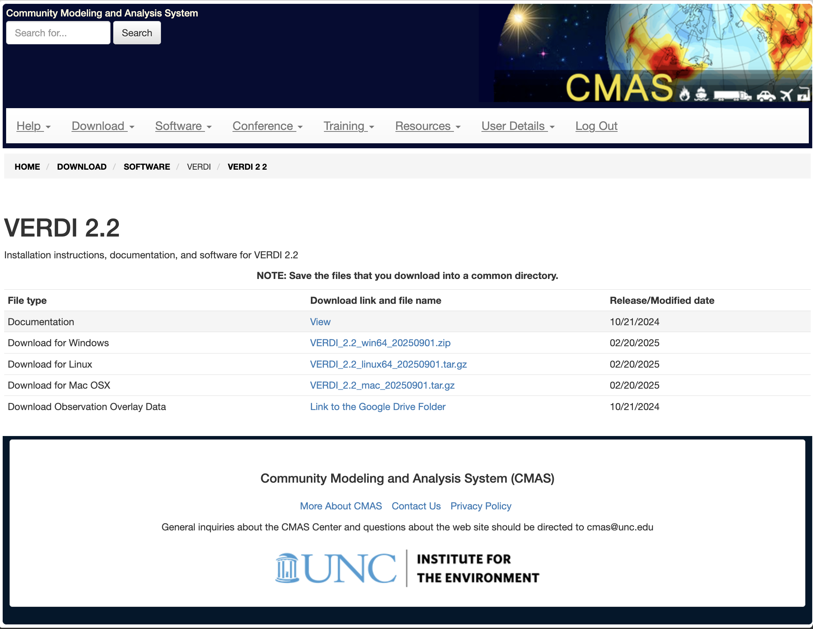
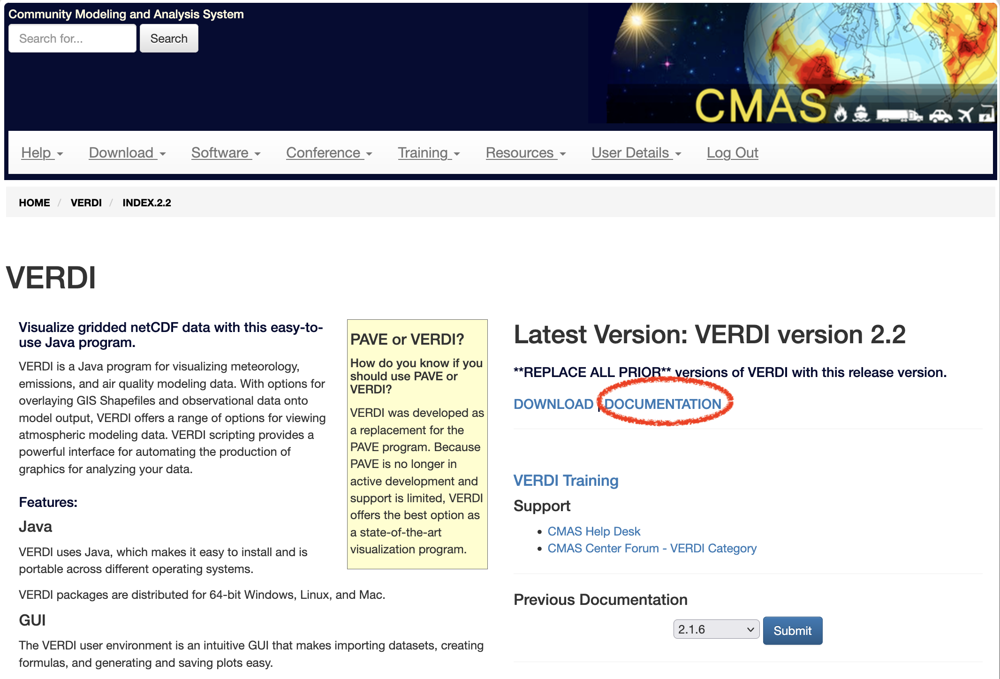

<!-- BEGIN COMMENT -->

[Home](README.md) - [Next Chapter >>](VERDI_ch02.md)

<!-- END COMMENT -->

**Visualization Environment for Rich Data Interpretation (VERDI): User’s Manual**

U.S. EPA Contract No. EP-W-09-023, “Operation of the Center for Community Air Quality Modeling and Analysis (CMAS)” 
Prepared for: Donna Schwede 
U.S. EPA, ORD/NERL/AMD/APMB 
E243-04 USEPA Mailroom 
Research Triangle Park, NC 27711 
Prepared by: Liz Adams 
Institute for the Environment 
The University of North Carolina at Chapel Hill 
100 Europa Drive, Suite 490,CB 1105  
Chapel Hill, NC 27599-1105 
Date: September 26, 2019 

<!---
First comment line...
**Contents**
* 1 [Introduction](#introduction)
  * 1.1 [Background](#background)
  * 1.2 [Where to Obtain VERDI](#-where-to-obtain-verdi)
  * 1.3 [Where to Obtain VERDI Documentation](#where-to-obtain-verdi-documentation)
  * 1.4 [Help Desk Support for VERDI](#help-desk-support-for-verdi)
  * 1.5 [Future VERDI Development](#future-verdi-development)
* 2 [Requirements for Using VERDI](#requirements-for-using-verdi)
  * 2.1 [Java Runtime Environment](#java-runtime-environment)
  * 2.2 [Memory and CPU Requirements](#memory-and-cpu-requirements)
  * 2.3 [Requirements to Run VERDI Remotely](#requirements-to-run-verdi-remotely)
  * 2.4 [Graphics Requirements](#graphics-requirements)
  * 2.5 [Display Properties](#display-properties)
* 3 [VERDI Installation Instructions](#verdi-installation-instructions)
  * 3.1 [Installation Instructions for Linux and Mac](#installation-instructions-for-linux-and-mac)
  * 3.2 [Installation Instructions for Windows](#installation-instructions-for-windows-)
  * 3.3 [Installation Instructions for computer that that requires a JRETM 7 other than what was provided in the distribution](#installation-instructions-for-computer-that-that-requires-a-jretm-7-other-than-what-was-provided-in-the-distribution)
  * 3.4 [Setting VERDI Preferences](#setting-verdi-preferences)
* 4 [Starting VERDI and Getting Your Data into VERDI](#starting-verdi-and-getting-your-data-into-verdi)
  * 4.1 [Starting VERDI](#starting-verdi)
  * 4.1.1 [Windows](#windows)
  * 4.1.2 [Linux and Other Non-Windows JRE 7 Supported System Configurations](#linux-and-other-non-windows-jre-7-supported-system-configurations)
  * 4.2 [Main Window](#main-window-)
  * 4.3 [Rearrange the Datasets, Formulas, and Areas Panes](#rearrange-the-datasets-formulas-and-areas-panes)
* 5 [Navigating VERDI’s Main Menu Options](#navigating-verdis-main-menu-options)
  * 5.1 [File Menu Options](#file-menu-options)
    * 5.1.1 [Open Project](#open-project)
    * 5.1.2 [Save Project](#save-project)
    * 5.1.3 [View Script Editor](#view-script-editor)
  * 5.2 [Plots Menu Options](#plots-menu-options)
    * 5.2.1 [Undock All Plots](#undock-all-plots)
    * 5.2.2 [Animate Tile Plots](#animate-tile-plots)
  * 5.3 [Window Menu Options](#window-menu-options)
    * 5.3.1 [Datasets, Areas, and Formulas](#datasets-areas-and-formulas)
    * 5.3.2 [Script Editor](#script-editor)
    * 5.3.3 [List of Plots](#list-of-plots)
  * 5.4 [Help Menu Options](#help-menu-options)
* 6 [Working with Gridded Datasets](#working-with-gridded-datasets)
  * 6.1 [Gridded Input File Formats](#gridded-input-file-formats)
    * 6.1.1 [Model Formats](#model-formats)
    * 6.1.2 [Observational Data Formats](#observational-data-formats)
  * 6.2 [Example Datasets](#example-datasets)
  * 6.3 [Adding and Removing a Dataset from a Local File System](#adding-and-removing-a-dataset-from-a-local-file-system)
  * 6.4 [Adding and Removing a Dataset from a Remote File System](#adding-and-removing-a-dataset-from-a-remote-file-system)
    * 6.4.1 [Remote File Browser](#remote-file-browser)
    * 6.4.2 [Adding Additional Remote Hosts](#adding-additional-remote-hosts)
  * 6.5 [Variables List](#variables-list)
  * 6.6 [Time Steps and Layers Panels](#time-steps-and-layers-panels)
  * 6.7 [Saving Projects](#saving-projects)
* 7 [Working with Formulas](#working-with-formulas)
  * 7.1 [Adding and Removing a Formula](#adding-and-removing-a-formula)
  * 7.2 [Example Formulas](#example-formulas)
  * 7.3 [Selecting a Formula for Plotting](#selecting-a-formula-for-plotting)
  * 7.4 [Saving Formulas](#saving-formulas)
  * 7.5 [Time Step and Layer Ranges](#time-step-and-layer-ranges)
* 8 [Working with Area Files](#working-with-area-files)
  * 8.1 [Area File Formats](#area-file-formats)
  * 8.2 [Example Area File](#example-area-file)
  * 8.3 [Requirements for Shapefiles used in Areal Interpolation](#requirements-for-shapefiles-used-in-areal-interpolation)
  * 8.4 [Adding and Removing an Area File](#adding-and-removing-an-area-file)
  * 8.5 [Areas List](#areas-list)
  * 8.6 [Areal Interpolation](#areal-interpolation)
* 9 [Subsetting Spatial and Temporal Data](#subsetting-spatial-and-temporal-data)
  * 9.1 [Specify Time Step Range](#specify-time-step-range)
  * 9.2 [Specify Layer Range](#specify-layer-range)
  * 9.3 [Specify Domain Range](#specify-domain-range)
  * 9.4 [Rules of Precedence for Subsetting Data](#rules-of-precedence-for-subsetting-data)
* 10 [Creating Plots](#creating-plots)
  * 10.1 [Tile Plot](#tile-plot)
    * 10.1.1 [Time Selection and Animation Controls](#time-selection-and-animation-controls)
    * 10.1.2 [Layer Selection](#layer-selection)
    * 10.1.3 [Grid Cell Time Aggregate Statistics](#grid-cell-time-aggregate-statistics)
  * 10.2 [Areal Interpolation Plot](#areal-interpolation-plot)
    * 10.2.1 [Options Menu](#options-menu)
    * 10.2.2 [Areal Values for Polygon Segment](#areal-values-for-polygon-segment)
    * 10.2.3 [View and Export Areal Interpolation Plot Data in Text Format](#view-and-export-areal-interpolation-plot-data-in-text-format)
    * 10.2.4 [Export Areal Interpolation Plot Data to Shapefiles](#export-areal-interpolation-plot-data-to-shapefiles)
  * 10.3 [Vertical Cross Section Plot](#-vertical-cross-section-plot)
  * 10.4 [Time Series Plot](#time-series-plot)
  * 10.5 [Time Series Bar Plot](#time-series-bar-plot)
  * 10.6 [Scatter Plot](#scatter-plot-)
  * 10.7 [Contour Plot](#contour-plot)
* 11 [Plot Menu Bar](#-plot-menu-bar)
  * 11.1 [File Menu](#file-menu-)
  * 11.2 [Configure Menu](#-configure-menu-)
    * 11.2.1 [Configure Plot](#configure-plot)
    * 11.2.2 [Save Configuration](#save-configuration)
    * 11.2.3 [Load Configuration](#load-configuration)
    * 11.2.4 [Load Chart Theme](#load-chart-theme)
    * 11.2.5 [Edit Chart Theme](#edit-chart-theme)
    * 11.2.6 [Save Chart Theme](#save-chart-theme)
  * 11.3 [Controls Menu](#controls-menu-)
    * 11.3.1 [Zoom](#zoom)
    * 11.3.2 [Probe](#probe)
      * 11.3.2.1 [Probe at a Single Point](#probe-at-a-single-point)
      * 11.3.2.2 [Probing a Domain Region of Data](#probing-a-domain-region-of-data)
    * 11.3.3 [Set Row and Column Ranges](#set-row-and-column-ranges)
    * 11.3.4 [Show Grid Lines](#show-grid-lines)
    * 11.3.5 [Show Latitude and Longitude](#show-latitude-and-longitude)
  * 11.4 [Plot Menu Options](#-plot-menu-options)
    * 11.4.1 [Time Series Plots(#time-series-plots)
    * 11.4.2 [Animate Plots](#animate-plots)
    * 11.4.3 [Add Overlays](#add-overlays)
      * 11.4.3.1 [Observational Data Overlays](#observational-data-overlays)
      * 11.4.3.2 [Vector Overlays](#vector-overlays)
  * 11.5 [GIS Layers](#gis-layers)
      * 11.5.1 [Add Map Layers](#add-map-layers)
      * 11.5.2 [Configure GIS Layers](#configure-gis-layers)
* 12 [Supported Grid and Coordinate Systems (Map Projections)](#supported-grid-and-coordinate-systems-map-projections)
  * 12.1 [Models-3 I/O API-formatted Data](#io-api-formatted-data)
  * 12.2 [CAMx Gridded Data](#camx-gridded-data)
* 13 [Models-3 I/O API Utilities, Data Conversion Programs, and Libraries](#io-api-utilities-data-conversion-programs-and-libraries)
* 14 [Contributing to VERDI Development](#contributing-to-verdi-development)
* 15 [Known Bugs](#known-bugs)
* 16 [Mathematical Functions](#mathematical-functions-)
  * 16.1 [Unary Functions](#unary-functions)
  * 16.2 [Binary Operators](#binary-operators)
  * 16.3 [Boolean Operators](#boolean-operators)
  * 16.4 [Time Step Index](#time-step-index)
* 17 [VERDI Batch Script Editor](#-verdi-batch-script-editor)
  * 17.1 [Specify hour/time step formula in batch script mode](#specify-hourtime-step-formula-in-batch-script-mode)
  * 17.2 [Mathematical function capability in batch script mode](#mathematical-function-capability-in-batch-script-mode)
    * 17.2.1 [Batch Script Example: Maximum Ozone – layer 1 (Figure 17-11)](#batch-script-example-maximum-ozone-layer-1-figure-17-11)
    * 17.2.2 [Batch Script Example : Minimum Ozone – layer 1 (Figure 17-12)](#batch-script-example-minimum-ozone-layer-1-figure-17-12)
    * 17.2.3 [Batch Script Example : Mean of Ozone – layer 1 (Figure 17-13)](#batch-script-example-mean-of-ozone-layer-1-figure-17-13)
    * 17.2.4 [Batch Script Example : Sum of Ozone – layer 1 (Figure 17-14)](#batch-script-example-sum-of-ozone-layer-1-figure-17-14)
* 18 [Command Line Scripting](#command-line-scripting)
   * 18.1 [Example Command Line Script for Linux Users](#example-command-line-script-for-linux-users)
   * 18.2 [Example Command Line Script for Windows Users](#example-command-line-script-for-windows-users)
* 19 [Areal Interpolation Calculations](#-areal-interpolation-calculations)
* 20 [Licenses for JAVA Libraries used by VERDI](#licenses-for-java-libraries-used-by-verdi)
* [Acknowledgments](#acknowledgments)
* [Data Contributions](#data-contributions)
* [Data Reader Contributions](#data-reader-contributions)
//
//
**Figures**
* [Figure 1. Top of VERDI Page; note DOWNLOAD and DOCUMENTATION links.](#Figure1)
* [Figure 2. Bottom of VERDI Page](#Figure2)
* [Figure 3. Downloading VERDI from the CMAS Web Site, Step 2.]((#Figure3)
* [Figure 4. Downloading VERDI from the CMAS Web Site, Step 3](#Figure4)
* [Figure 5. Getting Documentation on VERDI from the CMAS Web Site](#Figure5)
* [Figure 6. VERDI Documentation on the CMAS Web Site](#Figure6)
* [Figure 7. Starting VERDI in Windows](#Figure7)
* [Figure 8. VERDI Main Window](#Figure8)
* [Figure 9. VERDI Main Menu Options](#Figure9)
* [Figure 10. Selected plots must have matching time steps.](#Figure10)
* [Figure 11. Animate Plots Dialog and Tile Plots](#Figure11)
* [Figure 12. Example observational data file showing format.](#Figure12)
* [Figure 13. Open Dataset File Browser](#Figure13)
* [Figure 14. Datasets Pane Displaying Information about a Dataset](#Figure14)
* [Figure 15. Available Hosts in the Remote File Access Browser](#Figure15)
* [Figure 16. Select One or More Variables from Remote Dataset](#Figure16)
* [Figure 17. Remote Dataset Labeled with Number at End of the Filename](#Figure17)
* [Figure 18. Edit configure.properties File to Add a Remote Host](#Figure18)
* [Figure 19. Right-Click on Variable in Dataset Pane](#Figure19)
* [Figure 20. Adding Multiple Variables to Formula Editor](#Figure20)
* [Figure 21. Areas Pane](#Figure21)
* [Figure 22. Open Area File Browser](#Figure22)
* [Figure 23. Open Area File: Select Name Field](#Figure23)
* [Figure 24. Area Name Fields in Current Shapefile](#Figure24)
* [Figure 25. Specify Time Step Range](#Figure25)
* [Figure 26. Edit Layer Range in Formula Pane](#Figure26)
* [Figure 27. Tile Plot Example](#Figure27)
* [Figure 28. Areal Interpolation Plot: Area Average](#Figure28)
* [Figure 29. Areal Interpolation Plot: Area Totals](#Figure29)
* [Figure 30. Areal Interpolation Plot: Show Gridded Data](#Figure30)
* [Figure 31. Areal Interpolation Plot: Show Selected Areas](#Figure31)
* [Figure 32. Areal Values for a Selected Polygon](#Figure32)
* [Figure 33. Right Click on Area Plot](#Figure33)
* [Figure 34. Area Information in Columns](#Figure34)
* [Figure 35. Export to a Text File](#Figure35)
* [Figure 36. Name and Save the Text File](#Figure36)
* [Figure 37. Export Shapefile](#Figure37)
* [Figure 38. Name and Save Shapefile](#Figure38)
* [Figure 39. Vertical Cross Section Plot](#Figure39)
* [Figure 40. Vertical Cross Section Dialog Box](#Figure40)
* [Figure 41. Time Series Plot](#Figure41)
* [Figure 42. Time Series Bar Plot](#Figure42)
* [Figure 43. Scatter Plot](#Figure43)
* [Figure 44. Scatter Plot Dialog Box](#Figure44)
* [Figure 45. Scatter Plot Export Data into a CSV file](#Figure45)
* [Figure 46. Contour Plot](#Figure46)
* [Figure 47. Contour Plot Menu Options](#Figure47)
* [Figure 48. Rotated Contour Plot](#Figure48)
* [Figure 49. Tile and Areal Interpolation Plot Pull-down Menu Options](#Figure49)
* [Figure 50. Vertical Cross Section, Time Series, Time Series Bar, Scatter Plot Pull-down Menu Options](#Figure50)
* [Figure 51. Configure Plot, Titles Tab](#Figure51)
* [Figure 52. Configure Plot, Color Map Tab](#Figure52)
* [Figure 53. Configure Plot, Labels Tab](#Figure53)
* [Figure 54. Configure Plot, Other Tab](#Figure54)
* [Figure 11-7. Example Plot with Selected Tick Marks for Range Axis and Legend](#Figure1-2)
* [Figure 11-8. Top Portion of Edit Chart Theme Window](#Figure1-8)
* [Figure 11-9. Bottom Portion of Edit Chart Theme (Bg=background, Grdln=grid line)](#Figure11-9)
* [Figure 11-10. Select Font](#Figure11-10)
* [Figure 11-11. Select Color](#Figure11-11)
* [Figure 11-12. Save Dialog](#Figure11-12)
* [Figure 11-13. Right-Click on Tile Plot to Zoom Out](#Figure11-13)
* [Figure 11-14. Click on Plot to Probe: Data Value Shown in Lower Left of VERDI, Latitude/Longitude Values Shown in Lower Right](#Figure11-14)
* [Figure 11-15. Data Window Showing Probed Values for Region of Interest](#Figure11-15)
* [Figure 11-16. Select Set Row and Column Ranges](#Figure11-16)
* [Figure 11-17. Enter Row and Column Values](#Figure11-17)
* [Figure 11-18. Show Grid Lines on a Tile Plot](#Figure11-18)
* [Figure 11-19. Lat/Lon Values Shown in Lower Right of VERDI](#Figure11-19)
* [Figure 11-20. Plot Menu Options](#Figure11-20)
* [Figure 11-21. Animate Plot Dialog Box](#Figure11-21)
* [Figure 11-22. Tile Plot Observation Dialog](#Figure11-22)
* [Figure 11-23. Tile Plot with Observational Data Overlay](#Figure11-23)
* [Figure 11-24. Vector Overlay Dialog Box](#Figure11-24)
* [Figure 11-25. Wind Vector Overlay on an Ozone Tile Plot](#Figure11-25)
* [Figure 11-26. Add Map Layers](#Figure11-26)
* [Figure 11-27. Manage Layers Dialog Box](#Figure11-27)
* [Figure 12-1. Lambert Conformal Conic Map Projection Example Plot](#Figure12-1)
* [Figure 12-2. Polar Stereographic Map Projection Example Plot](#Figure12-2)
* [Figure 12-3. Mercator Map Projection Example Plot](#Figure12-3)
* [Figure 12-4. UTM Map Projection Example Plot](#Figure12-4)
* [Figure 12-5. Example CAMx diagnostic text file](#Figure12-5)
* [Figure 12-6. Models-3 I/O API Map Projection Parameters for Lambert Conformal Conic Projection](#Figure12-6)
* [Figure 12-7. Edited Example Projection File: camxproj.txt](#Figure12-7)
* [Figure 12-8. CAMx Example Plot](#Figure12-8)
* [Figure 17-1. File: View Script Editor](#Figure17-1)
* [Figure 17-2. Open Popup Window](#Figure17-2)
* [Figure 17-3. Top of Sample Script File – VERDI_2.0/data/scripts/file\_patterns.txt](#Figure17-3)
* [Figure 17-4. Bottom of Sample Script File – VERDI_2.0/data/scripts/tile_patterns.txt](#Figure17-4)
* [Figure 17-5. Close Datasets Warning Message](#Figure17-5)
* [Figure 17-6. Highlight Text to Select Task and Click Run](#Figure17-6)
* [Figure 17-7. Successful Batch Script Message](#Figure17-7)
* [Figure 17-8. Unsuccessful Batch Script Message: File not found](#Figure17-8)
* [Figure 17-9. Plot Image Generated by Task Block](#Figure17-9)
* [Figure 17-10. Tile Plot of Ozone at Time step 17, Layer 1](#Figure17-10)
* [Figure 17-11. Tile Plot of Maximum Air Temperature (aggregated over 25 time steps)](#Figure17-11)
* [Figure 17-12. Tile Plot of Minimum Ozone (aggregated over 25 time steps)](#Figure17-12)
* [Figure 17-13. Tile Plot of Mean Ozone (aggregated over 25 time steps)](#Figure17-13)
* [Figure 17-14. Tile Plot of the Sum of Ozone (aggregated over 25 time steps)](#Figure17-14)
* [Figure 18-1. Location of run.bat script in Windows](#Figure18-1)
* [Figure 18-2. Submit run.bat script from Run command](#Figure18-2)
last comment line.
-->

<a name="Introduction">

Introduction
============

</a>

Background
-----------

This manual describes how to use the Visualization Environment for Rich Data Interpretation (VERDI). VERDI is a flexible and modular Java-based visualization software tool that allows users to visualize multivariate gridded environmental datasets created by environmental modeling systems such as the Community Multiscale Air Quality (CMAQ) modeling system, the Weather Research and Forecasting (WRF) modeling system, and Model for Prediction Across Scales (MPAS). These systems produce files of gridded concentration and deposition fields that users need to visualize and compare with observational data both spatially and temporally. VERDI can facilitate these types of analyses.

Initial development of VERDI was done by the Argonne National Laboratory for the U.S. Environmental Protection Agency (EPA) and its user community. Argonne National Laboratory's work was supported by the EPA through U.S. Department of Energy contract DE-AC02-06CH11357.  Further development has been performed by the University of North Carolina Institute for the Environment under U.S. EPA Contract No. EP-W-05-045 and EP-W-09-023, by Lockheed Corporation under U.S. EPA contract No. 68-W-04-005, by General Dynamics Information Technology under U.S. EPA contract No. GS00Q09BGD0025 and Argonne National Laboratory.  VERDI is licensed under the GNU General Public License (GPL) version 3, and the source code is available through verdi.sourceforge.net.  Instructions for developers within the community are included in the VERDI Developer Instructions (see Section 1.3). VERDI is supported by the Community Modeling and Analysis System (CMAS) Center under U.S. EPA Contract No. EP-W-09-023. The batch script and VERDI Script Editor were developed and documented under U.S. EPA Contract No. EP-D-07-102, through an Office of Air Quality Planning and Standards project managed by Kirk Baker. The CMAS Center is located within the Institute for the Environment at the University of North Carolina at Chapel Hill.

This manual describes VERDI version 2.0 released in September 2019.

The following are useful web links for obtaining VERDI downloads and support:

1.  VERDI Visualization Tool web site:

<http://www.cmascenter.org/verdi>

1.  CMAS download page for users of VERDI (requires a CMAS account):

<https://www.cmascenter.org/download/forms/step_2.cfm?prod=11>

1.  CMAS GitHub website for developers of VERDI:

<https://github.com/CEMPD/VERDI>

1.  VERDI Frequently Asked Questions (FAQs):

<https://www.cmascenter.org/help/faq.cfm>

Use pulldown menu to select VERDI product to view its FAQs.

1. To query and ask questions use the new CMAS User Forum, by selecting the VERDI category: <https://forum.cmascenter.org/c/verdi>

1.  To query the older M3USER listserv for VERDI related technical support questions and answers: <http://lists.unc.edu/read/?forum=m3user>

2.  To query bugs and submit bug reports, questions, and/or requests:

<https://github.com/CEMPD/VERDI/issues>

 Where to Obtain VERDI
----------------------

You can download the latest version of VERDI from <https://www.cmascenter.org/verdi/> (PDF see ([Fig-@fig:Figure1]) and ([Fig -@fig:Figure2])) (Github see: [Figure1-1](#Figure1-1) and [Figure 1-2](#Figure1-2)). When you click on DOWNLOAD to download VERDI, you will be sent to the CMAS Model Download Center. To download and install VERDI, follow the instructions below, beginning at step 4. Alternatively, you may also begin at the CMAS web site <https://www.cmascenter.org>, and follow the instructions below:

1.  Log in using an existing CMAS account, or create a new CMAS account.

2.  Click the Download drop-down list and choose SOFTWARE.

3.  From the Software Download, Step 1 page go to the box Select Software to Download on the right side of the page. Use the drop-down list to select VERDI, and then click Submit.

4.  Select the product you wish to download, as shown in [Figure 3](#Figure3) ([Fig1-@fig:Figure3])) . Also specify the type of computer on which you will run VERDI (i.e., Linux PC, Windows, or Other) from the items in the scroll list. Note that the compilers question is not relevant for VERDI so please select Not Applicable. Finally, click Submit.

5.  As shown in [Figure 4](#Figure4) ([Fig1-@fig:Figure4]))  follow the links to the appropriate version of the Linux, Mac, or Windows installation files. Links are also available for the current version of the documentation.

<!-- BEGIN COMMENT -->

Figure 1. Top of VERDI Page; note DOWNLOAD and DOCUMENTATION links. 

<!-- END COMMENT -->

{#fig:Figure1}

<!-- BEGIN COMMENT -->

Figure 2. Bottom of VERDI Page 

<!-- END COMMENT -->

{#fig:Figure2}

<!-- BEGIN COMMENT -->

Figure 3. Downloading VERDI from the CMAS Web Site, Step 2. 

<!-- END COMMENT -->

{#fig:Figure3}

<!-- BEGIN COMMENT -->

Figure 4. Downloading VERDI from the CMAS Web Site, Step 3 

<!-- END COMMENT -->

{#fig:Figure4}

Where to Obtain VERDI Documentation
-----------------------------------

Documentation is available in several locations, described below. Each location provides links to the available documentation for VERDI, which can be viewed in your web browser or downloaded and saved to your computer.

-   The main VERDI page has a link to Documentation.

-   The VERDI download page on the CMAS website contains links to all of the available documentation.

-   On the left-hand side of the [www.cmascenter.org](http://www.cmascenter.org) web site, open the drop-down menu for Help and choose Documentation. Select the documentation for VERDI from the drop-down list and click Search. Select the model release from the drop-down list and click Search. The resulting documentation pane shows that the available documentation for the chosen release of VERDI GitHub:[Figure 5](#Figure5) or PDF:[Fig-@fig:Figure5].

<!-- BEGIN COMMENT -->

Figure 5. VERDI Documentation on the CMAS Web Site 

<!-- END COMMENT -->

{#fig:Figure5}

-   To go directly to the most recent VERDI documentation click on DOCUMENTATION from the VERDI software: <http://www.cmascenter.org/verdi>. [Figure 6](#Figure6) shows the list of documentation that is available for download for VERDI 2.0.

<!-- BEGIN COMMENT -->

Figure 6. VERDI Documentation on the CMAS Web Site 

<!-- END COMMENT -->

{#fig:Figure6}

Help Desk Support for VERDI
---------------------------

You are encouraged to search the new CMAS User Forum, by selecting the VERDI category: <https://forum.cmascenter.org/c/verdi> or using the old [M3USER listserv](http://lists.unc.edu/read/search/results?forum=m3user&words=verdi&sb=1) for VERDI-related technical support questions; report errors and/or requests for enhancement to the m3user forum. The m3user forum is supported by the community and also by CMAS to help users resolve issues and identify and fix bugs found in supported software products.

Future VERDI Development
------------------------

As stated in Schwede et al. (2007),[1] “VERDI is intended to be a community-based visualization tool with strong user involvement.” The VERDI source code is available to the public under a GNU Public License (GPL) license at <https://github.com/CEMPD/VERDI>. This allows users who wish to make improvements to VERDI to download the software, and to develop enhancements and improvements that they believe may be useful to the modeling community. Examples could include user-developed readers for additional file formats and modules for additional plot types. Users may wish to contribute data analysis routines, such as adding the ability to do bilinear interpolation (smoothing), or to contribute other enhancements to the existing plot types. The direction of future development will depend on the resources and the needs of the modeling community. If you are interested in contributing code to VERDI, please review the information in Chapter 14, “Contributing to VERDI Development.”

<!-- BEGIN COMMENT -->

[Home](README.md) - [Next Chapter >>](VERDI_ch02.md) 
VERDI User Manual (c) 2018 

<!-- END COMMENT -->
