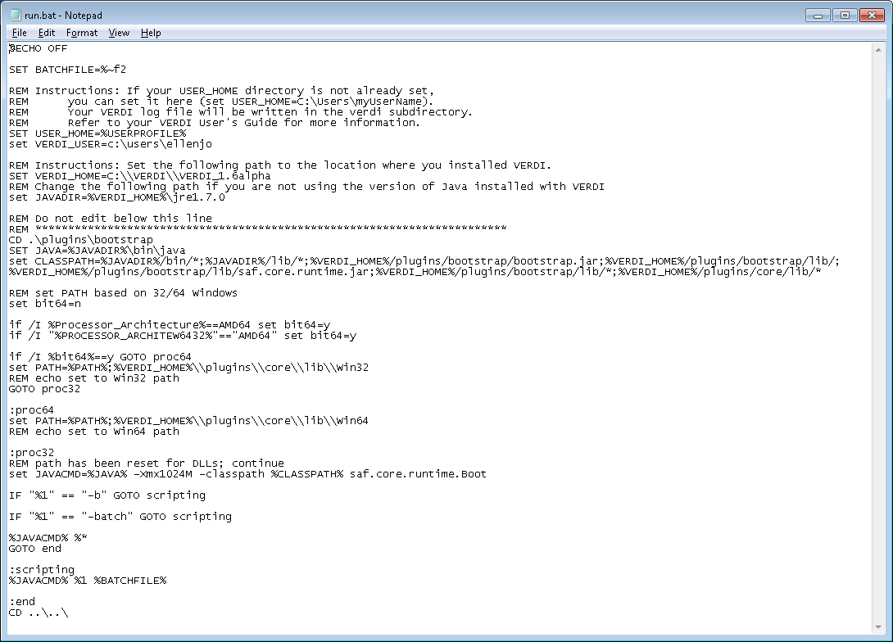
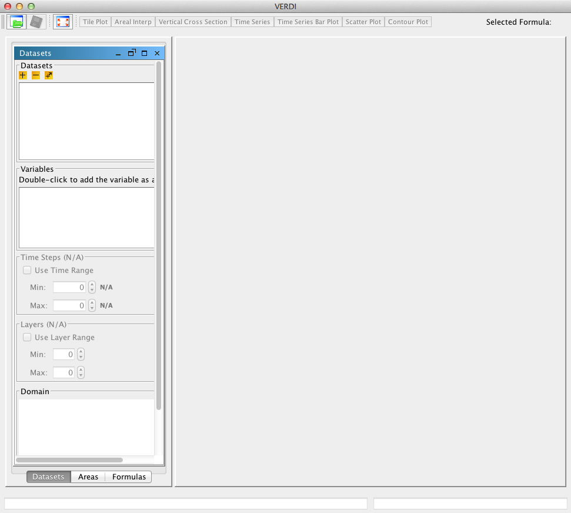

<!-- BEGIN COMMENT -->

[<< Previous Chapter](VERDI_ch03.md) - [Home](README.md) - [Next Chapter >>](VERDI_ch05.md)

<!-- END COMMENT -->

Starting VERDI and Getting Your Data into VERDI
===============================================

Starting VERDI
--------------

### Windows

If you have previously configured this VERDI installation, use Windows Explorer to navigate to your installation directory. Double-click on the file **run.bat** to start VERDI. Alternatively, you can open a command window. If you do not have a shortcut to launch a command window, press the Start button and type **cmd** in the *Search programs and files* textbox. If your window is too small, go to the window’s title bar and right-click; select Properties and then Layout and change your Screen Buffer Size and your Window Size appropriately.

Next, navigate to where you installed VERDI on your computer. You see the **run.bat** file. Its contents are shown in PDF:([Fig-@fig:Figure7]) or GitHub:[Figure 7](#Figure7). If you have previously executed this VERDI installation, just type **run** and press the **Enter** key. Otherwise, you may need to customize some of the settings in this file for your configuration. If so, edit your run.bat in a text editor such as Notepad.

Figure 7. Starting VERDI in Windows 

{#fig:Figure7}

VERDI_HOME needs to point to the directory where VERDI is installed, which is also the directory containing the run.bat file. In this figure VERDI is installed in the directory C:\\ VERDI\\VERDI_2.0.

JAVADIR needs to point to the directory where your JRE7 is installed. In this figure JRE7 is installed in the jre1.7.0 directory under the VERDI_HOME directory. If you are using a JRE in a different location on your computer, change the path in your run.bat file.

All other locations are specified relative to the VERDI_HOME or the JAVADIR, so you should not need to change any of those.

### Linux and Other Non-Windows JRE 7 Supported System Configurations

To start VERDI from Linux and other non-Windows JRE 7 Supported System Configurations, find the directory where VERDI was installed; then run the verdi.sh script. On a Mac go to the /Applications/verdi_2.0 directory and run the verdi.command script.

Main Window
------------

When VERDI starts it displays its title screen as it loads. The main window is then displayed PDF:([Fig-@fig:Figure8]) or Github:([Figure 8](#Figure8)). The top of the main window contains a menu bar with the main window options (**File, Plots, Window,** and **Help**). Below the menu bar are three icons that are shortcuts to some of the options available in the Main Window Menu Bar; the first is an **Open Project** icon, the second is a **Save Project** icon, the third is an icon that allows you to **Undock All Plots**. These shortcuts and the options available in the Main Window Menu Bar are discussed further in Chapter 5, “Navigating VERDI’s Main Menu Options.”

To the right of these three shortcut icons are buttons that list all of the available plot types. The **Selected Formula** is displayed on the far right. The Selected Formula refers to the formula that has been selected in the **Formula** pane (discussed briefly below and in detail in Chapter 7) and that will be used to create plots.

Below the icons and plot buttons, the VERDI window is divided into two main areas: a parameters area consisting of tabbed panes on the left side and a plots area on the right side. You can resize the entire window with your mouse. You can also resize the tabbed pane separately from the plot area by placing your mouse over the dividing line between them and then moving it to the left or the right. If you want, you can separate the tabbed pane into 3 panes by using your mouse to hold onto the pane’s title bar and then move it slightly out of alignment. To reassemble the 3 panes into a tabbed pane, use your mouse to hold onto the title bar of one pane, drag it until its outline fills the outline of another pane, and then release the mouse.

Figure 8. VERDI Main Window 

{#fig:Figure8}

The parameters area contains three tabbed panes:

-   The **Datasets** pane is used to load in the dataset files that you want to work with in this session (see Chapter 6). Once the datasets are loaded, VERDI automatically displays the lists of variables that are in the datasets. To see the variables in a dataset, click on the dataset, and the variables will be displayed in the **Variables** panel underneath the list of datasets. Double-click on the name of a variable listed on the variables panel to add it as a formula on the **Formula** pane; it also will be displayed as Selected Formula in the top right corner of the main VERDI window and will be the default formula for new plots that are created.

-   The **Formulas** pane is used to create a formula that refers to the variable and the dataset that you are interested in plotting (see Chapter 7). All plots in VERDI are generated from formulas. A formula can be as simple as a single variable from one dataset or it can be an equation that uses variables from one or more datasets.

-   Use the **Areas** pane to load area files for creating areal interpolation plots (see Chapter 8). An area file is defined as a shapefile that contains polygon features such as watersheds, counties, or any other set of closed polygons.

Any plots that are created are shown in the plots area on the right-hand side of the main window. These plots can be placed into their own movable windows using Plots&gt;Undock all Plots on VERDI’s main menu, as discussed in Section 5.2.1. The Tile Plot has an option (Plot&gt;Add Overlay&gt; Vectors) to create a Tile Plot of a variable with a vector overlay of wind vectors or other vector types. The Vector Plot has now been removed because the Tile Plot with vector overlay is superior. The functions that are currently enabled for Tile Plots are described in Section 10.1.

Rearrange the Datasets, Formulas, and Areas Panes
-------------------------------------------------

You can rearrange the **Datasets**, **Formulas**, and **Areas** panes to be most efficient for your current work. VERDI supports resizing the entire VERDI window, floating one or more panes to other locations on your desktop, and rearranging the panes within the VERDI window.

The **Datasets, Formulas**, and **Areas** panes can each be configured to float so you can position them elsewhere on your desktop. To allow a pane to float, click the icon at the top of the pane that looks like a rectangle with an angle bracket above the upper-right corner; its tool tip is “Externalize this view into a floating window”. You can then click on the pane and drag it independently of the VERDI main window. For example, this is useful when you are entering a formula in the **Formulas** pane and need to refer to the variables that are in a loaded dataset. Once a pane is disconnected from the frame, the icon changes to be a box with an arrow pointing inward, with the tool tip: “Connects this panel with the frame”. Click on the box with the inward arrow to reconnect the panel with the frame. This will return the floating pane back to where it was last connected within the main VERDI window.

You can rearrange the panes within the main VERDI window. Click on the tab at the bottom of a frame and slide it along that area to change the order of the frames. Or slide it up or down and arrange the frames vertically so you can see more than one at a time. You can also click and hold a tab to slide its pane next to the other panes, consuming space that had been used by the charts pane. If you have the three panes beside each other – or two panes with tabs next to the third pane – you can easily change their relative position. Click on the title of the frame that you want to move, drag it, and then release it.

You can also change the amount of the entire VERDI window that is devoted to the 3 panes on the left vs. the charts pane on the right. Position your cursor along the line dividing these two sets of panes such that the cursor becomes a horizontal arrow pointing both left and right. Drag the cursor to the left to reduce the size of these panes and increase the size of the chart pane, or to the right for the opposite effect.

<!-- BEGIN COMMENT -->

[<< Previous Chapter](VERDI_ch03.md) - [Home](README.md) - [Next Chapter >>](VERDI_ch05.md) 
VERDI User Manual (c) 2018 

<!-- END COMMENT -->
