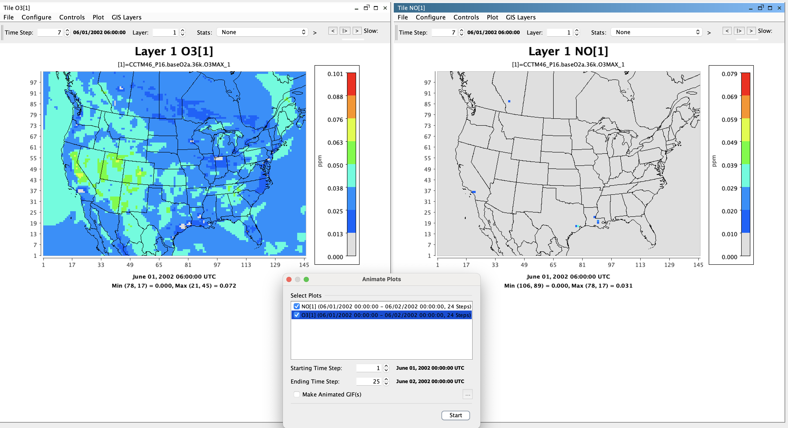
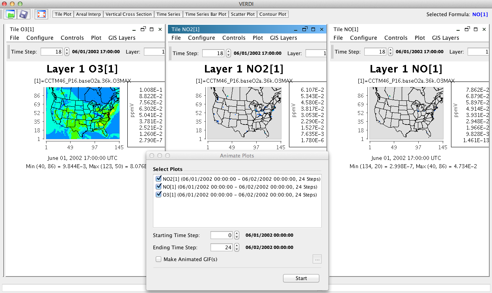

<!-- BEGIN COMMENT -->
  
[<< Previous Chapter](VERDI_ch04.md) - [Home](README.md) - [Next Chapter >>](VERDI_ch06.md)

<!-- END COMMENT -->

Navigating VERDI’s Main Menu Options
====================================

[Table 5-1](#Table5-1) lists the main menu options that are available on the top menu bar in VERDI’s main window (see [Table 5-1](#Table5-1)). These options are discussed in detail below.

Table 5-1. VERDI Main Menu Options

| **File**           | **Plots**          | **Window**| **Help**            |
|--------------------|--------------------|----------|----------------------|
| Open Project       |Undock All Plots    | Areas    | VERDI Help |
| Save Project       |Animate Tile Plots  | Datasets | About      |
| Save Project As    |                    | Formulas |            |
| View Script Editor |                    |          |            |
| Exit               |                    |          |            |

File Menu Options
-----------------

### Open Project

**Open Project** retrieves projects that were saved during a previous session (using the two **Save Project** options described in Section 5.1.2). Note that when you use a saved project, *it is very important* to load that project into VERDI *before* you load any additional datasets or create any additional variables/formulas. If you have already loaded datasets and then try to open a previously saved project, VERDI will show you a message that says “All currently loaded datasets will be unloaded” and will ask if you want to continue.

### Save Project

The **Save Project** and **Save Project As** options save dataset lists and associated formulas as a “project” for later use.

Note that plots are not saved with a project; only datasets and formulas are saved. If you wish to save a plot configuration for later use, see Chapter 11 section on Saving Plot Configurations ([Chapter 11](VERDI_ch11.md#save-configuration)).

### View Script Editor

Use the **View Script Editor** to modify and run batch scripts within VERDI. Several sample script files are provided with the VERDI distribution under the $VERDI_HOME/data/scripts directory. Use the Open popup window to specify file_patterns.txt, which is one of the sample script files. The contents of the file_patterns.txt will be displayed in the Script Editor in the right side of the VERDI window. Modify it to specify the local directory path name for the sample data files, the formulas, the type of plots, and the image format. The plots are not rendered within VERDI, but may be viewed using an image viewer. The batch scripting language is described in the sample script files, and is described in more detail in [Chapter 17 VERDI Batch Script Editor](VERDI_ch17.md#verdi-batch-script-editor)

Plots Menu Options
------------------

VERDI opens a single pane for plots, to the right of the **Dataset**, **Formula,** and **Area** tabbed pane. Each plot is created in its own pane and is placed in the plot pane. The most recent plot is displayed on the top. Each plot has a tab beneath it listing the type of plot and the formula used to create it. If you want to view a previously created plot, select the tab associated with its pane underneath the current plot; the selected plot is then displayed on top.

### Undock All Plots

As with the **Dataset**, **Formula,** and **Area** panes (Section 4.3), plot panes can be undocked or externalized so that you can move them into separate, floating windows. This allows side-by-side comparisons of plots. Note that undocking is performed only on previously created plots; each plot is placed within the VERDI main window when it is generated.

###  Animate Tile Plots

This option opens an **Animate Plots** dialog box PDF:([Fig-@fig:Figure9])) or GitHub:([Figure 9](#Figure9)) that allows you to select one or more plots, select a subset of the time range, and create an animated GIF file. There is also a separate way to create a QuickTime movie instead of a GIF, if desired.

Within the **Animate Plots** dialog box, you can **select plot(s)** to animate by clicking the check box beside each plot name.

You can choose to animate a single plot, or animate multiple plots synchronously. To view multiple animated plots synchronously, undock the plots (see Section 5.2.1) and arrange them so that they are located side by side for visual comparison during the animation. NOTE: The underlying number of time steps must match or the Start button will not activate (PDF:([Fig-@fig:Figure9])) or  GitHub: [Figure 9](#Figure9)).

<!-- BEGIN COMMENT -->

Figure 9. Selected plots must have matching time steps. 

<!-- END COMMENT -->

{#fig:Figure9}

After selecting your plots, **select the time range** by specifying both the **starting time step** and **ending time step** of the animation. The selected plots animate together over the selected time interval.

To create an animated GIF, check the **Make Animated GIF(s)** option in the **Animate Plots** dialog box. In the **Save** dialog box that appears, select the directory in which to store the file and the name to use for the animated GIF, then click the save button. When saving as an animated GIF, when multiple plots are selected, each animated plot will be saved to a separate animated GIF file. For example, if three plots were selected, the animated plots would be saved as &lt;filename&gt;-1.gif, &lt;filename&gt;-2.gif, &lt;filename&gt;-3.gif. You can view the animated GIF by opening the file in a web browser. see (PDF:([Fig-@fig:Figure10])) or  GitHub: [Figure 10](#Figure10))

Creating a QuickTime movie is also an option, but this is not done through the **Plots&gt;Animate Tile Plots** main menu option. Instead, use the **Plot** menu option found at the top of each individual plot to make a QuickTime movie.

<!-- BEGIN COMMENT -->

Figure 10 Animate Plots Dialog and Tile Plots 

<!-- END COMMENT -->

{#fig:Figure10}

Window Menu Options
-------------------

The **Window** menu provides an alternate way to select windows/panes to be brought to the front, and provides the same function as clicking on the tabs at the bottom of the windows/panes.

### Datasets, Areas, and Formulas

Select from the **Window** pull-down menu to bring to the front either the **Datasets** pane, **Areas** pane, or **Formulas** pane when those panes are docked.

### Script Editor

This option appears in the Window menu if you have a script editor window open. You can select this menu item instead of pressing the Script Editor tab at the bottom of its pane.

### List of Plots

The **Window** pull-down menu is automatically updated each time a plot is created or removed in a VERDI session; each entry in the plot list indicates the type of plot and the formula used (e.g, Tile O3[1]). A check mark to the left of a plot designates the active plot. Click on a plot entry to bring that plot to the front for viewing. Alternatively, you can bring a plot to the front by selecting the desired **plot tab** underneath the plots area of the main window or my clicking on the plot’s window for undocked plots. As in the menu entries, each **plot tab** is labeled with the plot type and the formula used.

Help Menu Options
-----------------

The **Help** pull-down menu contains two items that you can use to learn more about VERDI. When you select **VERDI Help Documents**, you can select to view either the user manual or the developer instruction in your PDF-compatible reader. When you select **About** a popup window that contains the name of the product, the version number, and the date the software was built is displayed.

<!-- BEGIN COMMENT -->

[<< Previous Chapter](VERDI_ch04.md) - [Home](README.md) - [Next Chapter >>](VERDI_ch06.md) 
VERDI User Manual (c) 2024 

<!-- END COMMENT -->

