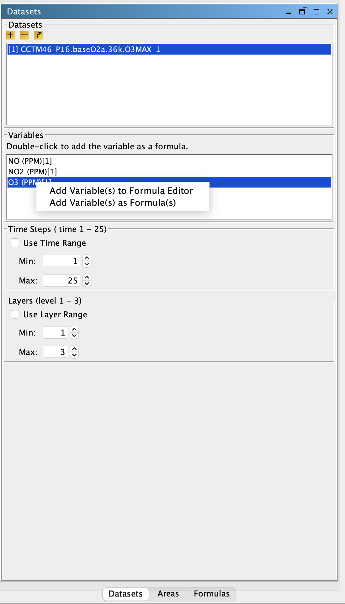

<!-- BEGIN COMMENT -->
  
[<< Previous Chapter](VERDI_ch05.md) - [Home](README.md) - [Next Chapter >>](VERDI_ch07.md)

<!-- END COMMENT -->

Working with Gridded Datasets
=============================

Gridded Input File Formats
--------------------------

###  Model File Format Conventions

VERDI currently supports visualizing files in the following file format conventions: CMAQ Models-3 Input/Output Applications Programming Interface (I/O API) netCDF, WRF netCDF, CAMx (UAM-IV), MPAS netCDF, and ASCII format (for observational data). VERDI uses a customized version of the thredds/NetCDF Java library v5.5.3 (<http://www.unidata.ucar.edu/software/netcdf-java>).

The CMAQ Models-3 I/O API was designed as a high-level interface on top of the netCDF Java library. (see https://www.cmascenter.org/ioapi/ and <http://www.unidata.ucar.edu/software/netcdf/> for further information). The Models-3 I/O API library provides a comprehensive programming interface to files for the air quality model developer and model-related tool developer, in both FORTRAN and C/C++. Models-3 I/O API files are self-describing and include projection information within the gridded dataset. See Chapter 12 for additional information on what projections and gridded data file format conventions are currently supported by VERDI.

NetCDF and Models-3 I/O API files are portable across computing platforms. This means that these files can be read regardless of what computer type or operating system you are using. Routines are available to convert data to these formats or new code can be written and contributed to VERDI for use by the community. Discussion of the Models-3 I/O API conversion programs and how to use them can be found in Chapter 13, “Models-3 I/O API Utilities, Data Conversion Programs, and Libraries”. If you write a routine for VERDI to read gridded data from other formats, please consider contributing your code to the user community using GitHub, as described in Chapter 14.

###  Observational Data Formats

VERDI can use observational data in either using ASCII file or created using Models-3 I/O API. An ASCII file needs to have data in tab-separated columns. The first four columns need to be in the order shown in PDF:([Fig-@fig:Figure11])) or GitHub:[Figure 11](#Figure11). VERDI allows the user to specify an alphanumeric value (either numbers and/or letters) for the fourth column (Station ID). One or more additional columns must have the header format 'name(units)'. Spreadsheet programs can be used to edit and write the files by choosing ASCII output; be certain to designate **tab** as the delimiting character (instead of comma). Data within a column must be complete, because empty fields prevent VERDI from reading the observational data.

Observational data in ASCII format can be obtained from many data sources. Data can be downloaded 
from the CMAS Center Google Drive 

<https://drive.google.com/drive/u/1/folders/1YIcmYtPH_DRyN51dDEQDh3r5Q_4iNLuu>

or  EPA’s Remote Sensing Information Gateway - RSIG

<https://www.epa.gov/hesc/remote-sensing-information-gateway>

To use a consistent set of units for the model data and the observational data, you may need to import the ASCII data into a tool (e.g., a spreadsheet or database program) and perform a unit conversion. VERDI doesn’t allow the user to use an observational variable to create a formula, so conversions to different units must be performed before loading the data into VERDI.

<!-- BEGIN COMMENT -->

Figure 11. Example observational data file showing format.

<!-- END COMMENT -->

{#fig:Figure11}

Alternatively, you can use a converter such as AIRS2M3 (see Chapter 13) to convert ASCII observational data into Models-3 I/O API "observational-data" files.

Example Datasets
----------------

Several example datasets are provided under the $VERDI_HOME/data directory. For example:

-   Windows: %VERDI_HOME%\\data

-   Mac: $VERDI_HOME/data/

-   Linux: $VERDI_HOME/data

These datasets may be used to recreate example plots that are provided in this user’s manual, including a tile plot with observational data overlay (see Section 11.6.3.1) and example datasets for the various projections that VERDI supports including Lambert Conformal Conic (LCC), polar stereographic, Universal Transverse Mercator (UTM), and Mercator. The data directory currently contains seven subdirectories:

1.  CAMx – contains sample CAMx dataset and camxproj.txt file

2.  configs – contains sample config and theme files

3.  hucRegion – contains Hydrologic Unit Code (HUC) shapefiles for region 3 (southeast US)

4.  model – contains sample WRF netCDF, MPAS netCDF, and CMAQ Models-3 I/O API datasets

5.  obs – contains an ASCII formatted observational dataset (Section 6.1.2), and an observational dataset created by airs2m3 converter (Chapter 13).

6.  plots – contains sample plots created by VERDI

7.  scripts – contains sample batch scripts

Adding and Removing a Dataset from a Local File System
------------------------------------------------------

To load a data set from a local file system, press the yellow **plus** button at the top of the **Datasets** pane. A file browser PDF:([Fig-@fig:Figure12])) or GitHub:([Figure 12](#Figure12)) allows you to select a dataset for use in VERDI. Support for loading data from a remote file system was added beginning in version 1.4. The use of the yellow **plus remote** button will be discussed in Section 6.4.

After you select a dataset, VERDI loads header information and displays the available variables, time steps, layers, and domain used by the file in the **Datasets** pane PDF:([Fig-@fig:Figure13])) or GitHub:([Figure 13](#Figure13)). (The actual model data are not loaded until later, when plots are created.) To view the variables for a particular dataset that has been loaded, click on the dataset name in the list to highlight it, and the variables will be listed in the panel below.

Datasets can be removed by highlighting the name of the dataset in the dataset list and pressing the yellow **minus** button. Note that although the dataset will be removed, the number that was assigned to that dataset will not be reused by VERDI during the current session (unless there had been only one dataset loaded, and it was removed; in that case the next dataset that is loaded will be labeled number 1).

<!-- BEGIN COMMENT -->

Figure 12. Open Dataset File Browser 

<!-- END COMMENT -->

{#fig:Figure12}

<!-- BEGIN COMMENT -->

Figure 13. Datasets Pane Displaying Information about a Dataset 

<!-- END COMMENT -->

{#fig:Figure13}

Adding and Removing a Dataset from a Remote File System
-------------------------------------------------------

VERDI provides users with the ability to select and add variables from datasets on remote file systems. To do this, press the yellow **plus remote** (plus with a diagonal arrow) button at the top of the **Datasets** pane. In the Remote File Access Browser PDF:([Fig-@fig:Figure14])) or GitHub:([Figure 14](#Figure14)) that appears, enter your user name, choose a host from the list, and enter your password, then click **Connect**.
<!-- BEGIN COMMENT -->

Figure 14. Available Hosts in the Remote File Access Browser 

<!-- END COMMENT -->

{#fig:Figure14}

### Remote File Browser

The top panel displays a listing of the home directory on the remote file system, as shown in PDF:([Fig-@fig:Figure15])) or GitHub:([Figure 15](#Figure 15)). The current path is displayed in the text box and users can edit this information to change to another directory. An alternate way to navigate between directories is using the middle panel. In the middle panel, double click on a directory name to go into that directory, or click on the “../” at the top of the middle panel to navigate up a directory. As you enter a directory, the contents of the directory will be displayed as a list in the middle panel. Directory names are followed by a “/” symbol, while filenames do not have a “/” symbol after them. View the variables within each file of interest by double clicking on the netCDF filename listed in the middle panel. NOTE: if the selected file has a format that is not supported by VERDI then the following message will be displayed in the bottom panel: “Not a valid NetCDF file”. For supported netCDF files, VERDI will provide a list of variables that are available within the file in the bottom panel labeled “Select one or more variables”. To select variables from the list, use your mouse to click on a single variable, or use either the Shift key with the mouse to select a contiguous list of variables, or the Control key with the mouse to select a set of individual variables. Once the variables that you would like VERDI to read are highlighted, click on the **Read** button.

<!-- BEGIN COMMENT -->

Figure 15. Select One or More Variables from Remote Dataset 

<!-- END COMMENT -->

{#fig:Figure15}

The variables read from the remote dataset will be displayed in the dataset and variable browser in the same way that variables from a local dataset are added and displayed within VERDI. The subsetted local dataset names are identical to the file names on the remote host, except for an additional extension that enumerates how many times the remote files were read and saved locally by VERDI (i.e., filename1, filename2, filename3, etc.), as shown in PDF:([Fig-@fig:Figure16])) GitHub:[Figure 16](#Figure16). To add variables from the same remote dataset, click on the **plus remote** button, and repeat the above procedure.

The Remote File Browser retains the login session and the directory that was last accessed by the user to facilitate ease of accessing remote datasets. VERDI increments the numerical extension to the dataset name to indicate that this subset file was created using the same remote dataset, but that the subset file with the new numerical extension may contain a different subset of variables. Note that VERDI does not check to see if the same variable from the same remote dataset has already been read. Also, subset files read in by VERDI are saved either to your home directory on your local file system (e.g., C:\\ Users\\username on a Windows 7 computer), or to the location that is specified in the config.properties file using the verdi.temporary.dir setting. Refer to Section 6.4.2 on how to edit and save the config.properties file.

The files are saved on your local machine to facilitate project management. To be able to save and then load a project for future use, the files need to be saved on the local machine. To avoid filling up your local file system, regularly inspect the file list in the home or verdi.temporary.dir directory and manually delete unneeded subset files.

Remote datasets can be removed from the dataset list in VERDI using the same procedure as for removing local datasets: highlight the name of the dataset in the dataset list and press the yellow **minus** button. Note that although the dataset will be removed from the dataset list, the number that was assigned to that dataset will not be reused by VERDI during the current session.

<!-- BEGIN COMMENT -->

Figure 16. Remote Dataset Labeled with Number at End of the Filename 

<!-- END COMMENT -->

{#fig:Figure16}

### Adding Additional Remote Hosts

VERDI contains the RemoteFileUtility and ncvariable programs that enable VERDI to add your Models-3 I/O API netCDF or WRF netCDF dataset from a remote file system. A gzipped tar file is available in the $VERDI_HOME directory.

1.  The RemoteFileUtility c-shell script and ncvariable binary need to be installed either in /usr/local/bin by the System Administrator, or you can place it in a different location and specify that location in the configure.properties file located in your $USER_HOME/verdi/ directory (see section 3.4 for the specific directory location that is used for each platform [Linux, Windows, Mac]). A template for the configure.properties file called configure.properties.TEMPLATE is provided in the distribution under the $VERDI_HOME directory.

2.  A README file provided with the software contains instructions on how to compile the source code if the binaries provided do not match your operating system.

3.  Copy the file configure.properties.TEMPLATE to configure.properties. Edit the configure.properties file in the $USER_HOME/verdi directory. Add the name or IP address of the Linux server, preceded by a comma, at the end of the list of machines defined as remote hosts in the configure.properties file, as shown in PDF:([Fig-@fig:Figure17])) or GitHub:[Figure 17](#Figure17). You then need to restart VERDI in order for it to recognize a newly added remote host name.

<!-- BEGIN COMMENT -->

Figure 17. Edit configure.properties File to Add a Remote Host 

<!-- END COMMENT -->

{#fig:Figure17}

Variables List
--------------

The variables list shows all of the variables contained in a loaded dataset see PDF:([Fig-@fig:Figure18])) or GitHub:[Figure 18](#Figure18). To display a variables list, select the name of the dataset of interest in the **Datasets** pane. Each of the variables in the list can be used to create a formula in the **Formula** pane that can then be used to create plots. VERDI allows the user to automatically add a formula by double-clicking on the name of a variable. This automatically creates a formula that contains the variable for the loaded dataset and makes it the default formula for making plots. In addition, you may right-click on the name of the variable to show a popup menu as shown in the middle of the figure. From this menu you can either add the variable as a formula, or you can to add it into the formula editor so that it can be used to compose more complex formulas. Formulas are described in more detail in Chapter 7.

<!-- BEGIN COMMENT -->

Figure 18. Right-Click on Variable in Dataset Pane 

<!-- END COMMENT -->

{#fig:Figure18}

Time Steps and Layers Panels
----------------------------

The range that is available for the dataset is listed in the Time Steps or Layers Panel in parenthesis next to the label for the panel. PDF:([Fig-@fig:Figure18])) or GitHub:[Figure 18](#Figure18) shows that the dataset has 25 time steps with the range displayed as: Time Steps (1-25). You can use a subset of the full time step range by clicking on the Use Time Range checkbox, and then using the Min and Max spinner controls to set a new minimum or maximum value, for example choosing time step 2 as the minimum time step and time step 4 as the maximum. When a tile plot is created, it will only display time steps 2-4. Detailed instructions for using the **Time Steps** and **Layers** panels are discussed in Chapter 9, “Subsetting Spatial and Temporal Data.”

Saving Projects
---------------

As noted in Section 5.1.2, lists of datasets and formulas can be saved as “projects” using the Save Project option in the **File** pull-down menu on the VERDI main window. Refer back to that section for discussion on saving new projects and loading existing projects. Note that the plots created in VERDI are not saved with the project.

<!-- BEGIN COMMENT -->

[<< Previous Chapter](VERDI_ch05.md) - [Home](README.md) - [Next Chapter >>](VERDI_ch07.md) 
VERDI User Manual (c) 2025 

<!-- END COMMENT -->
