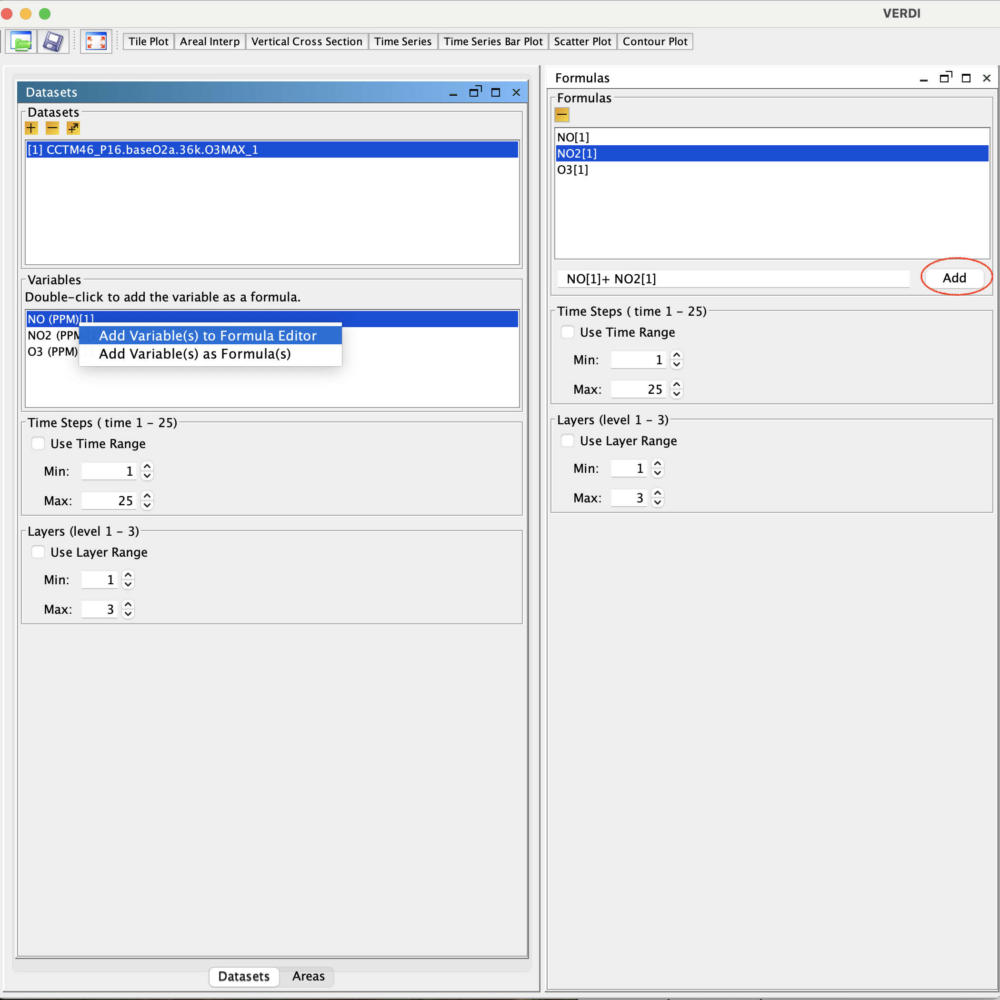

<!-- BEGIN COMMENT -->
  
[<< Previous Chapter](VERDI_ch06.md) - [Home](README.md) - [Next Chapter >>](VERDI_ch08.md)

<!-- END COMMENT -->

Working with Formulas
=====================

All plots in VERDI are generated from formulas. A formula is used to compare or manipulate variables in one or more gridded datasets. A formula can be as simple as a single variable from one gridded dataset or it can be an equation that uses variable(s) from one or more gridded datasets. Formulas are used to create visualizations that can assist with model performance evaluations, for example, or can help in comparing model results with observations.

Adding and Removing a Formula
-----------------------------

After loading the desired gridded datasets, you can use the variables in them to create formulas. To use a variable to create a simple formula, double click on the name of the variable. This will add the formula &lt;Variable Name&gt;[&lt;Dataset Number&gt;] to the formula list in the **Formulas** pane—for example, O3[1]. To add a variable to the formula editor window, highlight the variable, **right click** on the variable name in the **Datasets** pane, and select **Add Variable(s) to Formula Editor**. To add all or a subset of variables from the **Dataset** pane to the formula editor window, click on the first variable to highlight it, hold the Shift key down and click at the last variable that you want to include, then right click and select **Add Variables(s)**. The formulas that are highlighted using this method will be added to the formula editor ([Figure 7‑1](#Figure7-1)).

Figure 7‑1. Adding Multiple Variables to Formula Editor 

After the variable names are added to the Formula Editor, click on the formula pane and use the cursor and the keyboard to type in the mathematical functions and operators where needed to create a valid formula (see Section 7.2 and Chapter 16). After the formula has been created in the Formula Editor, click the **Add** button to place it in the list of formulas available in the **Formula** pane.

To remove a formula from the formulas list, highlight the name in the list and press the yellow **minus** button. Note that removing a formula from the formula list does not remove plots that were created prior to the deletion of the formula.

Example Formulas
----------------

To examine the values of ozone in dataset 1, the formula would be “O3[1]”.

To examine the difference in ozone between datasets 1 and 2, the formula would be “O3[1]-O3[2]”.

To calculate the percent difference in ozone between datasets 1 and 2, the formula would be “(O3[1]-O3[2])*100/(O3[2])”.To identify all cells where the ozone concentration exceeds a certain value, you can use the Boolean operators to focus on ranges of your data that are of particular interest. A Boolean expression will evaluate to either True = 1 or False = 0. For example, to plot the cells in which the ozone values in dataset 1 exceed 0.080 ppm, you could use the formula “(O3[1]&gt;0.080)*O3[1]”. In the resulting plot, each cell where O3[1] exceeds 0.080 will show the value of O3[1] for that cell; for all other cells the value shown will be zero.

The notations that can be used in formulas to represent various mathematical functions, and the order of precedence of these functions, are listed in Chapter 16, “Mathematical Functions.”

Selecting a Formula for Plotting
--------------------------------

You must select a formula before creating a plot. Check to see which formula is highlighted in the **Formula** pane, or look to the right of the plot buttons above the plots area of the main window to see the selected formula. By default, VERDI designates the most recently added formula as the selected formula. To change the selected formula to a different one in the list, click on a formula in the list on the **Formulas** pane, and you will then see it displayed as the selected formula above the plots area.

Saving Formulas
---------------

Both formulas and datasets can be saved using the **Save Project** item in the **File** pull-down menu on the VERDI main window. Saving new projects and loading existing projects were discussed in Section 5.1.

Time Step and Layer Ranges
--------------------------

Instructions for using the **Time Steps** and **Layers** panels are discussed in Chapter 9 Subsetting Spatial and Temporal Data.

Working with Area Files
=======================

Area File Formats
-----------------

Area files are defined in VERDI as shapefiles that contain area features such as watersheds and counties, or any other shapefile that consists of a set of closed polygons.

The shapefile format (ESRI, 1998) consists of four files.

1.  The *.shp file contains the actual shape vertices.

2.  The *.shx file contains the index data pointing to the structures in the .shp file.

<!-- -->

1.  The *.dbf file contains the attributes (e.g., unique county ID).

2.  The *.prj file contains the map projection information associated with the polygons.

Example Area File
-----------------

Shapefiles that contain closed polygons are used by VERDI to interpolate gridded data to geographic boundary regions to create Areal Interpolation Plots. Shapefiles containing state, county, or census block, for example, or any other shapefile containing polygon areas may be used in VERDI to calculate and map formulas to the user-selected geographic regions. An example shapefile containing the 8-digit HUC watershed boundary map for the Southeast (HUC 3) is provided in the VERDI release under the $VERDI_HOME/data/HucRegion directory.

Examples of on-line data archives for these shapefiles include:

<http://datagateway.nrcs.usda.gov>

<https://www.census.gov/geo/maps-data/index.html>

Requirements for Shapefiles used in Areal Interpolation
-------------------------------------------------------

Shapefiles for areal interpolation must use units of degrees (not meters) and should use the following datum: DATUM[“unknown”, SPHEROID[“SPHERE”, 6370000.0, 0.0], TOWGS84[0,0,0]

Adding and Removing an Area File
--------------------------------

To load a shapefile, press the yellow **plus** button at the top left corner of the **Areas** pane (Figure 8‑1). A file browser (Figure 8‑2) allows you to change directories and select a shapefile file for use in VERDI. Click on the shapefile name and click **Next**. The **Open Area** popup window is displayed next, allowing you to select the name of the field to read from the file. Use the pull-down menu and click on the Name Field (Figure 8‑3) to be used. Each shapefile has a projection file associated with it (e.g., myFile.shp also has myFile.prj). After specifying the Name Field, select **Finish**. The resulting plot will be in the same projection as the gridded information used in the plot.

Areas List
----------

The shapefile name(s) are listed in the top panel of the **Areas** pane, and the name fields for the polygons provided in the shapefile(s) are listed in the panel underneath (see Figure 8‑4). The actual model data are not loaded until the Areal Interpolation plots are created. As additional shapefiles are added, the name fields associated with each shapefile are appended to the bottom of the Areas list. Use the scrollbar on the right side of the **Areas** pane to view the additional name fields that are available. To remove a shapefile, click on the name of the shapefile and press the yellow **minus** button at the top left corner of the **Areas** pane.

Areal Interpolation
-------------------

When you select the Areal Interpolation Plot, your selected formula is remapped over the polygon areas that are listed in the **Areas** pane. To select a subset of the polygon areas, and view the average and total values for selected formulas, see Section 10.2: Areal Interpolation Plot.

Figure 8‑1. Areas Pane 

Figure 8‑2. Open Area File Browser 

Figure 8‑3. Open Area File: Select Name Field 

Figure 8‑4. Area Name Fields in Current Shapefile 

<!-- BEGIN COMMENT -->

[<< Previous Chapter](VERDI_ch06.md) - [Home](README.md) - [Next Chapter >>](VERDI_ch08.md) 
VERDI User Manual (c) 2018 

<!-- END COMMENT -->
