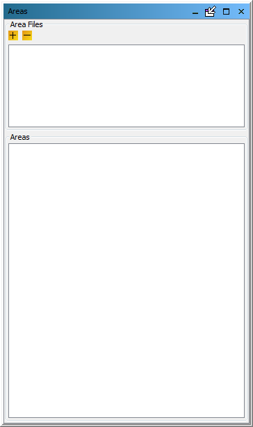
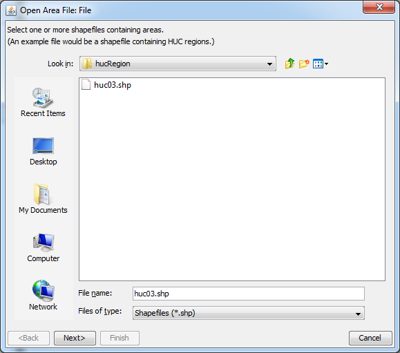
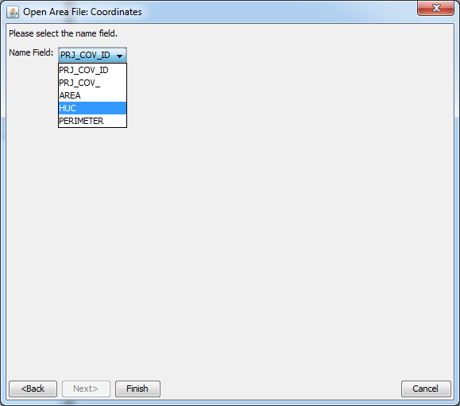
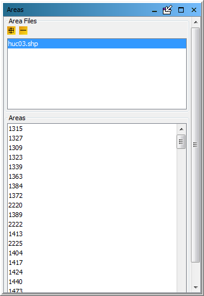

<!-- BEGIN COMMENT -->
  
[<< Previous Chapter](VERDI_ch07.md) - [Home](README.md) - [Next Chapter >>](VERDI_ch09.md)

<!-- END COMMENT -->

Working with Area Files
=======================

Area File Formats
-----------------

Area files are defined in VERDI as shapefiles that contain area features such as watersheds and counties, or any other shapefile that consists of a set of closed polygons.

The shapefile format (ESRI, 1998) consists of four files.

1.  The *.shp file contains the actual shape vertices.

2.  The *.shx file contains the index data pointing to the structures in the .shp file.

<!-- -->

1.  The *.dbf file contains the attributes (e.g., unique county ID).

2.  The *.prj file contains the map projection information associated with the polygons.

Example Area File
-----------------

Shapefiles that contain closed polygons are used by VERDI to interpolate gridded data to geographic boundary regions to create Areal Interpolation Plots. Shapefiles containing state, county, or census block, for example, or any other shapefile containing polygon areas may be used in VERDI to calculate and map formulas to the user-selected geographic regions. An example shapefile containing the 8-digit HUC watershed boundary map for the Southeast (HUC 3) is provided in the VERDI release under the $VERDI_HOME/data/HucRegion directory.

Examples of on-line data archives for these shapefiles include:

<http://datagateway.nrcs.usda.gov>

<https://www.census.gov/geo/maps-data/index.html>

Requirements for Shapefiles used in Areal Interpolation
-------------------------------------------------------

Shapefiles for areal interpolation must use units of degrees (not meters) and should use the following datum: DATUM[“unknown”, SPHEROID[“SPHERE”, 6370000.0, 0.0], TOWGS84[0,0,0]

Adding and Removing an Area File
--------------------------------

To load a shapefile, press the yellow **plus** button at the top left corner of the **Areas** pane PDF:([Fig-@fig:Figure20])) or GitHub:[Figure 20](#Figure20). A file browser PDF:([Fig-@fig:Figure21])) or GitHub:[Figure 21](#Figure21) allows you to change directories and select a shapefile file for use in VERDI. Click on the shapefile name and click **Next**. The **Open Area** popup window is displayed next, allowing you to select the name of the field to read from the file. Use the pull-down menu and click on the Name Field PDF:([Fig-@fig:Figure22])) or GitHub:[Figure 22](#Figure22) to be used. Each shapefile has a projection file associated with it (e.g., myFile.shp also has myFile.prj). After specifying the Name Field, select **Finish**. The resulting plot will be in the same projection as the gridded information used in the plot.

Areas List
----------

The shapefile name(s) are listed in the top panel of the **Areas** pane, and the name fields for the polygons provided in the shapefile(s) are listed in the panel underneath PDF:([Fig-@fig:Figure23])) or GitHub:[Figure 23](#Figure23). The actual model data are not loaded until the Areal Interpolation plots are created. As additional shapefiles are added, the name fields associated with each shapefile are appended to the bottom of the Areas list. Use the scrollbar on the right side of the **Areas** pane to view the additional name fields that are available. To remove a shapefile, click on the name of the shapefile and press the yellow **minus** button at the top left corner of the **Areas** pane.

Areal Interpolation
-------------------

When you select the Areal Interpolation Plot, your selected formula is remapped over the polygon areas that are listed in the **Areas** pane. To select a subset of the polygon areas, and view the average and total values for selected formulas, see Section 10.2: Areal Interpolation Plot.

<!-- BEGIN COMMENT -->

Figure 20. Areas Pane 

<!-- END COMMENT -->

{#fig:Figure20}

<!-- BEGIN COMMENT -->

Figure 21. Open Area File Browser 

<!-- END COMMENT -->
{#fig:Figure21}

<!-- BEGIN COMMENT -->

Figure 22. Open Area File: Select Name Field 

<!-- END COMMENT -->

{#fig:Figure22}

<!-- BEGIN COMMENT -->

Figure 23. Area Name Fields in Current Shapefile 

<!-- END COMMENT -->

{#fig:Figure23}

<!-- BEGIN COMMENT -->

[<< Previous Chapter](VERDI_ch07.md) - [Home](README.md) - [Next Chapter >>](VERDI_ch09.md) 
VERDI User Manual (c) 2018 

<!-- END COMMENT -->
