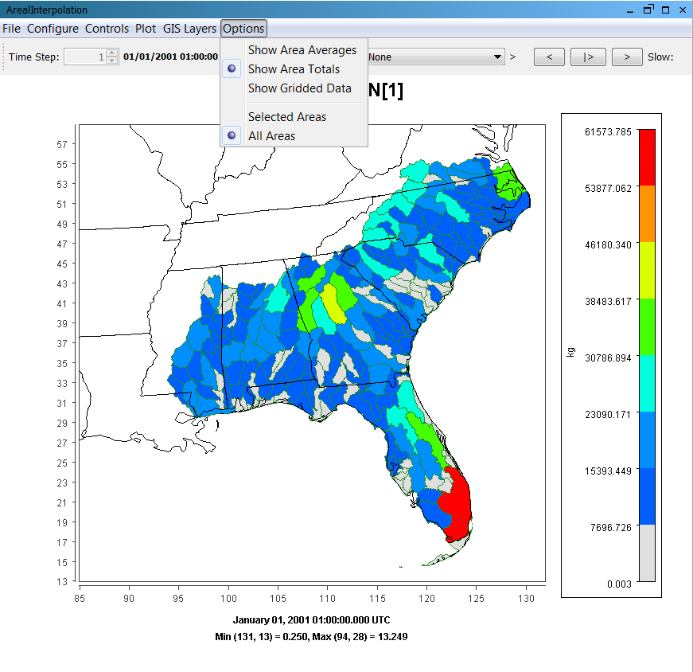

<!-- BEGIN COMMENT -->
  
[<< Previous Chapter](VERDI_ch09.md) - [Home](README.md) - [Next Chapter >>](VERDI_ch11.md)

<!-- END COMMENT -->

Creating Plots
==============

After creating a formula, you are ready to create and view some plots. The available plot types are shown on the buttons at the top of the VERDI main window: tile plot, areal interpolation plot, vertical cross section plot, time series plot, time series bar plot, scatter plot, and contour plot. All of these are described in this chapter. Note that not all datasets are appropriate for all plot types.

To generate a plot first highlight a formula in the list of formulas you have created in the **Formula** pane. You can also see the selected formula in the top right corner of the main VERDI screen (i.e., to the right of the plot buttons). Next, generate a plot by clicking on that plot type’s button. If VERDI needs additional information to generate your chosen plot, a dialog box appears to prompt you for that information.

Each plot contains its own menu bar at the top of its window with options for configuring and exploring that type of plot. The menus may include **File, Configure, Controls,** **Plot,** and **GIS Layers**. The options for each of these menus are described in more detail in Chapter 11 Plot Menu Bar.

Tile Plot
---------

The **Tile Plot** displays gridded data defined as time steps and layers. It can also display grid cell time aggregate statistics. [Figure 10‑1](#Figure10-1) provides an example of the **Tile Plot** window.

Figure 10‑1. Tile Plot Example 

### Time Selection and Animation Controls

At the top left of the Tile plot, the **Time Step** spin control can be used to change the time step by clicking the up or down arrow. Alternatively, highlight the value shown for the current time step, type in the desired value, and press the **Enter** key.

Buttons in the top right corner of the plot allow you to use play/stop, reverse, forward, and speed options to control the animation of the plot. Control the speed of the animation through the text box labeled **Slow**; the default delay is 50 milliseconds between frames. If that text box is not visible, expand the plot window’s width by clicking with the left mouse button on the right edge of the window and dragging to the right. Enter a number in the box for the length of the delay and then press the **Enter** key. A larger plot with multiple map layers may require a shorter delay between frames than a small zoomed-in plot with few map layers.

### Layer Selection

The Layer displayed for the plot can be controlled by clicking on the up or down arrow for the **Layer** spin control in the top center of the plot.

### Grid Cell Time Aggregate Statistics

The pull down menu option labeled **Stats** provides the option to display grid cell time-aggregate statistics (e.g., per-cell minimum, maximum, mean, geometric mean, median, first quartile, third quartile, variance, standard deviation, coefficient of variance, range, interquartile range, sum, time step of minimum, time step of maximum, maximum 8-hour average, and hours of noncompliance). Although you are still able to use the spinners to change the time step, the values and the chart’s colors do not change.

VERDI calculates the grid cell time aggregate statistics as follows: For each cell (*i,j,k*) in the currently selected domain (independent of neighboring cells), the aggregated statistical value is calculated over the currently selected time steps. In other words, the aggregated statistical value is calculated for the plotted formula for cells (*i,j,k,*tmin...tmax), with the number of time steps *n*, where *n*=(tmax-tmin+1).

-   MINIMUM: min (var(i,j,k,tmin), var(i,j,k,tmin+1), ..., var(i,j,k,tmax))

-   MAXIMUM: max (var(i,j,k,tmin), var(i,j,k,tmin+1), ..., var(i,j,k,tmax))

-   MEAN: SUM / n

-   GEOMETRIC_MEAN: ((var(i,j,k,tmin), var(i,j,k,tmin+1), ..., var(i,j,k,tmax)))(1/n)

-   MEDIAN: value at 50th percentile of (sorted {var(i,j,k,tmin), var(i,j,k,tmin+1), ..., var(i,j,k,tmax)})

-   FIRST_QUARTILE: value at 25th percentile of( sorted (var(i,j,k,tmin), var(i,j,k,tmin+1), ..., var(i,j,k,tmax)))

-   THIRD_QUARTILE: value at 75th percentile of( sorted (var(i,j,k,tmin), var(i,j,k,tmin+1), ..., var(i,j,k,tmax)))

-   VARIANCE: ((var(i,j,k,tmin)-MEAN)2 + (var(i,j,k,tmin+1)-MEAN)2 + ... + (var(i,j,k,tmax)-MEAN)2) / (n - 1)

-   STANDARD_DEVIATION: VARIANCE0.5

-   COEFFICIENT_OF_VARIANCE: STANDARD_DEVIATION / |MEAN|

-   RANGE: MAXIMUM - MINIMUM

-   INTERQUARTILE_RANGE: THIRD_QUARTILE - FIRST_QUARTILE

-   SUM: var(i,j,k,tmin) + var(i,j,k,tmin+1) + ... + var(i,j,k,tmax)

-   TIMESTEP_OF_MINIMUM: 0-based time step when cell contains its minimum value

-   TIMESTEP_OF_MAXIMUM: 0-based time step when cell contains its maimum value

-   HOURS_OF_NON_COMPLIANCE: number of time steps that the cell value eceeds a given threshold |{Var(I,j,k,t(i))&gt;threshold}|

-   MAXIMUM_8HOUR_MEAN: Ma (M1, M2, ..., Mn-8) where Mi = mean(var(i,j,k,t(i)), var(i,j,k,t(i)+1), var(i,j,k,t(i+2)), ...,var(i,j,k,t(i+8)), for i = 1..n-8

-   fourth_max:  fourth highest value for each grid cell (used to obtain the 4th highest value of your rolling 8 hr maximum CMAQ output file)

-   custom_percentile: default is > .12 (use the text box) value at custom th percentile of( sorted (var(i,j,k,tmin), var(i,j,k,tmin+1), ..., var(i,j,k,tmax)))

Areal Interpolation Plot
------------------------

The **areal interpolation** plot displays the interpolated value of the selected formula for each polygon in the selected area file. Compare the colors of the polygons to those shown in the legend, to see the relative values of the formula for each polygon area. The Areal Interpolation Plot includes several capabilities that are not available for other plot types, so these are described below, rather than in Chapter 11 Plot Menu Bar.

### Options Menu

The Areal Interpolation Plot menu contains an **Options** menu to allow the user to change the map to display either the Area Averages ([Figure 10‑2](#Figure10-2)), the Area Totals ([Figure 10‑3](#Figure10-3)), or the value of the formula contained in the Gridded Dataset (uninterpolated) ([Figure 10‑4](#Figure10-4)). The **Options** pull-down menu may also be used to display **All** area segments that are loaded in the area list, or to display only the area segments that are selected by highlighting the name field from the area list ([Figure 10‑5](#Figure10-5)).

Figure 10‑2. Areal Interpolation Plot: Area Average 

Figure 10‑3. Areal Interpolation Plot: Area Totals 

Figure 10‑4. Areal Interpolation Plot: Show Gridded Data 

Figure 10‑5. Areal Interpolation Plot: Show Selected Areas 

### Areal Values for Polygon Segment

To view the area, total value, and average value for a selected polygon segment use the mouse cursor to hover over a polygon on the map. The values are shown at the bottom left of the information panel (Figure 10‑6).

Figure 10‑6. Areal Values for a Selected Polygon 

### View and Export Areal Interpolation Plot Data in Text Format

To view the average and total interpolation values for selected formulas in a spreadsheet format, **right click** on the Areal Interpolation Plot and select **Area Information** ([Figure 10‑7](#Figure10-7)), then click on the radio button next to All, to select all area regions, click on the Formula Name, then click on OK. The Area Information Spreadsheet contains four columns: the identification number from the name field for the polygon, the total area, average interpolated value, and total interpolated value ([Figure 10‑8](#Figure10-8)). At the top of the **Area Information** tab, the user may select **File&gt;Export** to export the data to a spreadsheet file ([Figure 10‑9](#Figure10-9)). The save popup window allows the user to specify with either a text (.txt) or comma-separated-values (\*.csv) format, also known as a comma-delimited text file ([Figure 10‑10](#Figure10-10).

Figure 10‑7. Right Click on Area Plot 

Figure 10‑8. Area Information in Columns 

Figure 10‑9. Export to a Text File 

Figure 10‑10. Name and Save the Text File 

### Export Areal Interpolation Plot Data to Shapefiles

At the top of the **Area Information** tab ([Figure 10‑11](#Figure10-11)), the user may select **File&gt;Export Shapefiles** to export the data to a shapefile. In the Save popup window ([Figure 10‑12](#Figure10-12)), input the name in the File Name field, and select file type: Shapefile (\*.shp). The data provided in the Area Information report (i.e., name, total area, average value, total value) are exported to the shapefile. A GIS program such as User-friendly Desktop Internet GIS (uDig; <http://udig.refractions.net/>), an open-source Java program, or QGIS (<http://qgis.org/en/site/>) may be used to view the shapefiles generated by VERDI. The shapefiles are saved as five separate files that must be kept together as part of the ESRI format (\*.shp, *.dbf, *.prj, *.shx, and *.fix). There are no units assigned to the data that are saved in the shapefile, so it is important for the user to keep a copy of the comma-delimited text file, or to keep some alternative text file that specifies the units for each data field.

Figure 10‑11. Export Shapefile 

Figure 10‑12. Name and Save Shapefile 

 Vertical Cross Section Plot
----------------------------

The **vertical cross section plot** allows you to show a slice of data ([Figure 10‑13](#Figure10-13)). A popup dialog box ([Figure 10‑14](#Figure10-14)) prompts you for information needed to create the plot. Enter either the column to be used (for an *x*-axis cross section) or the row to be used (for a *y*-axis cross section) in the plot. The current time step on the plot can be changed using the **Time Step** spinner control above the plot, which also changes the date and time shown in the bottom of the plot. There is also a **Column** spinner control to change the column number (or row number). The cross-section column number (or row number) is included in the title of the plot and changes as you change the spinner control.

Figure 10‑13. Vertical Cross Section Plot 

Figure 10‑14. Vertical Cross Section Dialog Box 

Time Series Plot
----------------

The **time series plot** shows a line graph with the average values over time ([Figure 10‑15](#Figure10-15)). The plot is made for the formula’s selected domain, layer range, and time-step range. Each time step’s data are averaged linearly to produce that time step’s data point. The current layer can be changed using the **Layer** spinner control above the plot. The layer value listed in the title is updated when you change the layer.

Figure 10‑15. Time Series Plot 

Time Series Bar Plot
--------------------

The **time series bar plot** shows average values over time in a bar plot format ([Figure 10‑16](#Figure10-16)) rather than a line format ([Figure 10‑15](#Figure10-15)). Other than that, the description of this plot type is the same as for the time series line plot (see Section 10.4).

Figure 10‑16. Time Series Bar Plot 

Scatter Plot
-------------

The **scatter plot** shows the relationship between two formulas using dots ([Figure 10‑17](#Figure10-17)). Specify the formulas using the dialog box that comes up before the plot is displayed ([Figure 10‑18](#Figure10-18)). The current time step and layer can be adjusted using the spinner controls above the plot. The data from a scatter plot may be exported by selecting the **File** menu option and then selecting Export data. If your dataset has more than one layer or time step, a popup window (see [Figure 10‑19](#Figure10-19)) allows you to specify whether you want to export the data for the current layer, or for all layers, and for the current time step, or for all time steps. Specify the time and layer ranges, and then click the **OK** button. A Save popup dialog box appears. Navigate to the directory in which you want to save this file and enter a file name with a .csv extension. The CSV file will be comma-delimited, and will contain the following columns of data: layer, time step, *x*-axis formula, *y*-axis formula. You can open this file in a spreadsheet program if your data does not contain too many rows (e.g., 65,536 or 1,048,576 depending upon version of Microsoft Excel).

Figure 10‑17. Scatter Plot 

Figure 10‑18. Scatter Plot Dialog Box 

Figure 10‑19. Scatter Plot Export Data into a CSV file 

Contour Plot
------------

The **contour plot** shows a three-dimensional (3‑D) representation of values for a gridded dataset (e.g., one that can be used in the Tile Plot) ([Figure 10‑20](#Figure10-20)). Note that the 3-D contour plot is displayed in its own window (i.e., not in the VERDI window). The current time step and layer can be adjusted using controls above the plot. You can also animate the plot over time using an option in the **Plot** pull-down menu ([Figure 10‑21](#Figure10-21)). In addition, the contour plots can be rotated in three dimensions to achieve different viewing angles by using the left mouse button to grab and rotate the plot ([Figure 10‑22](#Figure10-22)).

Figure 10‑20. Contour Plot 

Figure 10‑21. Contour Plot Menu Options 

Figure 10‑22. Rotated Contour Plot 

<!-- BEGIN COMMENT -->

[<< Previous Chapter](VERDI_ch09.md) - [Home](README.md) - [Next Chapter >>](VERDI_ch11.md) 
VERDI User Manual (c) 2018 

<!-- END COMMENT -->
