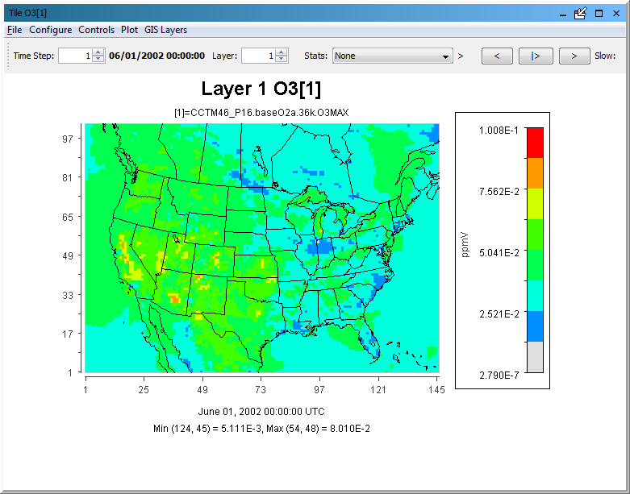
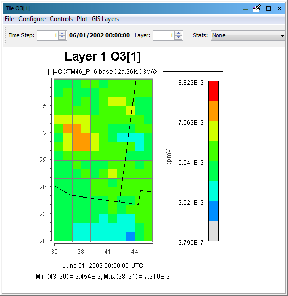

<!-- BEGIN COMMENT -->

[<< Previous Chapter](VERDI_ch10.md) - [Home](README.md) - [Next Chapter >>](VERDI_ch12.md)

<!-- END COMMENT -->
 
Plot Menu Bar
==============

Each VERDI plot contains a menu bar with options specific to that type of plot. The menu options at the top of the Tile Plot and Areal Interpolation Plot include those shown in [Table 11-1](#Table11-1).

<a id=Table11-1></a>
Table 11-1. Tile and Areal Interpolation Plot Pull-down Menu Options

| **File**            | **Configure**      | **Controls**                | **Plot**                   | **GIS Layers** |
|---------------------|--------------------|-----------------------------|----------------------------|----------------|
| Print               | Configure Plot     | Zoom (not for MPAS netCDF)  | Time Series of Probed Cell(s) | Add Map Layers |
| Export as Image/GIS | Load Configuration | Probe (not for MPAS netCDF) | Time Series Bar of Probed Cell(s) | Configure GIS Layers  |
|                     | Save Configuration | Set Row and Column Ranges   |Time Series of Min. Cell(s) | Set Current Maps as Plot Default |
|                     |                    |  Show Grid Lines (MPAS:Show Cell Borders) | Time Series of Max. Cell(s) |  |
|                     |                    | Show Lat/Lon (MPAS:Show Wind Vectors)    | Animate Plot               |  |
|                     |                    |                           | Add Overlay (not for MPAS netCDF)         |  |
|                     |                    | For MPAS: Show Wind Vectors|                              |              |


The menu options at the top of the Vertical Cross Section, Time Series, Time Series Bar Plot and Scatter Plot include those shown in [Table 11-2](#Table11-2). Most options are common to all plots, and function in the same way (unless the option is grayed out). Therefore, this chapter is organized by menu instead of by plot type.

<a id=Table11-2></a>
Table 11-2. Vertical Cross Section, Time Series, Time Series Bar, Scatter Plot Pull-down Menu Options


| **File**        | **Configure**      | **Controls** |
|-----------------|--------------------|--------------|
| Print           | Configure Plot     | Zoom         |
| Export as Image | Load Configuration | Probe        |
|                 | Save Configuration | Show Lat/Lon |     
|                 | Load Chart Theme   |              |
|                 | Edit Chart Theme   |              |
|                 | Save Chart Theme   |              |


File Menu
----------

Options in the **File** menu include printing a plot and exporting a plot to an image file. Plots can be saved as BMP, EPS, JPEG, PNG, TIFF image files or as the Shapefile format. The ASC format is a text file containing the cell values.

 Configure Menu
----------------

The **Configure** pull-down menu contains the following options: Configure Plot, Load Configuration, and Save Configuration. When you want to see your changes on the plot, press the **Apply** button. When you have finalized the settings for your plot, click the **OK** button to close the Configure Plot dialog box.

### Configure Plot

PDF:([Fig-@fig:Figure48]) or GitHub:[Figure 48](#Figure48) through PDF:([Fig-@fig:Figure51]) or GitHub:[Figure 51](#Figure51) show the dialog boxes that appear when you select Configure Plot. The **Configure Plot** dialog box contains four tabs: **Titles, Color Map, Labels,** and **Other**.

-   **Titles** **tab:** PDF:([Fig-@fig:Figure48]) or GitHub: [Figure 48](#Figure48) shows the selections on this tab that you can use to edit title text and select the font type, size, and color for the title and two subtitles of the plot. Subtitles may be turned on or off by selecting or deselecting the check box for each subtitle. If a check box is not selected the associated text, font type and size, and color boxes are grayed out. However, you must provide a title or VERDI will provide its default title for you. To blank out the title you must select it and then enter spaces for the name of the title. If you deselect the title VERDI will provide its default title for you.

<!-- BEGIN COMMENT -->

<a id=Figure48></a>
Figure 48. Configure Plot, Titles Tab<br>

<!-- END COMMENT -->

{#fig:Figure48}

-   **Text:** Enter the desired text directly in the textbox. You can enter text for the plot’s title and up to two optional subtitles.
-   **Use Unicode in Text:** Unicode characters can be used with text, for example, if you want to display "2.5" as subscripts in PM2.5, you can insert Unicode "\u2082" for subscripted 2, Unicode "\u2024" for a dot and Unicode "\u2085" for subscripted 5 in the **Text** field.
 {#fig:Figure48a}

 {#fig:Figure48b}

-   **Font:** Press the **Select** button to the right of the Font line for the title or subtitle you wish to change. Your system’s standard Select Font dialog box is then displayed for you. Select a font family, font style, and size; press the **OK** button to return to the Configure Plot tab.

-   **Color:** Press the **Select** button to the right of the Color line for the title or subtitle to edit. There are five types of color palettes that you can use to select a color – Swatches, HSV, HSL, RGB, and CMYK – each on its own tab. When you select a color examples of its use are shown in the Preview portion of the Select Color window. Select the **OK** button to accept the color and return to the Titles tab of the Configure Plot dialog box.

-   **Color Map** **tab:** This tab is available for only the Tile and Areal Interpolation Plots (see PDF:([Fig-@fig:Figure49]) or GitHub:[Figure 49](#Figure49)). This tab provides many widgets for you to configure your legend colors, break points, range, etc. You can select the number of tiles, the palette type to be used, the color interval, the number format, and the scale.

<!-- BEGIN COMMENT -->

<a id=Figure49></a>
Figure 49. Configure Plot, Color Map Tab<br>

<!-- END COMMENT -->

{#fig:Figure49}

-   **Number of Tiles:** Start by selecting the number of tiles at the top of the pane. Options in some other selections, such as the available palettes and break points, change as you vary the number of tiles.

-   **Palette Type:** Three palette types are available: Diverging, Qualitative, and Sequential. Diverging has dark colors at the maximum and minimum of the range and light colors in the middle. Qualitative has a mixture of colors. Sequential has a dark color on one end (typically the maximum) with lighter shades of the same color proceeding to the lightest shade at the minimum. The color palettes frequently associated with air quality modeling results are the Tile Plot default and the Newton RGB palettes of the Sequential type.

-   **Reverse:** The reverse button reverses the order of the colors in the selected palette. For example, if a sequential palette is used, the reverse button changes the color intensities such that the darkest color is at the minimum instead of the maximum of the scale.

-   **Interval:** The interval can be set to either Automatic or Custom. The typical setting is Automatic, meaning that VERDI calculates the interval break points based on the minimum and maximum values in the dataset. Change the interval to Custom if you need to edit the values for Interval Start for each color tile.

-   **Number Format:** To specify the number format used in the map legend, enter the format [leading non-digit][0][width].[decimals][E][0] Then click the Rebuild button. NOTE: If you use any character other than **E** or **e**, VERDI will display each value as a decimal followed by that character.

    **Explanation of the format:**

    [leading non-digit]: optional; earlier had leading % like C; not required; any non-digit character before the first digit is ignored

    [0]: optional; if present values may have leading 0’s to match the overall width

    [width]: sum of [decimals] + 1 for . + desired number of places before the .; is recomputed in code if too small

    .: separator between the values for [width] and for [decimals]

    [decimals]: number of decimal places requested

    [E]: optional; if present use scientific notation (e.g., 2.33E-2) otherwise display in regular decimal notation (e.g., 0.0233)

    [0]: trailing zero AFTER the E is optional; the code puts on a trailing zero if one isn’t there

-   **Scale:** Select either Linear or Logarithmic. The interval start values are automatically adjusted when you change the scale.

-   **Min** and **Max:** The minimum and the maximum values are computed for the data to be plotted. If you set the Interval to Automatic, you can change the values for the minimum and maximum. Then, press the Rebuild button and the Apply button to see your changes both in the legend and on the map. You cannot edit the minimum or the maximum value if the Interval is set to Custom. Instead, directly edit the Interval Start values; the Interval Start value for the lowest interval is the minimum value.

-   **Rebuild:** The Rebuild button is either active or inactive (i.e., grayed out) depending upon what other widgets are active. If you make changes and the Rebuild button is active, press it before continuing.


-   **Labels** **tab:** PDF:([Fig-@fig:Figure50]) or GitHub:[Figure 50](#Figure50)) shows widgets for you to edit more labels on your plot. There are four tabs through which you can edit the labels of the Domain Axis (x-axis), the Range Axis (y-axis), Legend, and Footer.

<!-- BEGIN COMMENT -->

<a id=Figure50></a>
Figure 50. Configure Plot, Labels Tab<br>

<!-- END COMMENT -->

{#fig:Figure50}


-   **Domain Axis:** This tab has two parts: Label and Ticks. Use the Label panel the same way as the Titles tab (above) by editing the Text, Font, and Color. The Ticks panel allows you to change the labels associated with the ticks on the Domain Axis. The “Show Tick Labels” checkbox is typically checked, but you can uncheck it to not show any ticks or labels on this axis. Number allows you to decrease the number of tick labels. Note that you cannot increase the number of ticks via this screen and the values of the ticks do not change; you are effectively turning tick labels on/off via this checkbox. The Font and Color widgets work the same as for the Titles tab.

-   **Range Axis:** All the widgets on this tab are the same as on the Domain Axis tab. You are just making the changes for the Range Axis. PDF:([Fig-@fig:Figure52]) or GitHub:[Figure 52](#Figure52)) shows an example plot where the number of Tick Labels has been reduced in both the Range Axis and the Legend, but the number of tick labels has not been reduced in the Domain Axis.

<!-- BEGIN COMMENT -->

<a id=Figure52></a>
<center>
Figure 52. Example Plot with Selected Tick Marks for Range Axis and Legend<br>

<!-- END COMMENT -->

{#fig:Figure52}

</center>


-   **Legend:** The Show Legend checkbox defaults to checked, which indicates that the legend should be shown. If you do not want a legend, uncheck that checkbox. All the widgets on this tab are the same as on the tabs for the axes. Use the Label part to designate and format the label that appears vertically in the left side of the legend box. The tick labels are for the boundaries between colors in the legend. If you uncheck the Show Tick Labels checkbox, the tick labels disappear from the legend.

-   **Footer:** This tab is divided into three parts: Line One, Line Two, and Observational Data Legend. Lines One and Two are for the first and second lines of footers, respectively. VERDI automatically creates these lines for you, but you can either edit or remove them here. You cannot enter text for the Observational Data Legend if you do not have observational data on your plot.

-   **Other** **tab:** As shown in PDF:([Fig-@fig:Figure51]) or GitHub:[Figure 51](#Figure51)), use the widgets on this tab to enable or disable showing the grid lines, to select the color of grid lines, and to select the series color.

<!-- BEGIN COMMENT -->

<a id=Figure51></a>
Figure 51. Other Tab<br>

<!-- END COMMENT -->

{#fig:Figure51}

###  Save Configuration

If you have made changes to the configuration of a plot, and want to reuse that configuration for other plots, use the **Save Configuration** selection from the **Configure** menu. It is very important (1) to name the file in a manner that you will remember what it contains and (2) to save the file in a logical place so you will be able to find it when you need it.

The file name should indicate the formula name, the dataset, and the type of plot from which it was saved. Also, use the “.cfg” extension to indicate that it is a configuration file. An example file name is &lt;FormulaName&gt;_&lt;DatasetFilename&gt;_&lt;PlotType&gt;.cfg, or “O3_CCTM_base_tile.cfg”.

You may decide to keep your configuration files with projects to which they relate or in a common directory. When you save your configuration file, VERDI uses the value of verdi.config.home in your config.properties file as the default location. If you want to save the configuration somewhere else, browse to the location. Enter the file name and press the **Save** button.

When you choose to save your configuration, VERDI displays a popup box asking if you want to save the title/subtitles. Although the configuration files generated by VERDI look similar to HTML or XML files, they are just text files containing tags compatible with the parser in VERDI. You can look at the contents of these files in a plain text editor (e.g., Notepad), but be very careful if you decide to change their contents; you could make the file unusable.

#### Configuration file xml format

This example configuration file contains 11 colors, with a color scheme that diverges, from a minimum value of -2.5 to a maximum value of 2.5. An enhancement was made to use the hexidecimal format to save the color values, beginning in VERDI_2.1.5. VERDI can read a configuration file that uses either hexademicimal values or 32 bit integer values saved prior to this enhancement. This allows the user to use color wheels available online to customize their plots.

```
<PlotConfig>
                                        <property type="java.awt.Color" key="anl.verdi.plot.config.PlotConfiguration.footer_line_1_color" value="#000000" />
                                                        <property type="java.lang.Integer" key="anl.verdi.plot.config.PlotConfiguration.domain_tick_number" value="13" />
                                                        <property type="java.awt.Color" key="anl.verdi.plot.config.PlotConfiguration.units_tick_color" value="#000000" />
                                                        <property type="java.awt.Font" key="anl.verdi.plot.config.PlotConfiguration.range_tick_font" value="Lucida Grande-plain-13" />
                                                        <property type="java.awt.Color" key="anl.verdi.plot.config.PlotConfiguration.units_color" value="#404040" />
                                                        <property type="java.awt.Font" key="anl.verdi.plot.config.PlotConfiguration.range_font" value="Lucida Grande-plain-13" />
                                                        <ColorMap intervalType="CUSTOM" scaleType="LINEAR" logBase="10.0" paletteType="DIVERGING" min="-2.5" max="2.5">
    <Format type="java.text.DecimalFormat" pattern="#0.00" />
    <Scale description="Color Scale">
                        <Step>-2.5</Step>
                <Step>-2.0</Step>
                <Step>-1.5</Step>
                <Step>-0.5</Step>
                <Step>-0.01</Step>
                <Step>0.01</Step>
                <Step>0.05</Step>
                <Step>0.5</Step>
                <Step>1.0</Step>
                <Step>1.5</Step>
                <Step>2.0</Step>
                <Step>2.5</Step>
            </Scale>
    <Palette description="dark red to light to dark blue" reverseColors="false">
                <Color>#67001F</Color>
                <Color>#B2182B</Color>
                <Color>#D6604D</Color>
                <Color>#F4A582</Color>
                <Color>#FDDBC7</Color>
                <Color>#F7F7F7</Color>
                <Color>#D1E5F0</Color>
                <Color>#92C5DE</Color>
                <Color>#4393C3</Color>
                <Color>#2166AC</Color>
                <Color>#053061</Color>
            </Palette>
</ColorMap>
                                                        <property type="java.awt.Font" key="anl.verdi.plot.config.PlotConfiguration.obs_legend_font" value="Lucida Grande-plain-13" />
                                                        <property type="java.lang.Boolean" key="anl.verdi.plot.config.PlotConfiguration.footer_line_1_auto_text" value="true" />
                                                        <property type="java.lang.String" key="anl.verdi.plot.config.PlotConfiguration.domain_tick_label_orientation" value="HORIZONTAL" />
                                                        <property type="java.awt.Font" key="anl.verdi.plot.config.PlotConfiguration.footer_line_2_font" value="LucidaGrande-bold-13" />
                                                        <property type="java.awt.Color" key="anl.verdi.plot.config.PlotConfiguration.domain_color" value="#404040" />
                                                        <property type="java.lang.String" key="anl.verdi.plot.config.PlotConfiguration.subtitle1_show_line" value="TRUE" />
                                                        <property type="java.lang.String" key="anl.verdi.plot.config.PlotConfiguration.footer_line_1" value="January 01, 2015 00:00:00.000 UTC" />
                                                        <property type="java.lang.String" key="anl.verdi.plot.config.PlotConfiguration.range" value="" />
                                                        <property type="java.awt.Color" key="anl.verdi.plot.config.TilePlotConfiguration_grid_line_color" value="#808080" />
                                                        <property type="anl.verdi.formula.Formula$Type" key="anl.verdi.plot.config.PlotConfiguration.plot_type" value="TILE" />
                                                        <property type="java.lang.Boolean" key="anl.verdi.plot.config.PlotConfiguration.range_show_tick" value="true" />
                                                        <property type="java.lang.Boolean" key="anl.verdi.plot.config.PlotConfiguration.units_show_tick" value="true" />
                                                        <property type="java.lang.String" key="anl.verdi.plot.config.TilePlotConfiguration_layer_line_size" value="1" />
                                                        <property type="java.lang.String" key="anl.verdi.plot.config.PlotConfiguration.footer_line_2" value="Min (52, 106) = -47.41, Max (227, 214) = 7.04" />
                                                        <property type="java.awt.Color" key="anl.verdi.plot.config.PlotConfiguration.range_color" value="#404040" />
                                                        <property type="java.lang.String" key="anl.verdi.plot.config.PlotConfiguration.domain" value="" />
                                                        <property type="java.awt.Color" key="anl.verdi.plot.config.PlotConfiguration.range_tick_color" value="#404040" />
                                                        <property type="java.awt.Font" key="anl.verdi.plot.config.PlotConfiguration.units_tick_font" value="Lucida Grande-plain-13" />
                                                        <property type="java.awt.Font" key="anl.verdi.plot.config.PlotConfiguration.footer_line_1_font" value="LucidaGrande-bold-13" />
                                                        <property type="java.lang.Integer" key="anl.verdi.plot.config.PlotConfiguration.units_tick_number" value="12" />
                                                        <property type="java.awt.Color" key="anl.verdi.plot.config.PlotConfiguration.footer_line_2_color" value="#000000" />
                                                        <property type="java.lang.Boolean" key="anl.verdi.plot.config.PlotConfiguration.legend_show" value="true" />
                                                        <property type="java.lang.Boolean" key="anl.verdi.plot.config.PlotConfiguration.footer_line_2_auto_text" value="true" />
                                                        <property type="java.lang.Boolean" key="anl.verdi.plot.config.PlotConfiguration.domain_show_tick" value="true" />
                                                        <property type="java.awt.Color" key="anl.verdi.plot.config.PlotConfiguration.domain_tick_color" value="#404040" />
                                                        <property type="java.awt.Font" key="anl.verdi.plot.config.PlotConfiguration.domain_tick_font" value="Lucida Grande-plain-13" />
                                                        <property type="java.lang.Boolean" key="anl.verdi.plot.config.PlotConfiguration.footer_show_line_2" value="true" />
                                                        <property type="java.lang.Boolean" key="anl.verdi.plot.config.PlotConfiguration.footer_show_line_1" value="true" />
                                                        <property type="java.lang.String" key="anl.verdi.plot.config.PlotConfiguration.title_show_line" value="TRUE" />
                                                        <property type="java.lang.String" key="anl.verdi.plot.config.PlotConfiguration.subtitle2_show_line" value="TRUE" />
                                                        <property type="java.lang.Boolean" key="anl.verdi.plot.config.PlotConfiguration.obs_show_legend" value="false" />
                                                        <property type="java.awt.Font" key="anl.verdi.plot.config.PlotConfiguration.units_font" value="Lucida Grande-plain-13" />
                                                        <property type="java.awt.Color" key="anl.verdi.plot.config.PlotConfiguration.obs_legend_color" value="#000000" />
                                                        <property type="java.awt.Font" key="anl.verdi.plot.config.PlotConfiguration.domain_font" value="Lucida Grande-plain-13" />
                                                        <property type="java.lang.String" key="anl.verdi.plot.config.TilePlotConfiguration_scatter_shape_size" value="8" />
                                                        <property type="java.awt.Color" key="anl.verdi.plot.config.TilePlotConfiguration_layer_line_color" value="#000000" />
                                                        <property type="java.lang.Boolean" key="anl.verdi.plot.config.TilePlotConfiguration_show_grid_lines" value="false" />
                                                        <property type="java.lang.Integer" key="anl.verdi.plot.config.PlotConfiguration.range_tick_number" value="24" />
                                                        <property type="java.lang.String" key="anl.verdi.plot.config.PlotConfiguration.units" value="ug m-3" />
                </PlotConfig>
```


### Load Configuration

To load a plot configuration file, first create a new plot that is of the same type and uses the same formula as that within the configuration file. Then select the **Load Configuration** option from the **Configure** menu on that plot. An **Open File Dialog** window enables you to navigate to the directory in which you saved the configuration file. Select the file you need and press the **Open** button. The plot title (if saved), color map, and other plot configuration features are then applied to the plot.

Note that it is possible to load a saved configuration file that does not apply to the selected plot. VERDI may try to load what it can, which may result in something other than what you expected. Therefore, before loading a saved plot configuration check carefully to be sure the plot type and formula of the configuration file match those of the new plot.

You can also load configuration files in batch or command line scripts by setting the parameter configFile (e.g., configFile=C:\\User\\username\\VERDI_2.1\\data\\configs\\o3_10bin.cfg).

###  Load Chart Theme

A Chart Theme sets the background colors and fonts for a Vertical Cross Section, Time Series, Time Series Bar, and Scatter plot. A loaded theme applies to each of these types of plots when you create them. This allows the user to customize and make the plots uniform for publishing purposes.

To load a chart theme, select the **Configure** menu on the plot and then the **Load Chart Theme** menu item. An **Open** Dialog window enables you to navigate to the verdi.config.home directory set in your config.properties file under the verdi directory in your home directory. As an example, select the **white.theme** theme file and press the **Open** button. The plot title, color map, and other plot configuration features are then applied to your current plot.

###  Edit Chart Theme

To edit a chart theme, select the **Configure** menu on the plot and then the **Edit Chart Theme** menu item. An **Edit Chart Theme** dialog frame opens. The top part of the Dialog is shown in PDF:([Fig-@fig:Figure53]) or GitHub:[Figure 53](#Figure53); use the slider to view the bottom portion of the Dialog as shown in PDF:([Fig-@fig:Figure54]) or Github:[Figure 54](#Figure54). Click **Select** next to the Text item you would like to change and a Select Font Dialog opens PDF:([Fig-@fig:Figure55]) or GitHub:([Figure 55](#Figure55)). To change the color of an item, click Select next to it, and a Select Color Dialog frame opens PDF:([Fig-@fig:Figure56]) or GitHub:([Figure 56](#Figure56)). Click Apply at any time to see your changes. When you are finished click OK to close the Edit Chart Theme window.

<!-- BEGIN COMMENT -->

<a id=Figure53></a>
Figure 53. Top Portion of Edit Chart Theme Window<br>

<!-- END COMMENT -->

{#fig:Figure53}

<!-- BEGIN COMMENT -->

<a id=Figure54></a>
Figure 54. Bottom Portion of Edit Chart Theme (Bg=background, Grdln=grid line)<br>

<!-- END COMMENT -->

{#fig:Figure54}

<!-- BEGIN COMMENT -->

<a id=Figure55></a>
Figure 55. Select Font in Edit Chart Theme Window<br>

<!-- END COMMENT -->

{#fig:Figure55}

<!-- BEGIN COMMENT -->

<a id=Figure56></a>
Figure 56. Select Color in Edit Chart Theme Window<br>

<!-- END COMMENT -->

{#fig:Figure56}


###  Save Chart Theme

To edit a chart theme, select **Save Chart Theme** option from the Configure menu on the plot. A **Save** Dialog will open PDF:([Fig-@fig:Figure57]) or GitHub:([Figure 57](#Figure57))

<!-- BEGIN COMMENT -->

<a id=Figure57></a>
Figure 57. Save Dialog<br>

<!-- END COMMENT -->

{#fig:Figure57}


Controls Menu
--------------

The **Controls** pull-down menu contains the following options: Zoom (not available for MPAS netCDF), Probe(not available for MPAS netCDF), Set Row and Column Ranges, Show Grid Lines (or Show Cell Borders for MPAS netCDF), and Show Lat/Lon (or Show Wind Vectors for MPAS netCDF).

### Zoom

To zoom in and enlarge a subdomain of the plot, select the **Zoom** option. Then use your left mouse button to draw a rectangle around your region of interest on the plot. To zoom out click on the chart using your right mouse button to bring up the context menu PDF:([Fig-@fig:Figure58]) or GitHub:([Figure 58](#Figure58)). Move your cursor over either Zoom Out or Max Zoom Out and press the left mouse button. The Zoom Out selection performs a step zoom and the Max Zoom Out selection zooms out to the full extent of the plot.

<!-- BEGIN COMMENT -->

<a id=Figure58></a>
Figure 58. Right-Click on Tile Plot to Zoom Out<br>

<!-- END COMMENT -->

{#fig:Figure58}

The selections in the context menu are a little different for the time series plot. Zoom In and Zoom Out open another level of menus where you can select Both Axes, Domain Axis, or Range Axis. The Auto Range selection opens another submenu with the same 3 selections; use the Auto Range, Both Axes submenu to reset both axes to the full extent of both the domain and the range.

### Probe

To determine the data value at a specific point or within a subregion, select the **Probe** option.

#### Probe at a Single Point

To probe a single data point, use the mouse to hover the cursor over a single point on the plot (e.g., one value on a time series plot, one grid cell on a tile plot); the coordinates of the point are shown in the lower right-hand side of the plot in the format (column, row) or (longitude, latitude) if you have selected Show Lat/Lon. Once you click on the grid point of interest, the value of the datum at that grid point is displayed in the lower left-hand area of VERDI main window PDF:([Fig-@fig:Figure60]) or GitHub:([Figure 60](#Figure60)) in the format (time step, layer, row, column):value.

<!-- BEGIN COMMENT -->

<a id=Figure60></a>
Figure 60. Click on Plot to Probe: Data Value Shown in Lower Left of VERDI, Latitude/Longitude Values Shown in Lower Right<br>

<!-- END COMMENT -->

{#fig:Figure60}

#### Probing a Domain Region of Data

When you have Probe selected you can examine the values of a region of locations. Use your mouse to draw a rectangle on the plot by clicking on a location, dragging the mouse to the opposite corner of your desired rectangle, and then releasing the mouse button. VERDI will create a data window displaying the grid values and will place it in the plot area of the VERDI main window as a tabbed window PDF:([Fig-@fig:Figure61]) or GitHub:([Figure 61](#Figure61)). The File&gt;Export menu option at the top of the spreadsheet allows you to save probed data as a comma-delimited text file (\*.csv).

<!-- BEGIN COMMENT -->

<a id=Figure61></a>
Figure 61. Data Window Showing Probed Values for Region of Interest<br>

<!-- END COMMENT -->

{#fig:Figure61}

### Set Row and Column Ranges

The **Controls&gt;Set Row and Column Ranges** menu item displays a popup window that allows you to configure the minimum and maximum values used in the columns (\*x*-axis domain) and rows (\*y*-axis range) PDF:([Fig-@fig:Figure62]) or GitHub: ([Figure 62](#Figure62)). Specify the values and then click **OK** to redraw the plot.

<!-- BEGIN COMMENT -->

<a id=Figure62></a>
Figure 62. Select Set Row and Column Ranges<br>

<!-- END COMMENT -->

{#fig:Figure62}


### Show Grid Lines

Use the Show Grid Lines selection on the Controls menu if you want to have grid lines overlaid on your plot. PDF:([Fig-@fig:Figure63]) or GitHub: [Figure 63](#Figure63) shows one reason for wanting grid lines. There is a set of grid cells with relatively high ozone values for the selected time step and layer. By zooming in on the plot and then showing the grid lines, the individual cells can be identified for further analysis.

<!-- BEGIN COMMENT -->

<a id=Figure63></a>
Figure 63. Show Grid Lines on a Tile Plot<br>

<!-- END COMMENT -->

{#fig:Figure63}

### Show Latitude and Longitude

To view the latitude and longitude values for a point on the plot, select the Show Lat/Lon option on the **Controls** menu. Then, hover your cursor over a location to see its latitude and longitude. The lat/lon coordinates are displayed in the lower right-hand side of the window PDF:([Fig-@fig:Figure64]) or GitHub: ([Figure 64](#Figure64)). The option to display the lat/lon coordinates may be selected, and works with either the Zoom or the Probe option.

<!-- BEGIN COMMENT -->

<a id=Figure64></a>
Figure 64. Lat/Lon Values Shown in Lower Right of VERDI<br>

<!-- END COMMENT -->

{#fig:Figure64}

### Show Cell Borders (MPAS files)

VERDI can visualize the model grid structure to verify that the mesh generated is what was intended for MPAS files that only contain the mesh (no model data) or for MPAS files that contain both the mesh and the model data.
To visualize the MPAS mesh, select the MPAS file, and then if it is a MPAS file with only the mesh, select the meshStructure variable and then create a Tile Plot. For regular MPAS files with model output, you can click on any variable and create a tile plot. From the Tile Plot menu, use the **Controls** menu, then select the Show Cell Borders, and then zoom in or zoom out to visualize the mesh or grid for the region of interest in the MPAS file.

<!-- BEGIN COMMENT -->

<a id=Figure64m></a>
Figure 64m. MPAS Mesh Structure Visualized in VERDI Tile Plot<br>

<!-- END COMMENT -->

{#fig:Figure64m}


 Plot Menu Options
------------------

The **Plot** pull-down menu PDF:([Fig-@fig:Figure65]) or GitHub: ([Figure 65](#Figure65)) contains the following options: Time Series of Probed Cell(s), Time Series Bar of Probed Cell(s), Time Series of Min. Cell(s), Time Series of Max. Cell(s), Animate Plot, and Add Overlay. NOTE: The Time Series of Probed Cells and the Time Series Bar of Probed Cells selections are grayed out until you select a grid cell or multiple grid cells using the Controls&gt;Probe menu selection.

<!-- BEGIN COMMENT -->

<a id=Figure65></a>
Figure 65. Plot Menu Options<br>

<!-- END COMMENT -->

{#fig:Figure65}


### Time Series Plots

The Time Series of Probed Cell(s) and Time Series Bar of Probed Cell(s) allows the user to select a set of cells, and then produce a time series or time series bar plot of the chosen subset of probed cells. The Time Series of Min. [or Max.] Cell(s) option creates a time series plot using data for the currently selected formula at that formula’s domain, layer range, and time step range. The minimum [or maximum] value of that formula over the domain and layer range at that time step is calculated by VERDI and used for each of the time step’s data points. For examples of the Time Series Plot and the Time Series Bar Plot see PDF:([Fig-@fig:Figure41]) or GitHub: [Figure 40](#Figure40) and [Figure 41](#Figure41), respectively.

### Animate Plots

You can create an animated plot by selecting the Animate Plot option. The Time Series and Time Series Bar Plots do not have an Animate Plot option. The plots that may be animated include: Tile, Areal Interpolation, Vertical Cross Section, and Contour Plot. An Animate Plot dialog box PDF:([Fig-@fig:Figure66]) or GitHub:([Figure 66](#Figure66)) appears, allowing you to save animations either as an animated GIF with a file extension of .gif or as a QuickTime movie with a file extension of .mov. This **Plot** menu option is plot-specific and so does not allow you to animate more than one plot at a time. To animate multiple plots, you will need to use the **Plots** pull-down menu at the top of the VERDI main window; see Section 5.2.2, “Animate Tile Plots.”

<!-- BEGIN COMMENT -->

<a id=Figure66></a>
Figure 66. Animate Plot Dialog Box<br>

<!-- END COMMENT -->

{#fig:Figure66}

### Add Overlays

VERDI supports two types of overlays – observations and vectors. For both types of overlays you may need to add data from another data file onto the underlying plot.

#### Observational Data Overlays

It is useful to visually compare the results contained in model output datasets with the data points in observational datasets. You can do this by creating a Tile Plot of the model output and then overlaying it with observational data points. The observational dataset needs to be in a csv- or tab-delimited format or a Models-3 I/O API observational data format. See Chapter 13 for more information about how to convert AIRS observational data into this latter format.

Sample observational data are provided in the directory $VERDI_HOME/data/obs so you can create a sample Observational Data Overlay Plot. Follow these instructions to create your plot.

-   Load a model output dataset.

-   Load an observational dataset. Note that an *OBS* label appears to the right of the dataset name in the **Dataset** pane.

-   Double-click on a variable in an observational dataset and add it to the **Variable** pane. Note that an *OBS* label appears to the right of the dataset name in the **Variable** pane.

-   Create a formula in the **Formula** pane using a variable from the ***model output*** dataset. Use this formula to create a tile plot. (NOTE: If you attempt to use a formula that contains a variable from an observational dataset, the following error will occur: “Error while evaluating formula: Selected dataset is observational.”

-   Select Add Overlay&gt;Observations from the tile plot’s **Plot** menu to view observational data as an overlay on a tile plot.

-   An **Observation** dialog box PDF:([Fig-@fig:Figure67]) or GitHub: ([Figure 67](#Figure67)) appears containing the variables that are available in the observational dataset. Select the observational variable to overlay on the Tile Plot from the Observation Details list. Multiple observational dataset variables can be overlaid on a Tile Plot.

-   You can control the appearance of the symbols representing the observational data. The stroke size controls the thickness of the line used to draw the symbols; the shape size controls their diameter. You can use up to six different open-area shapes—circle, diamond, square, star, sun, and triangle—to distinguish among multiple observational datasets. A circle is the default symbol shape.

-   Select **Add Variable** and then **OK** to overlay the observational data on the tile plot PDF:([Fig-@fig:Figure68]) or GitHub:([Figure 68](Figure68)).

Repeat the above process to add multiple variables. To remove the symbols for a variable on an observational data overlay, or to reset their size, shape, or stroke thickness, reopen the **Observation** dialog by using Add Overlay&gt;Observations, select the observational variable you want to adjust, and then change its stroke size, shape size, or symbol. You can also remove a variable or move it up or down in the list. When you are finished click the **OK** button.

The center of the observational data point corresponds to the lat/lon value that is provided in the Models-3 I/O API observational data file. If observations are collocated, they are placed on top of one another. If that happens you may want to select different symbols or sizes for each dataset and place them from largest on the bottom to smallest on the top.

<!-- BEGIN COMMENT -->

<a id=Figure67></a>
Figure 67. Tile Plot Observation Dialog<br>

<!-- END COMMENT -->

{#fig:Figure67}

<!-- BEGIN COMMENT -->

<a id=Figure68></a>
Figure 68. Tile Plot with Observational Data Overlay<br>

<!-- END COMMENT -->

{#fig:Figure68}


#### Vector Overlays

Follow these instructions to add a vector overlay to a Tile plot. Typically, these are created to show wind speed and direction on a plot of gridded air quality data. The length of the calculated vectors is proportional to their magnitude.

-   Create your Tile Plot.

-   If the data for your vectors are not in the same dataset, load the correct one and select the formulas that you will need for the vectors.

-   Select the Add Overlay&gt;Vectors option from the tile plot’s **Plot** pull-down menu PDF:([Fig-@fig:Figure69]) or GitHub:([Figure 69](#Figure69)).

-   Select the two components of your vector in the Vector Overlay dialog box PDF:([Fig-@fig:Figure69]) or GitHub:([Figure 69](#Figure69)). Typically, these are the East-West (u) and North-South (v) components of the wind. Assign the u component to Horizontal and the v component to Vertical.

-   Specify the Vector Sampling Increment value to specify how many vectors are displayed, for example for every vector (increment=1), every third vector (increment=3), every fifth vector (increment=5)

-   Click the **OK button** and the vector overlays are displayed on the plot.

NOTE: At this time you cannot control how the vectors are displayed, and there is no option to remove the vectors from the plot. If you need to make a change, you must start again with your Tile Plot.

Currently, vectors are plotted in the center of the grid cell. UWIND and VWIND are typically obtained from METCRO3D, which are defined at dot points or cell corners. Plotting the wind vector at their calculated locations will be added to the Tile Plot in a future release.

<!-- BEGIN COMMENT -->

<a id=Figure69></a>
Figure 69. Vector Overlay Dialog Box<br>

<!-- END COMMENT -->

{#fig:Figure69}

An example of an ozone concentration Tile Plot with a wind vector overlay is shown in Figure PDF:[Fig-@fig:Figure70] or GitHub:[Figure 70](#Figure70). The length of each vector is proportional to its length. The direction of the vector is calculated from the direction and magnitudes of its two components. This figure illustrates how the wind changes speed and direction in this portion of the modeling domain for layer 1, time step 1.

<!-- BEGIN COMMENT -->

<a id=Figure70></a>
Figure 70. Wind Vector Overlay on an Ozone Tile Plot<br>

<!-- END COMMENT -->

{#fig:Figure70}


GIS Layers
----------

The **GIS Layer**s menu contains the following options: Add Map Layers, Configure GIS Layers, and Set Current Maps as Plot Default. All map layers provided with VERDI are shapefiles.

### Add Map Layers

Use the **Add Maps Layers** option in the **GIS Layers** menu to add maps to a Tile Plot or Areal Interpolation Plot PDF:([Fig-@fig:Figure71]) or GitHub:([Figure 71](#Figure71)). Note that all GIS layers must be shapefiles.

A selection of default maps—including World, North America. USA States, USA Counties, HUCs, Rivers, and Roads—can be selected or deselected by clicking on the respective menu selection. A check mark then appears or disappears next to the chosen map name, and the selected map appears on the plot.
Shapefile, Citation:
cb_2018_us_state_500k, 2018 TIGER/Line Shapefiles(machine-readable data files) prepared by the U.S. Census Bureau, 2018
ne_10m_rivers_lake_centerlines, Made with Natural Earth. Free vector and raster map data @ naturalearthdata.com.
ne_10m_roads, Made with Natural Earth. Free vector and raster map data @ naturalearthdata.com.
ne_50m_admin_0_countries, Made with Natural Earth. Free vector and raster map data @ naturalearthdata.com.
ne_50m_admin_1_states_provinces_lakes, Made with Natural Earth. Free vector and raster map data @ naturalearthdata.com.
Department_of_State_Valid_QGIS, Made with U.S. Department of State Large Scale International Boundaries (LSIB) dataset, https://hiu.state.gov/data/


<!-- BEGIN COMMENT -->

<a id=Figure71></a>
Figure 71. Add Map Layers<br>

<!-- END COMMENT -->

{#fig:Figure71}

As of VERDI 1.6, the Tile Plot and Areal Interpolation Plot use the Shapefile format for all maps and GIS layers, the bin format is no longer used.

### Configure GIS Layers

To show an additional map on the plot, select the **Configure GIS Layers** option in the **GIS Layers** menu. When you click on this item, a dialog box titled Manage Layers gives you the following options: Move Up, Move Down, and Remove Layer PDF:([Fig-@fig:Figure72]) or GitHub:([Figure 72](#Figure72)). The Edit Layer option has been greyed out.

<!-- BEGIN COMMENT -->

<a id=Figure72></a>
Figure 72. Manage Layers Dialog Box<br>

<!-- END COMMENT -->

{#fig:Figure72}

-   To rearrange the order in which the GIS layers are displayed on the plot, select a layer in the Manage Layers dialog box, and then select Move Up or Move Down. Click the **OK** button to reposition the order of that layer within the list. If the layers that you are selecting are boundaries and were created to have a transparent fill, then rearranging the order of the layers will not change the look of the boundaries on the plot.

-   To remove a GIS layer from the plot, select that layer in the list and select Remove Layer. Then click the **OK** button to remove it.

<!-- BEGIN COMMENT -->

[<< Previous Chapter](VERDI_ch10.md) - [Home](README.md) - [Next Chapter >>](VERDI_ch12.md)<br>
VERDI User Manual (c) 2023<br>

<!-- END COMMENT -->
