<!-- BEGIN COMMENT -->
  
[<< Previous Chapter](VERDI_ch11.md) - [Home](README.md) - [Next Chapter >>](VERDI_ch13.md)

<!-- END COMMENT -->

Supported Grid and Coordinate Systems (Map Projections)
======================================

VERDI makes calls to the netCDF Java library to obtain the grid and coordinate system information about the data directly from the model data input files when the input data files are self-describing (CMAQ, SMOKE, WRF netCDF format files).

I/O API Data Convention
----------------------

For the I/O API, support for Lambert conformal conic (LCC) map projection, Universal Transverse Mercator (UTM) map projection, and polar stereographic map projection was added in VERDI 1.1., and Mercator projection in VERDI 1.2. The grid projections listed on the following website are supported, although not all have been tested: <https://www.cmascenter.org/ioapi/documentation/3.1/html/GRIDS.html>

Users that need VERDI to support other projections are encouraged to provide small input datasets as attachments to emails to the m3user listserv, or to github.com/CEMPD/VERDI/issues, for testing and to facilitate future development efforts. [Figure 12‑1](#Figure12-1) through [Figure 12‑4](#Figure12-4) illustrate sample plots generated for datasets with LCC, polar stereographic, Mercator, and UTM map projections, respectively.

Figure 12‑1. Lambert Conformal Conic Map Projection Example Plot 
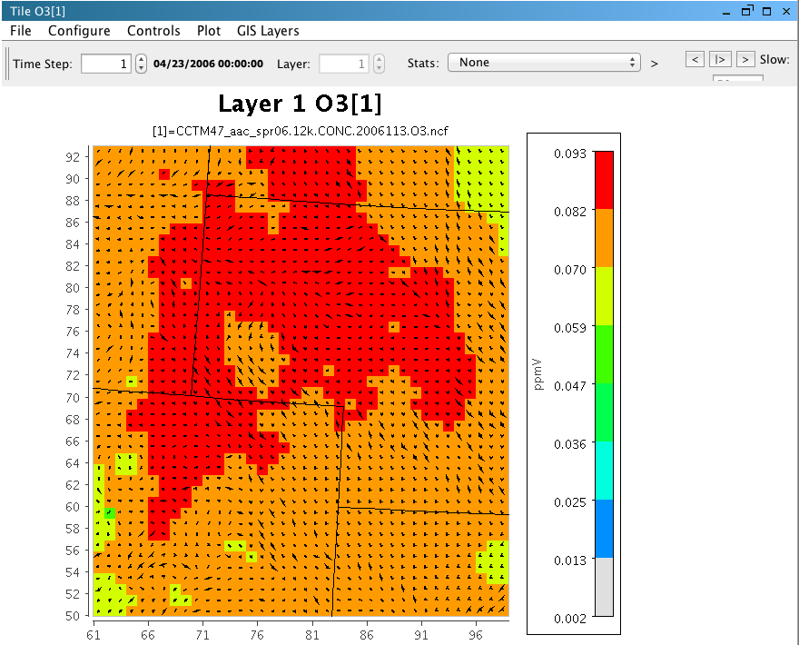

Figure 12‑2. Polar Stereographic Map Projection Example Plot 
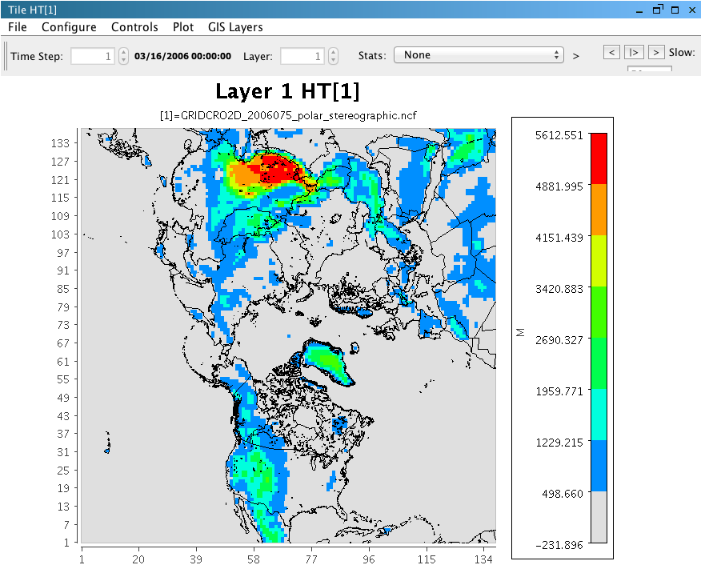

Figure 12‑3. Mercator Map Projection Example Plot 
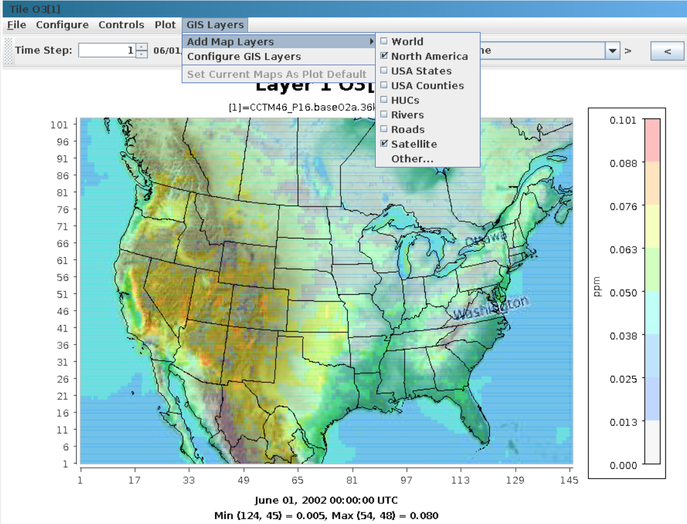

Figure 12‑4. UTM Map Projection Example Plot 
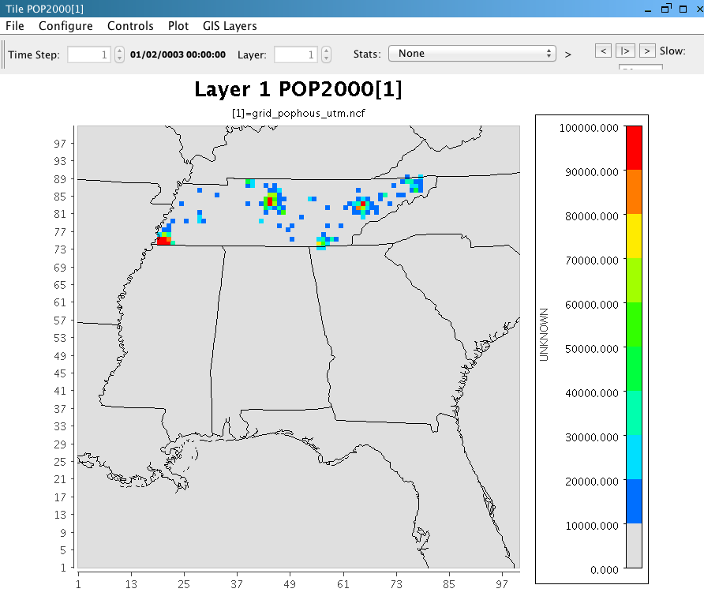

CAMx Gridded Data Convention
--------------------------

The netCDF-java library used in VERDI includes support for CAMx UAM‑IV binary files using a preset default projection. CAMx or UAM binary files contain information about the x and y offsets from the center of the projection in meters, but do not contain information about the projection. The projection information is available in separate diagnostic files, which are part of the CAMx output along with the UAM binaries ([Figure 12‑5](#Figure12-5)).

Figure 12‑5. Example CAMx diagnostic text file 
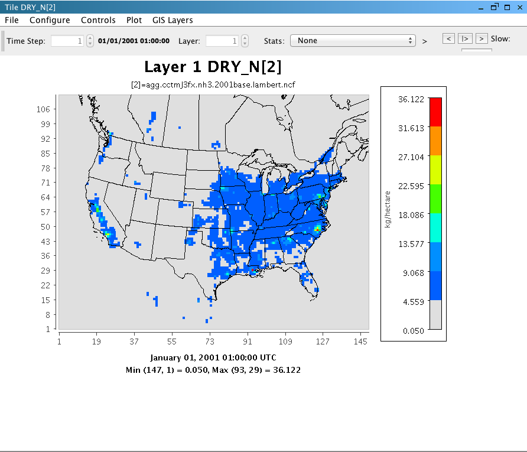

The netCDF-java library writes the default projection information to a text file in the directory where the CAMx binary (UAM-IV) file is located. You can then review and edit the projection information to make it consistent with the projection specified in the CAMx diagnostic text files. The definitions of the projection parameters used in the camxproj.txt file are defined using Models-3 I/O API format https://www.cmascenter.org/ioapi/documentation/3.1/html/GRIDS.html. You must edit the camxproj.txt file to match the grid description information provided in the corresponding camx.diag file. [Figure 12‑6](#Figure12-6) shows the definition for the grid projection parameters for a Lambert conformal conic projection.

Figure 12‑6. Models-3 I/O API Map Projection Parameters for Lambert Conformal Conic Projection 
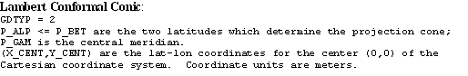

[Figure 12‑7](#Figure12-7) shows the values of the camxproj.txt after editing it to match the values of the camx.diag file (**Error! Reference source not found.**) using the definitions of the Models-3 grid parameters (**Error! Reference source not found.**). [Figure 12‑8](#Figure12-8) shows the resulting Tile Plot of the CAMx sample dataset.

Figure 12‑7. Edited Example Projection File: camxproj.txt 
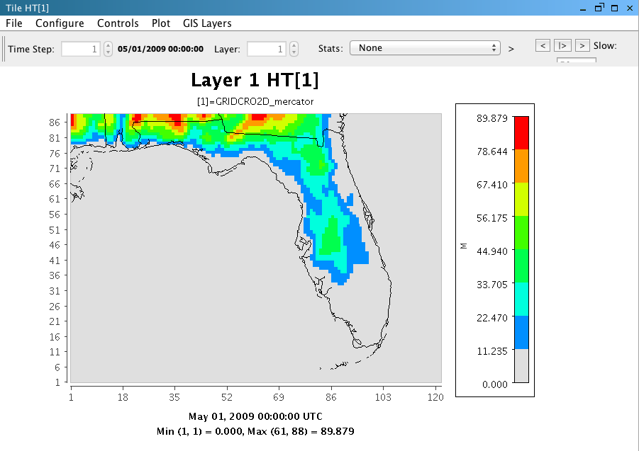

Figure 12‑8. CAMx Example Plot 
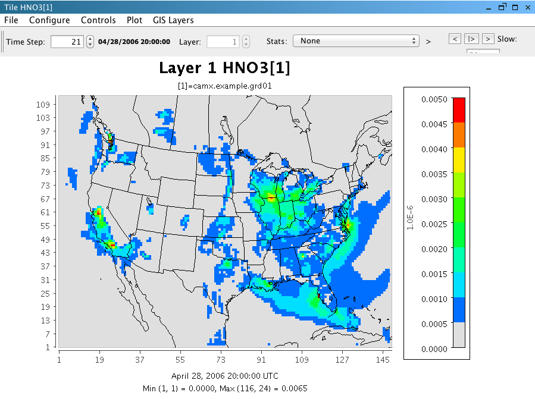

WRF netCDF Data Convention
-------------------------
The WRF netCDF data convention is supported in VERDI. https://www.mmm.ucar.edu/weather-research-and-forecasting-model
Figure 12-9. WRF Example Plot of Height in Meters on a 1km Texas Domain 
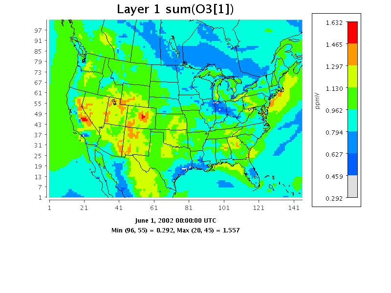

MPAS netCDF Data Convention
--------------------------
The MPAS netCDF data convention is supported in VERDI https://mpas-dev.github.io/.
Figure 12-10. MPAS Example Plot of 2 meter Temperature on World Map
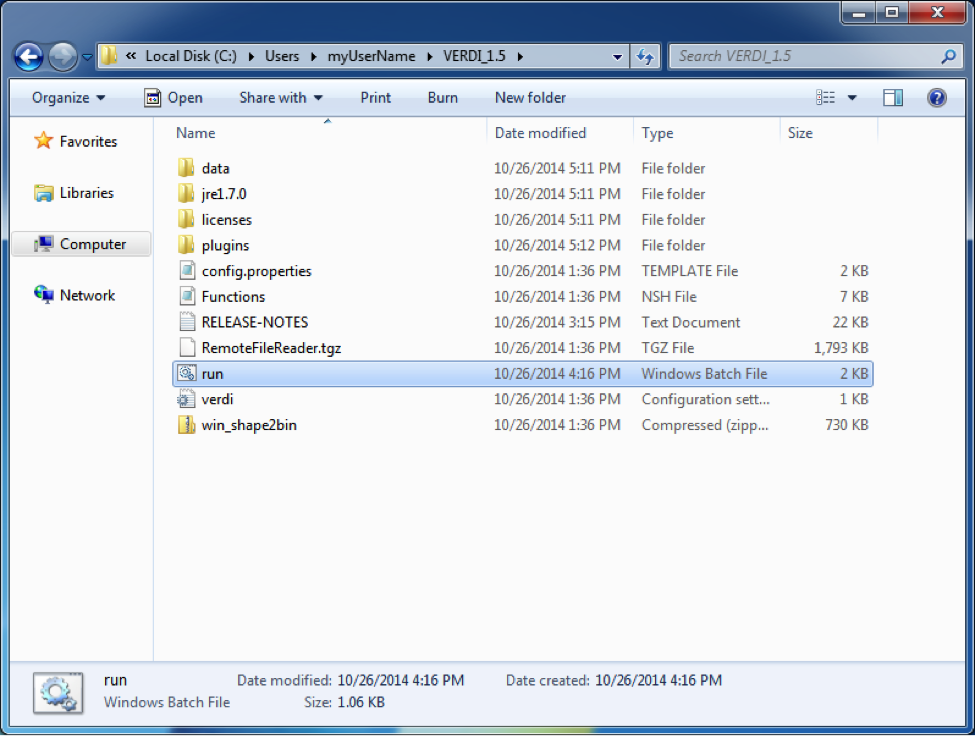

Figure 12-11. MPAS Example Plot of 2 meter Temperature Zoomed in to California
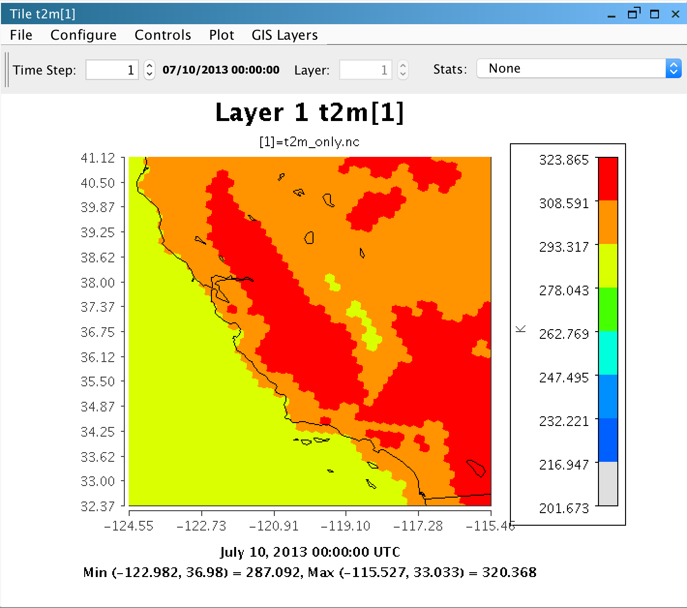

<!-- BEGIN COMMENT -->

[<< Previous Chapter](VERDI_ch11.md) - [Home](README.md) - [Next Chapter >>](VERDI_ch13.md) 
VERDI User Manual (c) 2018 

<!-- END COMMENT -->

