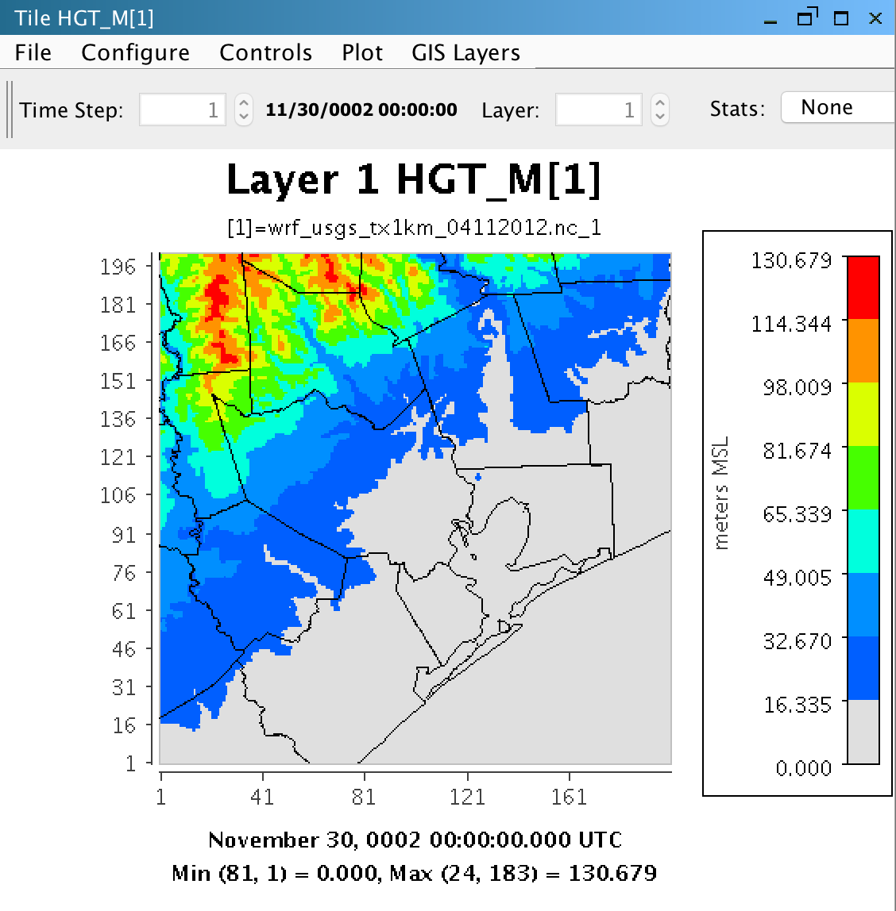
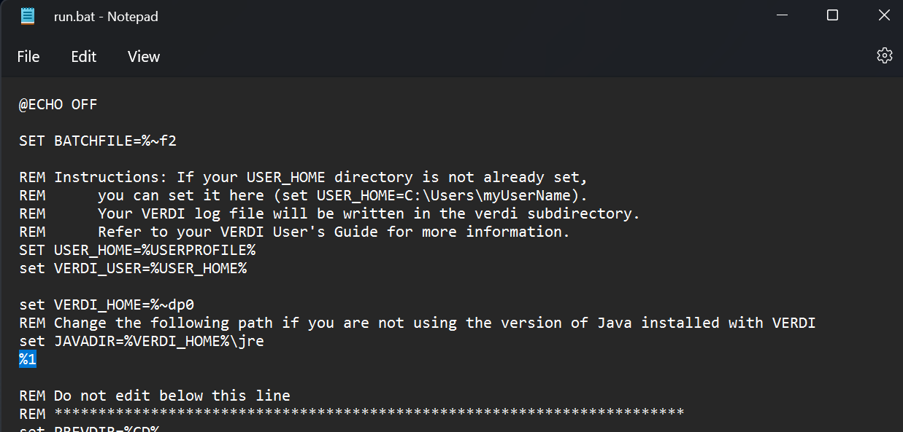
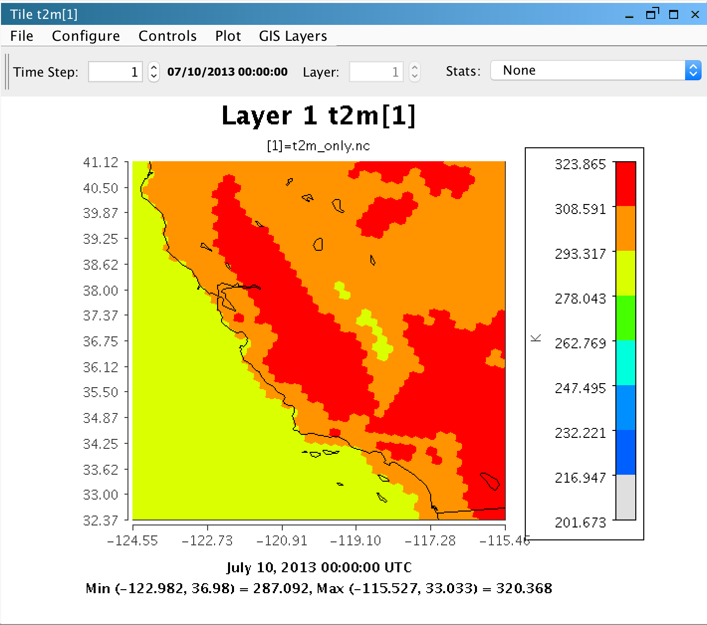
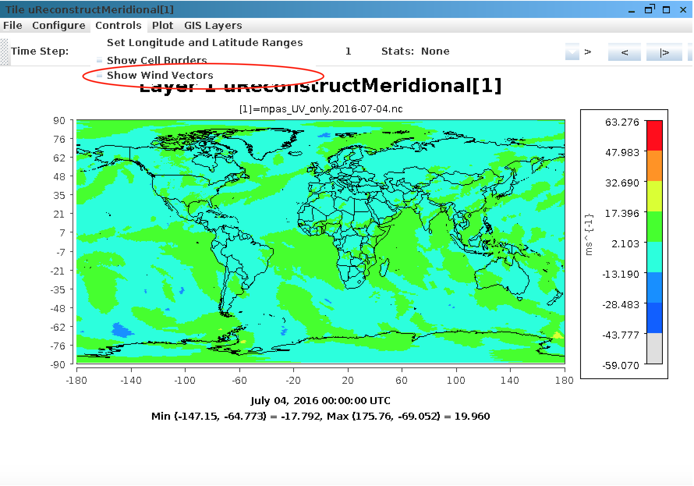
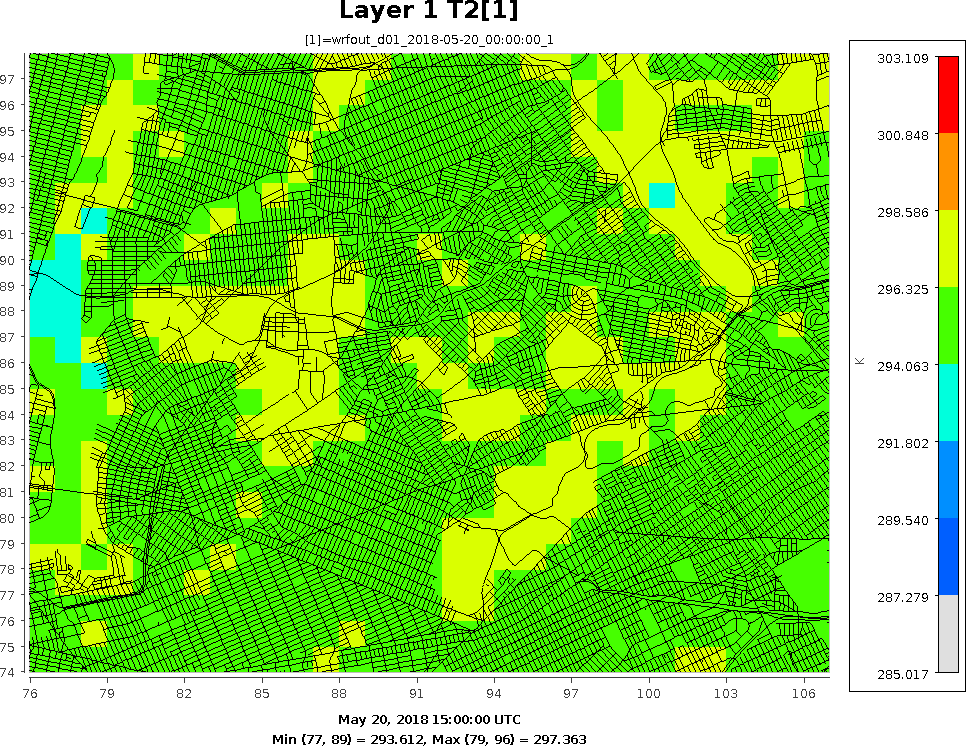

<!-- BEGIN COMMENT -->
  
[<< Previous Chapter](VERDI_ch11.md) - [Home](README.md) - [Next Chapter >>](VERDI_ch13.md)

<!-- END COMMENT -->

Supported Grid and Coordinate Systems (Map Projections)
======================================

VERDI makes calls to the netCDF Java library to obtain the grid and coordinate system information about the data directly from the model data input files when the input data files are self-describing netCDF files (MCIP, SMOKE, CMAQ, WRF, MPAS). The available tile plot options vary depending on the meta data convention in the files: I/O API (M3IO) data convention (MCIP, SMOKE, CMAQ), CAMx Gridded Data Convention, WRF netCDF Data Convention, and MPAS netCDF Data Convention. 

Models-3 I/O API Data Convention
----------------------

For the Models-3 I/O API, support for Lambert conformal conic (LCC) map projection, Universal Transverse Mercator (UTM) map projection, and polar stereographic map projection was added in VERDI 1.1., and Mercator projection in VERDI 1.2. The grid projections listed on the following website are supported, although not all have been tested: 
https://www.cmascenter.org/ioapi/documentation/all_versions/html/.

Users that need VERDI to support other projections are encouraged to provide small input datasets as attachments to emails to the m3user listserv, or to github.com/CEMPD/VERDI/issues, for testing and to facilitate future development efforts. PDF: ([Fig-@fig:Figure77])) or GitHub:[Figure 77](#Figure77) through ([Fig-@fig:Figure79])) or GitHub:[Figure 79](#Figure79) illustrate sample plots generated for datasets with LCC, polar stereographic, Mercator, and UTM map projections, respectively.

Figure 77. CMAQ Lambert Conformal Conic (GDTYP = 2) Map Projection Example Plot 

{#fig:Figure77}

Figure 78. MCIP Polar Stereographic (GDTYP = 6) Map Projection Example Plot 

{#fig:Figure78}

Figure 79. MCIP Mercator (GDTYP = 7) Map Projection Example Plot 

{#fig:Figure79}

Figure 80. SMOKE UTM (GDTYP = 5) Map Projection Example Plot 

{#fig:Figure80}

CAMx Gridded Data Convention
--------------------------

The netCDF-java library used in VERDI includes support for CAMx UAM-IV binary files using a preset default projection. CAMx or UAM binary files contain information about the x and y offsets from the center of the projection in meters, but do not contain information about the projection. The projection information is available in separate diagnostic files, which are part of the CAMx output along with the UAM binaries PDF: ([Fig-@fig:Figure81])) or GitHub:[Figure 81](#Figure81).

Figure 81. Example CAMx diagnostic text file 

{#fig:Figure81}

The netCDF-java library writes the default projection information to a text file in the directory where the CAMx binary (UAM-IV) file is located. You can then review and edit the projection information to make it consistent with the projection specified in the CAMx diagnostic text files. The definitions of the projection parameters used in the camxproj.txt file are defined using Models-3 I/O API format https://www.cmascenter.org/ioapi/documentation/all_versions/html/. You must edit the camxproj.txt file to match the grid description information provided in the corresponding camx.diag file.  PDF: ([Fig-@fig:Figure82])) or GitHub:[Figure 82](#Figure82) shows the definition for the grid projection parameters for a Lambert conformal conic projection.

Figure 82. Models-3 I/O API Map Projection Parameters for Lambert Conformal Conic Projection 

{#fig:Figure82}

 PDF: ([Fig-@fig:Figure83])) or GitHub:[Figure 83](#Figure83) shows the values of the camxproj.txt after editing it to match the values of the camx.diag file and using the definitions of the Models-3 grid parameters.  PDF: ([Fig-@fig:Figure84])) or GitHub:[Figure 84](#Figure84)  shows the resulting Tile Plot of the CAMx sample dataset.

Figure 83. Edited Example Projection File: camxproj.txt 

{#fig:Figure83}

Figure 84. CAMx Tile Plot 

{#fig:Figure84}  

WRF netCDF Data Convention
-------------------------
The WRF netCDF data convention is supported in VERDI. https://www.mmm.ucar.edu/weather-research-and-forecasting-model

Figure 85. WRF Lambert Conformal (MAP_PROJ = 1) Plot of Height in Meters on a 1km Texas Domain 

{#fig:Figure85}

MPAS netCDF Data Convention
--------------------------
The MPAS netCDF data convention is supported in VERDI https://mpas-dev.github.io/.
A plot of 2 meter Temperature on the World Map PDF is available in: ([Fig-@fig:Figure86])) or GitHub:[Figure 86](#Figure86)
Figure 86. MPAS Example Plot of 2 meter Temperature on World Map 

{#fig:Figure86}

An MPAS Plot of 2 meter temperature zoomed in to California is available PDF: ([Fig-@fig:Figure87])) or GitHub:[Figure 87](#Figure87)

Figure 87. MPAS Plot of 2 meter Temperature Zoomed in to California 

{#fig:Figure87}

An MPAS plot of the 3-d Zonale and Meridonal Wind components from a daily MPAS-A output file (history file) showing the pull down menu option to select wind vectors is available in PDF: ([Fig-@fig:Figure88])) or GitHub:[Figure 88](#Figure88)
Figure 88. MPAS Plot of the 3-d Zonal and Meridional Wind components from a daily MPAS-A output file (history file) along with the necessary mesh definition data zoomed into North America. Load the mpas_UV_only.2016-07-04.nc file, double click on the "uReconstructMeridional" variable, select Tile Plot, then select Controls > Show Wind Vectors. Zoom into an area over North America, or other location to view the wind vectors. 
Note, the mpas_UV_only.2016-07-04.nc file is too large to be distributed with VERDI due to the github 100 Mb file size limit. It may be downloaded from the google drive link: https://drive.google.com/file/d/1i9aP7s63cz-BRxD6s0AMVsSUeYjRxVIb/view?usp=sharing 

{#fig:Figure88}

The resulting wind vector plot of the 3-d Zonal and Meridonal Wind components from a daily MPAS-A output file is available in PDF: ([Fig-@fig:Figure89])) or GitHub:[Figure 89](#Figure89)
Figure 89. MPAS Plot of the 3-d Zonal and Meridional Wind components from a daily MPAS-A output file (history file) Zoomed into North America 

{#fig:Figure89}

<!-- BEGIN COMMENT -->

[<< Previous Chapter](VERDI_ch11.md) - [Home](README.md) - [Next Chapter >>](VERDI_ch13.md) 
VERDI User Manual (c) 2025 

<!-- END COMMENT -->

