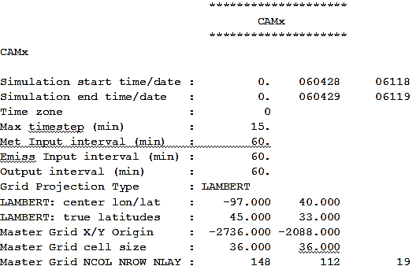

<!-- BEGIN COMMENT -->
  
[<< Previous Chapter](VERDI_ch16.md) - [Home](README.md) - [Next Chapter >>](VERDI_ch18.md)

<!-- END COMMENT -->

 VERDI Batch Script Editor
==========================

To open the Script Editor, use File&gt;View Script Editor ([Figure 17-1](#Figure17-1)). Prior running a batch script, remove all datasets from the dataset list. To remove a dataset, click on each dataset in the dataset panel and press the yellow minus button.

<!-- BEGIN COMMENT -->

Figure 17-1. File: View Script Editor 

<!-- BEGIN COMMENT -->

An **Open** popup window will be displayed, click on a sample script file in the VERDI_2.1/data/scripts directory ([Figure 17-2](#Figure17-2)).

<!-- BEGIN COMMENT -->

Figure 17-2. Open Popup Window 

<!-- BEGIN COMMENT -->

After you select a script file and click Open in the Open popup window, the Script Editor window ([Figure 17-3](#Figure17-3)), the Batch Script File format consists of two blocks – a Global block and a Task Block. The Global block allows you to specify a set of parameters (such as the file and directory names) on which all other tasks are performed. In this block you can specify any parameters that are used to run any other tasks. If the same parameters are specified with different values in a subsequent Task block, those values will overwrite the values specified in the Global block. One Global Block specifies the common parameters shared by all Task blocks, and multiple task blocks can be defined to specify the type of batch operations that will be performed (e.g., defining formulas and creating plots).

Unload all datasets before running a batch script within the Script Editor. If any dataset is not unloaded a warning message will pop up ([Figure 17-5](#Figure17-5)) requesting that you close all datasets before running your batch script.

Figure 17-5) appears in the right-hand side of VERDI. Use the Script Editor to edit, save, and run batch scripts within VERDI. The Batch Scripting Language used for the VERDI Script Editor is described in the header of the sample text format script files.

Figure 17-5. Top of Sample Script File – VERDI_2.1/data/scripts/file_patterns.txt 

Figure 17-6. Bottom of Sample Script File – VERDI_2.1/data/scripts/tile_patterns.txt

The Batch Script File format consists of two blocks – a Global block and a Task Block. The Global block allows you to specify a set of parameters (such as the file and directory names) on which all other tasks are performed. In this block you can specify any parameters that are used to run any other tasks. If the same parameters are specified with different values in a subsequent Task block, those values will overwrite the values specified in the Global block. One Global Block specifies the common parameters shared by all Task blocks, and multiple task blocks can be defined to specify the type of batch operations that will be performed (e.g., defining formulas and creating plots).

Unload all datasets before running a batch script within the Script Editor. If any dataset is not unloaded a warning message will pop up (Figure 17-5) requesting that you close all datasets before running your batch script.

Figure 17-8. Close Datasets Warning Message

The multifiles.txt sample script that is provided as part of the VERDI release demonstrates how to create a tile plot using a mathematical combination of variables. An excerpt of that script is shown below.

&lt;Task&gt;
dir=D:\\verdi-dist2\\data\\model
f=copy.36k.O3MAX
f=CCTM46_P16.baseO2a.36k.O3MAX
f=another.36k.O3MAX
s=O3[1]-O3[2]+O3[3]*2
gtype=tile
saveImage=jpeg
imageDir=D:\\verdi-dist2
imageFile=three_components_36k.O3MAX
&lt;/Task&gt;

The above task specifies the name of three input files. The input files are assigned a number based on the order in which they are specified.

[1]=Copy.36k.O3MAX

[2]=CCTM46_P16.baseO2a.36k.O3MAX

[3]=another.36k.O3MAX

s=O3[1]-O3[2]+O3[3]*2 defines a formula that uses variables from the three filenames

This formula takes ozone in file 1 and subtracts the ozone in file 2 and adds two times the ozone in file 3.

The type of plot is specified as a tile plot by setting the parameter *gtype* to tile (i.e., gtype=tile).

The image file format is specified by setting the parameter *saveImage* to jpeg (i.e., saveImage=jpeg).

The output directory where the images will be stored is specified by setting the parameter *imageDir* (i.e., imageDir=D:\\verdi-dis2).

The image file name is specified by setting the parameter *imageFile*; imageFile=three_components_36k.O3MAX.

Use the left mouse button to highlight the task that you would like to run and then click **Run** in the Script Editor window. A popup window then appears to indicate the task ran successfully (Figure 17-6). In this example the title and subtitle were obtained from the definition in the global block. Aspects of the plot defined in the global block are used for multiple tasks and are applied even if only a highlighted task is run.

Figure -. Highlight Text to Select Task and Click Run

If you select Run without highlighting a Text Block, then the entire batch script executes and generates the plots. To edit the batch script, highlight a segment that you would like to copy and use Ctrl-C to copy the text; then click in an area where you want to paste the text and use Ctrl-V to insert the copied text. Test your changes to the script by highlighting the text block and click run. When your script executes successfully VERDI displays the popup window shown in If the user has specified an incorrect path, or incorrect filename for the input dataset, then a series of error messages will appear, starting with the message shown in **Error! Reference source not found.**.

Figure 17-8. Unsuccessful Batch Run

NOTE: Click either the Save or the Save As… button to save your edits before exiting the Script Editor.

After saving the script file (e.g. C:\\verdi-script\\myscript.txt), you can run the batch script directly from command lines without invoking the VERDI GUI. On a Windows computer, start a command window, navigate to the directory containing your run.bat file, and then run this command:

run.bat –batch C:\\verdi-script\\myscript.txt

On Linux/Mac platforms, change directory to where the Verdi.sh is located and execute this command (assuming your script file myscript.txt is saved in /home/user/verdi-script directory):

./verdi.sh –batch /home/user/verdi-script/myscript.txt

(Note: the full path to the batch script must be specified. Neglecting to provide the full path along with the batch script name generates the following error: No such file or directory.) The batch script usage (see **Error! Reference source not found.**) will also be displayed from the command line after typing the following command:

(Windows)

run.bat –batch

(Linux/Mac)

./verdi.sh –batch

Figure -. Successful Batch Script Message

If the user has specified an incorrect path, or incorrect filename for the input dataset, then a series of error messages will appear, starting with the message shown in **Error! Reference source not found.**.

Figure -. Unsuccessful Batch Script Message: File not found

The VERDI Batch Editor checks to see if the path specified by the user as the imageDir exists. If the path does not exist, VERDI displays the error message:

“java.io.FileNotFoundException: with the path and filename listed”

followed by the message “(No such file or directory).” Verify that you supplied the correct path and filename. The directory specified as the image directory must exist prior to running the batch command. Double-click on the file in the imageDir directory to load and view the image file in your default visualization software. **Error! Reference source not found.** illustrates the tile plot image that was generated by running the highlighted text block.

Figure -. Plot Image Generated by Task Block

Specify hour/time step formula in batch script mode
---------------------------------------------------

Specify the timestep using the format:

VARIABLE[dataset number]:timestep.

The batch script notation used to specify an hour/time step involves specifying the formula then the hour: O3[1]:17 will result in Ozone for hour 17 from a given file in scripting mode (see Figure 17-10).

The batch script can be used to generate plots of a specific hour or time step using the formula

**s=Variable[dataset#]:hour**

for example:

**s=O3[1]:17 to plot the Temperature in first dataset for hour 17**

Batch Script Example:

**&lt;Global&gt;**

**dir=$LOCAL_DIR/verdi_2.1/data/model/**

**imageDir=$LOCAL_DIR/verdi_2.1/data/images**

**saveImage=jpeg**

**&lt;/Global&gt;**

**&lt;Task&gt;**

**gtype=tile**

**f= CCTM46_P16.baseO2a.36k.O3MAX**

**imageFile= CCTM46_P16.baseO2a.36k.O3MAX.tstep.17**

**s=O3[1]:17**

**&lt;/Task&gt;**

Figure -. Tile Plot of Ozone at Time step 17, Layer 1

Mathematical function capability in batch script mode
-----------------------------------------------------

This update provides the user the ability to perform mathematical functions in VERDI using the scripting mode. For example, Find maximum over all time steps at each grid cells.

The batch script can be used to generate plots for each mathematical function by using the task block to define each function. The notation used within the task block is:

**s=Formula(Variable[dataset#])**

For example:

**s=max(O3[1]) to plot the Maximum value over all timesteps for each grid cell in the domain.**

**s=min(O3[1]) to plot the Minimum value over all timesteps for each grid cell**

**s=mean(O3[1]) to plot the Mean value over all timesteps for each grid cell**

**s=sum(O3[1]) to plot the Sum of the variable over all timesteps for each grid cell**

The mathematical functions operate over all time steps at each grid cell. Examples for the batch script notation and the images produced are provided in the following sections.

### Batch Script Example: Maximum Ozone – layer 1 (Figure 17-11)

**&lt;Global&gt;**

**dir=$LOCAL_DIR/verdi_2.1/data/model/**

**gtype=tile**

**imageDir=$LOCAL_DIR/verdi_2.1/data/images**

**saveImage=jpeg**

**&lt;/Global&gt;**

**&lt;Task&gt;**

**f= CCTM46_P16.baseO2a.36k.O3MAX**

**imageFile=CCTM46_P16.baseO2a.36k.O3MAX.tstepmax.layer1**

**s=max(O3[1])**

**&lt;/Task&gt;**

Figure -. Tile Plot of Maximum Air Temperature (aggregated over 25 time steps)

### Batch Script Example : Minimum Ozone – layer 1 (Figure 17-12)

**&lt;Global&gt;**

**dir=$LOCAL_DIR/verdi_2.1/data/model/**

**gtype=tile**

**imageDir=$LOCAL_DIR/verdi_2.1/data/images**

**saveImage=jpeg**

**&lt;/Global&gt;**

**&lt;Task&gt;**

**f= CCTM46_P16.baseO2a.36k.O3MAX**

**imageFile=CCTM46_P16.baseO2a.36k.O3MAX.tstepmin.layer1**

**s=min(O3[1])**

**&lt;/Task&gt;**

Figure -. Tile Plot of Minimum Ozone (aggregated over 25 time steps)

### Batch Script Example : Mean of Ozone – layer 1 (Figure 17-13)

**&lt;Global&gt;**

**dir=$LOCAL_DIR/verdi_2.1/data/model/**

**gtype=tile**

**imageDir=$LOCAL_DIR/verdi_2.1/data/images**

**saveImage=jpeg**

**&lt;/Global&gt;**

**&lt;Task&gt;**

**f= CCTM46_P16.baseO2a.36k.O3MAX**

**imageFile=CCTM46_P16.baseO2a.36k.O3MAX.tstepmean.layer1**

**s=mean(O3[1])**

**&lt;/Task&gt;**

Figure -. Tile Plot of Mean Ozone (aggregated over 25 time steps)

### Batch Script Example : Sum of Ozone – layer 1 (Figure 17-14)

**&lt;Global&gt;**

**dir=$LOCAL_DIR/verdi_2.1/data/model/**

**gtype=tile**

**imageDir=$LOCAL_DIR/verdi_2.1/data/images**

**saveImage=jpeg**

**&lt;/Global&gt;**

**&lt;Task&gt;**

f= CCTM46_P16.baseO2a.36k.O3MAX

imageFile=CCTM46_P16.baseO2a.36k.O3MAX.tstepsum.layer1

s=sum(O3[1])

&lt;/Task&gt;

Figure -. Tile Plot of the Sum of Ozone (aggregated over 25 time steps)

<!-- BEGIN COMMENT -->

[<< Previous Chapter](VERDI_ch16.md) - [Home](README.md) - [Next Chapter >>](VERDI_ch18.md) 
VERDI User Manual (c) 2021 

<!-- END COMMENT -->
