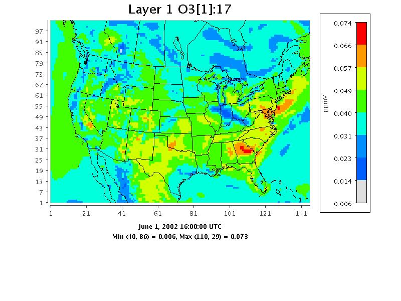

<!-- BEGIN COMMENT -->
  
[<< Previous Chapter](VERDI_ch17.md) - [Home](README.md) - [Next Chapter >>](VERDI_ch19.md)

<!-- END COMMENT -->

Command Line Scripting
======================

The commands described in this section can be executed from the command line through either command line arguments or Windows batch files. In Linux, you can edit the verdi.sh script, adding the command options at the end of the last line of the script. If you are using Windows, edit the run.bat script, again adding the command options at the end of the last line, and submitting the script at the windows command line. An example syntax for all commands follows the format

&lt;command&gt; &lt;command options&gt; \

where the “\” at the end of the command is optional.

Example Command Line Script for Linux Users
-------------------------------------------

Set an environment variable $VERDI_HOME by using

setenv VERDI_HOME //home//a_username//VERDI_2.0

Where a_username is your username.

The following script options will read in the file as the first dataset, select O3[1] as the formula from dataset 1, and create a tile plot of the O3[1].

./verdi.sh -f “$VERDI_HOME/data/model/CCTM46_P16.baseO2a.36k.O3MAX -s O3[1] -gtype tile

Example script file (Note that quotes (as shown highlighted in red) may be needed around the entire list of parameters” :

#! /bin/csh -f

#### 8hO3 Daily Max Plot

setenv DIR //home//training//verdi_2.0//data/OBS

../../verdi.sh \

"-f $DIR/ACONC_O3_8hr.dmax \

-f $DIR/AQS_overlay_2002_07.ncf \

-configFile /home/training/config.txt \

-s O3[1] \

-s O38[2]*1000"

Note: Currently, the syntax for the command line script is slightly different than the syntax for the batch script. For example, the batch script method supports requesting a plot of hour 12 using the notation O3[1]:12, but the command line script option requires the variable name and time step be specified independently:

-s O3[1]

-ts 12

Example Command Line Script for Windows Users
---------------------------------------------

Edit the run.bat script in the VERDI_2.0 directory by right clicking on the file and selecting edit.

Figure ‑. Location of run.bat script in Windows

The current run.bat in notepad contains a “%1” at the end that allows it to accept input following the run.bat script using the Windows run command. Unfortunately, this command does not accept directory names that have a space them, such as the “Program Files”. If you would like to enter the script command line options after run.bat, please move the data directory to C:\\VERDI\\data or some other similar location.

Enter the following in the Run command: cmd

When a command line window opens do the following:

cd C:\\Program Files\\VERDI_2.0\\

run.bat "-f C:\\VERDI\\data\\model\\CCTM46_P16.baseO2a.36k.O3MAX -s O3[1] -gtype tile"

The other option is to place the script commands within the run.bat itself. Remove the “%1” statement at the end of the run.bat that is provided in the distribution, and add the script options that you would like to use. The following run.bat contains script options that will read in the file C:\\VERDI_2.0\\data\\model\\CCTM46_P16.baseO2a.36k.O3MAX, select O3[1] as the formula, and create a Tile plot. The changes that you need to make to the run.bat are highlighted in red.

cd .\\plugins\\bootstrap

SET JAVA=..\\..\\jre1.6.0\\bin\\java

%JAVA% -Xmx512M -classpath "./bootstrap.jar;./lib/saf.core.runtime.jar;./lib/commons-logging.jar;.//lib//jpf-boot.jar;.//lib//jpf.jar;.//lib\\log4j-1.2.13.jar" saf.core.runtime.Boot -f C:\\VERDI_2.0\\data\\model\\CCTM46_P16.baseO2a.36k.O3MAX -s O3[1] -gtype fasttile

Run the run.bat script by clicking on Start, then selecting Run, then either using Browse to find the run.bat or typing it in (**Error! Reference source not found.**).

Figure ‑. Submit run.bat script from Run command

Script commands that can be used for command line scripting (listed in alphabetical order) are described below. Adding support for these script commands in the Script Editor is planned for a future VERDI release.

**[-alias &lt;aliasname=definition&gt;]** defines an alias. You can define an alias by creating a definition using variable names and derived variables that are calculated using the mathematical operators described in Section 15: Mathematical Functions. The alias definition does not include the dataset name. The alias is treated like any other formula once the alias definition and the dataset to which it should be applied are specified. If you need to redefine an alias definition, you must first use the **-unalias** command. The alias definitions are saved to a verdi.alias file in the verdi subdirectory under your home directory. VERDI uses this type of optional file in your home directory to maintain a snapshot of the current aliases being used. The following warning will be reported if an alias is defined more than once: “WARNING: Alias &lt;aliasname&gt; already defined, new definition ignored.” You are also responsible for not making circular references. Use the **‑printAlias** command to view what aliases are already defined. Note, you define an alias, VERDI will use that alias if you make a request to plot that variable again. If you are having issues with variable names being redefined, remember to check your verdi.alias file and remove it if needed.

**[-animatedGIF&lt;filename&gt;]** creates an animated GIF by doing an X Window Dump (XWD) of each of the time steps in the tile plot, then converting them to GIF images. If there are many time steps in the dataset, there will be a slight delay before you are again given control of the GUI.

**[-avi&lt;filename&gt;]** saves an animated plot of each of the time steps in the tile plot to the AVI video format.

**[-closeWindow “&lt;windowid&gt;”]** closes the window with the specified window ID.

**[-configFile &lt;configFileName&gt;]** specifies a configuration file for VERDI to use for configuring subsequent tile plots.

**[-copyright]** prints out copyright information for VERDI.

**[-drawDomainTicks ON|OFF]** turns the domain axis ticks on and off.

**[-drawGridLines ON|OFF]** turns the plot grid lines on and off.

**[-drawLegendTicks ON|OFF]** turns the ticks in the legend on and off.

**[-drawRangeTicks ON|OFF]** turns the range axis ticks on and off.

**[-f [[host:]&lt;filename&gt;]** tells VERDI to load in this dataset and make it the currently selected dataset. All datasets will stay in memory.

**[-fulldomain]** sets the VERDI domain matching the currently selected dataset to be completely selected. The currently selected dataset is usually the most recently added dataset.

**[-g &lt;tile|fasttile|line|bar|contour&gt;]** instructs VERDI to create a plot using the specified type and the currently selected formula’s data.

**[-gtype &lt;tile|fasttile|line|bar|contour&gt;]** instructs VERDI to create a plot using the specified type and the currently selected formula’s data (note: tile and fasttile will both generate a fasttile plot starting with VERDI version 1.4).

**[-help|fullhelp|usage]** display the information on all the command line arguments available. Each of these three versions performs the identical function.

**[-legendBins "&lt;bin0,bin1,...,bin_n&gt;"]** causes VERDI to use the specified numbers as breaks between colors on subsequent plots. The value of this argument is a comma-separated list of numbers. For example, **-legendBins “1,10,100,1000”** will cause plots to be created with three colors that correspond to values of 1-10, 10-100, and 100-1000. To go back to the default method for determining breaks between bins, enter **-legendBins DEFAULT**.

**[-level &lt;level&gt;]** sets the level range of all formulas to the single level specified.

**[-levelRange &lt;levelMax&gt; &lt;levelMin&gt;\]** sets the level range of all formulas to the range specified.

**\[-openProject &lt;VERDIProjectName&gt;\]** opens a previously save VERDI project.

**\[-mapName** &lt;pathname&gt;/&lt;mapFileName&gt; causes VERDI to use the supplied *map name* instead of the default map for tile plots.

**\[-printAlias\]** prints existing alias definitions.

**\[-project “&lt;VERDIProjectName&gt;”\]** save dataset lists and associated formulas as a “project” for later re-use.

**\[-**QuickTime **(NEW)\]** creates a QuickTime movie of the currently selected plot.

**\[-quit|exit]** ends the VERDI session.

**[-raiseWindow &lt;windowid&gt;]** raises the window with the specified plot ID (i.e., brings it to the front).

**[-s "&lt;formula&gt;"]** loads the specified formula into VERDI’s memory, and makes it the currently selected formula.

**[-save2ascii "&lt;filename&gt;"]** export data to a tab-delimited data file suitable for reading into a spreadsheet application such as Excel.

**[-saveImage "&lt;image type&gt;" &lt;file name&gt;]** saves the most recently created plot. This command works for all plot types. Supported formats include PNG, BMP, TIF, and JPG.

**[-scatter "&lt;formula1&gt;" "&lt;formula2&gt;"]** creates a scatter plot using the two formulas specified. Note that the formulas for the two components should already have been loaded into VERDI, and they are case sensitive.

**[-showWindow &lt;windowId&gt; &lt;timestep&gt;]** sets the time step of the window with the specified window ID to the specified time step. The time step must be within the allowable range for the dataset.

**[-subDomain &lt;xmin&gt; &lt;ymin&gt; &lt;xmax&gt; &lt;ymax&gt;]** sets the VERDI domain matching the currently selected dataset to the bounding box specified by its arguments. The currently selected dataset is the most recently added dataset. It is often handy to type **-subdomain** commands into VERDI’s standard input if you are trying to select a very precise subdomain (such as that needed for a vertical cross-section plot).

**[-subTitle1 "&lt;sub title 1 string&gt;"]** allow you to control a plot’s subtitles if desired. Subsequent plots will use the default subtitles, unless these arguments are used again.

**[-subTitle2"&lt;sub title 2 string&gt;"]** allow you to control a plot’s subtitles if desired. Subsequent plots will use the default subtitles, unless these arguments are used again.

**[-subTitleFont &lt;fontSize&gt;]** allow you to control the font size of the subtitle of a plot.

**[-system "&lt;system command&gt;"]** sends the specified command to the operating system’s command line.

**[-tfinal &lt;final time step&gt;]** sets the last time step for each formula’s time-step range to the specified step number, where the first step number is denoted by 0.

**[-tinit &lt;initial time step&gt;]** sets the first time step for each formula’s time-step range to the specified step number, where the first step number is denoted by 0.

**[-titleFont &lt;fontSize&gt;]** allows you to control the font size of the title of a plot.

**[-titleString "&lt;title string&gt;"]** sets the title for the next plot made to the specified title. Subsequent plots will use the default VERDI title, unless this argument is used again.

**[-ts &lt;time step&gt;]** sets the selected time step for each formula in VERDI’s memory to the specified step number, where the first step number is denoted by 0. This will remain the selected time step until you change it. It affects only tile plots and vertical cross-section plots.

**[-unalias &lt;aliasname&gt;]** is used to undefine an alias.

**[-unitString "&lt;unit string&gt;"]** can be used to override the default unit label used for plots. The default value comes from the dataset(s) themselves.

**[-vector "&lt;U&gt;" "&lt;V&gt;"]** creates a vector plot with U as the left-to-right vector component and V as the down-to-up vector component. There are no background colors used for this type of plot. Note that the formulas for the two components should already have been loaded into VERDI, and they are case sensitive.

**[-vectorTile "&lt;formula&gt;" "&lt;U&gt;" "&lt;V&gt;"]** creates a vector plot with the result of **"formula"** as the background tiles, U as the left-to-right vector component, and V as the down-to-up vector component. Note that the formulas for the three components should already have been loaded into VERDI, and they are case sensitive.

**[-version]** prints out information about the VERDI version being used on the standard output stream.

**[-verticalCrossPlot X|Y &lt;row/column&gt; (NEW)]** creates a vertical cross-section plot. You indicate whether this will be an *x* or *y* cross-section plot and what row or column to use as the base.

**[-windowid]** prints the window ID of the currently selected plot.

<!-- BEGIN COMMENT -->

[<< Previous Chapter](VERDI_ch17.md) - [Home](README.md) - [Next Chapter >>](VERDI_ch19.md) 
VERDI User Manual (c) 2018 

<!-- END COMMENT -->
