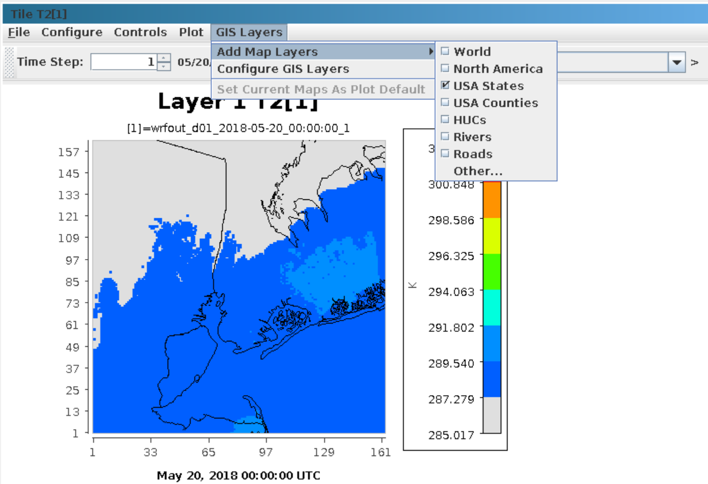
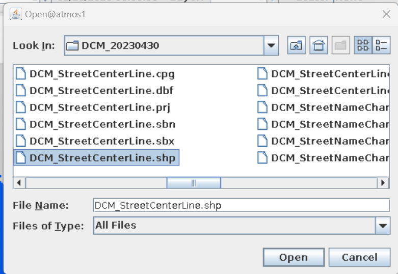
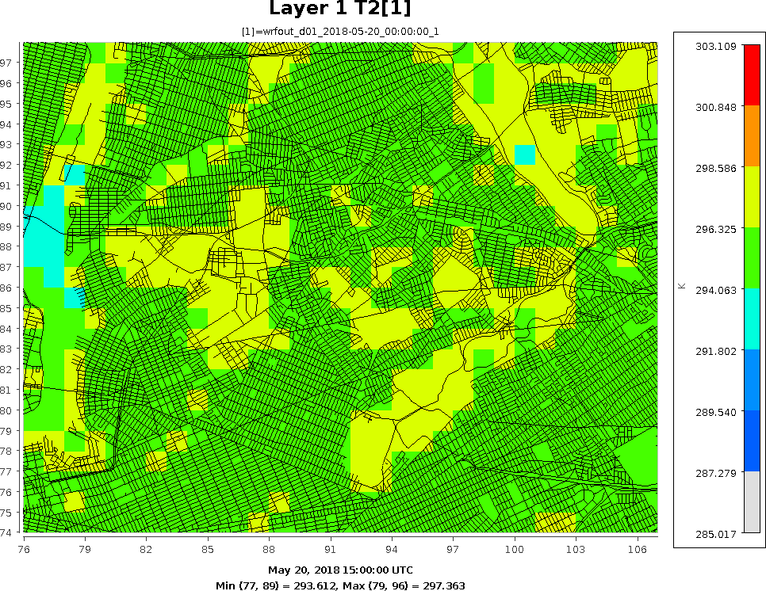

<!-- BEGIN COMMENT -->
  
[<< Previous Chapter](VERDI_ch19.md) - [Home](README.md) - [Next Chapter >>](VERDI_ch21.md)

<!-- END COMMENT -->

 Visualize Fine Scale Model Outputs
==========================
  Data from fine scale (neighborhood, or street level) model can be visualized on the street-level maps in VERDI.  Given user can provide fine scale map GIS layers (shapefiles) to be loaded into VERDI.  Here is a step by step example:
  
Step 1: Open VERDI GUI and load your fine scale model gridded datasets. you can get access to some sample model files under the folder: VERDI/data/model/wrfout_d01_2018-T2-05-20_00_00_00

Step 2: Select variable "T2" and create a "tile plot".  To turn on USA States lines and turn off the USA County lines,  click on GIS Layers → Add Map Layers, then check the box in front of "USA States" and go back in again to uncheck the box in front of "USA Counties".	

Figure showing Tile plot of Fine Scale Gridded Dataset: ([Fig-@fig:Figure106])) or GitHub:[Figure 106](#Figure106).

Figure 106. Tile Plot of Fine Scale Gridded Dataset 
  
{#fig:Figure106}

\newpage
     
Step 3: To add your own fine scale GIS layers, click on GIS Layers → Add Map Layers → Other…
A pop-up file browser window will show up for you to navigate to the street-level shapefiles, click on "open".    	

Figure to add Fine Scale GIS Layer using the pop-up window to load other GIS Layers UI: ([Fig-@fig:Figure107])) or GitHub:[Figure 107](#Figure107).

Figure 107. Add Fine Scale GIS layer 

{fig:Figure107}

\newpage

Step 4: Wait for a few seconds until the GIS layers are added to the tile plot, then zoom into your area of interest and explore.
The sample shapefiles are used to create the following map can be found at VERDI/data/DCMStreetCenterLine.zip    

A Figure of a tile plot with NYC street centerlines: ([Fig-@fig:Figure108])) or GitHub:[Figure 108](#Figure108).

Figure 108. Tile Plot with NYC Street Centerlines 

{fig:Figure108}

\newpage

<!-- BEGIN COMMENT -->

[<< Previous Chapter](VERDI_ch19.md) - [Home](README.md) - [Next Chapter >>](VERDI_ch21.md) 
VERDI User Manual (c) 2025 

<!-- END COMMENT -->
