***Visualization Environment for Rich Data Interpretation (VERDI 1.6 alpha): User’s Manual***
U.S. EPA Contract No. EP-W-09-023, “Operation of the Center for Community Air Quality Modeling and Analysis (CMAS)”
Prepared for: Donna Schwede
U.S. EPA, ORD/NERL/AMD/APMB
E243-04
USEPA Mailroom
Research Triangle Park, NC 27711
Prepared by: Liz Adams and Jo Ellen Brandmeyer
Institute for the Environment
The University of North Carolina at Chapel Hill
100 Europa Drive, Suite 490
CB 1105
Chapel Hill, NC 27599-1105
Date: June 15, 2016

<span id="_Toc80776013" class="anchor"></span>**Contents**
* 1 Introduction
  * 1.1 Background
  * 1.2 Where to Obtain VERDI
  * 1.3 Where to Obtain VERDI Documentation
  * 1.4 Help Desk Support for VERDI
  * 1.5 Future VERDI Development
* 2 Requirements for Using VERDI
  * 2.1 Java Runtime Environment
  * 2.2 Memory and CPU Requirements
  * 2.3 Requirements to Run VERDI Remotely
  * 2.4 Graphics Requirements
  * 2.5 Display Properties
* 3 VERDI Installation Instructions
  * 3.1 Installation Instructions for Linux and Mac
  * 3.2 Installation Instructions for Windows
  * 3.3 Installation Instructions for computer that that requires a JRE<sup>TM</sup> 7 other than what was provided in the distribution
  * 3.4 Setting VERDI Preferences
* 4 Starting VERDI and Getting Your Data into VERDI
  * 4.1 Starting VERDI
  * 4.1.1 Windows
  * 4.1.2 Linux and Other Non-Windows JRE 7 Supported System Configurations
  * 4.2 Main Window
  * 4.3 Rearrange the Datasets, Formulas, and Areas Panes
* 5 Navigating VERDI’s Main Menu Options
  * 5.1 File Menu Options
    * 5.1.1 Open Project
    * 5.1.2 Save Project
    * 5.1.3 View Script Editor
  * 5.2 Plots Menu Options
    * 5.2.1 Undock All Plots
    * 5.2.2 Animate Tile Plots
  * 5.3 Window Menu Options
    * 5.3.1 Datasets, Areas, and Formulas
    * 5.3.2 Script Editor
    * 5.3.3 List of Plots
  * 5.4 Help Menu Options
* 6 Working with Gridded Datasets
  * 6.1 Gridded Input File Formats
    * 6.1.1 Model Formats
    * 6.1.2 Observational Data Formats
  * 6.2 Example Datasets
  * 6.3 Adding and Removing a Dataset from a Local File System
  * 6.4 Adding and Removing a Dataset from a Remote File System
    * 6.4.1 Remote File Browser
    * 6.4.2 Adding Additional Remote Hosts
  * 6.5 Variables List
  * 6.6 Time Steps and Layers Panels
6.7 Saving Projects
7 Working with Formulas
7.1 Adding and Removing a Formula
7.2 Example Formulas
7.3 Selecting a Formula for Plotting
7.4 Saving Formulas
7.5 Time Step and Layer Ranges
8 Working with Area Files
8.1 Area File Formats
8.2 Example Area File
8.3 Requirements for Shapefiles used in Areal Interpolation
8.4 Adding and Removing an Area File
8.5 Areas List
8.6 Areal Interpolation
9 Subsetting Spatial andTemporal Data
9.1 Specify Time Step Range
9.2 Specify Layer Range
9.3 Specify Domain Range
9.4 Rules of Precedence for Subsetting Data
10 Creating Plots
10.1 Tile Plot
10.1.1 Time Selection and Animation Controls
10.1.2 Layer Selection
10.1.3 Grid Cell Time Aggregate Statistics
10.2 Areal Interpolation Plot
10.2.1 Options Menu
10.2.2 Areal Values for Polygon Segment
10.2.3 View and Export Areal Interpolation Plot Data in Text Format
10.2.4 Export Areal Interpolation Plot Data to Shapefiles
10.3 Vertical Cross Section Plot
10.4 Time Series Plot
10.5 Time Series Bar Plot
10.6 Scatter Plot
10.7 Contour Plot
11 Plot Menu Bar
11.1 File Menu
11.2 Configure Menu
11.2.1 Configure Plot
11.2.2 Save Configuration
11.2.3 Load Configuration
11.2.4 Load Chart Theme
11.2.5 Edit Chart Theme
11.2.6 Save Chart Theme
11.3 Controls Menu
11.3.1 Zoom
11.3.2 Probe
11.3.2.1 Probe at a Single Point
11.3.2.2 Probing a Domain Region of Data
11.3.3 Set Row and Column Ranges
11.3.4 Show Grid Lines
11.3.5 Show Latitude and Longitude
11.4 Plot Menu Options
11.4.1 Time Series Plots
11.4.2 Animate Plots
11.4.3 Add Overlays
11.4.3.1 Observational Data Overlays
11.4.3.2 Vector Overlays
11.5 GIS Layers
11.5.1 Add Map Layers
11.5.2 Configure GIS Layers
12 Supported Grid and Coordinate Systems (Map Projections)
12.1 I/O API-formatted Data
12.2 CAMx Gridded Data
13 I/O API Utilities, Data Conversion Programs, and Libraries
14 Contributing to VERDI Development
15 Known Bugs
16 Mathematical Functions
16.1 Unary Functions
16.2 Binary Operators
16.3 Boolean Operators
16.4 Time Step Index
17 VERDI Batch Script Editor
17.1 Specify hour/time step formula in batch script mode
17.2 Mathematical function capability in batch script mode
17.2.1 Batch Script Example: Maximum Ozone – layer 1 (Figure 17-11)
17.2.2 Batch Script Example : Minimum Ozone – layer 1 (Figure 17-12)
17.2.3 Batch Script Example : Mean of Ozone – layer 1 (Figure 17-13)
17.2.4 Batch Script Example : Sum of Ozone – layer 1 (Figure 17-14)
18 Command Line Scripting
18.1 Example Command Line Script for Linux Users
18.2 Example Command Line Script for Windows Users
19 Areal Interpolation Calculations
20 Licenses for JAVA Libraries used by VERDI
Acknowledgments
Data Contributions
Data Reader Contributions

**Figures**

Figure 1‑1. Top of VERDI Page; note DOWNLOAD and DOCUMENTATION links.
Figure 1‑2. Bottom of VERDI Page
Figure 1‑3. Downloading VERDI from the CMAS Web Site, Step 2.
Figure 1‑4. Downloading VERDI from the CMAS Web Site, Step 3
Figure 1‑5. Getting Documentation on VERDI from the CMAS Web Site
Figure 1‑6. VERDI Documentation on the CMAS Web Site
Figure 4‑1. Starting VERDI in Windows
Figure 4‑2. VERDI Main Window
Figure 5‑1. VERDI Main Menu Options
Figure 5‑2. Selected plots must have matching time steps.
Figure 5‑3 Animate Plots Dialog and Tile Plots
Figure 6‑1. Example observational data file showing format.
Figure 6‑2. Open Dataset File Browser
Figure 6‑3. Datasets Pane Displaying Information about a Dataset
Figure 6‑4. Available Hosts in the Remote File Access Browser
Figure 6‑5. Select One or More Variables from Remote Dataset
Figure 6‑6. Remote Dataset Labeled with Number at End of the Filename
Figure 6‑7. Edit configure.properties File to Add a Remote Host
Figure 6‑8. Right-Click on Variable in Dataset Pane
Figure 7‑1. Adding Multiple Variables to Formula Editor
Figure 8‑1. Areas Pane
Figure 8‑2. Open Area File Browser
Figure 8‑3. Open Area File: Select Name Field
Figure 8‑4. Area Name Fields in Current Shapefile
Figure 9‑1. Specify Time Step Range
Figure 9‑2. Edit Layer Range in Formula Pane
Figure 10‑1. Tile Plot Example
Figure 10‑2. Areal Interpolation Plot: Area Average
Figure 10‑3. Areal Interpolation Plot: Area Totals
Figure 10‑4. Areal Interpolation Plot: Show Gridded Data
Figure 10‑5. Areal Interpolation Plot: Show Selected Areas
Figure 10‑6. Areal Values for a Selected Polygon
Figure 10‑7. Right Click on Area Plot
Figure 10‑8. Area Information in Columns
Figure 10‑9. Export to a Text File
Figure 10‑10. Name and Save the Text File
Figure 10‑11. Export Shapefile
Figure 10‑12. Name and Save Shapefile
Figure 10‑13. Vertical Cross Section Plot
Figure 10‑14. Vertical Cross Section Dialog Box
Figure 10‑15. Time Series Plot
Figure 10‑16. Time Series Bar Plot
Figure 10‑17. Scatter Plot
Figure 10‑18. Scatter Plot Dialog Box
Figure 10‑19. Scatter Plot Export Data into a CSV file
Figure 10‑20. Contour Plot
Figure 10‑21. Contour Plot Menu Options
Figure 10‑22. Rotated Contour Plot
Figure 11‑1. Tile and Areal Interpolation Plot Pull-down Menu Options
Figure 11‑2. Vertical Cross Section, Time Series, Time Series Bar, Scatter Plot Pull-down Menu Options
Figure 11‑3. Configure Plot, Titles Tab
Figure 11‑4. Configure Plot, Color Map Tab
Figure 11‑5. Configure Plot, Labels Tab
Figure 11‑6. Configure Plot, Other Tab
Figure 11‑7. Example Plot with Selected Tick Marks for Range Axis and Legend
Figure 11‑8. Top Portion of Edit Chart Theme Window
Figure 11‑9. Bottom Portion of Edit Chart Theme (Bg=background, Grdln=grid line)
Figure 11‑10. Select Font
Figure 11‑11. Select Color
Figure 11‑12. Save Dialog
Figure 11‑13. Right-Click on Tile Plot to Zoom Out
Figure 11‑14. Click on Plot to Probe: Data Value Shown in Lower Left of VERDI, Latitude/Longitude Values Shown in Lower Right
Figure 11‑15. Data Window Showing Probed Values for Region of Interest
Figure 11‑16. Select Set Row and Column Ranges
Figure 11‑17. Enter Row and Column Values
Figure 11‑18. Show Grid Lines on a Tile Plot
Figure 11‑19. Lat/Lon Values Shown in Lower Right of VERDI
Figure 11‑20. Plot Menu Options
Figure 11‑21. Animate Plot Dialog Box
Figure 11‑22. Tile Plot Observation Dialog
Figure 11‑23. Tile Plot with Observational Data Overlay
Figure 11‑24. Vector Overlay Dialog Box
Figure 11‑25. Wind Vector Overlay on an Ozone Tile Plot
Figure 11‑26. Add Map Layers
Figure 11‑27. Manage Layers Dialog Box
Figure 12‑1. Lambert Conformal Conic Map Projection Example Plot
Figure 12‑2. Polar Stereographic Map Projection Example Plot
Figure 12‑3. Mercator Map Projection Example Plot
Figure 12‑4. UTM Map Projection Example Plot
Figure 12‑5. Example CAMx diagnostic text file
Figure 12‑6. Models-3 I/O API Map Projection Parameters for Lambert Conformal Conic Projection
Figure 12‑7. Edited Example Projection File: camxproj.txt
Figure 12‑8. CAMx Example Plot
Figure 17‑1. File: View Script Editor
Figure 17‑2. Open Popup Window
Figure 17‑3. Top of Sample Script File – VERDI\_1.5/data/scripts/file\_patterns.txt
Figure 17‑4. Bottom of Sample Script File – VERDI\_1.5/data/scripts/tile\_patterns.txt
Figure 17‑5. Close Datasets Warning Message
Figure 17‑6. Highlight Text to Select Task and Click Run
Figure 17‑7. Successful Batch Script Message
Figure 17‑8. Unsuccessful Batch Script Message: File not found
Figure 17‑9. Plot Image Generated by Task Block
Figure 17‑10. Tile Plot of Ozone at Time step 17, Layer 1
Figure 17‑11. Tile Plot of Maximum Air Temperature (aggregated over 25 time steps)
Figure 17‑12. Tile Plot of Minimum Ozone (aggregated over 25 time steps)
Figure 17‑13. Tile Plot of Mean Ozone (aggregated over 25 time steps)
Figure 17‑14. Tile Plot of the Sum of Ozone (aggregated over 25 time steps)
Figure 18‑1. Location of run.bat script in Windows
Figure 18‑2. Submit run.bat script from Run command

Introduction
============

Background 
-----------

This manual describes how to use the Visualization Environment for Rich Data Interpretation (VERDI). VERDI is a flexible and modular Java-based visualization software tool that allows users to visualize multivariate gridded environmental datasets created by environmental modeling systems such as the Community Multiscale Air Quality (CMAQ) modeling system and the Weather Research and Forecasting (WRF) modeling system. These systems produce files of gridded concentration and deposition fields that users need to visualize and compare with observational data both spatially and temporally. VERDI can facilitate these types of analyses.

Initial development of VERDI was done by the Argonne National Laboratory for the U.S. Environmental Protection Agency (EPA) and its user community. Argonne National Laboratory's work was supported by the EPA through U.S. Department of Energy contract DE-AC02-06CH11357.  Further development has been performed by the University of North Carolina Institute for the Environment under U.S. EPA Contract No. EP-W-05-045 and EP-W-09-023, by Lockheed Corporation under U.S. EPA contract No. 68-W-04-005, and Argonne National Laboratory.  VERDI is licensed under the GNU General Public License (GPL) version 3, and the source code is available through verdi.sourceforge.net.  Instructions for developers within the community are included in the VERDI Developer Instructions (see Section 1.3). VERDI is supported by the Community Modeling and Analysis System (CMAS) Center under U.S. EPA Contract No. EP-W-09-023. The batch script and VERDI Script Editor were developed and documented under U.S. EPA Contract No. EP-D-07-102, through an Office of Air Quality Planning and Standards project managed by Kirk Baker. The CMAS Center is located within the Institute for the Environment at the University of North Carolina at Chapel Hill.

This manual describes VERDI version 1.6 alpha released in April 2016.

The following are useful web links for obtaining VERDI downloads and support:

1.  VERDI Visualization Tool web site:

<http://www.cmascenter.org/verdi>

1.  CMAS download page for users of VERDI (requires a CMAS account):

<https://www.cmascenter.org/download/forms/step_2.cfm?prod=11>

1.  CMAS GitHub website for developers of VERDI:

<https://github.com/CEMPD/VERDI>

1.  VERDI Frequently Asked Questions (FAQs):

<https://www.cmascenter.org/help/faq.cfm>

Use pulldown menu to select VERDI product to view its FAQs.

1.  To query M3USER listserv for VERDI related technical support questions and answers: <http://lists.unc.edu/read/?forum=m3user>

2.  To query issues and submit bug reports, questions, and/or requests:

<https://github.com/CEMPD/VERDI/issues>

 Where to Obtain VERDI
----------------------

You can download the latest version of VERDI from <https://www.cmascenter.org/verdi/> (see [Figure 1‑1](#Figure1-1) and [Figure 1‑2](#Figure1-2). When you click on DOWNLOAD to download VERDI, you will be sent to the CMAS Model Download Center. To download and install VERDI, follow the instructions below, beginning at step 4. Alternatively, you may also begin at the CMAS web site <https://www.cmascenter.org>, and follow the instructions below:

1.  Log in using an existing CMAS account, or create a new CMAS account.

2.  Click the Download drop-down list and choose SOFTWARE.

3.  From the Software Download, Step 1 page go to the box Select Software to Download on the right side of the page. Use the drop-down list to select VERDI, and then click Submit.

4.  Select the product you wish to download, as shown in [Figure 1‑3](#Figure1-3). Also specify the type of computer on which you will run VERDI (i.e., Linux PC, Windows, or Other) from the items in the scroll list. Note that the compilers question is not relevant for VERDI so please select Not Applicable. Finally, click Submit.

5.  As shown in [Figure 1‑4](#Figure1-4) follow the links to the appropriate version of the Linux, Mac, or Windows installation files. Links are also available for the current version of the documentation.

<a id=Figure1-1></a>
Figure 1‑1. Top of VERDI Page; note DOWNLOAD and DOCUMENTATION links.


<a id=Figure1-2></a>
Figure 1‑2. Bottom of VERDI Page
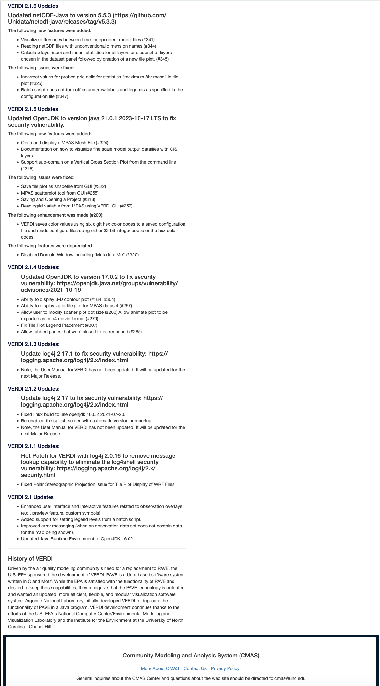

<a id=Figure1-3></a>
Figure 1‑3. Downloading VERDI from the CMAS Web Site, Step 2.


<a id=Figure1-4></a>
Figure 1‑4. Downloading VERDI from the CMAS Web Site, Step 3


Where to Obtain VERDI Documentation
-----------------------------------

Documentation is available in several locations, described below. Each location provides links to the available documentation for VERDI, which can be viewed in your web browser or downloaded and saved to your computer.

-   The main VERDI page (see [Figure 1‑1](#Figure1-1)) has a link to Documentation.

-   The VERDI download page on the CMAS website (see [Figure 1‑4](#Figure1-4)) contains links to all of the available documentation.

-   On the left-hand side of the [www.cmascenter.org](http://www.cmascenter.org) web site, open the drop-down menu for Help and choose Documentation. Select the documentation for VERDI from the drop-down list ([Figure 1‑5](#Figure1-5)) and click Search. Select the model release from the drop-down list and click Search. The resulting documentation pane shows that the available documentation for the chosen release of VERDI (see [Figure 1‑6](#Figure1-6)).

-   To go directly to the most recent VERDI documentation click on DOCUMENTATION from the VERDI software: <http://www.cmascenter.org/verdi>. [Figure 1‑6](#Figure1-6) shows the list of documentation that is available for download for VERDI 1.5.

<a id=Figure1-5></a>
Figure 1‑5. Getting Documentation on VERDI from the CMAS Web Site


<a id=Figure1-6></a>
Figure ‑. VERDI Documentation on the CMAS Web Site
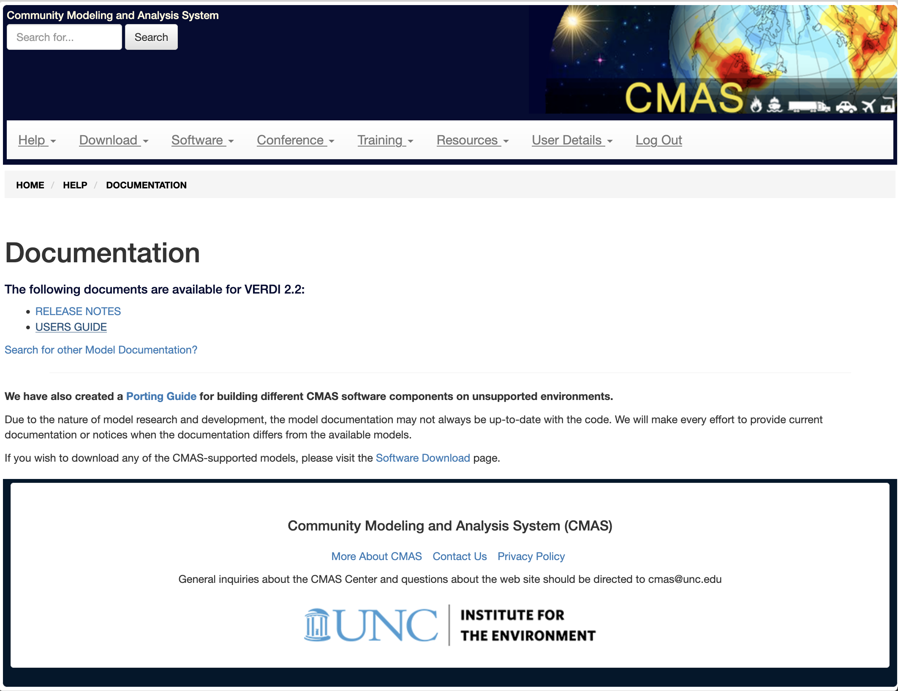

Help Desk Support for VERDI
---------------------------

You are encouraged to search the [M3USER listserv](http://lists.unc.edu/read/search/results?forum=m3user&words=verdi&sb=1) for VERDI-related technical support questions; report errors and/or requests for enhancement to the m3user forum. The m3user forum is supported by the community and also by CMAS to help users resolve issues and identify and fix bugs found in supported software products.

Future VERDI Development
------------------------

As stated in Schwede et al. (2007),[1] “VERDI is intended to be a community-based visualization tool with strong user involvement.” The VERDI source code is available to the public under a GNU Public License (GPL) license at <https://github.com/CEMPD/VERDI>. This allows users who wish to make improvements to VERDI to download the software, and to develop enhancements and improvements that they believe may be useful to the modeling community. Examples could include user-developed readers for additional file formats and modules for additional plot types. Users may wish to contribute data analysis routines, such as adding the ability to do bilinear interpolation (smoothing), or to contribute other enhancements to the existing plot types. The direction of future development will depend on the resources and the needs of the modeling community. If you are interested in contributing code to VERDI, please review the information in Chapter 14, “Contributing to VERDI Development.”

Requirements for Using VERDI
============================

Java Runtime Environment
------------------------

VERDI requires version 7 or above of the Java Standard Edition Runtime Environment (JRE). The JRE<sup>TM</sup> 7 is provided as part of the VERDI release for 32- and 64-bit Linux and Windows. If your computer requires a different version, see Section 3.3. <span id="_Toc197166113" class="anchor"><span id="_Toc292294996" class="anchor"></span></span>

Memory and CPU Requirements
---------------------------

VERDI’s memory and CPU requirements largely depend on the size of the datasets to be visualized. Small datasets can be visualized and manipulated using less than 1024 megabytes of RAM, while larger datasets may need considerably more. If you are using datasets that require either more or less than 1024 MB of memory, you can change the default maximum memory setting used by VERDI:

-   On Windows, edit the run.bat file that you use to launch VERDI. Look for the line that starts “set JAVACMD=” and change the value for the “Xmx” argument from the default heap size of 1024M.

-   On Linux or another Unix platform, you can edit verdi.sh and replace the 1024 in –Xmx1024M with a different value; for example, -Xmx2048M will allow VERDI to access up to 2048MB (or 2GB) of RAM.

Note that slower CPUs can quickly view and animate smaller datasets, whereas larger datasets require more time. As a user opens new Tile plots or other plot types, the memory requirements increase. As the user then closes the plots, the memory is released by VERDI.

Requirements to Run VERDI Remotely
----------------------------------

VERDI may be used to run on a remote compute server and have the graphics display locally on your desktop machine (Unix workstation, Mac, or PC) using the Tile Plot. Your computer needs to be configured to run X-Windows. Typically, you will connect to the remote compute server using secure shell (SSH). If you are using an X-Server and wish to generate 3-D plots using Open GL, you need to turn on Open GL support within the X-Server.

Graphics Requirements
---------------------

Three-dimensional contour plots require a graphics card with OpenGL or DirectX capability. By default VERDI uses OpenGL for 3D rendering. If you would like to use DirectX instead, add the line: j3d=-Dj3d.rend=d3d to the verdi.ini file.

Display Properties
------------------

VERDI works best on screen displays that have been set to a high or perhaps the highest screen resolution (1440 × 900 for Mac, or 1680 × 1050 for Windows 7). Follow these general instructions to adjust your screen resolution on the following types of computers.

-   Windows XP: Right-click on your desktop, click on the Settings tab in the popup window, and move the slider under the screen resolution section to set the resolution to 1280 × 1024 pixels.

-   Windows 7: Click on the Start button and select Control Panel. Select Display, then Adjust resolution. Use the drop-down boxes to select your type of display, screen resolution, etc.

-   Mac: Go to Applications and double-click on System Preferences. Under Hardware select Displays and then Select 1440 × 900.

VERDI Installation Instructions
===============================

<span id="_Toc197166117" class="anchor"><span id="_Toc292295001" class="anchor"></span></span>This chapter provides instructions for installing VERDI 1.6 alpha on a variety of computer platforms. The supporting libraries required by VERDI are included in the installation, along with a version of the JRE 7 for your convenience. If you already have JRE 7 installed on your computer, you will not need to uninstall it and you can choose to use that one.

VERDI 1.6 alpha is distributed as a zip or gzip file, as appropriate, for each of the following supported platforms:

-   32-bit Windows 8

-   64-bit Windows 8

-   32-bit Linux

-   64-bit Linux

-   Mac

If you have a different computer system, select the distribution for a computer system as close to yours as possible and proceed with the installation. Although Java is considered a write-once, run-anywhere computer language, that is not necessarily true for graphical software. Therefore, an appropriate version of some graphics libraries is included in each of the above VERDI distributions.

Installation Instructions for Linux and Mac
-------------------------------------------

Follow these instructions to install VERDI:

1.  tar -xvf verdi\_1.6\_alpha.tar.gz into a location where you would like to install VERDI

2.  Edit verdi\_1.6\_alpha/verdi.sh: Change the path for the VERDI\_HOME variable to reflect the location where VERDI was installed (e.g., VERDI\_HOME=/usr/local/verdi)

3.  Create a directory *verdi* under your home directory.

4.  Create an empty text file, name it *verdi.alias* and save it in your *verdi* directory. When you look at the directory listing for this *verdi* directory, you should see the *verdi.alias* file with a length of 0.

5.  Locate the file *config.properties.TEMPLATE* that is in your installation directory. Copy *config.properties.TEMPLATE* to your *verdi* directory and rename that file *config.properties* only.

    VERDI should now run if you execute the verdi.sh executable script (e.g., ./verdi.sh).

    Please continue with section 3.4.

Installation Instructions for Windows 
--------------------------------------

To install VERDI for Windows, unzip the file to a local directory on your Windows 7 computer. NOTE: You do not need to install VERDI under a Program Files directory or in the root directory on one of your hard disk drives. Therefore, you should not need Administrator rights to install VERDI 1.6 alpha. If your system is under strict control from your Administrator, you may be able to unzip the VERDI distribution under your home directory or your documents directory; however, you may have problems if there is a space in the path to your VERDI installation directory.

If you are unable to install VERDI on your computer, please check to see whether your user account is authorized to install software. You may need to request that a user with a computer administrator account install VERDI, or provide you with an account that has permission to install software. For more information about user account types, click Start and select Control Panel and then click on the User Account icon.

After successfully installing VERDI you need to perform the following tasks under your home directory.

1.  Locate your home directory. Your home directory is typically under C:\\Users\\yourloginid. So, if your login id is *staff*, your home directory is probably *C:\\Users\\staff*.

2.  Create a new directory *verdi* under your home directory (e.g., *C:\\Users\\staff\\verdi*).

3.  Create an empty text file, name it *verdi.alias* and save it in your *verdi* directory. When you look at the directory listing for this *verdi* directory, you should see the *verdi.alias* file with a length of 0.

4.  A text file named *config.properties.TEMPLATE* was installed into your VERDI installation directory. Copy *config.properties.TEMPLATE* to your *verdi* directory and rename that file *config.properties* only.

Note that VERDI writes a log file (i.e., *verdi.log*) as-needed to your *verdi* directory. This log file should remain small. However, if you need technical support we may ask for your log file. It will be a text file named verdi.log located in this verdi directory.

Please continue with section 3.4.

Installation Instructions for computer that that requires a JRE<sup>TM</sup> 7 other than what was provided in the distribution
-------------------------------------------------------------------------------------------------------------------------------

1.  Download Java SE 7 or 8 for your platform from <http://www.java.com/en/download/manual.jsp>

2.  Follow the installation instructions.

Setting VERDI Preferences
-------------------------

VERDI is configured via the config.properties file that you copied to your home/verdi directory. Edit this file to specify default directories for saving files, for placing the location of configuration files, and for saving project files. Contents of config.properties.TEMPLATE:

```csh
\# This file should be put in $USER\_HOME/verdi/ subdirectory
\# Please use double backslash for Windows platform or slash for UNIX-like platforms
\# Please uncomment the following lines and modify them to suit your local settings
\# Windows example settings format
\# verdi.project.home=C:\\\\ Users\\\\yourusername\\\\VERDI\_1.6\_alpha\\\\project
\# verdi.config.home=C:\\\\ Users\\\\yourusername\\\\VERDI\_1.6\_alpha\\\\config
\# Linux example settings format

verdi.project.home=../../data/project
verdi.config.home=../../data/configs
verdi.user.home=../../data/model
verdi.dataset.home=../../data/model
verdi.script.home=../../data/scripts

\# file folder used as default location of HUC datasets for areal interpolation

verdi.hucData=../../data/hucRegion/

\# For VERDI to access remote big netCDF data files

verdi.remote.hosts=terrae.nesc.epa.gov,vortex.rtpnc.epa.gov,garnet01.rtpnc.epa.gov,tulip.rtpnc.epa.gov
remote.file.util=/usr/local/bin/RemoteFileUtility
verdi.remote.ssh=/usr/bin/ssh

\# on local machine where VERDI is running. Used to hold temporary data file downloaded from a remote machine

verdi.temporary.dir=C:\\\\Users\\username\\temp
```

The items in the config.properties.TEMPLATE file that is installed with VERDI are commented out. To specify default directories, uncommented these lines by removing the starting ‘\#’ sign. Example settings that are provided in the default file show how to specify the paths to these locations, depending on whether the installation is for a Windows or Linux platform. Here are how the settings are used by VERDI. Note that VERDI stores the most recently used directory for each of these functions and will go to that directory when you repeat the load or save in the same session.

-   verdi.project.home: Default location from which to load and save projects
-   verdi.config.home: Default location from which to load and save plot configuration files
-   verdi.dataset.home: Default location from which to load datasets
-   verdi.script.home: Default location from which to load and save batch scripts
-   verdi.hucData: Default location where area shapefiles are located; VERDI navigates to this directory when the user selects to add a dataset in the Area pane.
-   verdi.remote.hosts: Contains a list of machines that the user can select to browse when adding a remote dataset using VERDI’s Remote File Access capability
-   verdi.remote.util: Location of the RemoteFileUtility script for Linux and Mac installations of VERDI.

Starting in VERDI version 1.4, the ui.properties file was removed and the user-configurable settings, such as the default directory locations, were moved to the config.properties file.

Starting VERDI and Getting Your Data into VERDI
===============================================

Starting VERDI
--------------

### Windows

If you have previously configured this VERDI installation, use Windows Explorer to navigate to your installation directory. Double-click on the file **run.bat** to start VERDI. Alternatively, you can open a command window. If you do not have a shortcut to launch a command window, press the Start button and type **cmd** in the *Search programs and files* textbox. If your window is too small, go to the window’s title bar and right-click; select Properties and then Layout and change your Screen Buffer Size and your Window Size appropriately.

Next, navigate to where you installed VERDI on your computer. You see the **run.bat** file. Its contents are shown in [Figure 4‑1](#Figure4-1). If you have previously executed this VERDI installation, just type **run** and press the **Enter** key. Otherwise, you may need to customize some of the settings in this file for your configuration. If so, edit your run.bat in a text editor such as Notepad.

<a id=Figure4-1></a>
Figure 4‑1. Starting VERDI in Windows


VERDI_HOME needs to point to the directory where VERDI is installed, which is also the directory containing the run.bat file. In this figure VERDI is installed in the directory C:\\VERDI\\VERDI\_1.6alpha.

JAVADIR needs to point to the directory where your JRE7 is installed. In this figure JRE7 is installed in the jre1.7.0 directory under the VERDI\_HOME directory. If you are using a JRE in a different location on your computer, change the path in your run.bat file.

All other locations are specified relative to the VERDI_HOME or the JAVADIR, so you should not need to change any of those.

### Linux and Other Non-Windows JRE 7 Supported System Configurations

To start VERDI from Linux and other non-Windows JRE 7 Supported System Configurations, find the directory where VERDI was installed; then run the verdi.sh script. On a Mac go to the /Applications/verdi_1.6.0_alpha directory and run the verdi.command script.

Main Window 
------------

When VERDI starts it displays its title screen as it loads. The main window is then displayed ([Figure 4‑2](#Figure4-2)). The top of the main window contains a menu bar with the main window options (**File, Plots, Window,** and **Help**). Below the menu bar are three icons that are shortcuts to some of the options available in the Main Window Menu Bar; the first is an **Open Project** icon, the second is a **Save Project** icon, the third is an icon that allows you to **Undock All Plots**. These shortcuts and the options available in the Main Window Menu Bar are discussed further in Chapter 5, “Navigating VERDI’s Main Menu Options.”

To the right of these three shortcut icons are buttons that list all of the available plot types. The **Selected Formula** is displayed on the far right. The Selected Formula refers to the formula that has been selected in the **Formula** pane (discussed briefly below and in detail in Chapter 7) and that will be used to create plots.

Below the icons and plot buttons, the VERDI window is divided into two main areas: a parameters area consisting of tabbed panes on the left side and a plots area on the right side. You can resize the entire window with your mouse. You can also resize the tabbed pane separately from the plot area by placing your mouse over the dividing line between them and then moving it to the left or the right. If you want, you can separate the tabbed pane into 3 panes by using your mouse to hold onto the pane’s title bar and then move it slightly out of alignment. To reassemble the 3 panes into a tabbed pane, use your mouse to hold onto the title bar of one pane, drag it until its outline fills the outline of another pane, and then release the mouse.

<a id=Figure4-2></a>
Figure 4‑2. VERDI Main Window
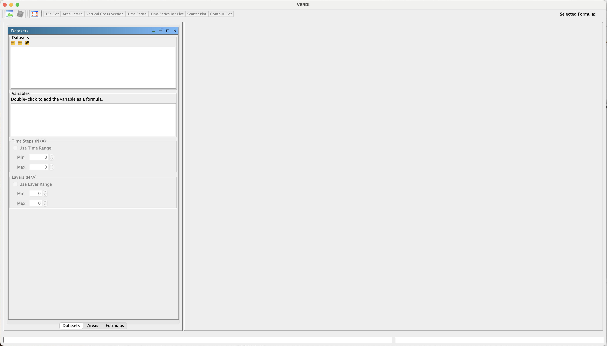

The parameters area contains three tabbed panes:

-   The **Datasets** pane is used to load in the dataset files that you want to work with in this session (see Chapter 6). Once the datasets are loaded, VERDI automatically displays the lists of variables that are in the datasets. To see the variables in a dataset, click on the dataset, and the variables will be displayed in the **Variables** panel underneath the list of datasets. Double-click on the name of a variable listed on the variables panel to add it as a formula on the **Formula** pane; it also will be displayed as Selected Formula in the top right corner of the main VERDI window and will be the default formula for new plots that are created.

-   The **Formula** pane is used to create a formula that refers to the variable and the dataset that you are interested in plotting (see Chapter 7). All plots in VERDI are generated from formulas. A formula can be as simple as a single variable from one dataset or it can be an equation that uses variables from one or more datasets.

-   Use the **Areas** pane to load area files for creating areal interpolation plots (see Chapter 8). An area file is defined as a shapefile that contains polygon features such as watersheds, counties, or any other set of closed polygons.

Any plots that are created are shown in the plots area on the right-hand side of the main window. These plots can be placed into their own movable windows using Plots&gt;Undock all Plots on VERDI’s main menu, as discussed in Section 5.2.1. The Tile Plot has an option (Plot&gt;Add Overlay&gt; Vectors) to create a Tile Plot of a variable with a vector overlay of wind vectors or other vector types. The Vector Plot has now been removed because the Tile Plot with vector overlay is superior. The functions that are currently enabled for Tile Plots are described in Section 10.1.

Rearrange the Datasets, Formulas, and Areas Panes
-------------------------------------------------

You can rearrange the **Datasets**, **Formulas**, and **Areas** panes to be most efficient for your current work. VERDI supports resizing the entire VERDI window, floating one or more panes to other locations on your desktop, and rearranging the panes within the VERDI window.

The **Datasets, Formulas**, and **Areas** panes can each be configured to float so you can position them elsewhere on your desktop. To allow a pane to float, click the icon at the top of the pane that looks like a rectangle with an angle bracket above the upper-right corner; its tool tip is “Externalize this view into a floating window”. You can then click on the pane and drag it independently of the VERDI main window. For example, this is useful when you are entering a formula in the **Formulas** pane and need to refer to the variables that are in a loaded dataset. Once a pane is disconnected from the frame, the icon changes to be a box with an arrow pointing inward, with the tool tip: “Connects this panel with the frame”. Click on the box with the inward arrow to reconnect the panel with the frame. This will return the floating pane back to where it was last connected within the main VERDI window.

You can rearrange the panes within the main VERDI window. Click on the tab at the bottom of a frame and slide it along that area to change the order of the frames. Or slide it up or down and arrange the frames vertically so you can see more than one at a time. You can also click and hold a tab to slide its pane next to the other panes, consuming space that had been used by the charts pane. If you have the three panes beside each other – or two panes with tabs next to the third pane – you can easily change their relative position. Click on the title of the frame that you want to move, drag it, and then release it.

You can also change the amount of the entire VERDI window that is devoted to the 3 panes on the left vs. the charts pane on the right. Position your cursor along the line dividing these two sets of panes such that the cursor becomes a horizontal arrow pointing both left and right. Drag the cursor to the left to reduce the size of these panes and increase the size of the chart pane, or to the right for the opposite effect.

Navigating VERDI’s Main Menu Options
====================================

[Table 5‑1](#Table5-1) illustrates the main menu options that are available on the top menu bar in VERDI’s main window (see [Figure 4‑2](#Figure4-2)). These options are discussed in detail below.

<a id=Table5-1></a>
Table 5‑1. VERDI Main Menu Options

| **File**           | **Plots**          | **Window**| **Help**            |
|--------------------|--------------------|----------|----------------------|
| Open Project       |Undock All Plots    | Areas    | VERDI Help | 
| Save Project       |Animate Tile Plots  | Datasets | About      |
| Save Project As    |                    | Formulas |            |
| View Script Editor |                    |          |            | 
| Exit               |                    |          |            |


File Menu Options
-----------------

### Open Project 

**Open Project** retrieves projects that were saved during a previous session (using the two **Save Project** options described in Section 5.1.2). Note that when you use a saved project, *it is very important* to load that project into VERDI *before* you load any additional datasets or create any additional variables/formulas. If you have already loaded datasets and then try to open a previously saved project, VERDI will show you a message that says “All currently loaded datasets will be unloaded” and will ask if you want to continue.<span id="_Toc197166128" class="anchor"></span>

### Save Project 

The **Save Project** and **Save Project As** options save dataset lists and associated formulas as a “project” for later use.

Note that plots are not saved with a project; only datasets and formulas are saved. If you wish to save a plot configuration for later use, see Section 11.4.2, “Save Configuration.”

### View Script Editor

Use the **View Script Editor** to modify and run batch scripts within VERDI. Several sample script files are provided with the VERDI distribution under the $VERDI_HOME/data/scripts directory. Use the Open popup window to specify file_patterns.txt, which is one of the sample script files. The contents of the file_patterns.txt will be displayed in the Script Editor in the right side of the VERDI window. Modify it to specify the local directory path name for the sample data files, the formulas, the type of plots, and the image format. The plots are not rendered within VERDI, but may be viewed using an image viewer. The batch scripting language is described in the sample script files, and is described in more detail in Chapter 17 VERDI Batch Script Editor.

Plots Menu Options
------------------

VERDI opens a single pane for plots, to the right of the **Dataset**, **Formula,** and **Area** tabbed pane. Each plot is created in its own pane and is placed in the plot pane. The most recent plot is displayed on the top. Each plot has a tab beneath it listing the type of plot and the formula used to create it. If you want to view a previously created plot, select the tab associated with its pane underneath the current plot; the selected plot is then displayed on top.

### Undock All Plots

As with the **Dataset**, **Formula,** and **Area** panes (Section 4.3), plot panes can be undocked or externalized so that you can move them into separate, floating windows. This allows side-by-side comparisons of plots. Note that undocking is performed only on previously created plots; each plot is placed within the VERDI main window when it is generated.

###  Animate Tile Plots

This option opens an **Animate Plots** dialog box ([Figure 5‑1](#Figure5-1)) that allows you to select one or more plots, select a subset of the time range, and create an animated GIF file. There is also a separate way to create a QuickTime movie instead of a GIF, if desired.

Within the **Animate Plots** dialog box, you can **select plot(s)** to animate by clicking the check box beside each plot name.

You can choose to animate a single plot, or animate multiple plots synchronously. To view multiple animated plots synchronously, undock the plots (see Section 5.2.1) and arrange them so that they are located side by side for visual comparison during the animation. NOTE: The underlying number of time steps must match or the Start button will not activate (see [Figure 5‑1](#Figure5-1)).

<a id=Figure5-1></a>
Figure 5‑1. Selected plots must have matching time steps.
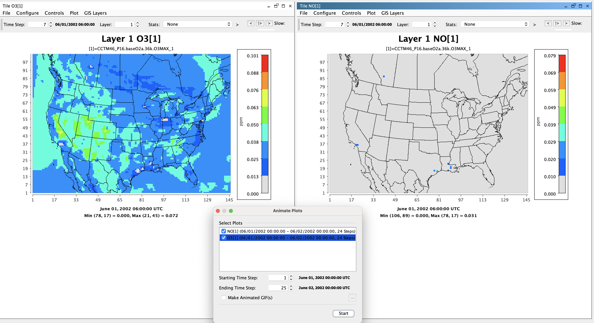

After selecting your plots, **select the time range** by specifying both the **starting time step** and **ending time step** of the animation. The selected plots animate together over the selected time interval.

To create an animated GIF, check the **Make Animated GIF(s)** option in the **Animate Plots** dialog box. In the **Save** dialog box that appears, select the directory in which to store the file and the name to use for the animated GIF, then click the save button. When saving as an animated GIF, when multiple plots are selected, each animated plot will be saved to a separate animated GIF file. For example, if three plots were selected, the animated plots would be saved as &lt;filename&gt;-1.gif, &lt;filename&gt;-2.gif, &lt;filename&gt;-3.gif. You can view the animated GIF by opening the file in a web browser.

Creating a QuickTime movie is also an option, but this is not done through the **Plots&gt;Animate Tile Plots** main menu option. Instead, use the **Plot** menu option found at the top of each individual plot to make a QuickTime movie.

<a id=Figure5-2></a>
Figure 5‑2 Animate Plots Dialog and Tile Plots
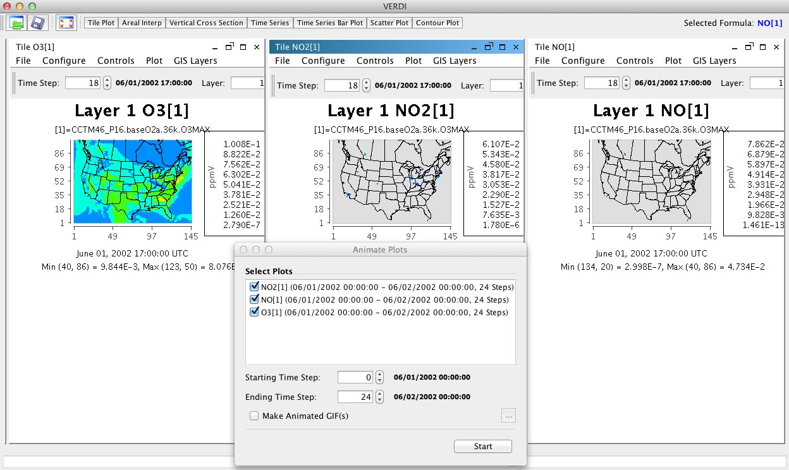

Window Menu Options
-------------------

The **Window** menu provides an alternate way to select windows/panes to be brought to the front, and provides the same function as clicking on the tabs at the bottom of the windows/panes.

### Datasets, Areas, and Formulas 

Select from the **Window** pull-down menu to bring to the front either the **Datasets** pane, **Areas** pane, or **Formulas** pane when those panes are docked.

### Script Editor

This option appears in the Window menu if you have a script editor window open. You can select this menu item instead of pressing the Script Editor tab at the bottom of its pane.

### List of Plots

The **Window** pull-down menu is automatically updated each time a plot is created or removed in a VERDI session; each entry in the plot list indicates the type of plot and the formula used (e.g, Tile O3[1]). A check mark to the left of a plot designates the active plot. Click on a plot entry to bring that plot to the front for viewing. Alternatively, you can bring a plot to the front by selecting the desired **plot tab** underneath the plots area of the main window or my clicking on the plot’s window for undocked plots. As in the menu entries, each **plot tab** is labeled with the plot type and the formula used.

Help Menu Options
-----------------

The **Help** pull-down menu contains two items that you can use to learn more about VERDI. When you select **VERDI Help Documents**, you can select to view either the user manual or the developer instruction in your PDF-compatible reader. When you select **About** a popup window that contains the name of the product, the version number, and the date the software was built is displayed.

Working with Gridded Datasets
=============================

Gridded Input File Formats
--------------------------

###  Model Formats

VERDI currently supports visualizing files in the following file format conventions: CMAQ Input/Output Applications Programming Interface (I/O API) netCDF, WRF netCDF, CAMx (UAM-IV), and ASCII format (for observational data).<span id="IOAPI" class="anchor"></span> VERDI uses a customized version of the thredds/NetCDF Java library v4.5.5 (<http://www.unidata.ucar.edu/software/netcdf-java>).

The CMAQ I/O API was designed as a high-level interface on top of the netCDF Java library. (see https://www.cmascenter.org/ioapi/ and <http://www.unidata.ucar.edu/software/netcdf/> for further information). The I/O API library provides a comprehensive programming interface to files for the air quality model developer and model-related tool developer, in both FORTRAN and C/C++. I/O API files are self-describing and include projection information within the gridded dataset. See Chapter 12 for additional information on what projections and gridded data file format conventions are currently supported by VERDI.

NetCDF and I/O API files are portable across computing platforms. This means that these files can be read regardless of what computer type or operating system you are using. Routines are available to convert data to these formats or new code can be written and contributed to VERDI for use by the community. Discussion of the I/O API conversion programs and how to use them can be found in Chapter 13, “I/O API Utilities, Data Conversion Programs, and Libraries”. If you write a routine for VERDI to read gridded data from other formats, please consider contributing your code to the user community using GitHub, as described in Chapter 14.<span id="_Toc292295025" class="anchor"><span id="_Toc197166138" class="anchor"></span></span>

###  Observational Data Formats

VERDI can use observational data in either ASCII or Models-3 I/O API format. An ASCII file needs to have data in tab-separated columns. The first four columns need to be in the order shown in [Figure 6‑1](#Figure6-1). VERDI allows the user to specify an alphanumeric value (either numbers and/or letters) for the fourth column (Station ID). One or more additional columns must have the header format 'name(units)'. Spreadsheet programs can be used to edit and write the files by choosing ASCII output; be certain to designate **tab** as the delimiting character (instead of comma). Data within a column must be complete, because empty fields prevent VERDI from reading the observational data.

Observational data in ASCII format can be obtained from many data sources, including EPA’s Remote Sensing Information Gateway - RSIG (<https://www.epa.gov/hesc/remote-sensing-information-gateway>). To use a consistent set of units for the model data and the observational data, you may need to import the ASCII data into a tool (e.g., a spreadsheet or database program) and perform a unit conversion. VERDI doesn’t allow the user to use an observational variable to create a formula, so conversions to different units must be performed before loading the data into VERDI.

<a id=Figure6-1></a>
Figure 6‑1. Example observational data file showing format.
<embed src="media/image011.png"/>


Alternatively, you can use a converter such as AIRS2M3 (see Chapter 13) to convert ASCII observational data into I/O API "observational-data" files.

Example Datasets
----------------

Several example datasets are provided under the $VERDI_HOME/data directory. For example:

-   Windows: %VERDI_HOME%\\data

-   Mac: $VERDI_HOME/data/

-   Linux: $VERDI_HOME/data

These datasets may be used to recreate example plots that are provided in this user’s manual, including a tile plot with observational data overlay (see Section 11.6.3.1) and example datasets for the various projections that VERDI supports including Lambert Conformal Conic (LCC), polar stereographic, Universal Transverse Mercator (UTM), and Mercator. The data directory currently contains seven subdirectories:

1.  CAMx – contains sample CAMx dataset and camxproj.txt file

2.  configs – contains sample config and theme files

3.  hucRegion – contains Hydrologic Unit Code (HUC) shapefiles for region 3 (southeast US)

<!-- -->

1.  model – contains sample WRF and CMAQ I/O API datasets

2.  obs – contains an ASCII formatted observational dataset (Section 6.1.2), and an observational dataset created by airs2m3 converter (Chapter 13).

3.  plots – contains sample plots created by VERDI

4.  scripts – contains sample batch scripts

Adding and Removing a Dataset from a Local File System
------------------------------------------------------

To load a data set from a local file system, press the yellow **plus** button at the top of the **Datasets** pane. A file browser ([Figure 6‑2](#Figure6-2)) allows you to select a dataset for use in VERDI. Support for loading data from a remote file system was added beginning in version 1.4. The use of the yellow **plus remote** button will be discussed in Section 6.4.

After you select a dataset, VERDI loads header information and displays the available variables, time steps, layers, and domain used by the file in the **Datasets** pane ([Figure 6‑3](#Figure6-3)). (The actual model data are not loaded until later, when plots are created.) To view the variables for a particular dataset that has been loaded, click on the dataset name in the list to highlight it, and the variables will be listed in the panel below.

Datasets can be removed by highlighting the name of the dataset in the dataset list and pressing the yellow **minus** button. Note that although the dataset will be removed, the number that was assigned to that dataset will not be reused by VERDI during the current session (unless there had been only one dataset loaded, and it was removed; in that case the next dataset that is loaded will be labeled number 1).

<a id=Figure6-2></a>
Figure ‑. Open Dataset File Browser
 

<a id=Figure6-3></a>
Figure ‑. Datasets Pane Displaying Information about a Dataset
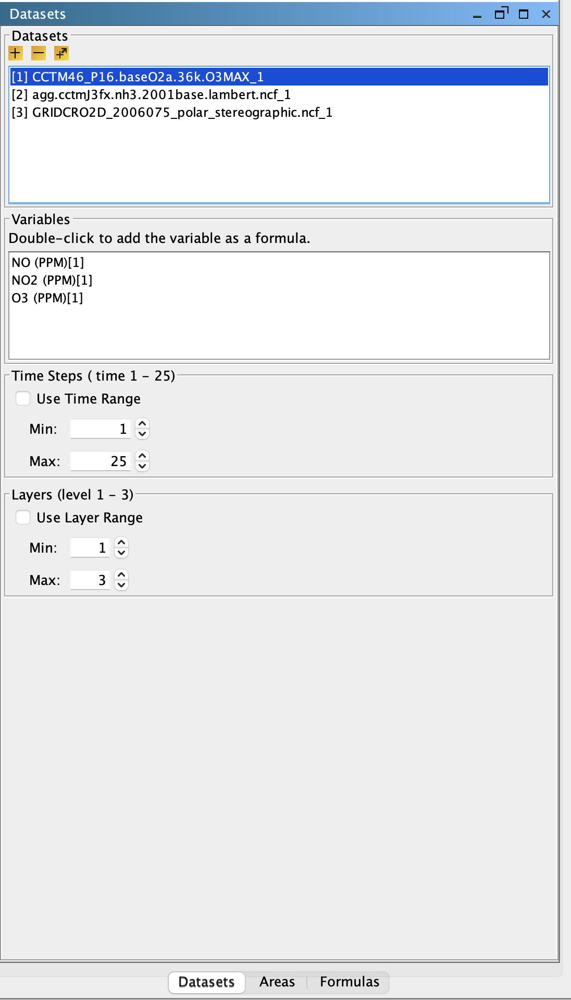 

Adding and Removing a Dataset from a Remote File System
-------------------------------------------------------

VERDI provides users with the ability to select and add variables from datasets on remote file systems. To do this, press the yellow **plus remote** (plus with a diagonal arrow) button at the top of the **Datasets** pane. In the Remote File Access Browser (Figure 6‑4) that appears, enter your user name, choose a host from the list, and enter your password, then click **Connect**.

<a id=Figure6-4></a>
Figure 6‑4. Available Hosts in the Remote File Access Browser
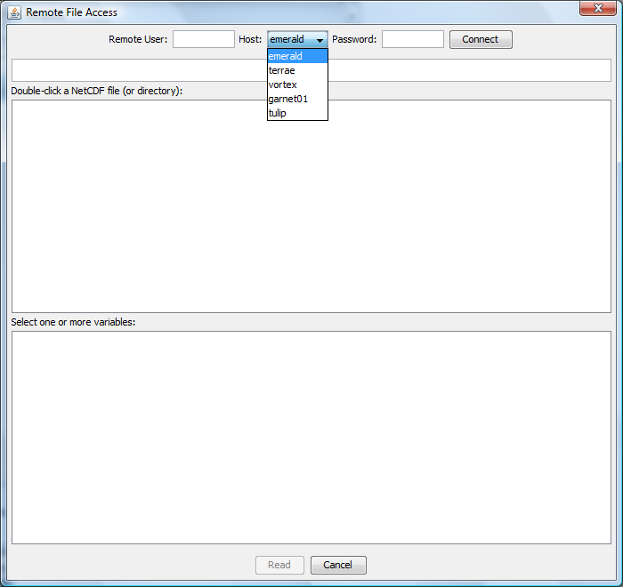 


### Remote File Browser

The top panel displays a listing of the home directory on the remote file system, as shown in Figure 6‑5. The current path is displayed in the text box and users can edit this information to change to another directory. An alternate way to navigate between directories is using the middle panel. In the middle panel, double click on a directory name to go into that directory, or click on the “../” at the top of the middle panel to navigate up a directory. As you enter a directory, the contents of the directory will be displayed as a list in the middle panel. Directory names are followed by a “/” symbol, while filenames do not have a “/” symbol after them. View the variables within each file of interest by double clicking on the netCDF filename listed in the middle panel. NOTE: if the selected file has a format that is not supported by VERDI then the following message will be displayed in the bottom panel: “Not a valid NetCDF file”. For supported netCDF files, VERDI will provide a list of variables that are available within the file in the bottom panel labeled “Select one or more variables”. To select variables from the list, use your mouse to click on a single variable, or use either the Shift key with the mouse to select a contiguous list of variables, or the Control key with the mouse to select a set of individual variables. Once the variables that you would like VERDI to read are highlighted, click on the **Read** button.

<a id=Figure6-5></a>
Figure 6‑5. Select One or More Variables from Remote Dataset
 

The variables read from the remote dataset will be displayed in the dataset and variable browser in the same way that variables from a local dataset are added and displayed within VERDI. The subsetted local dataset names are identical to the file names on the remote host, except for an additional extension that enumerates how many times the remote files were read and saved locally by VERDI (i.e., filename1, filename2, filename3, etc.), as shown in [Figure 6‑6](#Figure6-6). To add variables from the same remote dataset, click on the **plus remote** button, and repeat the above procedure.

The Remote File Browser retains the login session and the directory that was last accessed by the user to facilitate ease of accessing remote datasets. VERDI increments the numerical extension to the dataset name to indicate that this subset file was created using the same remote dataset, but that the subset file with the new numerical extension may contain a different subset of variables. Note that VERDI does not check to see if the same variable from the same remote dataset has already been read. Also, subset files read in by VERDI are saved either to your home directory on your local file system (e.g., C:\Users\username on a Windows 7 computer), or to the location that is specified in the config.properties file using the verdi.temporary.dir setting. Refer to Section 6.4.2 on how to edit and save the config.properties file.

The files are saved on your local machine to facilitate project management. To be able to save and then load a project for future use, the files need to be saved on the local machine. To avoid filling up your local file system, regularly inspect the file list in the home or verdi.temporary.dir directory and manually delete unneeded subset files.

Remote datasets can be removed from the dataset list in VERDI using the same procedure as for removing local datasets: highlight the name of the dataset in the dataset list and press the yellow **minus** button. Note that although the dataset will be removed from the dataset list, the number that was assigned to that dataset will not be reused by VERDI during the current session.

<a id=Figure6-6></a>
Figure 6‑6. Remote Dataset Labeled with Number at End of the Filename
 

### Adding Additional Remote Hosts

VERDI contains the RemoteFileUtility and ncvariable programs that enable VERDI to add your I/O API netCDF or WRF netCDF formatted dataset from a remote file system. A gzipped tar file is available in the $VERDI_HOME directory.

1.  The RemoteFileUtility c-shell script and ncvariable binary need to be installed either in /usr/local/bin by the System Administrator, or you can place it in a different location and specify that location in the configure.properties file located in your $USER_HOME/verdi/ directory (see section 3.4 for the specific directory location that is used for each platform [Linux, Windows, Mac]). A template for the configure.properties file called configure.properties.TEMPLATE is provided in the distribution under the $VERDI_HOME directory.

2.  A README file provided with the software contains instructions on how to compile the source code if the binaries provided do not match your operating system.

<!-- -->

1.  Copy the file configure.properties.TEMPLATE to configure.properties. Edit the configure.properties file in the $USER_HOME/verdi directory. Add the name or IP address of the Linux server, preceded by a comma, at the end of the list of machines defined as remote hosts in the configure.properties file, as shown in [Figure 6‑7](#Figure6-7). You then need to restart VERDI in order for it to recognize a newly added remote host name.

<a id=Figure6-7></a>
Figure 6‑7. Edit configure.properties File to Add a Remote Host
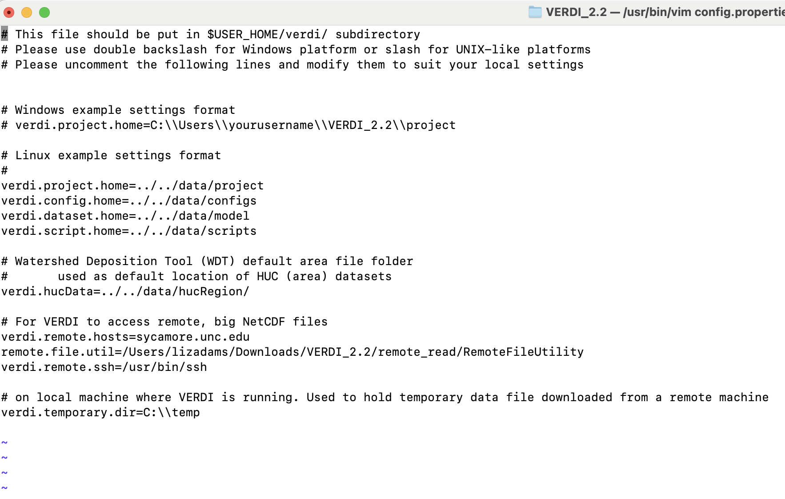 

Variables List
--------------

The variables list shows all of the variables contained in a loaded dataset (see Figure 6‑8). To display a variables list, select the name of the dataset of interest in the **Datasets** pane. Each of the variables in the list can be used to create a formula in the **Formula** pane that can then be used to create plots. VERDI allows the user to automatically add a formula by double-clicking on the name of a variable. This automatically creates a formula that contains the variable for the loaded dataset and makes it the default formula for making plots. In addition, you may right-click on the name of the variable to show a popup menu as shown in the middle of the figure. From this menu you can either add the variable as a formula, or you can to add it into the formula editor so that it can be used to compose more complex formulas. Formulas are described in more detail in Chapter 7.

<a id=Figure6-8></a>
Figure ‑. Right-Click on Variable in Dataset Pane
 

Time Steps and Layers Panels
----------------------------

The range that is available for the dataset is listed in the Time Steps or Layers Panel in parenthesis next to the label for the panel. [Figure 6‑8](#Figure6-8) shows that the dataset has 25 time steps with the range displayed as: Time Steps (1-25). You can use a subset of the full time step range by clicking on the Use Time Range checkbox, and then using the Min and Max spinner controls to set a new minimum or maximum value, for example choosing time step 2 as the minimum time step and time step 4 as the maximum. When a tile plot is created, it will only display time steps 2-4. Detailed instructions for using the **Time Steps** and **Layers** panels are discussed in Chapter 9, “Subsetting Spatial and Temporal Data.”

Saving Projects
---------------

As noted in Section 5.1.2, lists of datasets and formulas can be saved as “projects” using the Save Project option in the **File** pull-down menu on the VERDI main window. Refer back to that section for discussion on saving new projects and loading existing projects. Note that the plots created in VERDI are not saved with the project.

Working with Formulas
=====================

All plots in VERDI are generated from formulas. A formula is used to compare or manipulate variables in one or more gridded datasets. A formula can be as simple as a single variable from one gridded dataset or it can be an equation that uses variable(s) from one or more gridded datasets. Formulas are used to create visualizations that can assist with model performance evaluations, for example, or can help in comparing model results with observations.

Adding and Removing a Formula
-----------------------------

After loading the desired gridded datasets, you can use the variables in them to create formulas. To use a variable to create a simple formula, double click on the name of the variable. This will add the formula &lt;Variable Name&gt;[&lt;Dataset Number&gt;] to the formula list in the **Formulas** pane—for example, O3[1]. To add a variable to the formula editor window, highlight the variable, **right click** on the variable name in the **Datasets** pane, and select **Add Variable(s) to Formula Editor**. To add all or a subset of variables from the **Dataset** pane to the formula editor window, click on the first variable to highlight it, hold the Shift key down and click at the last variable that you want to include, then right click and select **Add Variables(s)**. The formulas that are highlighted using this method will be added to the formula editor ([Figure 7‑1](#Figure7-1)).

<a id=Figure7-1></a>
Figure 7‑1. Adding Multiple Variables to Formula Editor
 

After the variable names are added to the Formula Editor, click on the formula pane and use the cursor and the keyboard to type in the mathematical functions and operators where needed to create a valid formula (see Section 7.2 and Chapter 16). After the formula has been created in the Formula Editor, click the **Add** button to place it in the list of formulas available in the **Formula** pane.

To remove a formula from the formulas list, highlight the name in the list and press the yellow **minus** button. Note that removing a formula from the formula list does not remove plots that were created prior to the deletion of the formula.

Example Formulas
----------------

To examine the values of ozone in dataset 1, the formula would be “O3[1]”.

To examine the difference in ozone between datasets 1 and 2, the formula would be “O3[1]-O3[2]”.

To calculate the percent difference in ozone between datasets 1 and 2, the formula would be “(O3[1]-O3[2])*100/(O3[2])”.To identify all cells where the ozone concentration exceeds a certain value, you can use the Boolean operators to focus on ranges of your data that are of particular interest. A Boolean expression will evaluate to either True = 1 or False = 0. For example, to plot the cells in which the ozone values in dataset 1 exceed 0.080 ppm, you could use the formula “(O3[1]&gt;0.080)*O3[1]”. In the resulting plot, each cell where O3[1] exceeds 0.080 will show the value of O3[1] for that cell; for all other cells the value shown will be zero.

The notations that can be used in formulas to represent various mathematical functions, and the order of precedence of these functions, are listed in Chapter 16, “Mathematical Functions.”

Selecting a Formula for Plotting
--------------------------------

You must select a formula before creating a plot. Check to see which formula is highlighted in the **Formula** pane, or look to the right of the plot buttons above the plots area of the main window to see the selected formula. By default, VERDI designates the most recently added formula as the selected formula. To change the selected formula to a different one in the list, click on a formula in the list on the **Formulas** pane, and you will then see it displayed as the selected formula above the plots area.

Saving Formulas
---------------

Both formulas and datasets can be saved using the **Save Project** item in the **File** pull-down menu on the VERDI main window. Saving new projects and loading existing projects were discussed in Section 5.1.

Time Step and Layer Ranges
--------------------------

Instructions for using the **Time Steps** and **Layers** panels are discussed in Chapter 9 Subsetting Spatial and Temporal Data.

Working with Area Files
=======================

Area File Formats
-----------------

Area files are defined in VERDI as shapefiles that contain area features such as watersheds and counties, or any other shapefile that consists of a set of closed polygons.

The shapefile format (ESRI, 1998) consists of four files.

1.  The *.shp file contains the actual shape vertices.

2.  The *.shx file contains the index data pointing to the structures in the .shp file.

<!-- -->

1.  The *.dbf file contains the attributes (e.g., unique county ID).

2.  The *.prj file contains the map projection information associated with the polygons.

Example Area File
-----------------

Shapefiles that contain closed polygons are used by VERDI to interpolate gridded data to geographic boundary regions to create Areal Interpolation Plots. Shapefiles containing state, county, or census block, for example, or any other shapefile containing polygon areas may be used in VERDI to calculate and map formulas to the user-selected geographic regions. An example shapefile containing the 8-digit HUC watershed boundary map for the Southeast (HUC 3) is provided in the VERDI release under the $VERDI_HOME/data/HucRegion directory.

Examples of on-line data archives for these shapefiles include:

<http://datagateway.nrcs.usda.gov>

<https://www.census.gov/geo/maps-data/index.html>

Requirements for Shapefiles used in Areal Interpolation
-------------------------------------------------------

Shapefiles for areal interpolation must use units of degrees (not meters) and should use the following datum: DATUM[“unknown”, SPHEROID[“SPHERE”, 6370000.0, 0.0], TOWGS84[0,0,0]

Adding and Removing an Area File
--------------------------------

<span id="_Toc241299380" class="anchor"></span>To load a shapefile, press the yellow **plus** button at the top left corner of the **Areas** pane (Figure 8‑1). A file browser (Figure 8‑2) allows you to change directories and select a shapefile file for use in VERDI. Click on the shapefile name and click **Next**. The **Open Area** popup window is displayed next, allowing you to select the name of the field to read from the file. Use the pull-down menu and click on the Name Field (Figure 8‑3) to be used. Each shapefile has a projection file associated with it (e.g., myFile.shp also has myFile.prj). After specifying the Name Field, select **Finish**. The resulting plot will be in the same projection as the gridded information used in the plot.

Areas List
----------

The shapefile name(s) are listed in the top panel of the **Areas** pane, and the name fields for the polygons provided in the shapefile(s) are listed in the panel underneath (see Figure 8‑4). The actual model data are not loaded until the Areal Interpolation plots are created. As additional shapefiles are added, the name fields associated with each shapefile are appended to the bottom of the Areas list. Use the scrollbar on the right side of the **Areas** pane to view the additional name fields that are available. To remove a shapefile, click on the name of the shapefile and press the yellow **minus** button at the top left corner of the **Areas** pane.

Areal Interpolation
-------------------

When you select the Areal Interpolation Plot, your selected formula is remapped over the polygon areas that are listed in the **Areas** pane. To select a subset of the polygon areas, and view the average and total values for selected formulas, see Section 10.2: Areal Interpolation Plot.

<a id=Figure8-1></a>
Figure 8‑1. Areas Pane
 

<a id=Figure8-2></a>
Figure 8‑2. Open Area File Browser
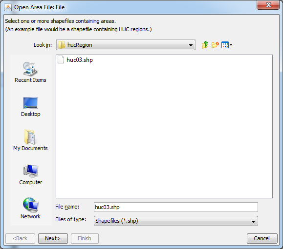 

<a id=Figure8-3></a>
Figure 8‑3. Open Area File: Select Name Field
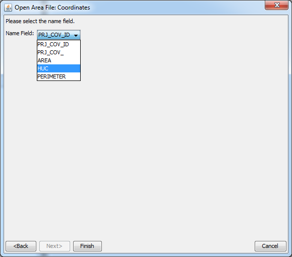 

<a id=Figure8-4></a>
Figure 8‑4. Area Name Fields in Current Shapefile
 

Subsetting Spatial and Temporal Data
====================================

Both the **Dataset** pane and the **Formula** pane include the three panels discussed in Sections 9.1 through 9.3: **Time Steps, Layers,** and **Domain**, respectively. Section 9.4 then discusses the precedence rules for subsetting data that determine whether **Datasets** or **Formulas** take priority.

Specify Time Step Range
-----------------------

The **Time Steps** panel ([Figure 9‑1](#Figure9-1)) displays the range of time steps included in a dataset. The maximum time-step range that can be used for a dataset or formula is specified in the **Min** and **Max** spinner controls. You can use these controls to select a subset of the available time-step range for plotting. Check the **Use Time Range** box above the spinner controls to tell VERDI to use the time-step range values you have specified when it creates a plot. By default, a plot initially displays data for the minimum time step specified in the **Time Steps** panel. The range of time steps shown in the **Time Step** spinner control at the top of the plot reflects the subset of time steps specified when the **Use Time Range** box is checked. The date and time of the time step displayed in the plot are shown below the x-axis labels. Subsetting a dataset’s or formula’s time-step range affect plots produced with those data. Section 9.4 describes the precedence rules.

<a id=Figure9-1></a>
Figure 9‑1. Specify Time Step Range
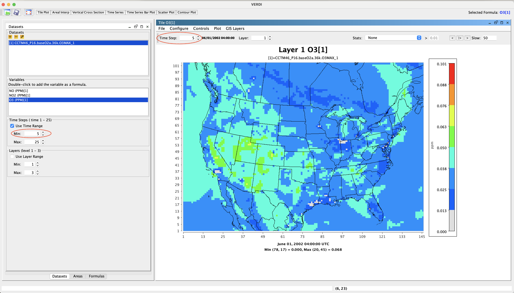 

Specify Layer Range
-------------------

Information on the range of vertical model layers included in a dataset is displayed in the **Layers** panel (Figure 9‑2). Use the **Min** and **Max** spinner controls to select a subset of the available layer data for plotting. Check the **Use Layer Range** box above the spinner controls to tell VERDI to use the layers you have specified. By default, a plot will initially display data for the minimum layer chosen in the **Layers** panel. The range of the layers available in the **Layer** spinner control at the top of the plot matches the subset of layers specified when the **Use Layer Range** box is checked. Subsetting a dataset’s or formula’s layer range affects plots produced with those data. Section 9.4 describes the precedence rules.

<a id=Figure9-2></a>
Figure 9‑2. Edit Layer Range in Formula Pane
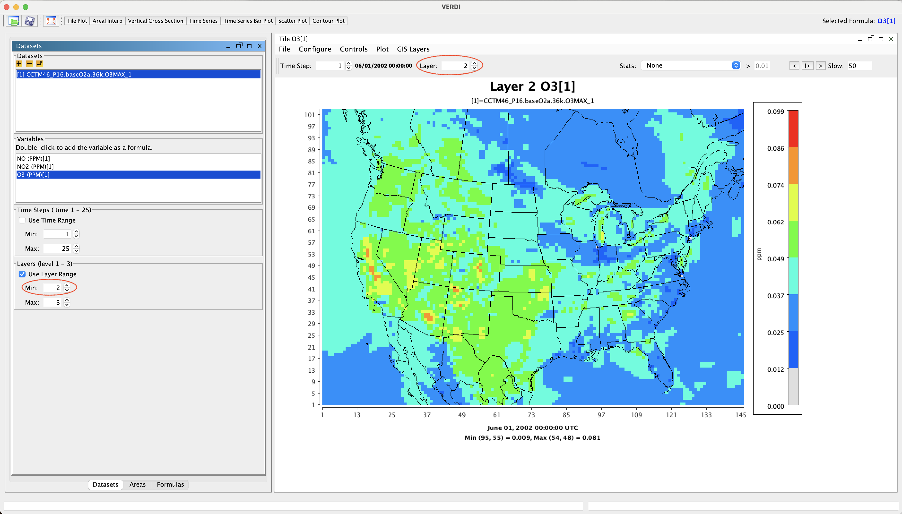 

Specify Domain Range
--------------------

Datasets contain data for cells over a particular geographic area. VERDI refers to this area as a *domain*. By default, the entire domain contained in a dataset is used in creating plots. Use the **Controls** menu and then the **Set Row and Column Ranges** selection to define a subset of this domain for plotting.

Rules of Precedence for Subsetting Data
---------------------------------------

Use the subsetting feature to combine variables from two or more datasets that originally contained different but overlapping time steps and layers. Select identical subsets of the data available in each dataset such that their time steps and layers match. Then you can select variables from those datasets to create a formula and plot the data. Because both the **Dataset** pane and the **Formula** pane have the **Time Steps** and **Layers** panels described above, precedence rules determine which pane’s settings take priority. It is important to understand these rules.

NOTE: You must check the appropriate boxes to have your selected ranges take effect.

-   Dataset precedence: A subset of data specified in the **Dataset** pane takes precedence over any subset specified in the **Formula** pane. However, VERDI does not change the ranges displayed in the **Formula** pane when you select a subset on the **Datasets** pane. For example, if a dataset has a full time-step range of 0-48 and you select a time-step range of 2-40 on the **Dataset** pane, then the 0-48 time-step range that is listed for the formula in the **Formula** pane is not applicable. When you subsequently create a plot, the time-step range subset you chose in the **Dataset** pane (2-40) is displayed.

-   Formula ranges: If you do not specify a subset for a particular data type (i.e., time steps or layers) in the **Dataset** pane, then any subsetting for that data type in the **Formula** pane takes effect.

Creating Plots
==============

After creating a formula, you are ready to create and view some plots. The available plot types are shown on the buttons at the top of the VERDI main window: tile plot, areal interpolation plot, vertical cross section plot, time series plot, time series bar plot, scatter plot, and contour plot. All of these are described in this chapter. Note that not all datasets are appropriate for all plot types.

To generate a plot first highlight a formula in the list of formulas you have created in the **Formula** pane. You can also see the selected formula in the top right corner of the main VERDI screen (i.e., to the right of the plot buttons). Next, generate a plot by clicking on that plot type’s button. If VERDI needs additional information to generate your chosen plot, a dialog box appears to prompt you for that information.

Each plot contains its own menu bar at the top of its window with options for configuring and exploring that type of plot. The menus may include **File, Configure, Controls,** **Plot,** and **GIS Layers**. The options for each of these menus are described in more detail in Chapter 11 Plot Menu Bar.

Tile Plot
---------

The **Tile Plot** displays gridded data defined as time steps and layers. It can also display grid cell time aggregate statistics. [Figure 10‑1](#Figure10-1) provides an example of the **Tile Plot** window.

Figure 10‑1. Tile Plot Example
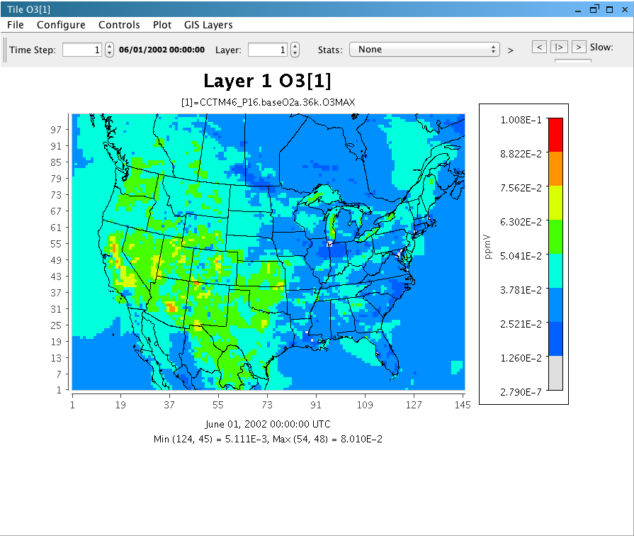 

### Time Selection and Animation Controls

At the top left of the Tile plot, the **Time Step** spin control can be used to change the time step by clicking the up or down arrow. Alternatively, highlight the value shown for the current time step, type in the desired value, and press the **Enter** key.

Buttons in the top right corner of the plot allow you to use play/stop, reverse, forward, and speed options to control the animation of the plot. Control the speed of the animation through the text box labeled **Slow**; the default delay is 50 milliseconds between frames. If that text box is not visible, expand the plot window’s width by clicking with the left mouse button on the right edge of the window and dragging to the right. Enter a number in the box for the length of the delay and then press the **Enter** key. A larger plot with multiple map layers may require a shorter delay between frames than a small zoomed-in plot with few map layers.

### Layer Selection

The Layer displayed for the plot can be controlled by clicking on the up or down arrow for the **Layer** spin control in the top center of the plot.

### Grid Cell Time Aggregate Statistics

The pull down menu option labeled **Stats** provides the option to display grid cell time-aggregate statistics (e.g., per-cell minimum, maximum, mean, geometric mean, median, first quartile, third quartile, variance, standard deviation, coefficient of variance, range, interquartile range, sum, time step of minimum, time step of maximum, maximum 8-hour average, and hours of noncompliance). Although you are still able to use the spinners to change the time step, the values and the chart’s colors do not change.

VERDI calculates the grid cell time aggregate statistics as follows: For each cell (*i,j,k*) in the currently selected domain (independent of neighboring cells), the aggregated statistical value is calculated over the currently selected time steps. In other words, the aggregated statistical value is calculated for the plotted formula for cells (*i,j,k,*tmin...tmax), with the number of time steps *n*, where *n*=(tmax-tmin+1).

-   MINIMUM: min (var(i,j,k,tmin), var(i,j,k,tmin+1), ..., var(i,j,k,tmax))

-   MAXIMUM: max (var(i,j,k,tmin), var(i,j,k,tmin+1), ..., var(i,j,k,tmax))

-   MEAN: SUM / n

-   GEOMETRIC_MEAN: ((var(i,j,k,tmin), var(i,j,k,tmin+1), ..., var(i,j,k,tmax)))<sup>(1/n)</sup>

-   MEDIAN: value at 50<sup>th</sup> percentile of (sorted {var(i,j,k,tmin), var(i,j,k,tmin+1), ..., var(i,j,k,tmax)})

-   FIRST_QUARTILE: value at 25<sup>th</sup> percentile of( sorted (var(i,j,k,tmin), var(i,j,k,tmin+1), ..., var(i,j,k,tmax)))

-   THIRD_QUARTILE: value at 75<sup>th</sup> percentile of( sorted (var(i,j,k,tmin), var(i,j,k,tmin+1), ..., var(i,j,k,tmax)))

-   VARIANCE: ((var(i,j,k,tmin)-MEAN)<sup>2</sup> + (var(i,j,k,tmin+1)-MEAN)<sup>2</sup> + ... + (var(i,j,k,tmax)-MEAN)<sup>2</sup>) / (n - 1)

-   STANDARD_DEVIATION: VARIANCE<sup>0.5</sup>

-   COEFFICIENT_OF_VARIANCE: STANDARD_DEVIATION / |MEAN|

-   RANGE: MAXIMUM - MINIMUM

-   INTERQUARTILE\_RANGE: THIRD\_QUARTILE - FIRST\_QUARTILE

-   SUM: var(i,j,k,tmin) + var(i,j,k,tmin+1) + ... + var(i,j,k,tmax)

-   TIMESTEP\_OF\_MINIMUM: 0-based time step when cell contains its minimum value

-   TIMESTEP\_OF\_MAXIMUM: 0-based time step when cell contains its maimum value

-   HOURS\_OF\_NON\_COMPLIANCE: number of time steps that the cell value eceeds a given threshold |{Var(I,j,k,t(i))&gt;threshold}|

-   MAXIMUM\_8HOUR\_MEAN: Ma (M1, M2, ..., Mn-8) where Mi = mean(var(i,j,k,t<sub>(i)</sub>), var(i,j,k,t<sub>(i)+1</sub>), var(i,j,k,t<sub>(i+2)</sub>), ...,var(i,j,k,t<sub>(i+8)</sub>), for i = 1..n-8

Areal Interpolation Plot
------------------------

The **areal interpolation** plot displays the interpolated value of the selected formula for each polygon in the selected area file. Compare the colors of the polygons to those shown in the legend, to see the relative values of the formula for each polygon area. The Areal Interpolation Plot includes several capabilities that are not available for other plot types, so these are described below, rather than in Chapter 11 Plot Menu Bar.

### Options Menu

The Areal Interpolation Plot menu contains an **Options** menu to allow the user to change the map to display either the Area Averages ([Figure 10‑2](#Figure10-2)), the Area Totals ([Figure 10‑3](#Figure10-3)), or the value of the formula contained in the Gridded Dataset (uninterpolated) ([Figure 10‑4](#Figure10-4)). The **Options** pull-down menu may also be used to display **All** area segments that are loaded in the area list, or to display only the area segments that are selected by highlighting the name field from the area list ([Figure 10‑5](#Figure10-5)).

<a id=Figure10-2></a>
Figure 10‑2. Areal Interpolation Plot: Area Average
 

<a id=Figure10-3></a>
Figure 10‑3. Areal Interpolation Plot: Area Totals
 

<a id=Figure10-4></a>
Figure 10‑4. Areal Interpolation Plot: Show Gridded Data
 

<a id=Figure10-5></a>
Figure 10‑5. Areal Interpolation Plot: Show Selected Areas
 

### Areal Values for Polygon Segment

To view the area, total value, and average value for a selected polygon segment use the mouse cursor to hover over a polygon on the map. The values are shown at the bottom left of the information panel (Figure 10‑6).

<a id=Figure10-6></a>
Figure 10‑6. Areal Values for a Selected Polygon
 

### View and Export Areal Interpolation Plot Data in Text Format

To view the average and total interpolation values for selected formulas in a spreadsheet format, **right click** on the Areal Interpolation Plot and select **Area Information** ([Figure 10‑7](#Figure10-7)). The Area Information Spreadsheet contains four columns: the identification number from the name field for the polygon, the total area, average interpolated value, and total interpolated value ([Figure 10‑8](#Figure10-8)). At the top of the **Area Information** tab, the user may select **File&gt;Export** to export the data to a spreadsheet file ([Figure 10‑9](#Figure10-9)). The save popup window allows the user to specify with either a text (.txt) or comma-separated-values (\*.csv) format, also known as a comma-delimited text file ([Figure 10‑10](#Figure10-10).

<a id=Figure10-7></a>
Figure 10‑7. Right Click on Area Plot
 

<a id=Figure10-8></a>
Figure 10‑8. Area Information in Columns
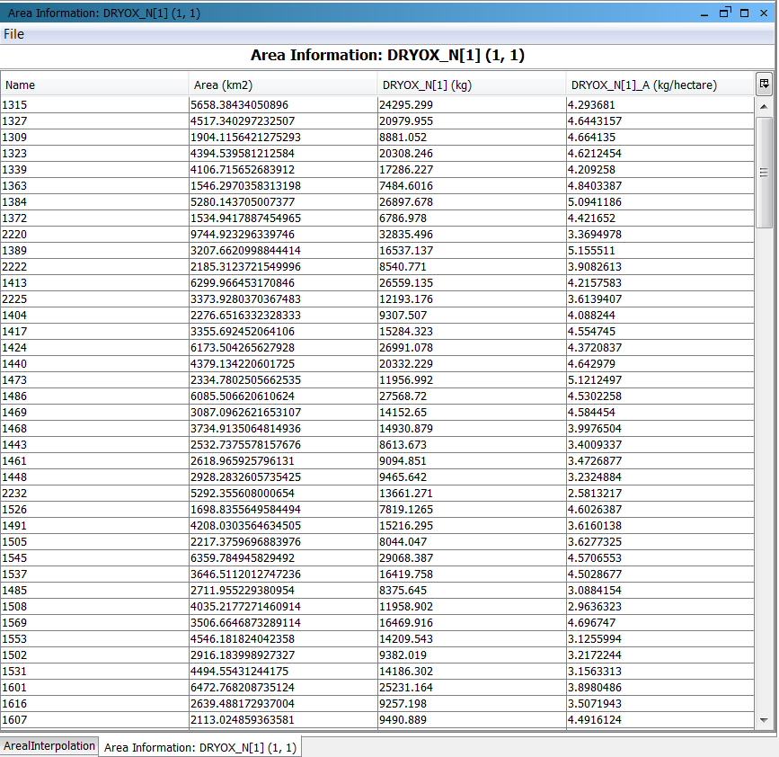 

<a id=Figure10-9></a>
Figure 10‑9. Export to a Text File     
 

<a id=Figure10-10></a>
Figure 10‑10. Name and Save the Text File
 

### Export Areal Interpolation Plot Data to Shapefiles

At the top of the **Area Information** tab ([Figure 10‑11](#Figure10-11)), the user may select **File&gt;Export Shapefiles** to export the data to a shapefile. In the Save popup window ([Figure 10‑12](#Figure10-12)), input the name in the File Name field, and select file type: Shapefile (\*.shp). The data provided in the Area Information report (i.e., name, total area, average value, total value) are exported to the shapefile. A GIS program such as User-friendly Desktop Internet GIS (uDig; <http://udig.refractions.net/>), an open-source Java program, or QGIS (<http://qgis.org/en/site/>) may be used to view the shapefiles generated by VERDI. The shapefiles are saved as five separate files that must be kept together as part of the ESRI format (\*.shp, *.dbf, *.prj, *.shx, and *.fix). There are no units assigned to the data that are saved in the shapefile, so it is important for the user to keep a copy of the comma-delimited text file, or to keep some alternative text file that specifies the units for each data field.

<a id=Figure10-11></a>
Figure 10‑11. Export Shapefile
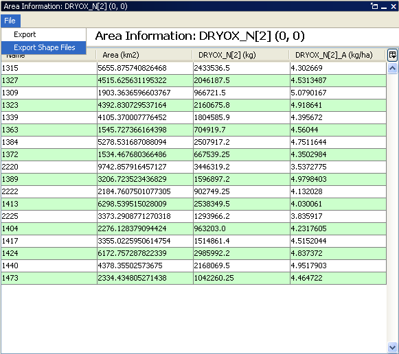 

<a id=Figure10-12></a>
Figure 10‑12. Name and Save Shapefile  |
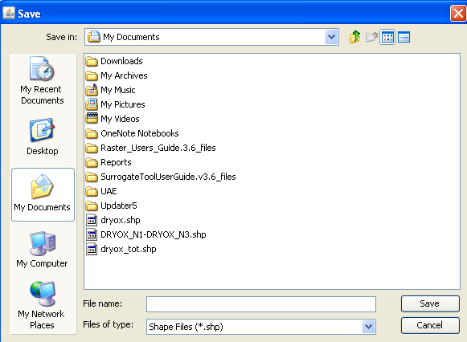 

 Vertical Cross Section Plot
----------------------------

The **vertical cross section plot** allows you to show a slice of data ([Figure 10‑13](#Figure10-13)). A popup dialog box ([Figure 10‑14](#Figure10-14)) prompts you for information needed to create the plot. Enter either the column to be used (for an *x*-axis cross section) or the row to be used (for a *y*-axis cross section) in the plot. The current time step on the plot can be changed using the **Time Step** spinner control above the plot, which also changes the date and time shown in the bottom of the plot. There is also a **Column** spinner control to change the column number (or row number). The cross-section column number (or row number) is included in the title of the plot and changes as you change the spinner control.

<a id=Figure10-13></a>
Figure 10‑13. Vertical Cross Section Plot
 

<a id=Figure10-14></a>
Figure 10‑14. Vertical Cross Section Dialog Box
 

Time Series Plot
----------------

The **time series plot** shows a line graph with the average values over time ([Figure 10‑15](#Figure10-15)). The plot is made for the formula’s selected domain, layer range, and time-step range. Each time step’s data are averaged linearly to produce that time step’s data point. The current layer can be changed using the **Layer** spinner control above the plot. The layer value listed in the title is updated when you change the layer.

<a id=Figure10-15></a>
Figure 10‑15. Time Series Plot
 

Time Series Bar Plot
--------------------

The **time series bar plot** shows average values over time in a bar plot format ([Figure 10‑16](#Figure10-16)) rather than a line format ([Figure 10‑15](#Figure10-15)). Other than that, the description of this plot type is the same as for the time series line plot (see Section 10.4).

<a id=Figure10-16></a>
Figure 10‑16. Time Series Bar Plot
 

Scatter Plot 
-------------

The **scatter plot** shows the relationship between two formulas using dots ([Figure 10‑17](#Figure10-17)). Specify the formulas using the dialog box that comes up before the plot is displayed ([Figure 10‑18](#Figure10-18)). The current time step and layer can be adjusted using the spinner controls above the plot. The data from a scatter plot may be exported by selecting the **File** menu option and then selecting Export data. If your dataset has more than one layer or time step, a popup window (see [Figure 10‑19](#Figure10-19)) allows you to specify whether you want to export the data for the current layer, or for all layers, and for the current time step, or for all time steps. Specify the time and layer ranges, and then click the **OK** button. A Save popup dialog box appears. Navigate to the directory in which you want to save this file and enter a file name with a .csv extension. The CSV file will be comma-delimited, and will contain the following columns of data: layer, time step, *x*-axis formula, *y*-axis formula. You can open this file in a spreadsheet program if your data does not contain too many rows (e.g., 65,536 or 1,048,576 depending upon version of Microsoft Excel).

<a id=Figure10-17></a>
Figure 10‑17. Scatter Plot
 
Figure ‑. Scatter Plot

<a id=Figure10-18></a>
Figure 10‑18. Scatter Plot Dialog Box
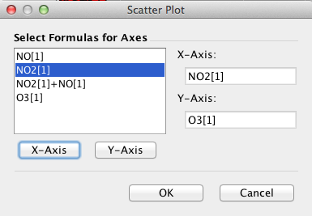 

<a id=Figure10-19></a>
Figure 10‑19. Scatter Plot Export Data into a CSV file
 

Contour Plot
------------

The **contour plot** shows a three-dimensional (3‑D) representation of values for a gridded dataset (e.g., one that can be used in the Tile Plot) ([Figure 10‑20](#Figure10-20)). Note that the 3-D contour plot is displayed in its own window (i.e., not in the VERDI window). The current time step and layer can be adjusted using controls above the plot. You can also animate the plot over time using an option in the **Plot** pull-down menu ([Figure 10‑21](#Figure10-21)). In addition, the contour plots can be rotated in three dimensions to achieve different viewing angles by using the left mouse button to grab and rotate the plot ([Figure 10‑22](#Figure10-22)).

<a id=Figure10-20></a>
Figure 10‑20. Contour Plot
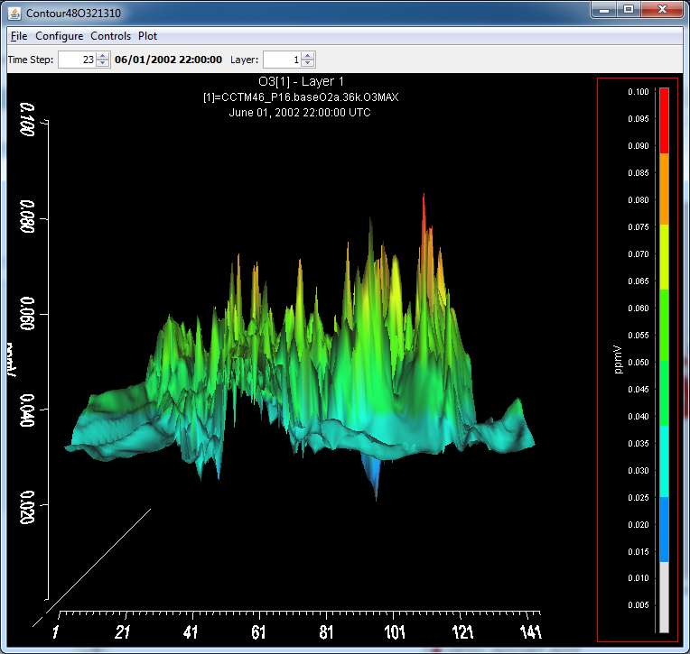 

<a id=Figure10-21></a>
Figure 10‑21. Contour Plot Menu Options
 

<a id=Figure10-22></a>
Figure 10‑22. Rotated Contour Plot
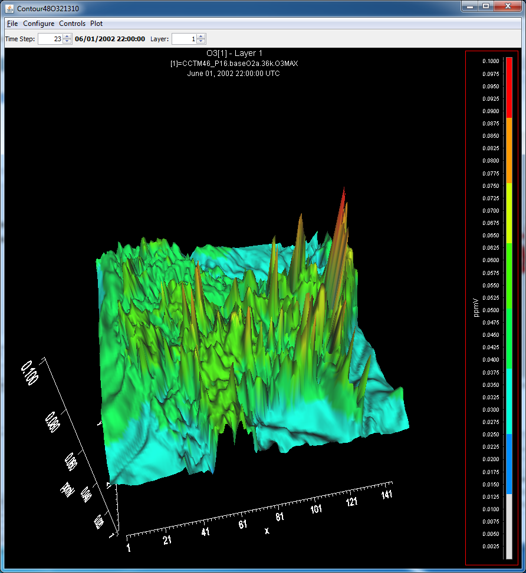 


 Plot Menu Bar
==============

Each VERDI plot contains a menu bar with options specific to that type of plot. The menu options at the top of the Tile Plot and Areal Interpolation Plot include those shown in [Table 11‑1](#Table11-1).

<a id=Table11-1></a>
Table 11‑1. Tile and Areal Interpolation Plot Pull-down Menu Options

| **File**         | **Configure**          | **Controls**         | **Plot**                       | **GIS Layers** |
|---------------------|--------------------|---------------------------|----------------------------|------------|
| Print   | Configure Plot                 | Zoom                      | Time Series of Probed Cell(s) | Add Map Layers |
| Export as Image/GIS  | Load Configuration | Probe          | Time Series Bar of Probed Cell(s)|Configure GIS Layers  | 
|                      | Save Configuration  |Set Row and Column Ranges|Time Series of Min. Cell(s)|Set Current Maps as Plot Default |
|                      |                   |  Show Grid Lines          |Time Series of Max. Cell(s) |  |
|                     |                    | Show Lat/Lon              | Animate Plot               |  | 
|                     |                    |                           | Add Overlay                |  |


The menu options at the top of the Vertical Cross Section, Time Series, Time Series Bar Plot and Scatter Plot include those shown in [Table 11‑2](#Table11-2). Most options are common to all plots, and function in the same way (unless the option is grayed out). Therefore, this chapter is organized by menu instead of by plot type.

<a id=Table11-2></a>
Table 11‑2. Vertical Cross Section, Time Series, Time Series Bar, Scatter Plot Pull-down Menu Options


| **File**        | **Configure**      | **Controls** | **Plot**                         |
|-----------------|--------------------|--------------|---------------------------------|
| Print           | Configure Plot     | Zoom         | Time Series of Probed Cell(s)   | 
| Export as Image  | Load Configuration | Probe       | Time Series Bar of Probed Cell(s)| 
|                 |  Save Configuration  | Show Lat/Lon| Time Series of Min. Cell(s)   |      
|                 | Load Chart Theme   |               | Time Series of Max. Cell(s)   |
|                 | Edit Chart Theme   |              | Animate Plot                      |
|                 | Save Chart Theme   |              |                                   |


File Menu 
----------

Options in the **File** menu include printing a plot and exporting a plot to an image file. Plots can be saved as BMP, EPS, JPEG, PNG, TIFF image files or as the Shapefile format. The ASC format is a text file containing the cell values.

 Configure Menu 
----------------

The **Configure** pull-down menu contains the following options: Configure Plot, Load Configuration, and Save Configuration. <span id="_Toc197166164" class="anchor"></span>When you want to see your changes on the plot, press the **Apply** button. When you have finalized the settings for your plot, click the **OK** button to close the Configure Plot dialog box.

### Configure Plot

[Figure 11‑1](#Figure11-1) through [Figure 11‑4](#Figure11-4) show the dialog boxes that appear when you select Configure Plot. The **Configure Plot** dialog box contains four tabs: **Titles, Color Map, Labels,** and **Other**.

-   **Titles** **tab:** [Figure 11‑1](#Figure11-1) shows the selections on this tab that you can use to edit title text and select the font type, size, and color for the title and two subtitles of the plot. Subtitles may be turned on or off by selecting or deselecting the check box for each subtitle. If a check box is not selected the associated text, font type and size, and color boxes are grayed out. However, you must provide a title or VERDI will provide its default title for you. To blank out the title you must select it and then enter spaces for the name of the title. If you deselect the title VERDI will provide its default title for you.

<!-- -->

-   **Text:** Enter the desired text directly in the textbox. You can enter text for the plot’s title and up to two optional subtitles.

-   **Font:** Press the **Select** button to the right of the Font line for the title or subtitle you wish to change. Your system’s standard Select Font dialog box is then displayed for you. Select a font family, font style, and size; press the **OK** button to return to the Configure Plot tab.

-   **Color:** Press the **Select** button to the right of the Color line for the title or subtitle to edit. There are five types of color palettes that you can use to select a color – Swatches, HSV, HSL, RGB, and CMYK – each on its own tab. When you select a color examples of its use are shown in the Preview portion of the Select Color window. Select the **OK** button to accept the color and return to the Titles tab of the Configure Plot dialog box.

<!-- -->

-   **Color Map** **tab:** This tab is available for only the Tile and Areal Interpolation Plots (see [Figure 11‑2](#Figure11-2)). This tab provides many widgets for you to configure your legend colors, break points, range, etc. You can select the number of tiles, the palette type to be used, the color interval, the number format, and the scale.

<!-- -->

-   **Number of Tiles:** Start by selecting the number of tiles at the top of the pane. Options in some other selections, such as the available palettes and break points, change as you vary the number of tiles.

-   **Palette Type:** Three palette types are available: Diverging, Qualitative, and Sequential. Diverging has dark colors at the maximum and minimum of the range and light colors in the middle. Qualitative has a mixture of colors. Sequential has a dark color on one end (typically the maximum) with lighter shades of the same color proceeding to the lightest shade at the minimum. The color palettes frequently associated with air quality modeling results are the Tile Plot default and the Newton RGB palettes of the Sequential type.

-   **Reverse:** The reverse button reverses the order of the colors in the selected palette. For example, if a sequential palette is used, the reverse button changes the color intensities such that the darkest color is at the minimum instead of the maximum of the scale.

-   **Interval:** The interval can be set to either Automatic or Custom. The typical setting is Automatic, meaning that VERDI calculates the interval break points based on the minimum and maximum values in the dataset. Change the interval to Custom if you need to edit the values for Interval Start for each color tile.

-   **Number Format:** To specify the number format used in the map legend, enter the format [leading non-digit][0][width].[decimals][E][0] Then click the Rebuild button. NOTE: If you use any character other than **E** or **e**, VERDI will display each value as a decimal followed by that character.

    **Explanation of the format:**

    [leading non-digit]: optional; earlier had leading % like C; not required; any non-digit character before the first digit is ignored

    [0]: optional; if present values may have leading 0’s to match the overall width

    [width]: sum of [decimals] + 1 for . + desired number of places before the .; is recomputed in code if too small

    .: separator between the values for [width] and for [decimals]

    [decimals]: number of decimal places requested

    [E]: optional; if present use scientific notation (e.g., 2.33E-2) otherwise display in regular decimal notation (e.g., 0.0233)

    [0]: trailing zero AFTER the E is optional; the code puts on a trailing zero if one isn’t there

-   **Scale:** Select either Linear or Logarithmic. The interval start values are automatically adjusted when you change the scale.

-   **Min** and **Max:** The minimum and the maximum values are computed for the data to be plotted. If you set the Interval to Automatic, you can change the values for the minimum and maximum. Then, press the Rebuild button and the Apply button to see your changes both in the legend and on the map. You cannot edit the minimum or the maximum value if the Interval is set to Custom. Instead, directly edit the Interval Start values; the Interval Start value for the lowest interval is the minimum value.

-   **Rebuild:** The Rebuild button is either active or inactive (i.e., grayed out) depending upon what other widgets are active. If you make changes and the Rebuild button is active, press it before continuing.

<!-- -->

-   **Labels** **tab:** [Figure 11‑3](#Figure11-3) shows widgets for you to edit more labels on your plot. There are four tabs through which you can edit the labels of the Domain Axis (x-axis), the Range Axis (y-axis), Legend, and Footer.

<!-- -->

-   **Domain Axis:** This tab has two parts: Label and Ticks. Use the Label panel the same way as the Titles tab (above) by editing the Text, Font, and Color. The Ticks panel allows you to change the labels associated with the ticks on the Domain Axis. The “Show Tick Labels” checkbox is typically checked, but you can uncheck it to not show any ticks or labels on this axis. Number allows you to decrease the number of tick labels. Note that you cannot increase the number of ticks via this screen and the values of the ticks do not change; you are effectively turning tick labels on/off via this checkbox. The Font and Color widgets work the same as for the Titles tab.

-   **Range Axis:** All the widgets on this tab are the same as on the Domain Axis tab. You are just making the changes for the Range Axis. [Figure 11‑5](#Figure11-5) shows an example plot where the number of Tick Labels has been reduced in both the Range Axis and the Legend, but the number of tick labels has not been reduced in the Domain Axis.

-   **Legend:** The Show Legend checkbox defaults to checked, which indicates that the legend should be shown. If you do not want a legend, uncheck that checkbox. All the widgets on this tab are the same as on the tabs for the axes. Use the Label part to designate and format the label that appears vertically in the left side of the legend box. The tick labels are for the boundaries between colors in the legend. If you uncheck the Show Tick Labels checkbox, the tick labels disappear from the legend.

-   **Footer:** This tab is divided into three parts: Line One, Line Two, and Observational Data Legend. Lines One and Two are for the first and second lines of footers, respectively. VERDI automatically creates these lines for you, but you can either edit or remove them here. You cannot enter text for the Observational Data Legend if you do not have observational data on your plot.

<!-- -->

-   **Other** **tab:** As shown in [Figure 11‑4](#Figure11-4), use the widgets on this tab to enable or disable showing the grid lines, to select the color of grid lines, and to select the series color.

<a id=Figure11-1></a>
Figure 11‑1. Configure Plot, Titles Tab
 

<a id=Figure11-2></a>
Figure 11‑2. Configure Plot, Color Map Tab
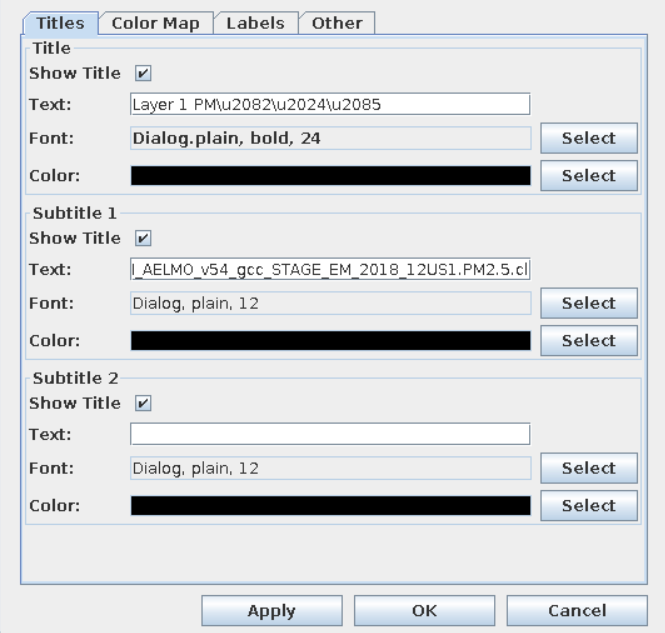 

<a id=Figure11-3></a>
Figure 11‑3. Configure Plot, Labels Tab
 

<a id=Figure11-4></a>
Figure 11‑4. Configure Plot, Other Tab
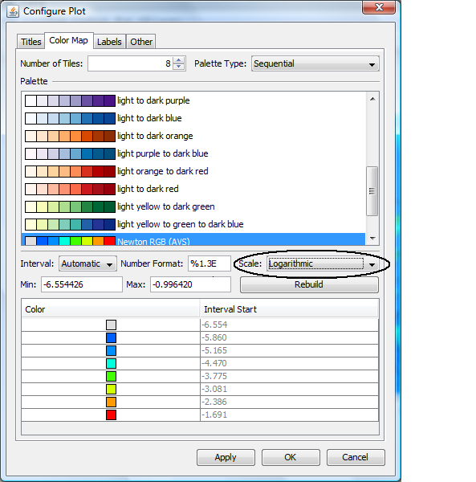 

<a id=Figure11-5></a>
Figure 11‑5. Example Plot with Selected Tick Marks for Range Axis and Legend
 

###  Save Configuration

If you have made changes to the configuration of a plot, and want to reuse that configuration for other plots, use the **Save Configuration** selection from the **Configure** menu. It is very important (1) to name the file in a manner that you will remember what it contains and (2) to save the file in a logical place so you will be able to find it when you need it.

The file name should indicate the formula name, the dataset, and the type of plot from which it was saved. Also, use the “.cfg” extension to indicate that it is a configuration file. An example file name is &lt;FormulaName&gt;_&lt;DatasetFilename&gt;_&lt;PlotType&gt;.cfg, or “O3_CCTM_base_tile.cfg”.

You may decide to keep your configuration files with projects to which they relate or in a common directory. When you save your configuration file, VERDI uses the value of verdi.config.home in your config.properties file as the default location. If you want to save the configuration somewhere else, browse to the location. Enter the file name and press the **Save** button.

When you choose to save your configuration, VERDI displays a popup box asking if you want to save the title/subtitles. Although the configuration files generated by VERDI look similar to HTML or XML files, they are just text files containing tags compatible with the parser in VERDI. You can look at the contents of these files in a plain text editor (e.g., Notepad), but be very careful if you decide to change their contents; you could make the file unusable.

### Load Configuration

To load a plot configuration file, first create a new plot that is of the same type and uses the same formula as that within the configuration file. Then select the **Load Configuration** option from the **Configure** menu on that plot. An **Open File Dialog** window enables you to navigate to the directory in which you saved the configuration file. Select the file you need and press the **Open** button. The plot title (if saved), color map, and other plot configuration features are then applied to the plot.

Note that it is possible to load a saved configuration file that does not apply to the selected plot. VERDI may try to load what it can, which may result in something other than what you expected. Therefore, before loading a saved plot configuration check carefully to be sure the plot type and formula of the configuration file match those of the new plot.

You can also load configuration files in batch or command line scripts by setting the parameter configFile (e.g., configFile=C:\\User\\username\\VERDI_1.6\\data\configs\o3_10bin.cfg).

###  Load Chart Theme

A Chart Theme sets the background colors and fonts for a Vertical Cross Section, Time Series, Time Series Bar, and Scatter plot. A loaded theme applies to each of these types of plots when you create them. This allows the user to customize and make the plots uniform for publishing purposes.

To load a chart theme, select the **Configure** menu on the plot and then the **Load Chart Theme** menu item. An **Open** Dialog window enables you to navigate to the verdi.config.home directory set in your config.properties file under the verdi directory in your home directory. As an example, select the **white.theme** theme file and press the **Open** button. The plot title, color map, and other plot configuration features are then applied to your current plot.

###  Edit Chart Theme

To edit a chart theme, select the **Configure** menu on the plot and then the **Edit Chart Theme** menu item. An **Edit Chart Theme** dialog frame opens. The top part of the Dialog is shown in [Figure 11‑6](#Figure11-6); use the slider to view the bottom portion of the Dialog as shown in [Figure 11‑7](#Figure11-7). Click **Select** next to the Text item you would like to change and a Select Font Dialog opens ([Figure 11‑8](#Figure11-8)). To change the color of an item, click Select next to it, and a Select Color Dialog frame opens ([Figure 11‑9](#Figure11-9)). Click Apply at any time to see your changes. When you are finished click OK to close the Edit Chart Theme window.

<a id=Figure11-6></a>
Figure 11‑6. Top Portion of Edit Chart Theme Window
 

<a id=Figure11-7></a>
Figure 11‑7. Bottom Portion of Edit Chart Theme (Bg=background, Grdln=grid line)
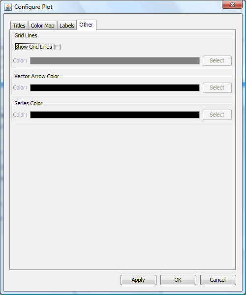 

<a id=Figure11-8></a>
Figure 11‑8. Select Font
 

<a id=Figure11-9></a>
Figure 11‑9. Select Color
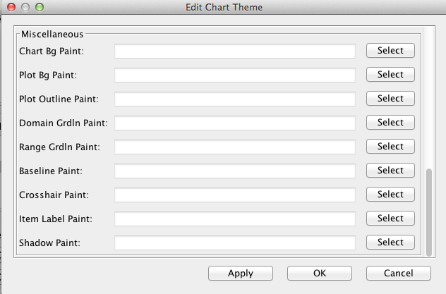 


###  Save Chart Theme

To edit a chart theme, select **Save Chart Theme** option from the Configure menu on the plot. A **Save** Dialog will open ([Figure 11‑10](#Figure11-10))

<a id=Figure11-10></a>
Figure 11‑10. Save Dialog
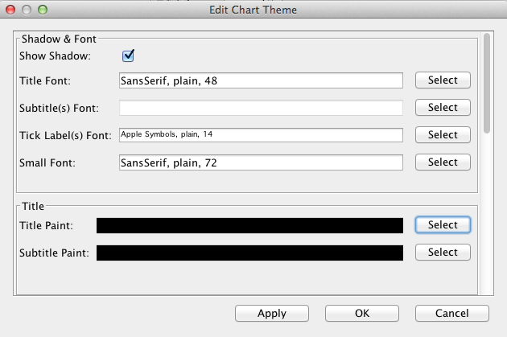 


Controls Menu 
--------------

The **Controls** pull-down menu contains the following options: Zoom, Probe, Set Row and Column Ranges, Show Grid Lines, and Show Lat/Lon.

### Zoom 

To zoom in and enlarge a subdomain of the plot, select the **Zoom** option. Then use your left mouse button to draw a rectangle around your region of interest on the plot. To zoom out click on the chart using your right mouse button to bring up the context menu ([Figure 11‑11](#Figure11-11)). Move your cursor over either Zoom Out or Max Zoom Out and press the left mouse button. The Zoom Out selection performs a step zoom and the Max Zoom Out selection zooms out to the full extent of the plot.

<a id=Figure11-11></a>
Figure 11‑11. Right-Click on Tile Plot to Zoom Out
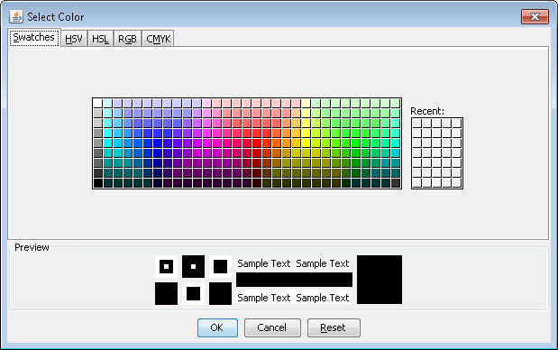 

The selections in the context menu are a little different for the time series plot. Zoom In and Zoom Out open another level of menus where you can select Both Axes, Domain Axis, or Range Axis. The Auto Range selection opens another submenu with the same 3 selections; use the Auto Range, Both Axes submenu to reset both axes to the full extent of both the domain and the range.

### Probe

To determine the data value at a specific point or within a subregion, select the **Probe** option.

#### Probe at a Single Point

To probe a single data point, use the mouse to hover the cursor over a single point on the plot (e.g., one value on a time series plot, one grid cell on a tile plot); the coordinates of the point are shown in the lower right-hand side of the plot in the format (column, row) or (longitude, latitude) if you have selected Show Lat/Lon. Once you click on the grid point of interest, the value of the datum at that grid point is displayed in the lower left-hand area of VERDI main window ([Figure 11‑12](#Figure11-12)) in the format (time step, layer, row, column):value.

<a id=Figure11-12></a>
Figure 11‑12. Click on Plot to Probe: Data Value Shown in Lower Left of VERDI, Latitude/Longitude Values Shown in Lower Right
 

#### Probing a Domain Region of Data

When you have Probe selected you can examine the values of a region of locations. Use your mouse to draw a rectangle on the plot by clicking on a location, dragging the mouse to the opposite corner of your desired rectangle, and then releasing the mouse button. VERDI will create a data window displaying the grid values and will place it in the plot area of the VERDI main window as a tabbed window ([Figure 11‑13](#Figure11-13)). The File&gt;Export menu option at the top of the spreadsheet allows you to save probed data as a comma-delimited text file (\*.csv).

<a id=Figure11-13></a>
Figure 11‑13. Data Window Showing Probed Values for Region of Interest
 

### Set Row and Column Ranges

The **Controls&gt;Set Row and Column Ranges** menu item displays a popup window that allows you to configure the minimum and maximum values used in the columns (\*x*-axis domain) and rows (\*y*-axis range) ([Figure 11‑14](#Figure11-14) and [Figure 11‑15](#Figure11-15)). Specify the values and then click **OK** to redraw the plot.

<a id=Figure11-14></a>
Figure 11‑14. Select Set Row and Column Ranges


<a id=Figure11-15></a>
Figure 11‑15. Enter Row and Column Values
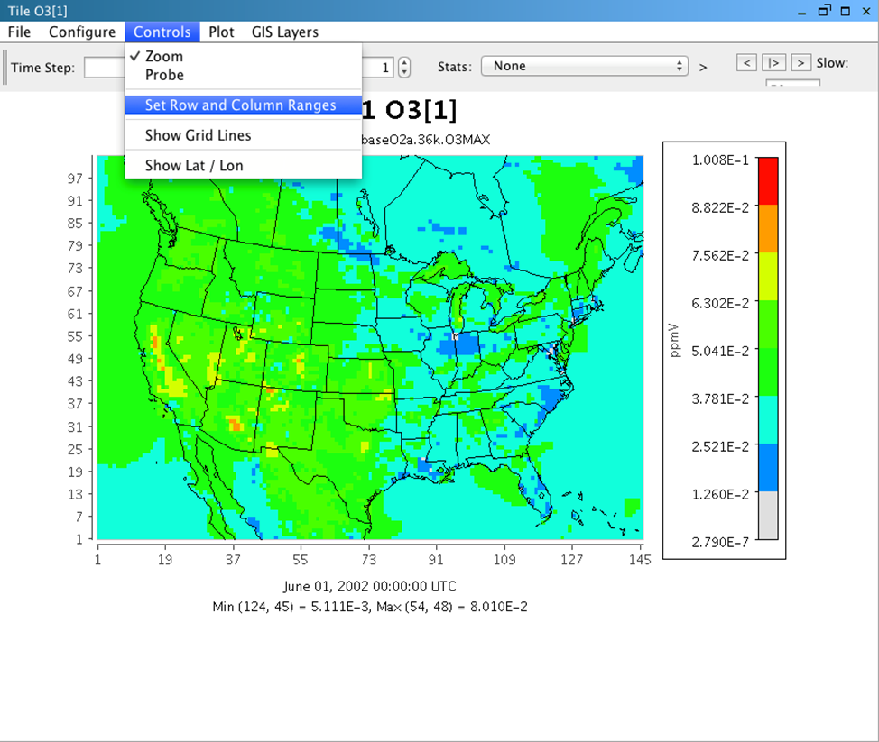


### Show Grid Lines

Use the Show Grid Lines selection on the Controls menu if you want to have grid lines overlaid on your plot. [Figure 11‑16](#Figure11-16) shows one reason for wanting grid lines. There is a set of grid cells with relatively high ozone values for the selected time step and layer. By zooming in on the plot and then showing the grid lines, the individual cells can be identified for further analysis.

<a id=Figure11-16></a>
Figure 11‑16. Show Grid Lines on a Tile Plot
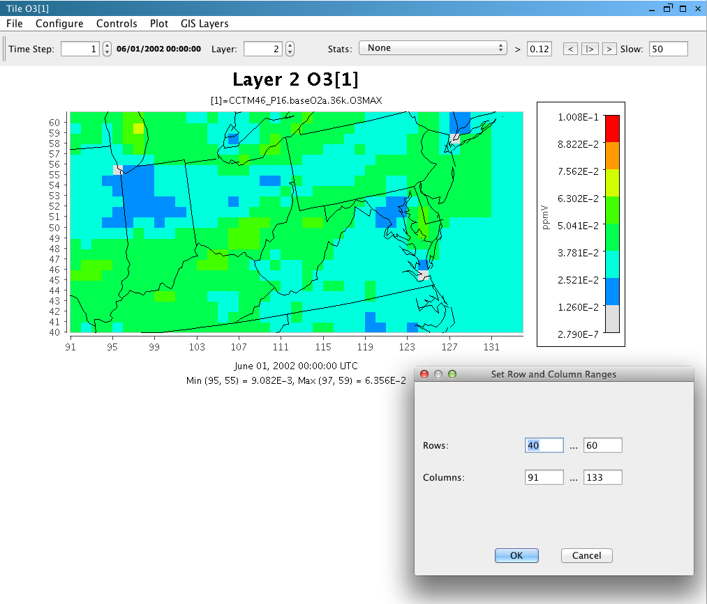 

### Show Latitude and Longitude

To view the latitude and longitude values for a point on the plot, select the Show Lat/Lon option on the **Controls** menu. Then, hover your cursor over a location to see its latitude and longitude. The lat/lon coordinates are displayed in the lower right-hand side of the window ([Figure 11‑17](#Figure11-17)). The option to display the lat/lon coordinates may be selected, and works with either the Zoom or the Probe option.

<a id=Figure11-17></a>
Figure 11‑17. Lat/Lon Values Shown in Lower Right of VERDI


 Plot Menu Options
------------------

The **Plot** pull-down menu ([Figure 11‑18](#Figure11-18)) contains the following options: Time Series of Probed Cell(s), Time Series Bar of Probed Cell(s), Time Series of Min. Cell(s), Time Series of Max. Cell(s), Animate Plot, and Add Overlay. NOTE: The Time Series of Probed Cells and the Time Series Bar of Probed Cells selections are grayed out until you select a grid cell or multiple grid cells using the Controls&gt;Probe menu selection.

<a id=Figure11-18></a>
Figure 11‑18. Plot Menu Options
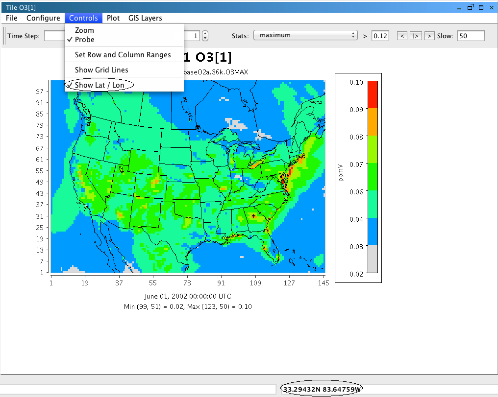 


### Time Series Plots

The Time Series of Probed Cell(s) and Time Series Bar of Probed Cell(s) allows the user to select a set of cells, and then produce a time series or time series bar plot of the chosen subset of probed cells. The Time Series of Min. [or Max.] Cell(s) option creates a time series plot using data for the currently selected formula at that formula’s domain, layer range, and time step range. The minimum [or maximum] value of that formula over the domain and layer range at that time step is calculated by VERDI and used for each of the time step’s data points. For examples of the Time Series Plot and the Time Series Bar Plot see [Figure 10‑15](#Figure10-15) and [Figure 10‑16](#Figure10-16), respectively.

### Animate Plots

You can create an animated plot by selecting the Animate Plot option. The Time Series and Time Series Bar Plots do not have an Animate Plot option. The plots that may be animated include: Tile, Areal Interpolation, Vertical Cross Section, and Contour Plot. An Animate Plot dialog box ([Figure 11‑19](#Figure11-19)) appears, allowing you to save animations either as an animated GIF with a file extension of .gif or as a QuickTime movie with a file extension of .mov. This **Plot** menu option is plot-specific and so does not allow you to animate more than one plot at a time. To animate multiple plots, you will need to use the **Plots** pull-down menu at the top of the VERDI main window; see Section 5.2.2, “Animate Tile Plots.”

<a id=Figure11-19></a>
Figure 11‑19. Animate Plot Dialog Box
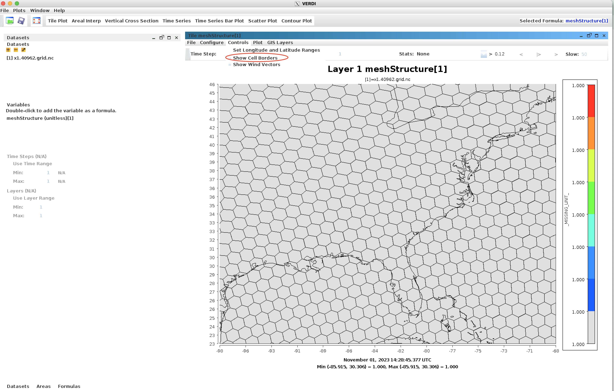 

### Add Overlays

VERDI supports two types of overlays – observations and vectors. For both types of overlays you may need to add data from another data file onto the underlying plot.

#### Observational Data Overlays

It is useful to visually compare the results contained in model output datasets with the data points in observational datasets. You can do this by creating a Tile Plot of the model output and then overlaying it with observational data points. The observational dataset needs to be in a csv- or tab-delimited format or an I/O API observational data format. See Chapter 13 for more information about how to convert AIRS observational data into this latter format.

Sample observational data are provided in the directory $VERDI_HOME/data/obs so you can create a sample Observational Data Overlay Plot. Follow these instructions to create your plot.

-   Load a model output dataset.

-   Load an observational dataset. Note that an *OBS* label appears to the right of the dataset name in the **Dataset** pane.

-   Double-click on a variable in an observational dataset and add it to the **Variable** pane. Note that an *OBS* label appears to the right of the dataset name in the **Variable** pane.

-   Create a formula in the **Formula** pane using a variable from the ***model output*** dataset. Use this formula to create a tile plot. (NOTE: If you attempt to use a formula that contains a variable from an observational dataset, the following error will occur: “Error while evaluating formula: Selected dataset is observational.”

-   Select Add Overlay&gt;Observations from the tile plot’s **Plot** menu to view observational data as an overlay on a tile plot.

-   An **Observation** dialog box ([Figure 11‑20](#Figure11-20)) appears containing the variables that are available in the observational dataset. <span id="_Toc197166234" class="anchor"></span>Select the observational variable to overlay on the Tile Plot from the Observation Details list. Multiple observational dataset variables can be overlaid on a Tile Plot.

-   You can control the appearance of the symbols representing the observational data. The stroke size controls the thickness of the line used to draw the symbols; the shape size controls their diameter. You can use up to six different open-area shapes—circle, diamond, square, star, sun, and triangle—to distinguish among multiple observational datasets. A circle is the default symbol shape.

-   Select **Add Variable** and then **OK** to overlay the observational data on the tile plot ([Figure 11‑21](Figure11-21)).

Repeat the above process to add multiple variables. To remove the symbols for a variable on an observational data overlay, or to reset their size, shape, or stroke thickness, reopen the **Observation** dialog by using Add Overlay&gt;Observations, select the observational variable you want to adjust, and then change its stroke size, shape size, or symbol. You can also remove a variable or move it up or down in the list. When you are finished click the **OK** button.

The center of the observational data point corresponds to the lat/lon value that is provided in the I/O API observational data file. If observations are collocated, they are placed on top of one another. If that happens you may want to select different symbols or sizes for each dataset and place them from largest on the bottom to smallest on the top.<span id="_Ref401855228" class="anchor"></span>

<a id=Figure11-20></a>
Figure 11‑20. Tile Plot Observation Dialog
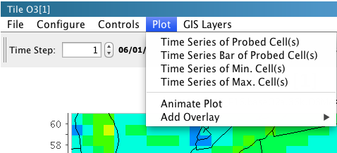 

<a id=Figure11-21></a>
Figure 11‑21. Tile Plot with Observational Data Overlay
 


#### Vector Overlays

Follow these instructions to add a vector overlay to a Tile plot. Typically, these are created to show wind speed and direction on a plot of gridded air quality data. The length of the calculated vectors is proportional to their magnitude.

-   Create your Tile Plot.

-   If the data for your vectors are not in the same dataset, load the correct one and select the formulas that you will need for the vectors.

-   Select the Add Overlay&gt;Vectors option from the tile plot’s **Plot** pull-down menu ([Figure 11‑22](#Figure11-22)).

-   Select the two components of your vector in the Vector Overlay dialog box ([Figure 11‑22](#Figure11-22)). Typically, these are the East-West (u) and North-South (v) components of the wind. Assign the u component to Horizontal and the v component to Vertical.

-   Specify the Vector Sampling Increment value to specify how many vectors are displayed, for example for every vector (increment=1), every third vector (increment=3), every fifth vector (increment=5)

-   Click the **OK button** and the vector overlays are displayed on the plot.

NOTE: At this time you cannot control how the vectors are displayed, and there is no option to remove the vectors from the plot. If you need to make a change, you must start again with your Tile Plot.

Currently, vectors are plotted in the center of the grid cell. UWIND and VWIND are typically obtained from METCRO3D, which are defined at dot points or cell corners. Plotting the wind vector at their calculated locations will be added to the Tile Plot in a future release.

<a id=Figure11-22></a>
Figure 11‑22. Vector Overlay Dialog Box
 

An example of an ozone concentration Tile Plot with a wind vector overlay is shown in Figure 11‑25. The length of each vector is proportional to its length. The direction of the vector is calculated from the direction and magnitudes of its two components. This figure illustrates how the wind changes speed and direction in this portion of the modeling domain for layer 1, time step 1.

<a id=Figure11-23></a>
Figure 11‑23. Wind Vector Overlay on an Ozone Tile Plot
 


GIS Layers
----------

The **GIS Layer**s menu contains the following options: Add Map Layers, Configure GIS Layers, and Set Current Maps as Plot Default. All map layers provided with VERDI are shapefiles.

### Add Map Layers

Use the **Add Maps Layers** option in the **GIS Layers** menu to add maps to a Tile Plot or Areal Interpolation Plot ([Figure 11‑24](#Figure11-24)). Note that all GIS layers must be shapefiles.

A selection of default maps—including World, North America. USA States, USA Counties, HUCs, Rivers, and Roads—can be selected or deselected by clicking on the respective menu selection. A check mark then appears or disappears next to the chosen map name, and the selected map appears on the plot.

<a id=Figure11-24></a>
Figure 11‑24. Add Map Layers
 

As of VERDI 1.6.0 alpha release, the Tile Plot and Areal Interpolation Plot use the Shapefile format for all maps and GIS layers, the bin format is no longer used.

### Configure GIS Layers

To show an additional map on the plot, select the **Configure GIS Layers** option in the **GIS Layers** menu. When you click on this item, a dialog box titled Manage Layers gives you the following options: Move Up, Move Down, and Remove Layer ([Figure 11‑25](#Figure11-25)). The Edit Layer option has been greyed out.

<a id=Figure11-25></a>
Figure 11‑25. Manage Layers Dialog Box
 

-   To rearrange the order in which the GIS layers are displayed on the plot, select a layer in the Manage Layers dialog box, and then select Move Up or Move Down. Click the **OK** button to reposition the order of that layer within the list. If the layers that you are selecting are boundaries and were created to have a transparent fill, then rearranging the order of the layers will not change the look of the boundaries on the plot.

-   To remove a GIS layer from the plot, select that layer in the list and select Remove Layer. Then click the **OK** button to remove it.

 Supported Grid and Coordinate Systems
(Map Projections)
======================================

VERDI makes calls to the netCDF Java library to obtain the grid and coordinate system information about the data directly from the model data input files when the input data files are self-describing (CMAQ, SMOKE, WRF netCDF format files).

I/O API-formatted Data
----------------------

For the I/O API, support for Lambert conformal conic (LCC) map projection, Universal Transverse Mercator (UTM) map projection, and polar stereographic map projection was added in VERDI 1.1., and Mercator projection in VERDI 1.2. The grid projections listed on the following website are supported, although not all have been tested: <https://www.cmascenter.org/ioapi/documentation/3.1/html/GRIDS.html>

Users that need VERDI to support other projections are encouraged to provide small input datasets as attachments to emails to the m3user listserv, or to github.com/CEMPD/VERDI/issues, for testing and to facilitate future development efforts. [Figure 12‑1](#Figure12-1) through [Figure 12‑4](#Figure12-4) illustrate sample plots generated for datasets with LCC, polar stereographic, Mercator, and UTM map projections, respectively.

<a id=Figure12-1></a>
Figure 12‑1. Lambert Conformal Conic Map Projection Example Plot
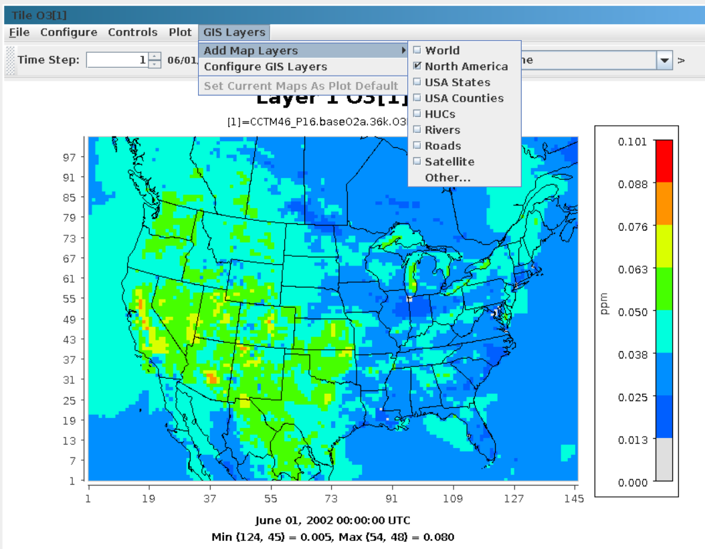 

<a id=Figure12-2></a>
Figure 12‑2. Polar Stereographic Map Projection Example Plot
 

<a id=Figure12-3></a>
Figure 12‑3. Mercator Map Projection Example Plot
 

<a id=Figure12-4></a>
Figure 12‑4. UTM Map Projection Example Plot
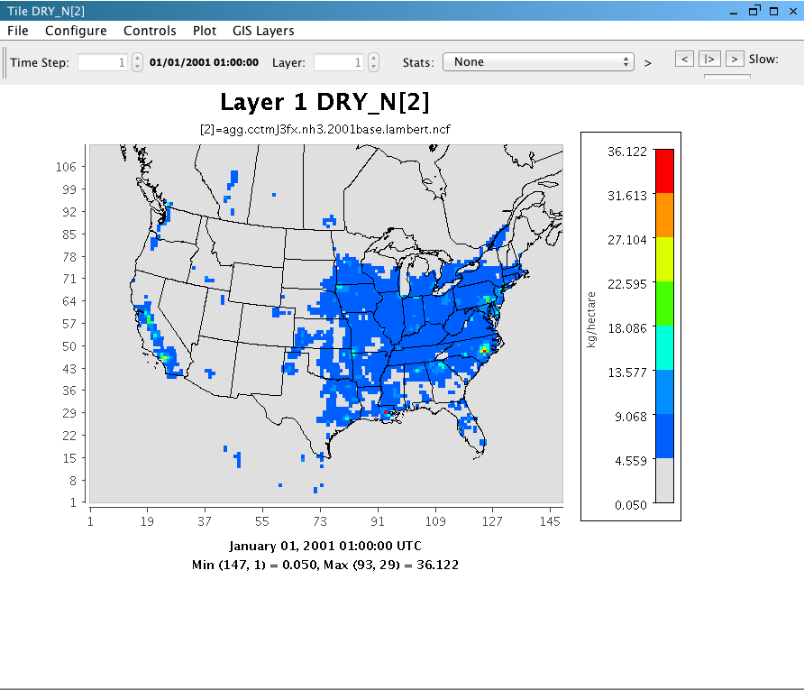 


CAMx Gridded Data
-----------------

The netCDF-java library used in VERDI includes support for CAMx UAM‑IV binary files using a preset default projection. CAMx or UAM binary files contain information about the x and y offsets from the center of the projection in meters, but do not contain information about the projection. The projection information is available in separate diagnostic files, which are part of the CAMx output along with the UAM binaries ([Figure 12‑5](#Figure12-5)).

<a id=Figure12-5></a>
Figure 12‑5. Example CAMx diagnostic text file
 


The netCDF-java library writes the default projection information to a text file in the directory where the CAMx binary (UAM-IV) file is located. You can then review and edit the projection information to make it consistent with the projection specified in the CAMx diagnostic text files. The definitions of the projection parameters used in the camxproj.txt file are defined using Models-3 I/O API format https://www.cmascenter.org/ioapi/documentation/3.1/html/GRIDS.html. You must edit the camxproj.txt file to match the grid description information provided in the corresponding camx.diag file. [Figure 12‑6](#Figure12-6) shows the definition for the grid projection parameters for a Lambert conformal conic projection.

<a id=Figure12-6></a>
Figure 12‑6. Models-3 I/O API Map Projection Parameters for Lambert Conformal Conic Projection
 

[Figure 12‑7](#Figure12-7) shows the values of the camxproj.txt after editing it to match the values of the camx.diag file (**Error! Reference source not found.**) using the definitions of the Models-3 grid parameters (**Error! Reference source not found.**). [Figure 12‑8](#Figure12-8) shows the resulting Tile Plot of the CAMx sample dataset.

<a id=Figure12-7></a>
Figure 12‑7. Edited Example Projection File: camxproj.txt
 

<a id=Figure12-8></a>
Figure 12‑8. CAMx Example Plot
 


I/O API Utilities, Data Conversion Programs,
and Libraries
============================================

As discussed in Section 6.1, routines are available to convert gridded input data to I/O API format or new code can be written and contributed to VERDI for use by the community. The I/O API routines that have been written to convert data into this format are discussed in this section. If you are unable to use the available routines to convert your data and have a gridded dataset that VERDI is unable to read, please contact VERDI support via *m3user@listserv.unc.edu* with a description of the dataset.

The I/O API Interface contains an extensive set of utility routines. There are example conversion programs to convert data from different data formats into the I/O API format. The I/O API Utilities are command line programs that are easy to script for automating analysis and post processing. An example of an I/O API Utility that may be useful to VERDI users is m3merge. This utility merges selected variables from a set of input files for a specified time period, and writes them to a single output file, with optional variable-renaming in the process. Another utility that you may find useful is m3xtract. This program allows you to extract a few species from a large file and save them to a smaller file on your local computer so you can explore them using VERDI. The I/O API Related Programs and Examples can be found at the following web site: https://www.cmascenter.org/ioapi/documentation/3.1/html/AA.html#tools.

Airs2m3 is an example of a data conversion program that converts the standard AIRS AMP350 observational data format to the I/O API format. The airs2m3 program requires the following inputs:

-   The input AIRS AMP350 print format file name.

-   The time zone conversion file (provided with the obs2api program - tzt.dat).

-   Additional hour shift variable. The AIRS data are hourly averaged, and a 00 time flag represents the hour 00-01. You may wish to represent that data segment by the ending hour. In that case, a 1 should be entered here.

-   Starting year, month, day, hour (GMT) (e.g., 1997 07 10 12).

-   Ending year, month, day, hour (GMT) (e.g., 1997 07 16 12).

-   Name of output variable (8 characters max) (e.g., O3_OBS).

Contributing to VERDI Development
=================================

If you have made an improvement to VERDI’s source code or documentation, please consider contributing it back to the community. You can start by requesting update notifications from VERDI’s GitHub site: <https://github.com/CEMPD/VERDI/>.

Instructions on how to set up the Eclipse Development Environment and for running and building VERDI within Eclipse are available in the VERDI Developer Documentation on the official VERDI web site: <https://www.cmascenter.org/verdi/>. If you anticipate doing software development on VERDI, you should contact the members of the VERDI project via <m3user@listserv.unc.edu>.

VERDI developers will test contributions to the source code and review the applicable documentation changes for inclusion in future VERDI releases. Note that anything you contribute either must have the same license as the rest of VERDI (i.e., GPL) or must be placed in the public domain.

The m3user listserv can be used to query known errors, bugs, suggested enhancements, or submitted code contributions using the following website: <http://lists.unc.edu/read/search/?forum=m3user>. First, check to see if your issue is already listed as a bug or request for enhancement. If you do not see a matching entry, please submit an email to the listserv <m3user@listserv.unc.edu>. If you are not yet a member, use the following web site to join:

<http://www.cmascenter.org/help/listserves.cfm#m3user>

Known Bugs
==========

As discussed in Section 1.4, you are encouraged to review the VERDI FAQ <http://www.cmascenter.org/help/faq.cfm>, review the latest release notes, query the m3user listserv <http://lists.unc.edu/read/?forum=m3user> to search questions and answers, bug reports, and suggestions. Once a bug is identified through the m3user listserve, it will be added as an issue on the Github for the developers to prioritize and fix. https://github.com/CEMPD/VERDI/issues.

Mathematical Functions 
=======================

All VERDI visualizations are the result of a formula evaluation. Formulas operate on the variables provided by the datasets. The simplest valid formula consists of a single variable; for example, “O3[1]” is the parameter O3 from current dataset 1. Using infix notation, you can construct more complicated formulas using the mathematical operators and functions listed below. (Note that the documentation below derives from the equivalent documentation for the Package for Analysis and Visualization of Environmental data [PAVE], which is available at <http://www.ie.unc.edu/cempd/EDSS/pave_doc/EntirePaveManual.html>.)

Note that the Batch Script method does not support all of the mathematical functions that are supported within the VERDI GUI and/or the command line script options.

Listed in order of precedence, the functions and operators are:

1.  abs, sqr, sqrt, exp, log, ln, sin, cos, tan, sind, cosd, tand, mean, sum, min, max

<!-- -->

1.  **\*\*** (power)

2.  **/, \***

3.  **+, -**

4.  **&lt;, &lt;=, &gt;, &gt;=**

5.  ==, !=

6.  &&

7.  **||**

VERDI also supports the following constants:

1.  E 2.7182818284590452354

<!-- -->

1.  PI 3.14159265358979323846

2.  NROWS Number of rows in the formula’s currently selected domain

3.  NCOLS Number of columns in the formula’s currently selected domain

4.  NLEVELS Number of levels in the formula’s currently selected domain

Unary Functions
---------------

Unary functions are passed a single argument. Depending on the argument and the function type, the function returns a single value or a matrix of data by performing the function on each cell of the arguments array. For example:

-   **sqrt(4):** Returns 2.0.

-   **sqrt(O3[1]):** Returns a matrix containing the square root of each value in the O3[1] variable’s array.

The following functions return a matrix when passed a dataset variable:

-   **abs:** Returns the absolute value of the argument

-   **sqrt:** Returns the square root of the argument.

-   **sqr:** Returns the square of the argument.

-   **log:** Returns the base 10 logarithm of the argument.

-   **exp:** Returns Euler’s number raised the power of the argument.

-   **ln:** Returns the natural logarithm of the argument.

-   **sin:** Returns the sine of the argument. The argument is in **radians**.

-   **cos:** Returns the cosine of the argument. The argument is in **radians**.

-   **tan:** Returns the tangent of the argument. The argument is in **radians**.

-   **sind:** Returns the sine of the argument. The argument is in **degrees**.

-   **cosd:** Returns the cosine of the argument. The argument is in **degrees**.

-   **tand:** Returns the tangent of the argument. The argument is in **degrees**.

The following functions return a single number in all cases when passed a dataset variable:

-   **mean:** Average cell value for all cells in currently selected domain.

-   **sum:** Sum of all cell values in currently selected domain.

-   **min:** For each cell (*i,j,k*) in the currently selected domain, this calculates the minimum value for that cell over the currently selected time steps. In other words, the minimum value in cells (*i,j,k,*tmin..tmax).

-   **max**: For each cell (*i,j,k*) in the currently selected domain, this calculates the maximum value for that cell over the currently selected time steps. In other words, the maximum value in cells (*i,j,k,*tmin..tmax).

Binary Operators
----------------

Binary operators are not passed a value but operate on the operands to their left and right. Typically, they return a matrix of data by performing the operation on each cell of the operand’s arrays. If both of the operands are single numbers then these binary operators return a single number. For example:

-   **O3[1] * 2:** multiplies each item in the O3[1] array by 2 and returns the result.

-   **O3[1] * O3[3]:** multiplies each item in the O3[1] array by the corresponding item in the O3[3] array and returns the result. (Note that this assumes that the arrays are of equivalent shape.)

-   **3 * 2:** multiplies 3 by 2.

The binary operators:

-   **+** Returns the sum of the operands

-   **-** Returns the difference of the operands

-   **\*** Returns the product of the operands

-   **/** Returns the ratio of the operands

-   **\*\*** Returns the left operand raised to the power of the right operand

Boolean Operators
-----------------

Boolean binary operators return either 1 or 0 in each cell of the resulting matrix. If the operands are single numbers, then a single 1 or 0 is returned. The Boolean binary operators:

-   **&lt;** Returns 1 if the left operand is less than the right operand, else 0

-   **&lt;=** Returns 1 if the left operand is less than or equal to the right operand, else 0

-   **&gt;** Returns 1 if the left operand is greater than the right operand, else 0

-   **&gt;=** Returns 1 if the left operand is greater than or equal to the right operand, else 0

-   **!=** Returns 1 if the left operand is not equal to the right operand, else 0

-   **==** Returns 1 if the left operand is equal to the right operand, else 0

-   **&&** Returns 1 if both operands are nonzero, else 0

-   **||** Returns 1 if either operand is nonzero, else 0

Time Step Index
---------------

A time step index can be specified after a variable name. For example, “O3[1]:0” is the value of the O3[1] variable at the first time step.

 VERDI Batch Script Editor
==========================

To open the Script Editor, use File&gt;View Script Editor ([Figure 17‑1](#Figure17-1)). Prior running a batch script, remove all datasets from the dataset list. To remove a dataset, click on each dataset in the dataset panel and press the yellow minus button.

<a id=Figure17-1></a>
Figure 17‑1. File: View Script Editor
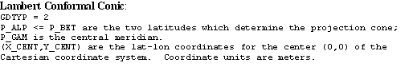 

An **Open** popup window will be displayed, click on a sample script file in the VERDI_1.5/data/scripts directory ([Figure 17‑2](#Figure17-2)).

<a id=Figure17-2></a>
Figure 17‑2. Open Popup Window
 

After you select a script file and click Open in the Open popup window, the Script Editor window ([Figure 17‑3](#Figure17-3)), the Batch Script File format consists of two blocks – a Global block and a Task Block. The Global block allows you to specify a set of parameters (such as the file and directory names) on which all other tasks are performed. In this block you can specify any parameters that are used to run any other tasks. If the same parameters are specified with different values in a subsequent Task block, those values will overwrite the values specified in the Global block. One Global Block specifies the common parameters shared by all Task blocks, and multiple task blocks can be defined to specify the type of batch operations that will be performed (e.g., defining formulas and creating plots).

Unload all datasets before running a batch script within the Script Editor. If any dataset is not unloaded a warning message will pop up ([Figure 17‑5](#Figure17-5)) requesting that you close all datasets before running your batch script.

<a id=Figure17-5></a>
 

Figure 17‑5) appears in the right-hand side of VERDI. Use the Script Editor to edit, save, and run batch scripts within VERDI. The Batch Scripting Language used for the VERDI Script Editor is described in the header of the sample text format script files. 

 
Figure ‑. Top of Sample Script File – VERDI\_1.5/data/scripts/file\_patterns.txt

 
Figure ‑. Bottom of Sample Script File – VERDI\_1.5/data/scripts/tile\_patterns.txt

<span id="_Ref323235774" class="anchor"></span>As shown in **Error! Reference source not found.** and **Error! Reference source not found.**, the Batch Script File format consists of two blocks – a Global block and a Task Block. The Global block allows you to specify a set of parameters (such as the file and directory names) on which all other tasks are performed. In this block you can specify any parameters that are used to run any other tasks. If the same parameters are specified with different values in a subsequent Task block, those values will overwrite the values specified in the Global block. One Global Block specifies the common parameters shared by all Task blocks, and multiple task blocks can be defined to specify the type of batch operations that will be performed (e.g., defining formulas and creating plots).

Unload all datasets before running a batch script within the Script Editor. If any dataset is not unloaded a warning message will pop up (Figure 17‑5) requesting that you close all datasets before running your batch script.

 

<span id="_Ref323235805" class="anchor"><span id="_Toc327606531" class="anchor"></span></span>Figure ‑. Close Datasets Warning Message

The multifiles.txt sample script that is provided as part of the VERDI release demonstrates how to create a tile plot using a mathematical combination of variables. An excerpt of that script is shown below.

&lt;Task&gt;
dir=D:\\\\verdi-dist2\\\\data\\\\model
f=copy.36k.O3MAX
f=CCTM46\_P16.baseO2a.36k.O3MAX
f=another.36k.O3MAX
s=O3\[1\]-O3\[2\]+O3\[3\]\*2
gtype=tile
saveImage=jpeg
imageDir=D:\\\\verdi-dist2
imageFile=three\_components\_36k.O3MAX
&lt;/Task&gt;

The above task specifies the name of three input files. The input files are assigned a number based on the order in which they are specified.

\[1\]=Copy.36k.O3MAX

\[2\]=CCTM46\_P16.baseO2a.36k.O3MAX

\[3\]=another.36k.O3MAX

s=O3\[1\]-O3\[2\]+O3\[3\]\*2 defines a formula that uses variables from the three filenames

This formula takes ozone in file 1 and subtracts the ozone in file 2 and adds two times the ozone in file 3.

The type of plot is specified as a tile plot by setting the parameter *gtype* to tile (i.e., gtype=tile).

The image file format is specified by setting the parameter *saveImage* to jpeg (i.e., saveImage=jpeg).

The output directory where the images will be stored is specified by setting the parameter *imageDir* (i.e., imageDir=D:\\\\verdi-dis2).

The image file name is specified by setting the parameter *imageFile*; imageFile=three\_components\_36k.O3MAX.

Use the left mouse button to highlight the task that you would like to run and then click **Run** in the Script Editor window. A popup window then appears to indicate the task ran successfully (Figure 17‑6). In this example the title and subtitle were obtained from the definition in the global block. Aspects of the plot defined in the global block are used for multiple tasks and are applied even if only a highlighted task is run.

 

<span id="_Ref323235839" class="anchor"><span id="_Toc327606532" class="anchor"></span></span>Figure ‑. Highlight Text to Select Task and Click Run

If you select Run without highlighting a Text Block, then the entire batch script executes and generates the plots. To edit the batch script, highlight a segment that you would like to copy and use Ctrl-C to copy the text; then click in an area where you want to paste the text and use Ctrl-V to insert the copied text. Test your changes to the script by highlighting the text block and click run. When your script executes successfully VERDI displays the popup window shown in If the user has specified an incorrect path, or incorrect filename for the input dataset, then a series of error messages will appear, starting with the message shown in **Error! Reference source not found.**.

 

Figure 17‑8. Unsuccessful Batch Run

NOTE: Click either the Save or the Save As… button to save your edits before exiting the Script Editor.

After saving the script file (e.g. C:\\verdi-script\\myscript.txt), you can run the batch script directly from command lines without invoking the VERDI GUI. On a Windows computer, start a command window, navigate to the directory containing your run.bat file, and then run this command:

run.bat –batch C:\\verdi-script\\myscript.txt

On Linux/Mac platforms, change directory to where the Verdi.sh is located and execute this command (assuming your script file myscript.txt is saved in /home/user/verdi-script directory):

./verdi.sh –batch /home/user/verdi-script/myscript.txt

(Note: the full path to the batch script must be specified. Neglecting to provide the full path along with the batch script name generates the following error: No such file or directory.) The batch script usage (see **Error! Reference source not found.**) will also be displayed from the command line after typing the following command:

(Windows)

run.bat –batch

(Linux/Mac)

./verdi.sh –batch

 

<span id="_Toc327606533" class="anchor"></span>Figure ‑. Successful Batch Script Message

<span id="_Ref323235856" class="anchor"></span>If the user has specified an incorrect path, or incorrect filename for the input dataset, then a series of error messages will appear, starting with the message shown in **Error! Reference source not found.**.

 

<span id="_Toc327606534" class="anchor"></span>Figure ‑. Unsuccessful Batch Script Message: File not found

The VERDI Batch Editor checks to see if the path specified by the user as the imageDir exists. If the path does not exist, VERDI displays the error message:

“java.io.FileNotFoundException: with the path and filename listed”

followed by the message “(No such file or directory).” Verify that you supplied the correct path and filename. The directory specified as the image directory must exist prior to running the batch command. Double-click on the file in the imageDir directory to load and view the image file in your default visualization software. **Error! Reference source not found.** illustrates the tile plot image that was generated by running the highlighted text block.

 

<span id="_Toc327606535" class="anchor"></span>Figure ‑. Plot Image Generated by Task Block

Specify hour/time step formula in batch script mode
---------------------------------------------------

Specify the timestep using the format:

VARIABLE\[dataset number\]:timestep.

The batch script notation used to specify an hour/time step involves specifying the formula then the hour: O3\[1\]:17 will result in Ozone for hour 17 from a given file in scripting mode (see Figure 17-10).

The batch script can be used to generate plots of a specific hour or time step using the formula

**s=Variable\[dataset\#\]:hour**

for example:

**s=O3\[1\]:17 to plot the Temperature in first dataset for hour 17**

Batch Script Example:

**&lt;Global&gt;**

**dir=$LOCAL\_DIR/verdi\_1.5/data/model/**

**imageDir=$LOCAL\_DIR/verdi\_1.5/data/images**

**saveImage=jpeg**

**&lt;/Global&gt;**

**&lt;Task&gt;**

**gtype=tile**

**f= CCTM46\_P16.baseO2a.36k.O3MAX**

**imageFile= CCTM46\_P16.baseO2a.36k.O3MAX.tstep.17**

**s=O3\[1\]:17**

**&lt;/Task&gt;**

 

<span id="_Toc327606536" class="anchor"></span>Figure ‑. Tile Plot of Ozone at Time step 17, Layer 1

Mathematical function capability in batch script mode
-----------------------------------------------------

This update provides the user the ability to perform mathematical functions in VERDI using the scripting mode. For example, Find maximum over all time steps at each grid cells.

The batch script can be used to generate plots for each mathematical function by using the task block to define each function. The notation used within the task block is:

**s=Formula(Variable\[dataset\#\])**

For example:

**s=max(O3\[1\]) to plot the Maximum value over all timesteps for each grid cell in the domain.**

**s=min(O3\[1\]) to plot the Minimum value over all timesteps for each grid cell**

**s=mean(O3\[1\]) to plot the Mean value over all timesteps for each grid cell**

**s=sum(O3\[1\]) to plot the Sum of the variable over all timesteps for each grid cell**

The mathematical functions operate over all time steps at each grid cell. Examples for the batch script notation and the images produced are provided in the following sections.

### Batch Script Example: Maximum Ozone – layer 1 (Figure 17-11)

**&lt;Global&gt;**

**dir=$LOCAL\_DIR/verdi\_1.5/data/model/**

**gtype=tile**

**imageDir=$LOCAL\_DIR/verdi\_1.5/data/images**

**saveImage=jpeg**

**&lt;/Global&gt;**

**&lt;Task&gt;**

**f= CCTM46\_P16.baseO2a.36k.O3MAX**

**imageFile=CCTM46\_P16.baseO2a.36k.O3MAX.tstepmax.layer1**

**s=max(O3\[1\])**

**&lt;/Task&gt;**

 

<span id="_Toc327606537" class="anchor"></span>Figure ‑. Tile Plot of Maximum Air Temperature (aggregated over 25 time steps)

### Batch Script Example : Minimum Ozone – layer 1 (Figure 17-12)

**&lt;Global&gt;**

**dir=$LOCAL\_DIR/verdi\_1.5/data/model/**

**gtype=tile**

**imageDir=$LOCAL\_DIR/verdi\_1.5/data/images**

**saveImage=jpeg**

**&lt;/Global&gt;**

**&lt;Task&gt;**

**f= CCTM46\_P16.baseO2a.36k.O3MAX**

**imageFile=CCTM46\_P16.baseO2a.36k.O3MAX.tstepmin.layer1**

**s=min(O3\[1\])**

**&lt;/Task&gt;**

 

<span id="_Toc327606538" class="anchor"></span>Figure ‑. Tile Plot of Minimum Ozone (aggregated over 25 time steps)

### Batch Script Example : Mean of Ozone – layer 1 (Figure 17-13)

**&lt;Global&gt;**

**dir=$LOCAL\_DIR/verdi\_1.5/data/model/**

**gtype=tile**

**imageDir=$LOCAL\_DIR/verdi\_1.5/data/images**

**saveImage=jpeg**

**&lt;/Global&gt;**

**&lt;Task&gt;**

**f= CCTM46\_P16.baseO2a.36k.O3MAX**

**imageFile=CCTM46\_P16.baseO2a.36k.O3MAX.tstepmean.layer1**

**s=mean(O3\[1\])**

**&lt;/Task&gt;**

 

<span id="_Toc327606539" class="anchor"></span>Figure ‑. Tile Plot of Mean Ozone (aggregated over 25 time steps)

### Batch Script Example : Sum of Ozone – layer 1 (Figure 17-14)

**&lt;Global&gt;**

**dir=$LOCAL\_DIR/verdi\_1.5/data/model/**

**gtype=tile**

**imageDir=$LOCAL\_DIR/verdi\_1.5/data/images**

**saveImage=jpeg**

**&lt;/Global&gt;**

**&lt;Task&gt;**

f= CCTM46\_P16.baseO2a.36k.O3MAX

imageFile=CCTM46\_P16.baseO2a.36k.O3MAX.tstepsum.layer1

s=sum(O3\[1\])

&lt;/Task&gt;

 

<span id="_Toc327606540" class="anchor"></span>Figure ‑. Tile Plot of the Sum of Ozone (aggregated over 25 time steps)

Command Line Scripting
======================

The commands described in this section can be executed from the command line through either command line arguments or Windows batch files. In Linux, you can edit the verdi.sh script, adding the command options at the end of the last line of the script. If you are using Windows, edit the run.bat script, again adding the command options at the end of the last line, and submitting the script at the windows command line. An example syntax for all commands follows the format

&lt;command&gt; &lt;command options&gt; \\

where the “\\” at the end of the command is optional.

Example Command Line Script for Linux Users
-------------------------------------------

Set an environment variable $VERDI\_HOME by using

setenv VERDI\_HOME /home/a\_username/VERDI\_1.5

Where a\_username is your username.

The following script options will read in the file as the first dataset, select O3\[1\] as the formula from dataset 1, and create a tile plot of the O3\[1\].

./verdi.sh -f “$VERDI\_HOME/data/model/CCTM46\_P16.baseO2a.36k.O3MAX -s O3\[1\] -gtype tile

Example script file (Note that quotes (as shown highlighted in red) may be needed around the entire list of parameters” :

\#! /bin/csh -f

\#\#\#\# 8hO3 Daily Max Plot

setenv DIR /home/training/verdi\_1.5/data/OBS

../../verdi.sh \\

"-f $DIR/ACONC\_O3\_8hr.dmax \\

-f $DIR/AQS\_overlay\_2002\_07.ncf \\

-configFile /home/training/config.txt \\

-s O3\[1\] \\

-s O38\[2\]\*1000"

Note: Currently, the syntax for the command line script is slightly different than the syntax for the batch script. For example, the batch script method supports requesting a plot of hour 12 using the notation O3\[1\]:12, but the command line script option requires the variable name and time step be specified independently:

-s O3\[1\]

-ts 12

Example Command Line Script for Windows Users
---------------------------------------------

Edit the run.bat script in the VERDI\_1.5 directory by right clicking on the file and selecting edit.

 

<span id="_Toc327606541" class="anchor"></span>Figure ‑. Location of run.bat script in Windows

The current run.bat in notepad contains a “%1” at the end that allows it to accept input following the run.bat script using the Windows run command. Unfortunately, this command does not accept directory names that have a space them, such as the “Program Files”. If you would like to enter the script command line options after run.bat, please move the data directory to C:\\VERDI\\data or some other similar location.

Enter the following in the Run command: cmd

When a command line window opens do the following:

cd C:\\Program Files\\VERDI\_1.5\\

run.bat "-f C:\\\\VERDI\\\\data\\\\CCTM46\_P16.baseO2a.36k.O3MAX -s O3\[1\] -gtype tile"

The other option is to place the script commands within the run.bat itself. Remove the “%1” statement at the end of the run.bat that is provided in the distribution, and add the script options that you would like to use. The following run.bat contains script options that will read in the file C:\\\\VERDI\_1.5\\data\\CCTM46\_P16.baseO2a.36k.O3MAX, select O3\[1\] as the formula, and create a Tile plot. The changes that you need to make to the run.bat are highlighted in red.

cd .\\plugins\\bootstrap

SET JAVA=..\\..\\jre1.6.0\\bin\\java

%JAVA% -Xmx512M -classpath "./bootstrap.jar;./lib/saf.core.runtime.jar;./lib/commons-logging.jar;./lib/jpf-boot.jar;./lib/jpf.jar;./lib\\log4j-1.2.13.jar" saf.core.runtime.Boot -f C:\\\\VERDI\_1.5\\data\\CCTM46\_P16.baseO2a.36k.O3MAX -s O3\[1\] -gtype fasttile

Run the run.bat script by clicking on Start, then selecting Run, then either using Browse to find the run.bat or typing it in (**Error! Reference source not found.**).

 

<span id="_Toc327606542" class="anchor"></span>Figure ‑. Submit run.bat script from Run command

Script commands that can be used for command line scripting (listed in alphabetical order) are described below. Adding support for these script commands in the Script Editor is planned for a future VERDI release.

**\[-alias &lt;aliasname=definition&gt;\]** defines an alias. You can define an alias by creating a definition using variable names and derived variables that are calculated using the mathematical operators described in Section 15: Mathematical Functions. The alias definition does not include the dataset name. The alias is treated like any other formula once the alias definition and the dataset to which it should be applied are specified. If you need to redefine an alias definition, you must first use the **-unalias** command. The alias definitions are saved to a verdi.alias file in the verdi subdirectory under your home directory. VERDI uses this type of optional file in your home directory to maintain a snapshot of the current aliases being used. The following warning will be reported if an alias is defined more than once: “WARNING: Alias &lt;aliasname&gt; already defined, new definition ignored.” You are also responsible for not making circular references. Use the **‑printAlias** command to view what aliases are already defined. Note, you define an alias, VERDI will use that alias if you make a request to plot that variable again. If you are having issues with variable names being redefined, remember to check your verdi.alias file and remove it if needed.

**\[-animatedGIF&lt;filename&gt;\]** creates an animated GIF by doing an X Window Dump (XWD) of each of the time steps in the tile plot, then converting them to GIF images. If there are many time steps in the dataset, there will be a slight delay before you are again given control of the GUI.

**\[-avi&lt;filename&gt;\]** saves an animated plot of each of the time steps in the tile plot to the AVI video format.

**\[-closeWindow “&lt;windowid&gt;”\]** closes the window with the specified window ID.

**\[-configFile &lt;configFileName&gt;\]** specifies a configuration file for VERDI to use for configuring subsequent tile plots.

**\[-copyright\]** prints out copyright information for VERDI.

**\[-drawDomainTicks ON|OFF\]** turns the domain axis ticks on and off.

**\[-drawGridLines ON|OFF\]** turns the plot grid lines on and off.

**\[-drawLegendTicks ON|OFF\]** turns the ticks in the legend on and off.

**\[-drawRangeTicks ON|OFF\]** turns the range axis ticks on and off.

**\[-f \[\[host:\]&lt;filename&gt;\]** tells VERDI to load in this dataset and make it the currently selected dataset. All datasets will stay in memory.

**\[-fulldomain\]** sets the VERDI domain matching the currently selected dataset to be completely selected. The currently selected dataset is usually the most recently added dataset.

**\[-g &lt;tile|fasttile|line|bar|contour&gt;\]** instructs VERDI to create a plot using the specified type and the currently selected formula’s data.

**\[-gtype &lt;tile|fasttile|line|bar|contour&gt;\]** instructs VERDI to create a plot using the specified type and the currently selected formula’s data (note: tile and fasttile will both generate a fasttile plot starting with VERDI version 1.4).

**\[-help|fullhelp|usage\]** display the information on all the command line arguments available. Each of these three versions performs the identical function.

**\[-legendBins "&lt;bin0,bin1,...,bin\_n&gt;"\]** causes VERDI to use the specified numbers as breaks between colors on subsequent plots. The value of this argument is a comma-separated list of numbers. For example, **-legendBins “1,10,100,1000”** will cause plots to be created with three colors that correspond to values of 1-10, 10-100, and 100-1000. To go back to the default method for determining breaks between bins, enter **-legendBins DEFAULT**.

**\[-level &lt;level&gt;\]** sets the level range of all formulas to the single level specified.

**\[-levelRange &lt;levelMax&gt; &lt;levelMin&gt;\]** sets the level range of all formulas to the range specified.

**\[-openProject &lt;VERDIProjectName&gt;\]** opens a previously save VERDI project.

**\[-mapName** &lt;pathname&gt;/&lt;mapFileName&gt; causes VERDI to use the supplied *map name* instead of the default map for tile plots.

**\[-printAlias\]** prints existing alias definitions.

**\[-project “&lt;VERDIProjectName&gt;”\]** save dataset lists and associated formulas as a “project” for later re-use.

**\[-**QuickTime **(NEW)\]** creates a QuickTime movie of the currently selected plot.

**\[-quit|exit\]** ends the VERDI session.

**\[-raiseWindow &lt;windowid&gt;\]** raises the window with the specified plot ID (i.e., brings it to the front).

**\[-s "&lt;formula&gt;"\]** loads the specified formula into VERDI’s memory, and makes it the currently selected formula.

**\[-save2ascii "&lt;filename&gt;"\]** export data to a tab-delimited data file suitable for reading into a spreadsheet application such as Excel.

**\[-saveImage "&lt;image type&gt;" &lt;file name&gt;\]** saves the most recently created plot. This command works for all plot types. Supported formats include PNG, BMP, TIF, and JPG.

**\[-scatter "&lt;formula1&gt;" "&lt;formula2&gt;"\]** creates a scatter plot using the two formulas specified. Note that the formulas for the two components should already have been loaded into VERDI, and they are case sensitive.

**\[-showWindow &lt;windowId&gt; &lt;timestep&gt;\]** sets the time step of the window with the specified window ID to the specified time step. The time step must be within the allowable range for the dataset.

**\[-subDomain &lt;xmin&gt; &lt;ymin&gt; &lt;xmax&gt; &lt;ymax&gt;\]** sets the VERDI domain matching the currently selected dataset to the bounding box specified by its arguments. The currently selected dataset is the most recently added dataset. It is often handy to type **-subdomain** commands into VERDI’s standard input if you are trying to select a very precise subdomain (such as that needed for a vertical cross-section plot).

**\[-subTitle1 "&lt;sub title 1 string&gt;"\]** allow you to control a plot’s subtitles if desired. Subsequent plots will use the default subtitles, unless these arguments are used again.

**\[-subTitle2"&lt;sub title 2 string&gt;"\]** allow you to control a plot’s subtitles if desired. Subsequent plots will use the default subtitles, unless these arguments are used again.

**\[-subTitleFont &lt;fontSize&gt;\]** allow you to control the font size of the subtitle of a plot.

**\[-system "&lt;system command&gt;"\]** sends the specified command to the operating system’s command line.

**\[-tfinal &lt;final time step&gt;\]** sets the last time step for each formula’s time-step range to the specified step number, where the first step number is denoted by 0.

**\[-tinit &lt;initial time step&gt;\]** sets the first time step for each formula’s time-step range to the specified step number, where the first step number is denoted by 0.

**\[-titleFont &lt;fontSize&gt;\]** allows you to control the font size of the title of a plot.

**\[-titleString "&lt;title string&gt;"\]** sets the title for the next plot made to the specified title. Subsequent plots will use the default VERDI title, unless this argument is used again.

**\[-ts &lt;time step&gt;\]** sets the selected time step for each formula in VERDI’s memory to the specified step number, where the first step number is denoted by 0. This will remain the selected time step until you change it. It affects only tile plots and vertical cross-section plots.

**\[-unalias &lt;aliasname&gt;\]** is used to undefine an alias.

**\[-unitString "&lt;unit string&gt;"\]** can be used to override the default unit label used for plots. The default value comes from the dataset(s) themselves.

**\[-vector "&lt;U&gt;" "&lt;V&gt;"\]** creates a vector plot with U as the left-to-right vector component and V as the down-to-up vector component. There are no background colors used for this type of plot. Note that the formulas for the two components should already have been loaded into VERDI, and they are case sensitive.

**\[-vectorTile "&lt;formula&gt;" "&lt;U&gt;" "&lt;V&gt;"\]** creates a vector plot with the result of **"formula"** as the background tiles, U as the left-to-right vector component, and V as the down-to-up vector component. Note that the formulas for the three components should already have been loaded into VERDI, and they are case sensitive.

**\[-version\]** prints out information about the VERDI version being used on the standard output stream.

**\[-verticalCrossPlot X|Y &lt;row/column&gt; (NEW)\]** creates a vertical cross-section plot. You indicate whether this will be an *x* or *y* cross-section plot and what row or column to use as the base.

**\[-windowid\]** prints the window ID of the currently selected plot.

 Areal Interpolation Calculations
=================================

Before calculating the average value for a polygon segment, the area for each polygon is calculated using the projection of the grid system loaded. The system then calculates the area of overlay between each grid cell and the polygon segment.

The total contribution of a value (concentration, deposition, rainfall, etc.) from each cell for a given polygon segment is calculated using the following equation:

TV <sub>i</sub> = sum (O<sub>rci</sub> \* V<sub>rc</sub>) where

O<sub>rci</sub> = Area of overlay of cell at row r and column c with segment i,

V<sub>rc</sub> = value of cell at row r and column c, and

r and c iterate across the rows and columns of the grid.

The Average Value is calculated by dividing the total value by the area of the polygon segment:

AverageV<sub>i</sub> = TV<sub>i</sub> / A<sub>i</sub> where

A<sub>i</sub> = Area of the polygon segment i

Licenses for JAVA Libraries used by VERDI
=========================================

VERDI has been developed using a number of open source Java libraries. Table 20‑1 contains a list of the jar files or Java libraries that are used by VERDI, a link to where each library may be acquired, a link to the location where the license is referenced by the documentation for each library, as well as a link to each license. The distribution for VERDI contains a sub-directory called licenses. This directory contains a copy of the licenses for the open source Java libraries used by VERDI.

| **List of Java Libraries** | **Where to acquire software**                       | **Reference to Software License for Software**                                                   | **Link to license or the specific license number**      |
|----------------------------|-----------------------------------------------------|--------------------------------------------------------------------------------------------------|---------------------------------------------------------|
| JTS (java topology suite)  | <http://sourceforge.net/projects/jts-topo-suite/>   | <http://www.vividsolutions.com/JTS/jts_frame.htm>                                                | <http://www.gnu.org/copyleft/lesser.html>               |
| log4j-1.2.13.jar           | <http://www.unidata.ucar.edu/software/netcdf-java/> |                                                                                                  | <http://logging.apache.org/log4j/1.2/license.html>      |
| saf.core.runtime.jar       | <http://safr.sourceforge.net>                       | <http://www.eclipse.org/stp/cf/saf/SAFcore.html>                                                 | <http://www.eclipse.org/legal/epl-v10.html>             |
| vecmath.jar                | <http://java3d.dev.java.net/>                       | <https://vecmath.dev.java.net/>                                                                  | <http://www.gnu.org/licenses/old-licenses/gpl-2.0.html> |
| geoapi                     | <http://geoapi.sourceforge.net/>                    | <http://www.codeplex.com/GeoAPI/license>                                                         | LGPL V2.1, Feb. 1999                                    |
| Gt2                        | <http://sourceforge.net/projects/geotools/>         | <http://docs.codehaus.org/display/GEOTDOC/00+Source+License>                                     | <http://www.gnu.org/licenses/lgpl-2.1.txt>              |
| hsqldb                     | <http://hsqldb.org/>                                |                                                                                                  | <http://hsqldb.org/web/hsqlLicense.html>                |
| jfreechart                 | <http://sourceforge.net/projects/jfreechart/>       | <http://developer.vrjuggler.org/browser/trunk/juggler/external/jfreechart/LICENSE.txt?rev=15441> | LGPL V2.1, Feb. 1999                                    |
| jscience                   | <http://jscience.org/>                              | <http://swik.net/Jean-Marie-Dautelle>                                                            | <http://swik.net/License:BSD/BSD+License+Text>          |
| Piccolo 1.2                | <http://www.cs.umd.edu/hcil/jazz/>                  | <http://www.cs.umd.edu/hcil/jazz/download/open-source.shtml>                                     | <http://opensource.org/licenses/bsd-license.php>        |
| Ucar\_ma2                  | <http://www.unidata.ucar.edu/software/netcdf-java>  | <http://www.unidata.ucar.edu/software/netcdf-java/>                                              | <http://www.gnu.org/copyleft/lesser.html>               |
| Repast symphony GIS        | <http://repast.sourceforge.net/>                    |                                                                                                  | <http://repast.sourceforge.net/repast-license.html>     |

<span id="_Ref323231980" class="anchor"></span>Table ‑ JAVA Libraries used by VERDI

Acknowledgments
===============

Contributions to VERDI from the community are greatly appreciated.

Data Contributions
------------------

<span id="_Toc292295118" class="anchor"></span>**Sample CAMx Dataset**

Marco Rodriguez, CIRA at Colorado State University <http://www.cira.colostate.edu/>

<span id="_Toc292295119" class="anchor"></span>**Sample Mercator Projection Dataset**

Tanya Otte, Atmospheric Modeling and Analysis Division, <http://www.epa.gov/amad/index.html>

Data Reader Contributions
-------------------------

<span id="_Toc292295121" class="anchor"></span>**I/O Service Provider (IOSP) Interface for CAMx:**

Barron Henderson, ORISE Fellow, EPA, Ph.D. student UNC Chapel Hill

<span id="_Toc292295122" class="anchor"></span>**Incorporating the IOSP into netcdf-java Library:**

John Carron, Unidata, <http://www.unidata.ucar.edu/software/netcdf/index.html>

[1] Schwede, D., N. Collier, J. Dolph, M.A. Bitz Widing, T. Howe, 2007: A New Tool for Analyzing CMAQ Modeling Results: Visualization Environment for Rich Data Interpretation (VERDI). Proceedings, CMAS 2007 Conference.
